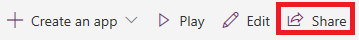
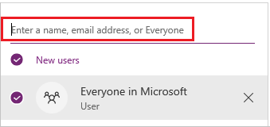
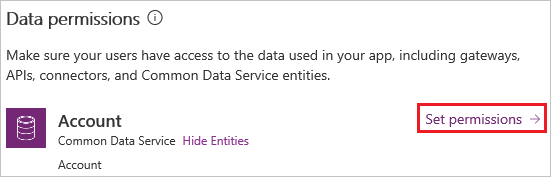
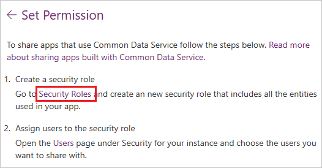
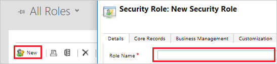
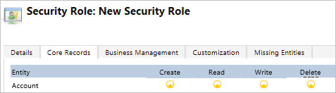
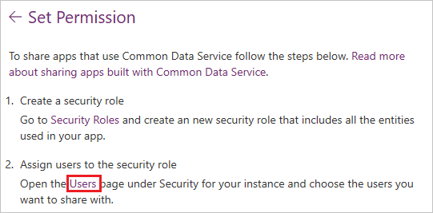
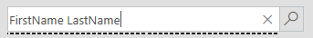
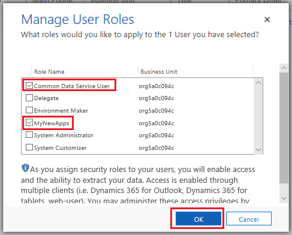

# Share a canvas app in PowerApps

After you build a canvas app that addresses a business need, specify which users in your organization can run the app and which can modify and even reshare it. Specify each user by name, or specify a security group in Azure Active Directory. If everyone would benefit from your app, specify that your entire organization can run it.

> [!IMPORTANT]
> For a shared app to function as you expect, you must also manage permissions for the data source or sources on which the app is based, such as [Common Data Service for Apps](#common-data-service-for-apps) or [Excel](share-app-data.md). You might also need to share [other resources](share-app-resources.md) on which the app depends, such as flows, gateways, or connections.

## Prerequisites

Before you share an app, you must save it to the cloud (not locally) and then publish the app.

- Give your app a meaningful name and a clear description, so that people know what your app does and they can easily find it in a list. On the **File** menu in PowerApps Studio, select **App settings**, specify a name, and then type or paste a description.

- Whenever you make changes, you must save and publish the app again if you want others to see those changes.

## Share an app

1. [Sign in](https://web.powerapps.com?utm_source=padocs&utm_medium=linkinadoc&utm_campaign=referralsfromdoc) to PowerApps, and then select **Apps** near the left edge.

    

1. Select the app that you want to share by selecting its icon.

    

1. In the banner, select **Share**.

    

1. Specify by name or alias the users or security groups in Azure Active Directory with which you want to share the app.

    To allow your entire organization to run the app (but not modify or share it), type **Everyone** in the sharing panel.

    

    > [!NOTE]
    > You can't share an app with a distribution group in your organization or with a user or group outside your organization.

1. If you want to allow those with whom you're sharing the app to edit and share it (in addition to running it), select the **Co-owner** check box.

    You can't grant **Co-owner** permission to a security group if you [created the app from within a solution](add-app-solution.md).
    
    > [!NOTE]
    > Regardless of permissions, no two people can edit an app at the same time. If one person opens the app for editing, other people can run it but not edit it.

1. If your app connects to data for which users need access permissions, specify them.

    For example, your app might connect to an entity in a CDS for Apps database. When you share such an app, the sharing panel prompts you to manage security for that entity.

    

    For more information about managing security for an entity, see [Manage entity permissions](share-app.md#manage-entity-permissions) later in this topic.

1. If you want to help people find your app, select the **Send an email invitation to new users** check box.

1. At the bottom of the share panel, select **Share**.

    Everyone with whom you shared the app can run it in PowerApps Mobile on a mobile device or in AppSource on [Dynamics 365](https://home.dynamics.com) in a browser. Co-owners can edit and share the app in [PowerApps](https://web.powerapps.com?utm_source=padocs&utm_medium=linkinadoc&utm_campaign=referralsfromdoc).

    If you sent an email invitation, everyone with whom you shared the app can run it by selecting a link in the invitation.

    - If a user selects the link on a mobile device, the app opens in PowerApps Mobile.
    - If a user selects the link on a desktop computer, the app opens in a browser.

    Co-owners who receive an invitation get another link that opens the app for editing in PowerApps Studio.

You can change permissions for a user or a security group by selecting their name and then performing either of these steps:

- To allow co-owners to run the app but no longer edit or share it, clear the **Co-owner** check box.
- To stop sharing the app with that user or group, select the Remove (x) icon.

## Security-group considerations

- If you share an app with a security group, existing members of that group and anyone who joins it will have the permission that you specify for that group. Anyone who leaves the group loses that permission unless they belong to a different group that has access or you give them permission as an individual.
- Every member of a security group has the same permission for an app as the overall group does. However, you can specify greater permissions for one or more members of that group to allow them greater access. For example, you can give Security Group A permission to run an app, but you can also give User B, who belongs to that group, **Co-owner** permission. Every member of the security group can run the app, but only User B can edit it. If you give Security Group A **Co-owner** permission and User B permission to run the app, that user can still edit the app.

## Manage entity permissions

### Common Data Service for Apps

If you create an app based on CDS for Apps, you must also ensure that the users with whom you share the app have the appropriate permissions for the entity or entities on which the app relies. Specifically, those users must belong to a security role that can perform tasks such as creating, reading, writing, and deleting relevant records. In many cases, you'll want to create one or more custom security roles with the exact permissions that users need to run the app. You can then assign a role to each user as appropriate.

> [!NOTE]
> As of this writing, you can assign security roles to individual users but not to security groups.

#### Prerequisite

To perform the next two procedures, you must have **System administrator** permissions for a CDS for Apps database.

#### Create a security role

1. In the sharing panel, select **Set permissions** under **Data permissions**, and then select the **Security Roles** link.

    

1. Under **All Roles**, select **New**, and then type or paste a name for the role that you're creating.

    

1. Select one or more tabs to find the entity or entities that your app uses, and then select the permissions that you want to grant the security role.

    For example, this graphic shows that the **Core records** tab contains the **Accounts** entity, and users to which this security role has been assigned can create, read, write, and delete records in that entity.

    

1. Select **Save and Close**.

#### Assign a user to a role

1. In the sharing panel, select **Set permissions** under **Data permissions**, and then select the **Users** link.

    

1. In the upper-right corner, type or paste the name of the user whom you want to assign to the role, and then select the search icon.

    

1. In the search results, point to the result that you want, and then select the check box that appears.

1. In the top banner, select **Manage roles**.

1. In the dialog box that appears, select the check boxes for **Common Data Service User** and the role that the user needs for your app, and then select **OK.**

    

### Common Data Service (previous version)

When you share an app that's based on an older version of Common Data Service, you must share the runtime permission to the service separately. If you don’t have permission to do this, see your environment administrator.
