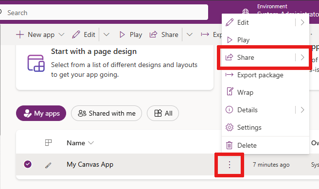
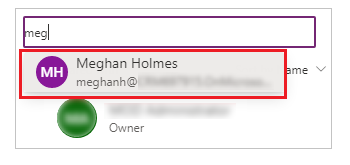
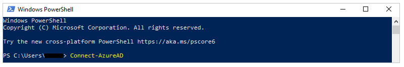
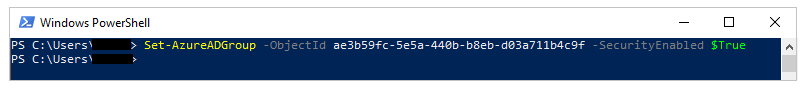

# Share a canvas app with your organization

After you build a canvas app that addresses a business need, specify which users in your organization can run the app and who can modify and even re-share it. Specify each user by name, or specify a security group in Azure Active Directory (Azure AD). If everyone would benefit from your app, specify that your entire organization can run it. To learn about sharing apps outside of your organization, go to [Share a canvas app with guest users](share-app-guests.md).

> [!IMPORTANT]
> For a shared app to function as you expect, you must also manage permissions for the data source or sources on which the app is based, such as [Microsoft Dataverse](#dataverse) or [Excel](share-app-data.md). You might also need to share [other resources](share-app-resources.md) on which the app depends, such as flows, gateways, or connections.

## Prerequisites

Before you share an app, you must [save it to the cloud](save-publish-app.md#save-changes-to-an-app) (not locally) and then [publish](save-publish-app.md#publish-an-app) it.

- Give your app a meaningful name and a clear description, so that people know what your app does and they can easily find it in a list. Select **Settings** > specify a name, and then enter a description.

- Whenever you make changes, you must save and publish the app again if you want others to see those changes.

## Share an app

1. Sign in to [Power Apps](https://make.powerapps.com).

1. On the left pane, select **Apps**.

    

1. Select the app that you want to share by selecting its icon.

    

1. On the command bar, select **Share**.  
   or  
   Select **More Commands** (**...**), and then select **Share** from the drop-down menu.

    

1. Specify by name or alias the users or security groups in Azure AD with whom you want to share the app.

    - To allow your entire organization to run the app (but not modify or share it), enter **Everyone** in the sharing panel. Users will be able to find this app by setting the apps list filter to "Org apps".

        

    - You can share an app with a list of aliases, friendly names, or a combination of those (for example, **Meghan Holmes <meghan.holmes@contoso.com>**) if the items are separated by semicolons. If several people have the same name but different aliases, the first person found will be added to the list. A tooltip appears if a name or alias already has permission or can't be resolved.

        

    > [!NOTE]
    > You can't share an app with a distribution group in your organization or with a group outside your organization.

1. If you want to allow users to edit and share the app, select the **Co-owner** check box.

    

    You can't grant Co-owner permission to a security group if you [created the app from within a solution](add-app-solution.md).

    > [!NOTE]
    > Regardless of permissions, no two people can edit an app at the same time. If one person opens the app for editing, other people can run it but not edit it.

1. If your app connects to data for which users need access permissions, specify security roles as appropriate.

    For example, your app might connect to a table in a Dataverse database. When you share such an app, the sharing panel prompts you to manage security for that table.

    

    For more information about managing security for a table, go to [Manage table permissions](#manage-table-permissions).

    If your app uses connections to other data sources—such as an Excel file hosted on OneDrive for Business—ensure that you share these data sources with the users you shared the app with.

    

    For more information about sharing canvas app resources and connections, go to [Share canvas app resources](share-app-resources.md).

1. If you want to help people find your app, select the **Send an email invitation to new users** check box.

    

1. At the bottom of the share panel, select **Share**.

    Users can now run the app by using Power Apps Mobile on a mobile device or from AppSource on [Microsoft 365](https://www.office.com/apps) in a browser. Co-owners can edit and share the app in [Power Apps](https://make.powerapps.com?utm_source=padocs&utm_medium=linkinadoc&utm_campaign=referralsfromdoc).

    If you sent an email invitation, users can also run the app by selecting the link in the invitation email:

    - If a user selects the link on a mobile device, the app opens in Power Apps Mobile.
    - If a user selects the link on a desktop computer, the app opens in a browser.

    Co-owners who receive an invitation get another link that opens the app for editing in Power Apps Studio.
<!--markdownlint-disable MD036-->
**To change permissions for a user or a security group**

- To allow co-owners to run the app but no longer edit or share it, clear the **Co-owner** check box.
- To stop sharing the app with that user or group, select the **Remove** (x) icon.

## Security group considerations

- All existing members of the security group inherit the app permissions. New users joining the security group will inherit the security group permissions on the app. Users leaving the group will no longer have access through that group, but those users can continue to have access either by having permissions assigned to them directly or through membership in another security group.

- Every member of a security group has the same permissions for an app as the overall group does. However, you can specify greater permissions for one or more members of that group to allow them greater access. For example, you can give Security Group A permission to run an app. And then, you can also give User B, who belongs to that group, Co-owner permission. Every member of the security group can run the app, but only User B can edit it. If you give Security Group A Co-owner permission and User B permission to run the app, that user can still edit the app.

### Share an app with Microsoft 365 groups

You can share an app with [Microsoft 365 groups](/microsoft-365/admin/create-groups/compare-groups). However, the group must have security enabled. Enabling security ensures that the Microsoft 365 group can receive security tokens for authentication to access apps or resources.

**To check whether a Microsoft 365 group has security enabled**

1. Ensure that you have access to the [Azure AD cmdlets](/azure/active-directory/users-groups-roles/groups-settings-v2-cmdlets).

1. Go to [Azure portal](https://portal.azure.com/) \> **Azure Active Directory** \> **Groups**, select the appropriate group, and then copy the **Object Id**.

1. [Connect to Azure AD](/powershell/module/azuread/connect-azuread) by using the `Connect-AzureAD` PowerShell cmdlet.

    

1. Get the [group details](/powershell/module/AzureAD/Get-AzureADGroup) by using `Get-AzureADGroup -ObjectId <ObjectID\> | select *`. <br> In the output, ensure that the property **SecurityEnabled** is set to **True**.

    

**To enable security for a group**

If the group isn't security-enabled, you can use the PowerShell cmdlet [Set-AzureADGroup](/powershell/module/AzureAD/Set-AzureADGroup) to set the **SecurityEnabled** property to **True**: 

```Set-AzureADGroup -ObjectId <ObjectID> -SecurityEnabled $True```



> [!NOTE]
> You must be the owner of the Microsoft 365 group to enable security.
> Setting the **SecurityEnabled** property to **True** doesn't affect how Power Apps and Microsoft 365 features work. This command is required because the **SecurityEnabled** property is set to **False** by default when Microsoft 365 groups are created outside of Azure AD.

After a few minutes, you can discover this group in the Power Apps sharing panel and share apps with this group.
<a name="manage-table-permissions"></a>
<a name="dataverse"></a>

## Manage table permissions for Dataverse

If you create an app based on Dataverse, you must also ensure that the users you share the app with have the appropriate permissions for the table or tables used by the app. Particularly, those users must belong to a security role that can do tasks such as creating, reading, writing, and deleting relevant records. In many cases, you'll want to create one or more custom security roles with the exact permissions that users need to run the app. You can then assign the role to each user as appropriate.

> [!NOTE]
> - You can assign security roles to individual users and security groups in Azure AD, but not to Microsoft 365 groups.
> - If a user isn't in the Dataverse root business unit, you can share the app without providing a security role, and then set the security role directly.

### Prerequisite

To assign a role, you must have **System administrator** permissions for a Dataverse database.

**To assign a security group in Azure AD to a role**

1. In the sharing panel under **Data permissions**, select **Assign a security role**.

1. Select the Dataverse roles that you want to apply to the selected Azure AD users or groups.

     

> [!NOTE]
> When you share an app that's based on an older version of Dataverse, you must share the runtime permission to the service separately. If you don’t have permission to do this, see your environment administrator.

## Next steps

[Share a canvas app with guest users](share-app-guests.md)  

### See also

[Edit an app](edit-app.md)  
[Restore an app to a previous version](restore-an-app.md)  
[Export and import an app](export-import-app.md)  
[Delete an app](delete-app.md)  


[!INCLUDE[footer-include](../../includes/footer-banner.md)]