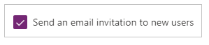
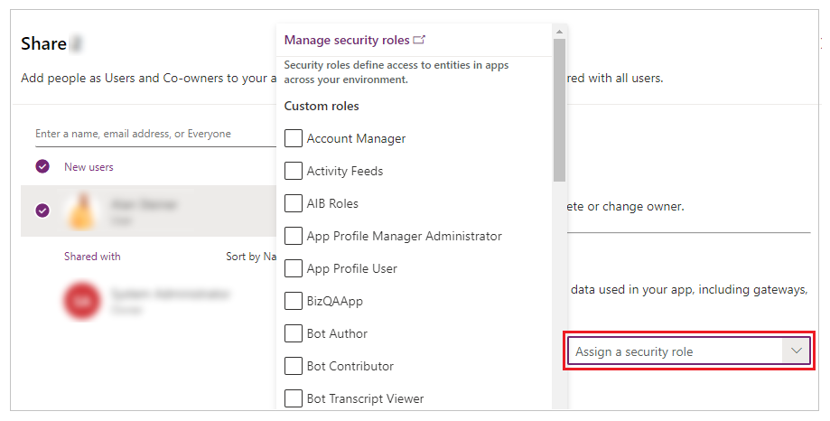

# Share a canvas app with your organization

When you create a canvas app, you can define which users in your organization can use the app, modify it, and even re-share it. You can specify individual users by name or designate a security group in Microsoft Entra ID.

## Prerequisites

Before you share an app, you must [save it](save-publish-app.md) (not locally) and then [publish](save-publish-app.md) it.

- Give your app a meaningful name and a clear description, so that people know what your app does and they can easily find it in a list. Select **Settings** > specify a name, and then enter a description.

- Whenever you make changes, you must save and publish the app again if you want others to see those changes.

> [!IMPORTANT]
> For a shared app to function as you expect, you must also manage permissions for the data source or sources on which the app is based, such as [Microsoft Dataverse](#dataverse) or [Excel](share-app-data.md). You might also need to share [other resources](share-app-resources.md) on which the app depends, such as flows, gateways, or connections.

## Share an app from Power Apps

1. Sign in to [Power Apps](https://make.powerapps.com).

1. On the left navigation pane, select **Apps**.

1. Select the app that you want to share.

1. On the command bar, select **Share**. Or select the **Commands** menu next to your app name and then select **Share**.

1. In the **Share** dialog box, type the names or alias of the user or security groups in Microsoft Entra ID.

1. Select the down arrow to choose permissions for the app. Options include:
    - **User**: Can use the app only.
    - **Co-Owner**: Can use, edit, and share the app but not delete or change owners.

        :::image type="content" source="media/share-app/share-app-coowner.png" alt-text="share with a co-owner":::\
    - If your app connects to a Dataverse table, the permissions dropdown will display a **More security roles** option. Select the appropriate security roles, and those roles will be automatically assigned to users when you share the app.
    - If your admin enables the [app level security roles](/power-platform/admin/settings-collaboration#security-roles) in Power Platform Admin, only system admins can grant collaborators with app-level privileges when sharing. The privilege can be read or edit access.

       :::image type="content" source="media/share-app/more-security-roles.png" alt-text="More security roles option":::

1. Optional steps:
   - Select the **overflow menu (...)** at the top-right corner and then select **Upload app image** to include an image of the app in the email.

    :::image type="content" source="media/share-app/share-app-app-image.png" alt-text="Add an app image":::

   - Select **Manage access** to displays app access details, including current users and co-owners. You can also edit user access and assign security roles here. The **Additional data access** tab shows app connections to data sources like Dataverse tables or Excel files on OneDrive for Business. To manage security roles for data sources other than Dataverse, such as Excel files on OneDrive, ensure you share these data sources with the app users.

     :::image type="content" source="media/share-app/share-app-access.png" alt-text="Manage app access":::

1. Add an optional message and then select **Share**.


> [!NOTE]
> - To learn about sharing apps outside of your organization, see [Share a canvas app with guest users](share-app-guests.md).
> - To learn about sharing limits applicable to canvas apps in managed environments, see [Sharing limits](/power-platform/admin/managed-environment-sharing-limits).

## Classic app sharing experience

You can still use the classic app sharing experience by selecting the classic sharing option.

1. Sign in to [Power Apps](https://make.powerapps.com).

1. On the left navigation pane, select **Apps**.

1. Select the app that you want to share.

1. On the command bar, select **Share**. Or select the **Commands** menu next to your app name and then select **Share**

1. Select the **overflow menu (...)** at the top-right corner and then select **Use classic sharing**.

   :::image type="content" source="media/share-app/share-app-revert-to-classic.png" alt-text="Share app using classic sharing":::

1. Specify the name or alias the users or security groups in Microsoft Entra ID with whom you want to share the app.

    You can share an app with a list of aliases, friendly names, or a combination of those (for example, **Meghan Holmes \<meghan.holmes@contoso.com\>**) if the items are separated by semicolons.

    If several people have the same name but different aliases, the first person found is added to the list. A tooltip appears if a name or alias already has permission or can't be resolved.

    :::image type="content" source="media/share-app/individual-user.png " alt-text="Screenshot that shows what happens when you search for a name in the search field on an app page.":::

   > [!NOTE]
   > You can't share an app with a distribution group in your organization or with a group outside your organization.

   > [!IMPORTANT]
   > To avoid degraded experiences, use a security group when sharing the app with over 100 users.

1. If your app contains premium components, such as a map or address input, users must have a Power Apps license to use the app. To request licenses for the users of your app, select **Request licenses**, which submits the request to your admin.

   :::image type="content" source="media/request-licenses-for-others-banner.png" alt-text="Request Power Apps licenses for your users.":::

   > [!NOTE]
   > You can't request licenses for security groups or distribution lists. For more information about requesting licenses, see [Request Power Apps licenses for your app users](../common/request-licenses-for-users.md).

1. If you want to allow users to edit and share the app, select the **Co-owner** check box.

    :::image type="content" source="media/share-app/co-owner.png" alt-text="Screenshot that shows where to check the box for Co-owner.":::

    In the sharing interface, you can't grant Co-owner permission to a security group if you [created the app from within a solution](add-app-solution.md). However, its possible to grant co-owner permission to a security group for apps in a solution by using the [Set-PowerAppRoleAssignment cmdlet](/powershell/module/microsoft.powerapps.administration.powershell/set-adminpowerapproleassignment).  

1. If your app connects to data for which users need access permissions, specify security roles as appropriate.

    For example, your app might connect to a table in a Dataverse database. When you share such an app, the sharing panel prompts you to manage security for that table.

    

    For more information about managing security for a table, go to [Manage table permissions](#manage-table-permissions).

    If your app uses connections to other data sources&mdash;such as an Excel file hosted on OneDrive for Business&mdash;ensure that you share these data sources with the users you shared the app with.

    

    For more information about sharing canvas app resources and connections, go to [Share canvas app resources](share-app-resources.md).

1. If you want to help people find your app, select the **Send an email invitation to new users** check box.

    

1. At the bottom of the share panel, select **Share**.

    Users can now run the app by using Power Apps Mobile on a mobile device or from AppSource on [Microsoft 365](https://www.office.com/apps) in a browser. Co-owners can edit and share the app in [Power Apps](https://make.powerapps.com?utm_source=padocs&utm_medium=linkinadoc&utm_campaign=referralsfromdoc).

    If you sent an email invitation, users can also run the app by selecting the link in the invitation email:

    - If a user selects the **Open the app** link on a mobile device, the app opens in Power Apps Mobile.
    - If a user selects the **Open the app** link on a desktop computer, the app opens in a browser.
    - If a user selects the **Microsoft Teams** link, the app opens in Microsoft Teams.

    If you selected **Co-owner** while sharing, the recipients will see a link for **Power Apps Studio** that will open the app for editing using Power Apps Studio.

<!--markdownlint-disable MD036-->
**To change permissions for a user or a security group**

- To allow co-owners to run the app but no longer edit or share it, clear the **Co-owner** check box.
- To stop sharing the app with that user or group, select the **Remove** (x) icon.

## Share apps using Teams

You can share a link to your app in a Teams chat. The user that you share the app with needs to be on the same tenant and have access to the app that you're sharing.

> [!NOTE]
> - To add canvas apps to Teams using the web player:
>     - Your organization must have **Allow interaction with custom apps** turned on. More information: [Manage custom app policies and settings in Microsoft Teams](/microsoftteams/teams-custom-app-policies-and-settings)
>     - Your organization must allow **Shared Power Apps**. More information: [Manage Microsoft Power Platform apps in the Microsoft Teams admin center](/microsoftteams/manage-power-platform-apps)
> - If you're the sender or receiver and get a **This app cannot be found** error when you select **Add app to Teams**, this means you don't have access to the app. To get access, contact your admin.  
> - If you're the sender and you don't have the Power Apps personal app installed in Teams, then a preview card will appear with a **Show Preview** button. To unfurl the full adaptive card, select **Show Preview**.


To share the app, copy the app link from your web browser and paste it into the Teams chat. Before you send the link, you'll see a preview of your message.

> [!div class="mx-imgBorder"]
> 

Legend:

1. **Link to app**: Select the web link to open the app.
2. **Collapse preview**: Select to close the preview. When you collapse the preview then the user that you send the link to will only get a web link to open the app. They won't see the buttons to add the **App to Teams** or **Launch app in web**.
3. **Name of app**: Shows the name of the app.
4. **Add app to Teams**: Select to add the app to Teams.
5. **Launch app in Web**: Open the app directly in your browser.

## Request licenses for your users

When sharing an app that requires a license for use, you can request Power Apps licenses for your users. For more information, see [Request Power Apps licenses for your app users](../common/request-licenses-for-users.md).

## Security group considerations

- All existing members of the security group inherit the app permissions. New users joining the security group will inherit the security group permissions on the app. Users leaving the group will no longer have access through that group, but those users can continue to have access either by having permissions assigned to them directly or through membership in another security group.

- Every member of a security group has the same permissions for an app as the overall group does. However, you can specify greater permissions for one or more members of that group to allow them greater access. For example, you can give Security Group A permission to run an app. And then, you can also give User B, who belongs to that group, Co-owner permission. Every member of the security group can run the app, but only User B can edit it. If you give Security Group A Co-owner permission and User B permission to run the app, that user can still edit the app.

- Users must explicitly be a member of the security group. If a user is an owner of the group, they must also assign themselves as a member of the group to inherit app permissions.

### Share an app with Microsoft 365 groups

You can share an app with [Microsoft 365 groups](/microsoft-365/admin/create-groups/compare-groups). However, the group must have security enabled. Enabling security ensures that the Microsoft 365 group can receive security tokens for authentication to access apps or resources.


**Using Microsoft Graph:**

1. Install the Microsoft Graph module. 

    ```powershell
    Install-Module Microsoft.Graph -Scope CurrentUser
    ```

2. Connect to Microsoft Graph. For information about the administrator roles required to manage groups, see  [Microsoft Entra roles for managing groups](/graph/api/resources/groups-overview#microsoft-entra-roles-for-managing-groups).

    ```powershell
    Connect-MgGraph -Scopes "Group.ReadWrite.All"
    ```

3. Set the Object ID of Microsoft 365 group.

    ```powershell
    $ObjectID = "<ObjectID>"
    ```

4. Enable security.

    ```powershell
    Update-MgGroup -GroupId $ObjectID -BodyParameter @{ SecurityEnabled = $true }
    ```

5. Verify the update.

    ```powershell
    Get-MgGroup -GroupId $ObjectID | Select-Object DisplayName, SecurityEnabled
    ```


> [!NOTE]
> You must be the owner of the Microsoft 365 group to enable security.
> Setting the **SecurityEnabled** property to **True** doesn't affect how Power Apps and Microsoft 365 features work. This command is required because the **SecurityEnabled** property is set to **False** by default when Microsoft 365 groups are created outside of Microsoft Entra ID.

After a few minutes, you can discover this group in the Power Apps sharing panel and share apps with this group.
<a name="manage-table-permissions"></a>
<a name="dataverse"></a>


## Manage table permissions for Dataverse

If you create an app based on Dataverse, you must also ensure that the users you share the app with have the appropriate permissions for the table or tables used by the app. Particularly, those users must belong to a security role that can do tasks such as creating, reading, writing, and deleting relevant records. In many cases, you'll want to create one or more custom security roles with the exact permissions that users need to run the app. You can then assign the role to each user as appropriate.

> [!NOTE]
> - You can assign security roles to individual users and security groups in Microsoft Entra ID, but not to Microsoft 365 groups.
> - If a user isn't in the Dataverse root business unit, you can share the app without providing a security role, and then set the security role directly.
> - After a security role is assigned to a user or group, you can't unassigned it when you share an app. However, you can still unassign security roles through the admin portal.

### Prerequisite

To assign a role, you must have **System administrator** permissions for a Dataverse database.

**To assign a security group in Microsoft Entra to a role**

1. In the sharing panel under **Data permissions**, select **Assign a security role**.

1. Select the Dataverse roles that you want to apply to the selected Microsoft Entra users or groups.

     

> [!NOTE]
> When you share an app that's based on an older version of Dataverse, you must share the runtime permission to the service separately. If you don’t have permission to do this, see your environment administrator.

## Next steps

[Share a canvas app with guest users](share-app-guests.md)  

### See also

[Edit an app](edit-app.md)  
[Restore an app to a previous version](restore-an-app.md)  
[Export and import an app](export-import-app.md)  
[Delete an app](delete-app.md)  


[!INCLUDE[footer-include](../../includes/footer-banner.md)]
