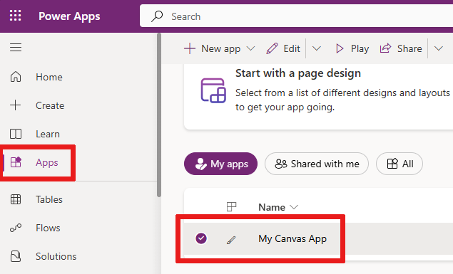

# Share a canvas app in PowerApps

After you build a canvas app that addresses a business need, specify which users in your organization can run the app and which can modify and even reshare it. Specify each user by name, or specify a security group in Azure Active Directory. If everyone would benefit from your app, specify that your entire organization can run it.

> [!IMPORTANT]
> For a shared app to function as you expect, you must also manage permissions for the data source or sources on which the app is based, such as [Common Data Service](#common-data-service) or [Excel](share-app-data.md). You might also need to share [other resources](share-app-resources.md) on which the app depends, such as flows, gateways, or connections.

## Prerequisites

Before you share an app, you must save it to the cloud (not locally) and then publish the app.

- Give your app a meaningful name and a clear description, so that people know what your app does and they can easily find it in a list. On the **File** menu in Power Apps Studio, select **App settings**, specify a name, and then type or paste a description.

- Whenever you make changes, you must save and publish the app again if you want others to see those changes.

## Share an app

1. [Sign in](https://make.powerapps.com?utm_source=padocs&utm_medium=linkinadoc&utm_campaign=referralsfromdoc) to PowerApps, and then select **Apps** near the left edge.

    

1. Select the app that you want to share by selecting its icon.

    

1. In the banner, select **Share**.

    

1. Specify by name or alias the users or security groups in Azure Active Directory with which you want to share the app.

    - To allow your entire organization to run the app (but not modify or share it), type **Everyone** in the sharing panel.
    - You can share an app with a list of aliases, friendly names, or a combination of those (for example, **Jane Doe &lt;jane.doe@contoso.com>**) if the items are separated by semi-colons. If more than one person has the same name but different aliases, the first person found will be added to the list. A tooltip appears if a name or alias already has permission or can't be resolved. 

    

    > [!NOTE]
    > You can't share an app with a distribution group in your organization or with a group outside your organization.

1. If you want to allow those with whom you're sharing the app to edit and share it (in addition to running it), select the **Co-owner** check box.

    You can't grant **Co-owner** permission to a security group if you [created the app from within a solution](add-app-solution.md).

    > [!NOTE]
    > Regardless of permissions, no two people can edit an app at the same time. If one person opens the app for editing, other people can run it but not edit it.

1. If your app connects to data for which users need access permissions, specify them.

    For example, your app might connect to an entity in a Common Data Service database. When you share such an app, the sharing panel prompts you to manage security for that entity.

    > [!div class="mx-imgBorder"]
    > 

    For more information about managing security for an entity, see [Manage entity permissions](share-app.md#manage-entity-permissions) later in this topic.

1. If you want to help people find your app, select the **Send an email invitation to new users** check box.

1. At the bottom of the share panel, select **Share**.

    Everyone with whom you shared the app can run it in Power Apps Mobile on a mobile device or in AppSource on [Dynamics 365](https://home.dynamics.com) in a browser. Co-owners can edit and share the app in [PowerApps](https://make.powerapps.com?utm_source=padocs&utm_medium=linkinadoc&utm_campaign=referralsfromdoc).

    If you sent an email invitation, everyone with whom you shared the app can run it by selecting a link in the invitation.

    - If a user selects the link on a mobile device, the app opens in Power Apps Mobile.
    - If a user selects the link on a desktop computer, the app opens in a browser.

    Co-owners who receive an invitation get another link that opens the app for editing in Power Apps Studio.

You can change permissions for a user or a security group by selecting their name and then performing either of these steps:

- To allow co-owners to run the app but no longer edit or share it, clear the **Co-owner** check box.
- To stop sharing the app with that user or group, select the Remove (x) icon.

## Security-group considerations

- If you share an app with a security group, existing members of that group and anyone who joins it will have the permission that you specify for that group. Anyone who leaves the group loses that permission unless they belong to a different group that has access or you give them permission as an individual.

- Every member of a security group has the same permission for an app as the overall group does. However, you can specify greater permissions for one or more members of that group to allow them greater access. For example, you can give Security Group A permission to run an app, but you can also give User B, who belongs to that group, **Co-owner** permission. Every member of the security group can run the app, but only User B can edit it. If you give Security Group A **Co-owner** permission and User B permission to run the app, that user can still edit the app.

## Manage entity permissions

### Common Data Service

If you create an app based on Common Data Service, you must also ensure that the users with whom you share the app have the appropriate permissions for the entity or entities on which the app relies. Specifically, those users must belong to a security role that can perform tasks such as creating, reading, writing, and deleting relevant records. In many cases, you'll want to create one or more custom security roles with the exact permissions that users need to run the app. You can then assign a role to each user as appropriate.

> [!NOTE]
> As of this writing, you can assign security roles to individual users and security groups in Azure Active Directory but not to Office groups.

#### Prerequisite

To assign a role, you must have **System administrator** permissions for a Common Data Service database.

#### Assign a security group in Azure AD to a role

1. In the sharing panel, select **Assign a security role** under **Data permissions**.

1. Select the role or roles in Common Data Service that you want to assign to the user or the security group in Azure AD with which you want to share the app.
     > [!div class="mx-imgBorder"] 
     > 

### Common Data Service (previous version)

When you share an app that's based on an older version of Common Data Service, you must share the runtime permission to the service separately. If you don’t have permission to do this, see your environment administrator.

## Share with guests
 
Power Apps canvas apps can be shared with guest users of an Azure Active Directory tenant. This enables inviting external business partners, contractors, and third parties to run your company’s canvas apps. 

> [!NOTE]
> Guests may only be assigned the **User** role, and not the **Co-owner** role, for apps shared with them.

### Prerequisites
- In Azure Active Directory (Azure AD), enable B2B external collaboration for the tenant. More information: [Enable B2B external collaboration and manage who can invite guests](/azure/active-directory/b2b/delegate-invitations)
    - Enable B2B external collaboration is on by default. However, the settings can be changed by a tenant admin.  For more information about Azure AD B2B, see [What is guest user access in Azure AD B2B?](/azure/active-directory/b2b/what-is-b2b)  
- Access to an account that can add guest users to an Azure AD tenant. Admins and users with the Guest Inviter role can add guests to a tenant.   
- The guest user must have a license with Power Apps use rights that matches the capability of the app assigned through one of the following tenants:
    - The tenant hosting the app being shared.
    - The home tenant of the guest user.

### Steps to grant guest access
1. Select **New guest user** to add guest users in Azure AD. More information: [Quickstart: Add a new guest user in Azure AD](/azure/active-directory/b2b/b2b-quickstart-add-guest-users-portal).
    > [!div class="mx-imgBorder"] 
    > 
2. If the guest user doesn't already have a license in their home tenant, assign a license to the guest user.
   - To assign guest users from admin.microsoft.com, see [Assign licenses to one user](/office365/admin/subscriptions-and-billing/assign-licenses-to-users).
   - To assign guest users from portal.azure.com, see [Assign or remove licenses](/azure/active-directory/fundamentals/license-users-groups).
 
   > [!IMPORTANT]
   > You may need to disable the Microsoft 365 admin center preview to assign a license to a guest. 

3. Share the canvas app. 
    1. Sign in to https://make.powerapps.com  
    2. Go to **Apps**, select a canvas app, and then on the command bar select **Share**. 
    3. Enter an email address for a guest user from an Azure AD tenant. More information: [What is guest user access in Azure AD B2B?](/azure/active-directory/b2b/what-is-b2b)
          > [!div class="mx-imgBorder"] 
          > 
 
After you share an app for guest access, guests can discover and access apps shared with them from the email sent to them as part of sharing.

> [!div class="mx-imgBorder"]  
> 

### Frequently Asked Questions

#### What’s the difference between canvas app guest access and Power Apps Portals? 
Canvas apps enable building an app, tailored to digitizing a business processes, without writing code in a traditional programming language such as C#. Guest access for canvas apps enables teams of individuals made up of different organizations participating in a common business process to access the same app resources that may be integrated with a wide variety of Microsoft and third-party sources. More information: [Overview of canvas-app connectors for PowerApps](/powerapps/maker/canvas-apps/connections-list).

[Power Apps Portals](/powerapps/maker/portals/overview) provide the ability to build low-code, responsive websites that allow external users to interact with the data stored in Common Data Service. It allows organizations to create websites that can be shared with users external to their organization either anonymously or through the login provider of their choice, such as LinkedIn, Microsoft Account, or other commercial login providers. 

The following table outlines a few core capability differences between Power Apps Portals and canvas apps.  

| | Interface | Authentication | Accessible data sources |
|------|--------|----------|-------------------|
| Power Apps Portals | Browser only experience | Allows anonymous and authenticated access | Common Data Service |
| Canvas apps | Browser and mobile apps | Requires authentication via Azure AD | Any ~150 out-of-box connectors and any custom connector  |
||

#### Can guests access customized forms in SharePoint?
Yes. Any user that can access a SharePoint list with a customized form can create and edit items in the list, using the form, without any Power Apps license.

#### Can guests access apps embedded in SharePoint? 
Yes. Though, access to canvas standalone apps require a license with Power Apps use rights that matches the capability of the app, including apps that are embedded. When embedding a canvas app in SharePoint via the Microsoft Power Apps embed control, enter the app id. To do this, enter the app ID in the **App web link or ID** box. 

> [!div class="mx-imgBorder"]  
> 

When embedding a canvas app in SharePoint via the iFrame HTML tag, reference the app using the full web URL. To find the URL, go to https://make.powerapps.com, select an app, select the **Details** tab, and the URL is displayed under **Web link**.

> [!div class="mx-imgBorder"]  
> 

#### How come guests can launch the app shared with them but connections fail to be created?
As with non-guests, the underlying data source(s) accessed by the app must also be made accessible to the guest.

#### What license must be assigned to my guest so they can run an app shared with them?
The same license that’s required for non-guests to run an app. For instance, if the app uses premium connecters then a Power Apps Per App Plan or a Power Apps Per User Plan must be assigned to the guest.  

|                                 | SharePoint customized form | Standalone canvas app using non-premium connectors | Standalone canvas app using premium connectors | Model driven app |
|---------------------------------|----------------------------|----------------------------------------------------|------------------------------------------------|------------------|
| SharePoint user (no PA license) | x                          |                                                    |                                                |                  |
| Power Apps Included w/ Office    | x                          | x                                                  |                                                |                  |
| Power Apps Per App Plan          | x                          | x                                                  | x                                              | x                |
| Power Apps Per User Plan         | x                          | x                                                  | x                                              | x                |

#### In Power Apps Mobile, how does a guest see apps for their home tenant?
Any user that has accessed an canvas app, on their mobile device, that’s published in an Azure AD tenant that isn’t their home tenant must sign-out of Power Apps and sign back in to Power Apps Mobile.  

#### Must a guest accept the Azure AD guest invitation prior to sharing an app with the guest?
No. If a guest launches an app shared with them prior to accepting a guest invitation the guest will be prompted to accept the invitation as part of the sign-in experience while launching the app.  

#### What Azure AD tenant are connections for a guest user created in?
Connections for an app are always made in the context of the Azure AD tenant the app is associated. For instance, if an app is created in the Contoso tenant then connections made for Contoso internal and guest users are made in the context of the Contoso tenant.

#### Can guests use Microsoft Graph via Microsoft Security Graph connector or a custom connector using Microsoft Graph APIs?
No, Azure AD guests can't query Microsoft Graph to retrieve information for a tenant in which they’re a guest.

#### What InTune policies apply to guests using my PowerApps?
InTune only applies policies of a user’s home tenant. For instance, if Alice@Contoso.com shares an app with Vikram@Fabrikam.com, InTune continues to apply Fabrikam.com policies on Virkam’s device regardless of the Power Apps he runs.

#### What connectors support guest access?
All connectors that do not perform Azure AD authentication of any type supports guest access. The following table enumerates all connectors that perform Azure AD authentication and which connectors currently support guest access. Many of these will be updated leading up to general availability.

| **Connector**                                     | **Supports guest access**                                              |
|---------------------------------------------------|------------------------------------------------------------------------|
| 10to8 Appointment Scheduling                      | No                                                                     |
| Adobe Creative Cloud                              | No                                                                     |
| Adobe Sign                                        | No                                                                     |
| Asana                                             | No                                                                     |
| AtBot Admin                                       | No                                                                     |
| AtBot Logic                                       | No                                                                     |
| Azure AD                                          | Yes                                                                    |
| Azure Automation                                  | Yes                                                                    |
| Azure Container Instance                          | Yes                                                                    |
| Azure Data Factory                                | Yes                                                                    |
| Azure Data Lake                                   | Yes                                                                    |
| Azure DevOps                                      | No                                                                     |
| Azure Event Grid                                  | No                                                                     |
| Azure IoT Central                                 | Yes                                                                    |
| Azure Key Vault                                   | No                                                                     |
| Azure Kusto                                       | Yes                                                                    |
| Azure Log Analytics                               | Yes                                                                    |
| Azure Resource Manager                            | Yes                                                                    |
| Basecamp 2                                        | No                                                                     |
| Bitbucket                                         | No                                                                     |
| Bitly                                             | No                                                                     |
| bttn                                              | No                                                                     |
| Buffer                                            | No                                                                     |
| Business Central                                  | No                                                                     |
| CandidateZip                                      | No                                                                     |
| Capsule CRM                                       | No                                                                     |
| Cloud PKI Management                              | No                                                                     |
| Cognito Forms                                     | No                                                                     |
| Common Data Service                               | No                                                                     |
| Common Data Service (Legacy)                      | No                                                                     |
| D&B Optimizer                                     | No                                                                     |
| Derdack SIGNL4                                    | No                                                                     |
| Disqus                                            | No                                                                     |
| Document Merge                                    | No                                                                     |
| Dynamics 365                                      | No                                                                     |
| Dynamics 365 AI for Sales                         | Yes                                                                    |
| Dynamics 365 for Fin & Ops                        | No                                                                     |
| Enadoc                                            | No                                                                     |
| Eventbrite                                        | No                                                                     |
| Excel Online (Business)                           | No                                                                     |
| Excel Online (OneDrive)                           | No                                                                     |
| Expiration Reminder                               | No                                                                     |
| FreshBooks                                        | No                                                                     |
| GoToMeeting                                       | No                                                                     |
| GoToTraining                                      | No                                                                     |
| GoToWebinar                                       | No                                                                     |
| Harvest                                           | No                                                                     |
| HTTP with Azure AD                                | No                                                                     |
| Infusionsoft                                      | No                                                                     |
| Inoreader                                         | No                                                                     |
| Intercom                                          | No                                                                     |
| JotForm                                           | No                                                                     |
| kintone                                           | No                                                                     |
| LinkedIn                                          | No                                                                     |
| Marketing Content Hub                             | No                                                                     |
| Medium                                            | No                                                                     |
| Metatask                                          | No                                                                     |
| Microsoft Forms                                   | No                                                                     |
| Microsoft Forms Pro                               | No                                                                     |
| Microsoft Graph Security                          | No                                                                     |
| Microsoft Kaizala                                 | No                                                                     |
| Microsoft School Data Sync                        | No                                                                     |
| Microsoft StaffHub                                | No                                                                     |
| Microsoft Teams                                   | Yes                                                                    |
| Microsoft To-Do (Business)                        | No                                                                     |
| Muhimbi PDF                                       | No                                                                     |
| NetDocuments                                      | No                                                                     |
| Office 365 Groups                                 | Yes                                                                    |
| Office 365 Outlook                                | No                                                                     |
| Office 365 Users                                  | Yes                                                                    |
| Office 365 Video                                  | No                                                                     |
| OneDrive                                          | No                                                                     |
| OneDrive for Business                             | No                                                                     |
| OneNote (Business)                                | No                                                                     |
| Outlook Customer Manager                          | No                                                                     |
| Outlook Tasks                                     | Yes                                                                    |
| Outlook.com                                       | No                                                                     |
| Paylocity                                         | No                                                                     |
| Planner                                           | No                                                                     |
| Plumsail Forms                                    | No                                                                     |
| Power BI                                          | Yes                                                                    |
| Project Online                                    | No                                                                     |
| ProjectWise Design Integration                    | No                                                                     |
| Projectwise Share                                 | No                                                                     |
| SharePoint                                        | Yes                                                                    |
| SignNow                                           | No                                                                     |
| Skype for Business Online                         | No                                                                     |
| Soft1                                             | No                                                                     |
| Stormboard                                        | No                                                                     |
| Survey123                                         | No                                                                     |
| SurveyMonkey                                      | No                                                                     |
| Toodledo                                          | No                                                                     |
| Typeform                                          | No                                                                     |
| Vimeo                                             | No                                                                     |
| Webex Teams                                       | No                                                                     |
| Windows Defender Advanced Threat Protection (ATP) | No                                                                     |
| Word Online (Business)                            | No                                                                     |
