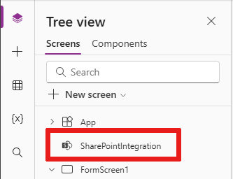

# Understand SharePoint forms integration
You can now easily [customize any SharePoint list form](customize-list-form.md) in Power Apps. In this article, we'll walk through the details of how these forms work and how you can customize them further.

If you've customized a form for a SharePoint list, you've likely noticed that the default generated form works for all operations, like creating, showing, or editing an item. This is accomplished with the help of generated formulas and the **SharePointIntegration** control.

## Understand the default generated form

The default generated form consists of the following controls and their corresponding defaults:

* **FormScreen1** - This is the [screen](controls/control-screen.md) that contains the form.

* **SharePointForm1** - This is the [form](working-with-forms.md) that's used to create, show, or edit the list item.

    * **Data Source** - The list for which the form has been customized.

    * **Item** - The selected item from the list. This is set to First() item in the list for your convenience when working in Power Apps Studio.

        ```powerapps-dot
        If( IsBlank(SharePointIntegration.Selected) || IsEmpty(SharePointIntegration.Selected),
            First('*YourListName*'),
            SharePointIntegration.Selected )
        ```
        [!TIP] This formula pattern ( ... SharePointDatasourceName.Selected ) works for  the Item property of a form.  See the customization section below for a formula pattern to set the value of a SharePoint record.
* **OnSuccess** -  Once the item is created or saved successfully, the form is reset and SharePoint hides the form.

        ```powerapps-dot
        ResetForm(SharePointForm1); RequestHide()
        ```

* **SharePointIntegration** - The control responsible for communicating user actions between SharePoint and Power Apps.

    * **Data Source** - The list for which the form has been customized.

        **'*YourListName*'**

    * **OnNew** - Sets **SharePointForm1** in new mode.

        **NewForm(SharePointForm1)**

    * **OnView** - Sets **SharePointForm1** in view mode.

        **ViewForm(SharePointForm1)**

    * **OnEdit** - Sets **SharePointForm1** in edit mode.

        **EditForm(SharePointForm1)**

    * **OnSave** - Submits the changes to **SharePointForm1**. On successful submission of the form, the **SharePointForm1.OnSuccess** formula is executed.

        **SubmitForm(SharePointForm1)**

    * **OnCancel** - Resets the changes to **SharePointForm1**. SharePoint always hides the form when a user clicks or taps **Cancel** in SharePoint.

        **ResetForm(SharePointForm1)**

These defaults ensure that the form works when running within SharePoint - they change the Power Apps form mode as the user interacts with it in SharePoint, and they ensure that the changes are submitted to SharePoint.

## Understand the SharePointIntegration control
The **SharePointIntegration** control communicates user actions between SharePoint and Power Apps.



>[!NOTE]
>You can access the properties for the **SharePointIntegration** control only when the form is running in SharePoint, not when you're customizing the form in Power Apps Studio. These properties may not be available in **OnStart** or **OnVisible**. 

The **SharePointIntegration** control has the following properties:

**Selected** - The selected item from the SharePoint list.

**OnNew** - Actions to perform when a user clicks or taps the **New** button or opens the **Create item** form in SharePoint.

**OnView** - Actions to perform when a user clicks or taps an **item** or opens the **Item detail** form in SharePoint.

**OnEdit** - Actions to perform when a user clicks or taps the **Edit all** button or opens the **Edit item** form in SharePoint.

**OnSave** - Actions to perform when a user clicks or taps the **Save** button in SharePoint.

**OnCancel** - Actions to perform when a user clicks or taps the **Cancel** button in SharePoint.

**SelectedListItemID** - Item ID for the selected item in a SharePoint list.

**Data Source** - The list that contains the record that the form will show, edit, or create. Note that if you change this property, the **Selected** and **SelectedItemID** properties may stop working.

## Customize the default form
Now that you have a better understanding of the default generated form and the **SharePointIntegration** control, you can change the formulas to further customize the forms. Here are some things to keep in mind when you customize forms:


* Use the **OnSave** formula of the **SharePointIntegration** control to customize what happens when a user clicks or taps **Save** in SharePoint. If you have multiple forms, make sure to submit the changes only for the form currently being used.

  > [!TIP]
  >    Set different values for a variable in the **OnNew**, **OnView**, and **OnEdit** formulas. You can use this variable in the **OnSave** formula to determine which form is being used.

* Make sure to include **RequestHide()** in the **OnSuccess** formula of all your forms. If you forget this, SharePoint will not know when to hide the form.

* You can't control the hiding of a form when a user clicks or taps **Cancel** in SharePoint, so make sure you reset your forms in the **OnCancel** formula of the **SharePointIntegration** control.

* The properties for the **SharePointIntegration** control may not be available in **OnStart** or **OnVisible**, and those events execute only once while the list is loaded. You can use **OnNew**, **OnView**, or **OnEdit** formulas to run logic before the form is shown to the user every time. 

## Commonly identified issues in working with the Sharepoint Integration Object
The SharepointIntegration.Selected value, when set to a Collection on the OnView property, does not show the latest value. The recommended way to fix this is to use the SharepointIntegration.SelectedListItemID and then do a lookup on the table to get the selectedRecord.
sample:

### OnView:

* Instead of :
    ```powerapps-dot
      Set( selectedItem,
          SharePointIntegration.Selected );
    ```
* Use:
    ```powerapps-dot
      Set( selectedLookupItem,
          LookUp( testSharepointIntegrationObject, 
                 ID=SharePointIntegration.SelectedListItemID ) );
    ```

Collection Variables are not reset on closing the PowerApp form and the state is persisted for the entire session.  Therefore if there are any use-cases where the variables need to be reset, clear the variables in the OnView property of the sharepointIntegration Object.

### See also

- EditForm, NewForm, SubmitForm, ResetForm, and ViewForm functions - [form functions in Power Apps](functions/function-form.md)
- [RequestHide function](functions/function-requesthide.md)
- [SharePoint integration scenarios](sharepoint/scenarios-intro.md)


[!INCLUDE[footer-include](../../includes/footer-banner.md)]