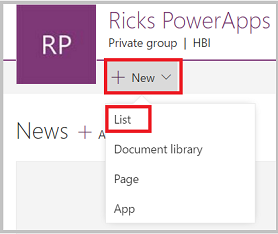
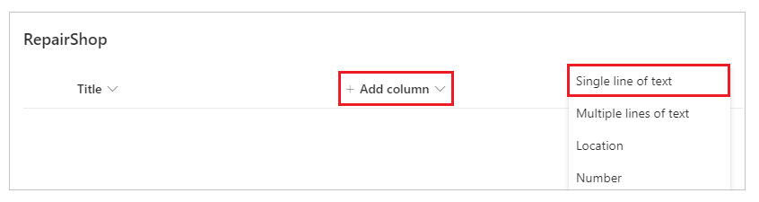
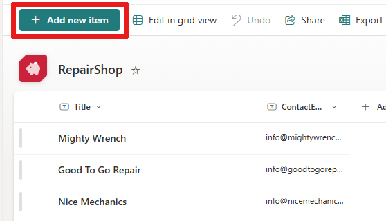
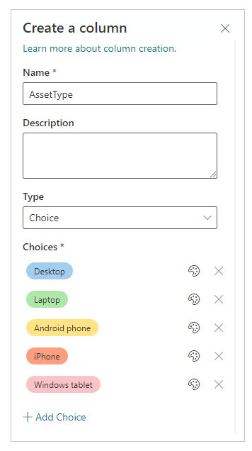
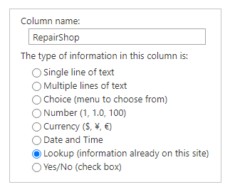
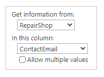
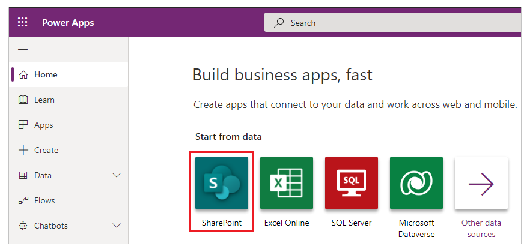
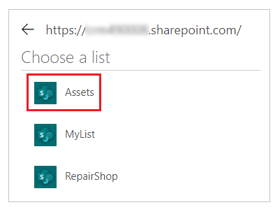
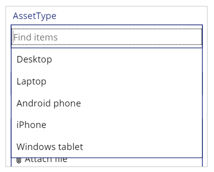
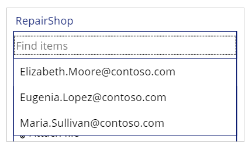

# How to link SharePoint lists using a lookup column in Power Apps

This tutorial shows how you can connect two SharePoint lists with a lookup column in a canvas app.

## Overview

SharePoint provides two types of lookup column:

* **Lookup**: links to another list: for example an *Orders* list may have a lookup column that links to customers in a *Customer* list;
* **Choice**: clicking or tapping the column displays a small menu of items that you choose from.

In this tutorial, you build an app that uses these kinds of lookup column.

### Why use a lookup column

Data in an enterprise is large and complex. Data in one SharePoint list often relates to data in another list. Lookup column are the primary way such business data comes together.

For example, you might have an **Orders** list which has a lookup column that links to a **Customers** list, to show which customer placed the order. The lookup column in the **Orders** list lets you get other data from the **Customers** list as well. You might also use a lookup column to connect the **Orders** list to a **Product** list, and bring in information you need about the product ordered, such as product pictures, specifications, manufacturer details, etc.

### What are Choice column used for?

**Choice** column are used for very short lists, but instead of actually creating a separate list, you include the list values in a small menu, which appears when you select **Choice** column, and you select one of the values.

Examples include data like Customer Status Code, Product Availability, State Codes; basically any fixed list that is relatively short. This data could in fact be implemented as separate lists, and then you would use a **Lookup** column to link to them, but it is usually easier and quicker to implement them as **Choice** column.

>[!TIP]
> For more SharePoint and Power Apps integration tutorials, go to [SharePoint integration scenarios](sharepoint/scenarios-intro.md).

## Create the lists in SharePoint

In this tutorial, you link two SharePoint custom lists together, **Assets** and **RepairShop**. The **Assets** list is used to track hardware equipment in a team. Since hardware gets broken from time to time, we use the **RepairShop** list to track the local shops which can fix it.

### The lookup column used in this example

The **RepairShop** list uses the *ContactEmail* column to identify the shop. This list is defined first so that each row in the **Assets** list has something to point to.

The **Assets** list has two lookup column:

* one called *RepairShop*, of type **Lookup**, which uses email addresses to point to entries in the **RepairShop** list;
* one called *AssetType*, of type **Choice**, which lists the kinds of hardware that this asset might be.

You most likely would define additional columns, depending on the information you need to track.

### Define the RepairShop list and add data

You do this first, so that when you add data to the **Assets** list, **RepairShop** entries are available for you to choose from the *Assets.RepairShop* lookup column.

1. On your SharePoint site, create a new **RepairShop** list from blank.

    

2. Add a *ContactEmail* column of type **Single line of text**.

    

3. Add any other columns you need.

4. Select **+ New** to enter sample data into the list, at least 3 rows with different *ContactEmail* values. When an asset needs to be repaired, you choose one of these. You can also use **Edit in grid view** to quickly enter text in grid.

    

### Define the Assets list

1. On your SharePoint site, create a new **Assets** list from blank.

1. Add an *AssetType* column of type **Choice**, and fill in the values you want to appear in the choice menu as choices. Then select **Save**.

    

1. Select **+ Add column** > **More**.

1. Enter column name as *RepairShop*. And column type as **Lookup**.

    

1. In additional column settings, select **RepairShop** as the list to get the information from, and the column for the lookup as **ContactEmail**.

    

1. Select **Ok**.

1. Add any additional column you want.

## Create an app from the Assets list

You use this app to add data to the **Assets** list.

1. Sign in to [Power Apps](https://make.powerapps.com).

1. Under **Start from data**, select **SharePoint**.

    

1. Select your SharePoint site. If you don't have a SharePoint connection, select **Create** instead, connect to SharePoint online, and then choose your site.

1. Choose the main list from your SharePoint site, in this example, **Assets**. Select the **Connect** button in the lower-right corner.

    

## Add data to the Assets list

Now you can run the app and see how the view details screen looks for the lookup columns.

1. Press F5 or select Preview (  ).

2. Select the **+** symbol in the upper right corner to add an entry.

3. Enter a **Title** for this asset.

4. Select the **AssetType** dropdown arrow. The values displayed are those you entered when you created this column. Choose one of the entries.

    

5. Select the **RepairShop** dropdown arrow. Choose one of the entries.

    

6. In the upper-right corner, select the check mark to save the new entry.

7. (optional) Repeat this procedure to add as many items to the list as you want.

8. Press Esc to return to the default workspace.

9. [Save and publish](save-publish-app.md) the app.

## Next steps

* [Introducing support for lookups and a new sample app](https://powerapps.microsoft.com/blog/support-for-lookups/)
* [Performance, Refresh button, ForAll, and multiple column lookups](https://powerapps.microsoft.com/blog/performance-refresh-forall-multiple-field-lookups-531/)
* [Generate an app by using a Microsoft Dataverse database](data-platform-create-app.md)
* [Create an app from scratch using a Dataverse database](data-platform-create-app-scratch.md)

### See also

- [SharePoint integration scenarios](sharepoint/scenarios-intro.md)

[!INCLUDE[footer-include](../../includes/footer-banner.md)]