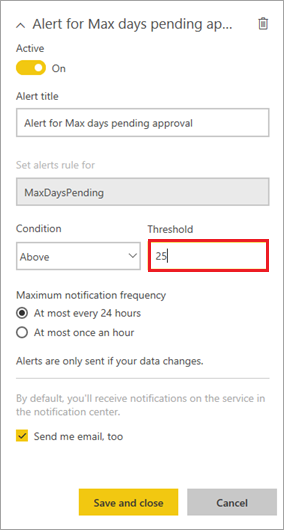

# Set up data alerts for the Power BI dashboard
> [!NOTE]
> This article is part of a tutorial series on using Power Apps, Power Automate, and Power BI with SharePoint Online. Make sure you read the [series introduction](sharepoint-scenario-intro.md) to get a sense of the big picture, as well as related downloads.

In this task we'll add an alert in Power BI to let us know if pending projects are taking too long to approve, and a flow that responds when that alert occurs. For more information on alerts, see [Data alerts in Power BI service](/power-bi/service-set-data-alerts).

## Step 1: Create an alert
1. In the Power BI service, open the dashboard you created in the last task.
2. On the card with the single number, click or tap the ellipsis (**. . .**).
   
    
3. Click or tap .
   
    
4. In the right pane, click or tap **Add alert rule**.
   
    
5. Look at the options that are available for alerts, such as how frequently an alert should run. Enter a value of 25 for **Threshold**, then click or tap **Save and close**.
   
    

The alert won't fire right now even though 56 is above the threshold of 25. It will fire when data is updated, which we'll see when we [run through the scenario end-to-end](sharepoint-scenario-summary.md).

When the alerts fires, Power BI sends email to the creator of the alert, and we'll see how to send additional mail using Power Automate, in the next step.

## Step 2: Create a flow that responds to the alert
1. Sign into flow.microsoft.com, click or tap **Services**, then **Power BI**.
   
    
2. Click or tap **Send an e-mail to any audience when a Power BI data alert is triggered**.
   
    
3. Click or tap **Use this template**.
4. If you're not already signed in, sign into Outlook and Power BI, then click or tap **Continue**.
   
    
5. In the **Alert Id** drop-down list, select **Alert for Max days pending approval**.
   
    
6. In the **To** box, enter a valid email address.
   
    
7. Click or tap **Edit** to see other fields that you can update.
   
    
8. At the top right of the screen, click **Create flow**, then **Done**.
   
    

We will see this flow run when we [run through the scenario end-to-end](sharepoint-scenario-summary.md). Now we'll move on to the last task in this scenario - embedding a Power BI report into SharePoint.

## Next steps
The next step in this tutorial series is to [embed the Power BI project report in SharePoint Online](sharepoint-scenario-embed-report.md).

### See also

- [SharePoint integration scenarios](sharepoint/scenarios-intro.md)

[!INCLUDE[footer-include](../../includes/footer-banner.md)]