# Create a canvas app to manage projects
> [!NOTE]
> This article is part of a tutorial series on using Power Apps, Power Automate, and Power BI with SharePoint Online. Make sure you read the [series introduction](sharepoint-scenario-intro.md) to get a sense of the big picture, as well as related downloads.

In this task, we'll build a canvas app from scratch. This app allows a user to assign a manager to projects and to update project details. You will see some of the same controls and formulas you saw in the first app, but you will build more of the app yourself this time. The process is more complex, but you'll learn more, so we think it's a fair trade-off.

## Quick review of Power Apps Studio
Power Apps Studio has three panes and a ribbon that make app creation feel like building a slide deck in PowerPoint:

1. Left navigation bar, which shows a hierarchical view of all the app's screens and controls, as well as thumbnails of the screens
2. Middle pane, which contains the app screen you are working on
3. Right-hand pane, where you set options like layout and data sources
4. Property drop-down list, where you select the properties that formulas apply to
5. Formula bar, where you add formulas (like in Excel) that define app behavior
6. Ribbon, where you add controls and customize design elements

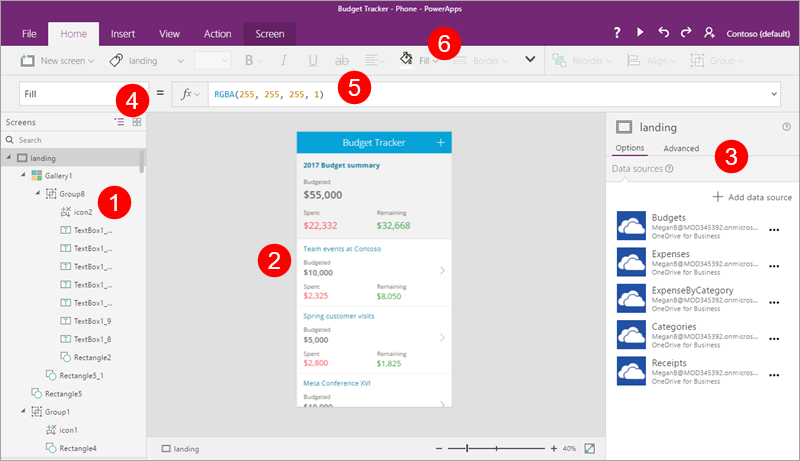

## Step 1: Create screens
With that review out of the way, let's start building an app.

### Create and save the app
1. In Power Apps Studio, click or tap **New**, then under **Blank app**, click or tap **Phone Layout**.
   
    
2. Click or tap **File**, which opens to an **App settings** tab. Enter the name "Project Management app".
   
    
3. Click or tap **Save as**, verify that the app will save to the cloud, then click **Save** in the lower right corner.
   
    

4. Click or tap  to go back to the app.

### Add four screens to the app
In this step, we'll create four blank screens for the app. We'll use different screen layouts, depending on the screen's purpose. We'll add to these screens in later steps.

| **Screen** | **Purpose** |
| --- | --- |
| **SelectTask** |Opening screen; navigate to other screens |
| **AssignManager** |Assign a manager to an approved project |
| **ViewProjects** |View a list of projects, with summary information |
| **UpdateDetails** |View and update the details for a project |

1. On the **Home** tab, click or tap **NewScreen**, then **Scrollable screen**.
   
    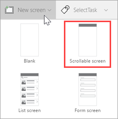
2. Rename the screen to **SelectTask**.
   
    
3. Create and rename additional screens:
   
   1. Click or tap **NewScreen**, then **Scrollable screen**. Rename the screen to **AssignManager**.
   2. Click or tap **NewScreen**, then **List screen**. Rename the screen to **ViewProjects**.
   3. Click or tap **NewScreen**, then **Form screen**. Rename the screen to **UpdateDetails**.
4. Select the ellipsis (**. . .**) next to **Screen1**, then click or tap **Delete**.
   
    

The app should now look like the following image.

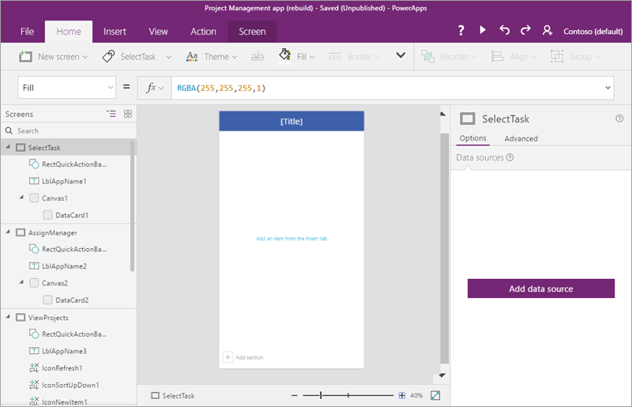

## Step 2: Connect to a SharePoint list
In this step, we'll connect to the **Project Details** SharePoint list. We only use one list in this app, but you could easily connect to both if you want to extend the app.

1. In the left navigation bar, click or tap the **SelectTask** screen.
2. In the right pane, click or tap **Add data source**.
   
    
3. Click or tap **New connection**.
   
    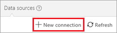
4. Click or tap **SharePoint**.
   
    
5. Select **Connect directly (cloud services)**, then click or tap **Create**.
   
    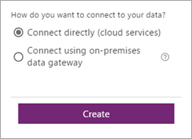
6. Enter a SharePoint URL, then click or tap **Go**.
   
    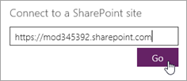
7. Select the **Project Details** list, then click or tap **Connect**.
   
    
   
    The **Data sources** tab in the right pane now shows the connection that you have created.
   
    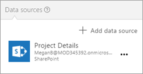

## Step 3: Build the SelectTask screen
In this step, we'll provide a way to navigate to the other screens in the app - working with some of the controls, formulas, and formatting options that Power Apps provides.

### Update the title and insert introductory text
1. In the left navigation bar, select the **SelectTask** screen.
2. In the middle pane, select the default **[Title]**, then in the formula bar, update the **Text** property to "Contoso Project Management".
   
    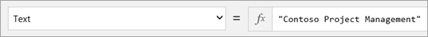
3. On the **Insert** tab, click or tap **Label**, then drag the label down below the top banner.
   
    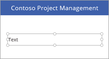
4. In the formula bar, set the following properties for the label:
   
   * **Color** property = **DarkGray**

   * **Size** property = **18**

   * **Text** property = "**Click or tap a task to continue..."**
     
     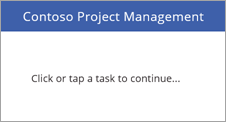

### Add two navigation buttons
1. On the **Insert** tab, click or tap **Button**, then drag the button below the label.
   
    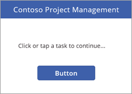
2. In the formula bar, set the following properties for the button:
   
   * **OnSelect** property = **Navigate(AssignManager, Fade)**. When you run the app and click this button, you navigate to the second screen in the app, with a fade transition between the screens.

   * **Text** property = **"Assign Manager"**

3. Resize the button to accommodate the text.
   
    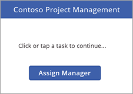
4. Insert another button with the following properties:
   
   * **OnSelect** property = **Navigate(ViewProjects, Fade)**.

   * **Text** property = **"Update Details"**
     
     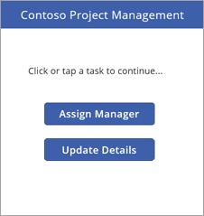
     
     > [!NOTE]
     > The button is labeled **Update Details**, but we first navigate to the **ViewProjects** screen to select a project to update.

### Run the app
The app doesn't do a lot yet, but you can run it if you like:

1. Click or tap the **SelectTask** screen (the app always starts from the selected screen in Preview mode in Power Apps Studio).

2. Click or tap  in the upper right corner to run the app.

3. Click or tap one of the buttons to navigate to another screen.

4. Click or tap  in the upper right corner to close the app.

## Step 4: Build the AssignManager screen
In this step, we'll use a gallery to display all projects that have been approved but don't yet have a manager. We'll add other controls, so you can assign a manager.

> [!NOTE]
>  We'll build a page later in the app that allows you to edit all fields for a project (including the manager field), but we thought it would be cool to build a screen like this one as well.

1. Save the changes you've made so far.

2. In the left navigation bar, click or tap the **AssignManager** screen.

### Update the title and insert introductory text

1. Change **[Title]** to **Assign Manager**.

2. Add a label with the following properties:
   
   * **Color** property = **DarkGray**

   * **Size** property = **18**

   * **Text** property = "**Select a project, then assign a manager"**
     
     

### Add a back arrow to return to the SelectTask screen

1. Click or tap the blue bar at the top of the screen.

2. On the **Insert** tab, click or tap **Icons**, then click or tap **Left**.
   
    

3. Move the arrow to the left side of the blue bar, and set the following properties:
   
   * **Color** property = **White**

   * **Height** property = **40**

   * **OnSelect** property = **Navigate(SelectTask, Fade)**

   * **Width** property = **40**
     
     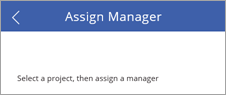

### Add and modify a gallery

1. On the **Insert** tab, click or tap **Gallery**, then **Vertical**.
   
    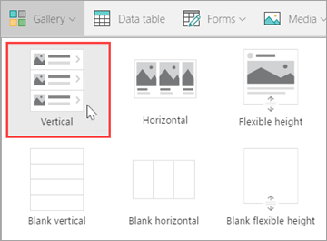

2. Select **Title, subtitle, and body** from the **Layout** menu in the right pane. 
   
    
   
    The gallery now has the right layout, but it still has the default sample text. We'll fix that next.
   
    

3. Set the following properties for the gallery:
   
   * **BorderThickness** property = **1**

   * **BorderStyle** property = **Dotted**

   * **Items** property = **Filter('Project Details', PMAssigned="Unassigned")**. Only projects with no manager assigned are included in the gallery.
     
     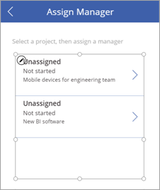

4. In the right pane, update the fields to match the following list:
   
   * **ApprovedDate**

   * **Status**

   * **Title**
     
     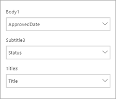

5. Resize labels in the gallery as appropriate, and remove the arrow from the first gallery item (we don't need to navigate anywhere from this gallery).
   
    
   
    The screen should now look like the following image.
   
    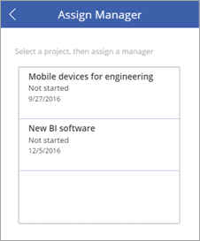

### Change the color of an item if it's selected

1. Select the gallery, then set the **TemplateFill** property to **If (ThisItem.IsSelected=true, Orange, White)**.

2. Select an item in the gallery. The screen should now look like the following image.
   
    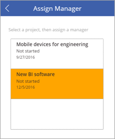

### Add a label, text input, and OK button to submit manager assignments

1. Click or tap outside the gallery you've been working on.

2. On the **Insert** tab, click or tap **Label**. Drag the label below the gallery, to the left. Set the following properties for the label:
   
   * **Size** property = **20**

   * **Text** property = **"Manager:"**
   
   

3. On the **Insert** tab, click or tap **Text**, then **Text input**. Drag the text input below the gallery, in the center. Set the following properties for the drop down:
   
   * **Default** property = **""**

   * **Height** property = **60**

   * **Size** property = **20**

   * **Width** property = **250**
   
   

4. On the **Insert** tab, click or tap **Button**. Drag the button below the gallery, to the right. Set the following properties for the button:
   
   * **Height** property = **60**

   * **OnSelect** property = **Patch('Project Details', LookUp('Project Details', ID = Gallery1.Selected.ID), {PMAssigned: TextInput1.Text})**. For more information, see [Formula deep-dive](#formula-deep-dive).

   * This formula updates the **Project Details** list, setting a value for the PMAssigned field.

   * **Size** property = **20**

   * **Text** property = **"OK"**

   * **Width** property = **80**
   
   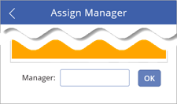

The completed screen should now look like the following image.

## Step 5: Build the ViewProjects screen
In this step, we'll change properties for the gallery on the **ViewProjects** screen. This gallery displays items from the **Project Details** list. You select an item on this screen, then you edit the details on the **UpdateDetails** screen.

1. In the left navigation bar, click or tap the **ViewProjects** screen.

2. Change **[Title]** to **"View Projects"**.

3. In the left navigation bar, click or tap **BrowserGallery1** under **ViewProjects**.

4. Select **Title, subtitle, and body** from the **Layout** menu in the right pane. 
   
    
   
    The gallery now has the right layout, with the default sample text.
   
    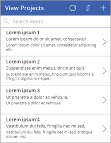

5. Select the refresh button , and set its **OnSelect** property to **Refresh('Project Details')**.

6. Select the new item button , and set its **OnSelect** property to **NewForm(EditForm1); Navigate(UpdateDetails, ScreenTransition.None)**.

### Add a back arrow to return to the SelectTask screen

1. In the left navigation bar, click or tap the **AssignManager** screen.

2. Select the back arrow you added there, and copy it.

3. Paste the arrow into the **ViewProjects** screen and position it to the left of the refresh button. 
   
    
   
    All its properties come along with it, including the **OnSelect** property of **Navigate(SelectTask, Fade)**.

### Change the data source for the BrowseGallery1 gallery

1. Select the **BrowseGallery1** gallery, and set the **Items** property of the gallery to **SortByColumns(Filter('Project Details', StartsWith(Title, TextSearchBox1.Text)), "Title", If(SortDescending1, Descending, Ascending))**.
   
    This sets the data source of the gallery to the **Project Details** list, and uses the **Title** field for search and sort.

2. Select the  in the first gallery item, and set the **OnSelect** property to **Navigate(UpdateDetails, None)**.
   
    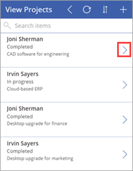

3. In the right pane, update the fields to match the following list:
   
   * **Status**

   * **PMAssigned**

   * **Title**
     
     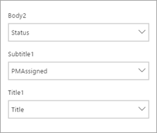
     
     The completed screen should now look like the following image.
     
     

## Step 6: Build the UpdateDetails screen
In this step, we'll connect the edit form on the **UpdateDetails** screen to our data source, and we'll make some property and field changes. On this screen, you edit details for a project that you selected on the **View Projects** screen.

1. In the left navigation bar, click or tap the **UpdateDetails** screen.

2. Change **[Title]** to **"Update Details"**.

3. In the left navigation bar, click or tap **EditForm1** under **UpdateDetails**.

4. Set the following properties for the form:
   
   * **DataSource** property = **'Project Details'**

   * **Item** property = **BrowseGallery1.Selected**

5. With the form still selected, in the right pane click or tap the checkbox for the following fields, in the order shown:
   
   * **Title**

   * **PMAssigned**

   * **Status**

   * **ProjectedStartDate**

   * **ProjectedEndDate**

   * **ProjectedDays**

   * **ActualDays**
     
     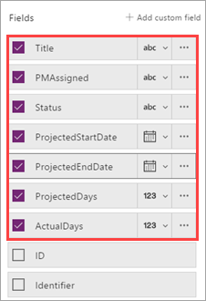
6. Select the cancel button , and set its **OnSelect** property to **ResetForm(EditForm1); Back()**.

7. Select the save button  and check out the **OnSelect** formula - **SubmitForm(EditForm1)**. Because we're using the edit form control, we can use **Submit()**, instead of using **Patch()** like we did earlier.

The completed screen should now look like the following image (if the fields are blank, make sure you select an item on the **View Projects** screen).

## Step 7: Run the app
Now that the app is complete, let's run it to see how it works. We'll add a link on the SharePoint site to the app. You will be able to run the app in the browser, but you might need to share the app for other people to run it. For more information, see [Share your app](share-app.md).

### Add a link to the app
1. In the Office 365 app launcher, click or tap **Power Apps**.
   
    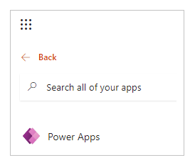

2. In Power Apps, click or tap the ellipsis (**. . .**) for **Project Management app**, then **Open**.
   
    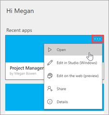

3. Copy the address (URL) for the app in the browser.
   
    

4. In SharePoint, click or tap **EDIT LINKS**.
   
    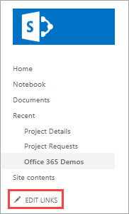

5. Click or tap **(+) link**.
   
    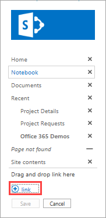

6. Enter "Project Management app", and paste in the address for the app.
   
    

7. Click or tap **OK**, then **Save**.
   
    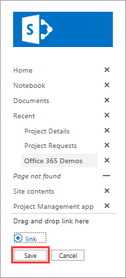

### Assign a manager to a project
Now that we have the app in our SharePoint site, we'll assume the role of the project approver - we'll look for any projects that don't have a manager assigned, and assign a manager to one of the projects. Then we'll assume the role of the project manager, and add some information about a project that is assigned to us.

1. First, let's look at the **Project Details** list in SharePoint. Two projects have a value of **Unassigned** in the **PMAssigned** column. We will see these in the app.
   
    

2. Click or tap the link that you created to the app.

3. On the first screen, click or tap **Assign Manager**.
   
    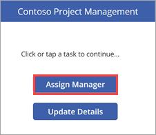

4. On the **Assign Manager** screen, you see the two unassigned projects from the list. Select the **New BI software** project.
   
    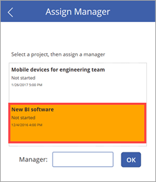

5. In the **Manager** text input, enter "Joni Sherman", then click **OK**.
   
    The change is applied to the list, and the gallery refreshes so only the remaining unassigned project is displayed.
   
    

6. Go back to the SharePoint list and refresh the page. You'll see that the project entry is now updated with the project manager name.
   
    

### Update details for the project

1. Click or tap  to go back to the first screen, then click or tap **Update Details**.
   
   

2. On the **View Projects** screen, enter "New" in the search box.
   
   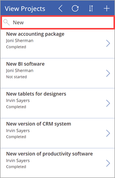

3. Click  for the **New BI software** item.
   
   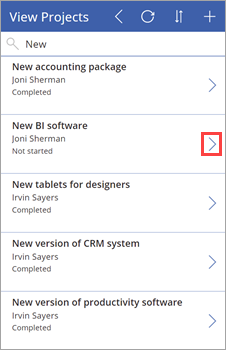

4. On the **Update Details** screen, set the following values:
   
   * The **ProjectedStartDate** field = "3/6/2017"

   * The **ProjectedEndDate** field = "3/24/2017"

   * The **ProjectedDays** field = "15"
   
   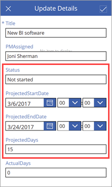

5. Click or tap  to apply the change to the SharePoint list.

6. Close the app, and go back to the list. You see that the project entry is now updated with the date and day changes.
   
    

## Formula deep-dive
This is the second optional section on Power Apps formulas. In the first deep-dive, we looked at one of the formulas that Power Apps generates for the browse gallery in a three-screen app. In this deep-dive, we'll look at a formula that we use for the **AssignManager** screen of our second app. Here's the formula:

**Patch( 'Project Details', LookUp( 'Project Details', ID = Gallery1.Selected.ID ), {PMAssigned: TextInput1.Text} )**

What does this formula do? When you select an item in the gallery and click the **OK** button, the formula updates the **Project Details** list, setting the **PMAssigned** column to the value that you specify in the text input. The formula uses functions to do its work:

* The [**Patch** function](functions/function-patch.md) modifies one or more records of a data source.

* The [**LookUp** function](functions/function-filter-lookup.md) finds the first record in a table that satisfies a formula.

When you put the functions together in the formula, here's what happens:

1. When you click the **OK** button, the **Patch** function is called to update the **Project Details** list.

2. Within the **Patch** function, the **LookUp** function identifies which row of the **Project Details** list to update. It does this by comparing the ID of the selected gallery item to the ID in the list. For example, an ID of 12 means that the entry for **New BI software** should be updated.

3. Now that the **Patch** function has the right ID, it updates the **PMAssigned** field to the value in **TextInput1.Text**.

## Next steps
The next step in this tutorial series is to [create a Power BI report to analyze projects](sharepoint-scenario-build-report.md).

### See also

- [SharePoint integration scenarios](sharepoint/scenarios-intro.md)

[!INCLUDE[footer-include](../../includes/footer-banner.md)]
