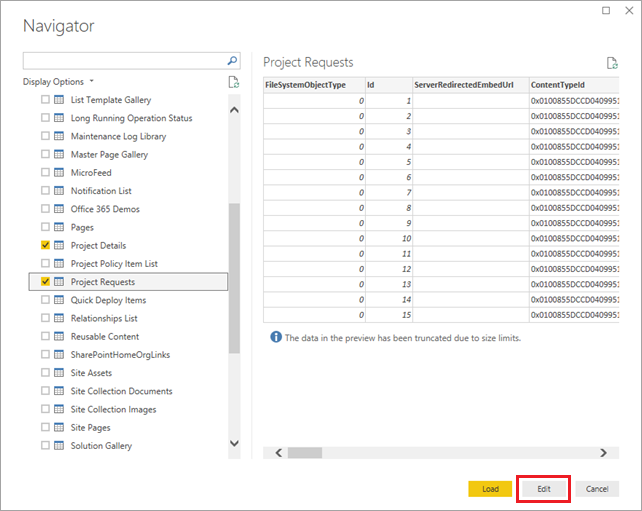
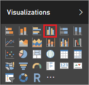
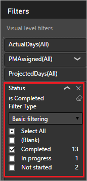
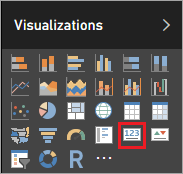
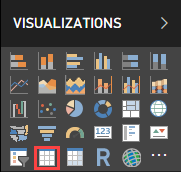
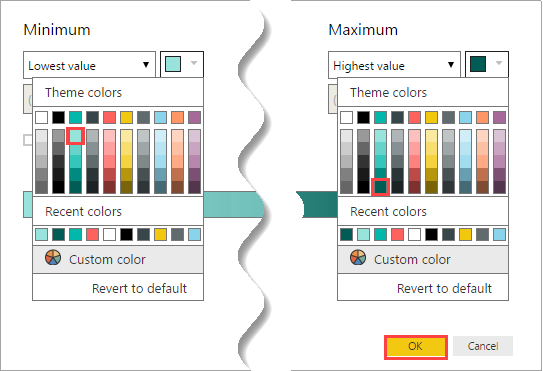

# Create a Power BI report to analyze projects
> [!NOTE]
> This article is part of a tutorial series on using Power Apps, Power Automate, and Power BI with SharePoint Online. Make sure you read the [series introduction](sharepoint-scenario-intro.md) to get a sense of the big picture, as well as related downloads.

In this task, we'll create a Power BI report based on the two SharePoint lists. We'll bring the list data into Power BI Desktop and clean it up a little, do some basic data modeling, and create a set of visuals that tell us something about the data.

## Quick review of Power BI Desktop
Before we dive into report creation, let's review Power BI Desktop. This is a powerful tool, with a lot of features, so we will focus on an overview of the areas that you will use in this task. There are three main work areas or *views* in Power BI Desktop: **Report** view, **Data** view, and **Relationships** view. Power BI Desktop also includes **Query Editor**, which opens in a separate window.

The following screen shows the three view icons along the left of Power BI Desktop: **Report**, **Data**, and **Relationships**, from top to bottom. The yellow bar along the left indicates the current view; in this case, **Report** view is displayed. Change views by selecting any of those three icons.


The **Report** view has five main areas:

1. The ribbon, which displays common tasks associated with reports and visualizations.
2. The **Report** view, or canvas, where visualizations are created and arranged.
3. The **Pages** tab area along the bottom, which lets you select or add a report page.
4. The **Visualizations** pane, where you change visualizations, customize colors or axes, apply filters, drag fields, and more.
5. The **Fields** pane, where query elements and filters can be dragged onto the **Report** view, or dragged to the **Filters** area of the **Visualizations** pane.


The **Data** view has three main areas:

1. The ribbon, which has the **Modeling** tab selected below. On this tab, you create calculated tables and columns, and make other changes to the data model.
2. The center pane, which shows data for the selected table.
3. The **Fields** pane, where you control how fields are displayed in your reports.


We don't use the **Relationships** view in this task, but you can check it out later after we bring the list data into Power BI Desktop.

In **Query Editor**, you build queries and transform data, then load that refined data model into Power BI Desktop. **Query Editor** has four main areas:

1. The ribbon, which has many options for shaping and transforming the data that you bring in.
2. The left pane, where queries are listed and available for selection, viewing, and shaping.
3. The center pane, where data from the selected query is displayed and available for shaping.
4. The **Query Settings** window, which lists the query's properties and data transform steps that have been applied.


## Step 1: Get data into Power BI Desktop
In this step, we'll first connect to the two lists. Then we'll clean up the data by removing columns we don't need for our data analysis. We'll also change the data types on some of the remaining columns so that calculations work properly. For more information on getting and cleaning data in Power BI Desktop, see the [Getting Data](https://powerbi.microsoft.com/guided-learning/powerbi-learning-1-1-overview-of-power-bi-desktop) section in our Guided Learning course.

### Connect to SharePoint lists
1. In Power BI Desktop, on the **Home** tab, click or tap **Get Data**, then **More…**
   
    
2. In the **Get Data** dialog box, click or tap **SharePoint Online List**, then **Connect**.
   
    
3. Enter the URL for your SharePoint site, then click or tap **OK**.
   
    
4. If you get the following dialog box, make sure you're signed in with the right credentials, then click or tap **Connect**.
   
    
5. Select **Project Details** and **Project Requests**, then click or tap **Edit**.
   
    
   
    The lists are now displayed as tables in Query Editor.
   
    

### Remove unnecessary columns from the tables
1. In the left navigation pane, click or tap **Project Details**.
2. In the middle pane, select the **FileSystemObjectType** column, then click or tap **Remove Columns**.
   
    
3. Remove the two columns after the **Id** column: **ServerRedirectedEmbedURL** and **ContentTypeId**. 
   > [!TIP]
   > Use the Shift key to select both columns, then click or tap **Remove Columns**.
4. Remove all columns to the right of the **PMAssigned** column (a total of 22 columns). The table should match the following image:
   
    
5. Repeat the process you just went through, now for **Project Requests**: remove **FileSystemObjectType**, **ServerRedirectedEmbedURL**, **ContentTypeId**, and all columns to the right of the **Approved** column (a total of 22 columns). The table should match the following image:
   
    

### Change the data type on Project Details columns
1. Select the **ProjectedDays** column, click or tap **Data Type: Any**, then **Whole Number**.
   
    
2. Repeat the previous step for the **ActualDays** column.
3. Select the **ApprovedDate** column, click or tap **Data Type: Any**, then **Date**.
   
    

4. Repeat the previous step for the **ProjectedStartDate** and **ProjectedEndDate** columns.

### Change the data type on Project Requests columns

1. Select the **EstimatedDays** column, click or tap **Data Type: Any**, then **Whole Number**.

2. Select the **RequestDate** column, click or tap **Data Type: Any**, then **Date**.

### Apply and save changes

1. On the **Home** tab, click **Close and Apply** to close Query Editor and go back to the main Power BI Desktop window.
   
    

2. Click or tap **File**, then **Save**, and save with the name project-analysis.pbix.

## Step 2: Improve the data model
Now that we have the data from our SharePoint lists pulled into Power BI Desktop, we'll move on to data modeling. Data modeling can be a time-consuming process, but we'll briefly show you some interesting things you can do to get more out of the list data in Power BI Desktop:

* Change how the two tables are related to each other
* Add a date table so we can make calculations based on weekdays
* Add calculated columns to calculate timespans between project milestones
* Add measures to calculate variance in projected versus actual days for a project

After these steps are complete, we can build visualizations that take advantage of the improvements to our model. For more information on modeling data in Power BI Desktop, see the [Modeling](https://powerbi.microsoft.com/guided-learning/powerbi-learning-2-1-intro-modeling-data) section in our Guided Learning course.

### Change table relationships
When Power BI Desktop brought the lists in, it created a relationship between them based on the **Id** column in both tables. The relationship should actually be between the **Id** column in the **Project Requests** table, and the **RequestId** column in the **Project Details** table. Let's fix that:

1. Click or tap the **Data view** icon.
   
    

2. On the **Modeling** tab, click or tap **Manage Relationships**. We'll stay on this tab in the **Data** view for all the data modeling steps.
   
    

3. Make sure the existing relationship is selected, click or tap **Delete**, then **Delete** again to confirm.
   
    

4. Click **New** to create a different relationship.

5. In the **Create Relationship** dialog box:
   
   1. For the first table, select **Project Requests**, and the **Id** column.
   
   2. For the second table, select **Project Details**, and the **RequestId** column.
   
   3. The screen should look like the following image. When you're ready, click or tap **OK**, then **Close**.
      
       

### Add a date table to make date-based calculations easier
1. Click or tap **New Table**.
   
    
2. Enter this formula into the formula bar: **Dates = CALENDARAUTO()**.
   
    
   
    This formula creates a table called **Dates** with a single date column. The table covers all dates from your other table, and it updates automatically if additional dates are added (i.e. if data is refreshed).
   
    This formula and the other ones in this section use Data Analysis Expressions (DAX), a formula language for Power BI and other technologies. For more information, see [DAX basics in Power BI Desktop](/power-bi/desktop-quickstart-learn-dax-basics).
3. Press Enter to create the **Dates** table.
   
    

### Add a calculated column to the Dates table
1. While still on the date table, click or tap **New Column**.
   
    
2. Enter this formula into the formula bar: **IsWeekDay = SWITCH(WEEKDAY(Dates[Date]), 1,0,7,0,1)**.
   
    This formula determines whether a date in the **Date** column is a weekday. If the date is a weekday, the **IsWeekDay** column gets a value of 1; otherwise it gets a value of 0.
3. Press Enter to add the **IsWeekDay** column to the **Dates** table.
   
    

### Add a calculated column to the Project Details table
1. In the right pane, click or tap the **Project Details** table, then **New Column**.
   
    
2. Enter this formula into the formula bar:
   
    ```dax
    ApprovedStartDiff = CALCULATE(SUM(Dates[IsWeekday]),
       DATESBETWEEN(Dates[Date],
          'Project Details'[ApprovedDate],
          'Project Details'[ProjectedStartDate]
      )
    )
    ```
   
    This formula calculates the difference in days between when a project was approved and when it is projected to start. It uses the **IsWeekday** column from the **Dates** table, so it counts only weekdays.
3. Press Enter to add the **ApprovedStartDiff** column to the **Project Details** table.
   
    

### Add a calculated column to the Project Requests table
1. In the right pane, click or tap the **Project Requests** table, then **New Column**.
   
    
2. Enter this formula into the formula bar:
   
    ```dax
    RequestDateAge = CALCULATE(SUM(Dates[IsWeekday]),
       DATESBETWEEN(Dates[Date],
          'Project Requests'[RequestDate],
          NOW()
       )
    )
    ```
   
    This formula calculates the difference in days between when a project was requested and today's date (NOW()). Again, the formula counts only weekdays. This column is used to look for the project that has been pending the longest.
3. Press Enter to add the **RequestDateAge** column to the **Project Requests** table.
   
    

### Add a measure to the Project Details table
1. In the right pane, click or tap the **Project Details** table, then **New Measure**.
   
    
2. Enter this formula into the formula bar:
   
    ```dax
    VarProjectedActual = DIVIDE(
        SUM('Project Details'[ActualDays]) - SUM('Project Details'[ProjectedDays]),
        SUM('Project Details'[ProjectedDays])
    )
    ```
   
    This formula calculates the variance between actual and projected days for a project. We add this as a measure, rather than a calculated column, so it returns the correct results regardless of how the data is filtered or aggregated in a report.
3. Press Enter to add the **VarProjectedActual** measure to the **Project Details** table.
   
    

### Add a measure to the Project Requests table
1. In the right pane, click or tap the **Project Requests** table, then **New Measure**.
   
    
2. Enter this formula into the formula bar:
   
    ```dax
    MaxDaysPending = MAXX(
        FILTER('Project Requests', 'Project Requests'[Approved]="Pending"),
        'Project Requests'[RequestDateAge]
    )
    ```
   
    This formula finds the project that has been pending the longest, based on the calculated column we defined earlier.
3. Press Enter to add the **MaxDaysPending** measure to the **Project Requests** table.
   
    

## Step 3: Create report visualizations
Now we're at the step that many people think of when they think of data analysis: creating visualizations so we can find patterns in our data. In this step, we'll create four visualizations:

* A column chart that shows projected days versus actual days on projects
* A column chart that shows the variance for each project
* A card that shows the project that has been pending the longest
* A table that shows the time between project approval and projected start date

After we've created these report visualizations in Power BI Desktop, we'll publish the data and reports to the Power BI service, so we can create and share dashboards. For more information on creating reports in Power BI Desktop, see the [Visualizations](https://powerbi.microsoft.com/guided-learning/powerbi-learning-3-1-intro-visualizations) section in our Guided Learning course.

### Create a bar chart to show projected versus actual
1. Click or tap the **Report** view icon. We'll stay in this view for the rest of our time in Power BI Desktop.
   
    
2. In the **Visualizations** pane on the right, click or tap **Clustered column chart**.
   
    
3. Drag **PMAssigned** and **Title** from **Project Details** in the **Fields** pane to **Axis** in the **Visualizations** pane.
   
    
4. Drag **ActualDays** and **ProjectedDays** from **Project Details** in the **Fields** pane to **Value** in the **Visualizations** pane.
   
    
5. The visualization should now look like the following image.
   
    
6. Drag **Status** from **Project Details** in the **Fields** pane to the **Filters** area of the **Visualizations** pane, then select the **Completed** check box.
   
   
   
   The chart is now filtered to show only completed projects, which makes sense because we are comparing projected days to actual days.
7. Click the arrows in the upper left corner of the chart to move up and down the hierarchy of project managers and projects. In the following image, you see what the drill down into projects looks like.
   
   

### Create a bar chart to show variance from projected
1. Click or tap on the canvas outside the visualization you just created.
2. In the **Visualizations** pane on the right, click or tap **Clustered column chart**.
   
    
3. Drag **PMAssigned** and **Title** from **Project Details** in the **Fields** pane to **Axis** in the **Visualizations** pane.
   
    
4. Drag **VarProjectedActual** from **Project Details** in the **Fields** pane to **Value** in the **Visualizations** pane.
   
    
5. Drag **Status** from **Project Details** in the **Fields** pane to the **Filters** area of the **Visualizations** pane, then select the **Completed** check box.
   
    
   
    The visualization should now look like the following image.
   
    
   
    You can see from this chart how much more variability there is for projects that were run by Irvin Sayers versus Joni Sherman. Drill in to see the variability by project, and whether the days projected was more or less than the actual days.
   
    
6. Before we create more visualizations, move and resize the ones you already created, so they fit side-by-side.
   
    

### Create a card that shows the longest pending project
1. Click or tap on the canvas outside the visualization you just created.
2. In the **Visualizations** pane on the right, click or tap **Card**.
   
    
3. Drag **MaxDaysPending** from **Project Requests** in the **Fields** pane to **Fields** in the **Visualizations** pane.
   
    
4. Click or tap **Format** (paint roller), then set **Border** to **On**.
   
    
5. Set **Title** to **On**, then add the title "Max days pending approval".
   
    
   
    The visualization should now look like the following image.
   
    
   
    After we publish this report, we'll use this tile to trigger an alert if the maximum value for a pending project reaches a certain threshold.

### Create a table that shows the time between project approval and projected start date
1. Click or tap on the canvas outside the visualization you just created.
2. In the **Visualizations** pane on the right, click or tap **Table**.
   
    
3. Drag **PMAssigned**, **Title**, and **ApprovedStartDiff** from **Project Details** in the **Fields** pane to **Values** in the **Visualizations** pane.
   
    
4. Drag **ProjectedStartDate** from **Project Details** in the **Fields** pane to the **Filters** area of the **Visualizations** pane, then select all dates except for **(Blank)**.
   
    
5. Resize the columns of the table so you can see all the data, and sort by **ApprovedStartDiff**, descending. The visualization should now look like the following image.
   
    
6. In the **Values** area, click or tap the down arrow for **ApprovedStartDiff**, then click or tap **Average**. Now we can see the average duration between project approval and projected start date.
   
    
7. Click or tap the down arrow for **ApprovedStartDiff** again, click or tap **Conditional formatting**, then click or tap **Background color scales**.
   
   
8. Set colors for the **Minimum** and **Maximum** fields as shown below, then click or tap **OK**.
   
   
   
   The visualization should now look like the following image.
   
   
   
   As you can see, projects that Irvin Sayers runs tend to start a lot later after approval. There could be factors other than the assigned manager, but this would be worth looking into.

That brings us to the end of the report section, and you should now have a complete report based on data imported from SharePoint and cleaned up and modeled in Power BI Desktop. If everything went according to plan, your report should look like the following image.


## Next steps
The next step in this tutorial series is to [publish the Power BI project report and create a dashboard](sharepoint-scenario-publish-report.md).

### See also

- [SharePoint integration scenarios](sharepoint/scenarios-intro.md)


[!INCLUDE[footer-include](../../includes/footer-banner.md)]
