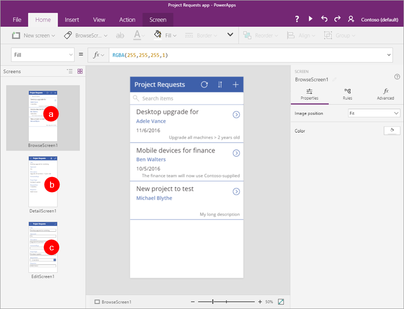
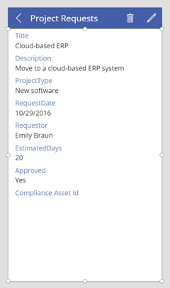
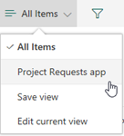

# Generate a canvas app to handle project requests
> [!NOTE]
> This article is part of a tutorial series on using Power Apps, Power Automate, and Power BI with SharePoint Online. Make sure you read the [series introduction](sharepoint-scenario-intro.md) to get a sense of the big picture, as well as related downloads.

Now that the SharePoint lists are in place, we can build and customize our first app. Power Apps is integrated with SharePoint, so it's easy to generate a basic *three screen app* directly from a list. This app allows you to view summary and detailed information for each list item, update existing list items, and create new list items. If you create an app directly from a list, the app appears as a *view* for that list. You can then run that app in a browser, as well as on a mobile phone.

## Step 1: Generate an app from a SharePoint list

1. In the **Project Requests** list you created, select **Integrate** -> **Power Apps** -> **Create an app**.
   
    

2. Give the app a name, like "Project Requests app", then click or tap **Create**. When the app is ready, it opens in Power Apps Studio.
   
    

## Step 2: Review the app in Power Apps Studio

1. In Power Apps Studio, the left navigation bar by default shows a hierarchical view of the screens and controls in the app.
   
    

2. Click or tap the thumbnail icon to switch views.
   
    

3. Click or tap each screen to view it in the middle pane. There are three screens:
   
    (a). The **browse** screen, where you browse, sort, and filter the data pulled in from the list.
    
    (b). The **details** screen, where you view more detail about an item.
    
    (c). The **edit/create** screen, where you edit an existing item or create a new one.
      
      

## Step 3: Customize the app's browse screen

1. Click or tap the browse screen.
   
    This screen has a *layout* that contains a *gallery* to show list items, as well as other *controls*, like a search bar and sort button.

2. Select the **BrowseGallery1** gallery by clicking or tapping any record except the first one.
   
    

3. In the right pane, under **Properties**, click or tap **Project Requests**. 

4. Update the fields to match the following list:
   
   * **RequestDate**

   * **Requestor**

   * **Title**

     

5. With **BrowseGallery1** still selected, select the **Items** property.
   
    

6. Change the formula to **SortByColumns(Filter('Project Requests', StartsWith(Title, TextSearchBox1.Text)), "Title", If(SortDescending1, Descending, Ascending))**.
   
    
   
    This allows you to sort and search by the **Title** field, instead of the default that Power Apps picked. See [Formula deep-dive](#formula-deep-dive) for more information.

6. Click or tap **File**, then **Save**. Click or tap  to go back to the app.

## Step 4: Review the app's details screen and edit screen
1. Click or tap the details screen.
   
    This screen has a different layout that contains a *display form* to show the details for an item selected in the gallery. It has controls to edit and delete items, and to go back to the browse screen.
   
    

4. Click or tap the edit screen.
   
    This screen contains an *edit form* to edit the selected item, or create a new one (if you come here directly from the browse screen). It has controls to save or discard changes.

    

## Step 5: Run the app from the list

1. In the **Project Requests** list, click or tap **All Items**, then **Project Requests app**.
   
    
2. Click **Open**, which opens the app in a new browser tab.
   
    

3. In the app, click or tap  for the first item in the browse gallery.
   
    

4. Click or tap  to edit the item.

5. Update the **Description** field – change the last word from "group" to "team," then click or tap 
   
   

6. Close the browser tab.

7. Go back to the **Project Requests** list, click or tap **Project Requests app**, then **All Items**.
   
   
8. Verify the change you made from the app.
   
    

This is a pretty simple app, and we only made a few basic customizations, but you can see it's possible to quickly build something interesting. We're going to move on to the next task, but look around the app a little more if you want, and see how the controls and formulas work together to drive app behavior.

## Formula deep-dive
This section is optional, but it will help you understand more about how formulas work. In step 3 of this task, we modified the formula for the **Items** property of **BrowseGallery1**. Specifically, we changed the sort and search to use the **Title** field, instead of the field that Power Apps picked. Here's the modified formula:

**SortByColumns ( Filter ( 'Project Requests', StartsWith ( Title, TextSearchBox1.Text ) ),
 "Title", If ( SortDescending1, Descending, Ascending ) )**

But what does this formula do? It determines the source of data that appears in the gallery, filters the data based on any text entered in the search box, and sorts the results based on the sort button in the app. The formula uses *functions* to do its work. Functions take parameters (i.e. input), perform an operation (like filtering), and return a value (i.e. output):

* The [**SortByColumns** function](functions/function-sort.md) sorts a table based on one or more columns.
* The [**Filter** function](functions/function-filter-lookup.md) finds the records in a table that satisfy a formula that you specify.
* The [**StartsWith** function](functions/function-startswith.md) tests whether one text string begins with another.
* The [**If** function](functions/function-if.md) returns one value if a condition is true, and returns another value if the same condition is false.

When you put the functions together in the formula, here's what happens:

1. If you enter text in the search box, the **StartsWith** function compares that text to the start of each string in the **Title** column of the list.
   
    **StartsWith ( Title, TextSearchBox1.Text )**
   
    For example, if you enter "de" in the search box, you see four results, including items that start with "Desktop" and "Device." You won't see all the "Mobile devices" items because those don't *start with* "de."

2. The **Filter** function *returns* rows from the **Project Requests** table. If there is no text in the search box to compare, **Filter** returns all rows.
   
    **Filter ( 'Project Requests', StartsWith ( Title, TextSearchBox1.Text )**

3. The **If** function looks at whether the variable **SortDescending1** is set to true or false (the sort button in the app sets it). The function then returns a value of **Descending** or **Ascending**.
   
    **If ( SortDescending1, Descending, Ascending )**

4. Now the **SortByColumns** function can sort the gallery. In this case, it sorts based on the **Title** field, but this can be a different field than the one you search on.

If you stuck with us up to this point, we hope you have a better sense of how this formula works, and how you can combine functions and other elements to drive the behavior your apps require. For more information, see [Formula reference for Power Apps](formula-reference.md).

## Next steps
The next step in this tutorial series is to [Create a flow to manage project approvals](sharepoint-scenario-approval-flow.md).

### See also

- [SharePoint integration scenarios](sharepoint/scenarios-intro.md)

[!INCLUDE[footer-include](../../includes/footer-banner.md)]
