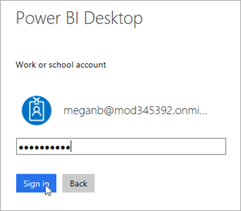
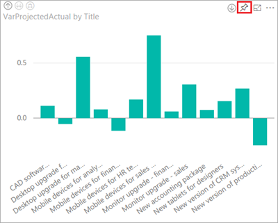

# Publish the Power BI project report and create a dashboard
> [!NOTE]
> This article is part of a tutorial series on using Power Apps, Power Automate, and Power BI with SharePoint Online. Make sure you read the [series introduction](sharepoint-scenario-intro.md) to get a sense of the big picture, as well as related downloads.

In this task, we'll publish our dataset and report to the Power BI service; then we'll create a dashboard based on the report. In many cases a report has a large number of visualizations and only a subset are used in a dashboard. In our case, we'll add all four visualizations to the dashboard.

## Step 1: Publish the dataset and report
1. In Power BI Desktop, on the **Home** tab, click or tap **Publish**.
   
    
2. If you're not already signed in to the Power BI service, enter an account, then click or tap **Sign in**.
   
    
3. Enter a password, then click or tap **Sign in**.
   
    
4. Choose a destination for the report, then click or tap **Select**. We recommend publishing to a group workspace to simplify access to the report in SharePoint. In this case, we are publishing to the **Project Management** group workspace. For more information, see [Collaborate in your Power BI app workspace](/power-bi/service-collaborate-power-bi-workspace).
   
    
5. After publishing completes, click or tap **Open 'project-analysis.pbx' in Power BI**.
   
    
6. The Power BI service loads the report in a browser. If the left navigation pane isn't expanded, click or tap the menu at the top left **(a)** to expand it.
   
    
   
    You can see that when we published, Power BI Desktop uploaded a dataset **(d)** and a report **(c)**. You create dashboards in the service, not Power BI Desktop, and this workspace doesn't have any dashboards yet **(b)**. We'll create one shortly.

## Step 2: Configure credentials for refresh
1. In the service, click or tap  in the top right corner, then click or tap **Settings**.
2. Click or tap **Datasets**, then **project-analysis**.
   
    
3. Expand **Data source credentials**, then click or tap **Edit credentials**.
   
    
4. Select **OAuth2** for Authentication method, then click or tap **Sign in**.
   
    
5. Select or sign in to an account that has permissions for the SharePoint lists.
   
    
   
    When the process completes, you'll get the following message in the service.
   
    

## Step 3: Create a dashboard

1. To get back to your report, under **REPORTS** click or tap **project-analysis**.

1. Click or tap the chart on the upper left, then click or tap .
   
    
2. Enter a name for the dashboard you want to pin to, then click or tap **Pin**.
   
    
3. Click or tap the chart on the upper right, then click or tap tap .
   
    
4. Select the existing dashboard, then click or tap **Pin**.
   
    

5. Repeat the pinning process for the other two visuals.

6. In the left navigation pane, click or tap the dashboard name.
   
    

7. Review the dashboard. If you click on a tile, you will go back to the report.
   
    

That wraps up most of the work in Power BI. If that was your first experience creating reports and dashboards, congratulations! If you're already a pro, we hope you could move through it quickly. Now we will add alerting to make sure we know if the dashboard needs our attention.

## Next steps
The next step in this tutorial series is to [set up data alerts for the Power BI project report](sharepoint-scenario-alerts-flow.md).

### See also

- [SharePoint integration scenarios](sharepoint/scenarios-intro.md)

[!INCLUDE[footer-include](../../includes/footer-banner.md)]