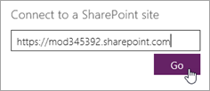
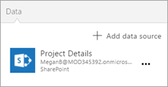

# Set up lists for SharePoint Online integration with PowerApps, Microsoft Flow, and Power BI
> [!NOTE]
> This article is part of a tutorial series on using PowerApps, Microsoft Flow, and Power BI with SharePoint Online. Make sure you read the [series introduction](sharepoint-scenario-intro.md) to get a sense of the big picture, as well as related downloads.

SharePoint has a ton of features for sharing and collaboration, but we will focus on one feature for this scenario: [SharePoint lists](https://support.office.com/article/Introduction-to-lists-0A1C3ACE-DEF0-44AF-B225-CFA8D92C52D7). A list is just a collection of data that you can share with team members and other site users. We'll review the lists used for this scenario, then you can create them in your own SharePoint Online site.

## Step 1: Understand the lists
The first list is **Project Requests**, where a project requestor adds a request. The project approver then reviews the request and approves or rejects it.

| **List Column** | **Data Type** | **Notes** |
| --- | --- | --- |
| Title |Single line of text |Default column, used for project name |
| Description |Single line of text | |
| ProjectType |Single line of text |Values: new hardware, upgraded hardware, new software, upgraded software |
| RequestDate |Date | |
| Requestor |Single line of text | |
| EstimatedDays |Number |Enables comparison of requestor estimate to project manager estimate to actual |
| Approved |Single line of text |Values: pending, yes, no |

> [!NOTE]
> We also use the **ID** column, which is generated by SharePoint and hidden by default. We use basic data types for simplicity, but a real app might use more complex types, like **Person or Group** for the **Requestor** column. For information on data types supported by PowerApps, see [Connect from Microsoft PowerApps to SharePoint](connections/connection-sharepoint-online.md#known-issues).

The second list is **Project Details**, which tracks details for all approved projects, like which project manager is assigned.

| **List Column** | **Data Type** | **Notes** |
| --- | --- | --- |
| Title |Single line of text |Default column, used for project name |
| RequestID |Number |Matches the value in the **Project Requests** list **ID** column |
| ApprovedDate |Date | |
| Status |Single line of text |Values: not started, in progress, completed |
| ProjectedStartDate |Date |When the project manager estimates that the project will start |
| ProjectedEndDate |Date |When the project manager estimates that the project will end |
| ProjectedDays |Number |Working days; would typically be calculated, but isn't in this scenario |
| ActualDays |Number |For completed projects |
| PMAssigned |Single line of text |Project manager |

## Step 2: Create and review the lists
To continue with the scenario, you need to create the two SharePoint lists and populate them with sample data. We'll show you how to do this by creating the list and pasting sample data into it. Make sure you have the Excel files from the [download package](https://aka.ms/o4ia0f).

> [!NOTE]
> Use Internet Explorer for this step.

### Create the lists

1. In Internet Explorer, in your SharePoint site, click or tap **New**, then **List**.
   
    

2. Enter the name "Project Requests", then click or tap **Create**.
   
    
   
    The **Project Requests** list is created, with the default **Title** field.
   
    

### Add columns to the list

1. Click or tap , then **Single line of text**.
   
    

2. Enter the name "Description", then click or tap **Save**.
   
3. Repeat steps **1.** and **2.** for the other columns in the list:
   
   1. **Single line of text** > "ProjectType"
   2. **Date** > "RequestDate"
   3. **Single line of text** > "Requestor"
   4. **Number** > "EstimatedDays"
   5. **Single line of text** > "Approved"

### Copy data into the list
1. Click or tap **Quick edit**.
   
    
2. Select the cells in the grid.
   
    
3. Open the project-requests.xlsx workbook and select all the data (not the headings).
   
    
4. Copy the data and paste it into the grid in SharePoint, then click or tap **Done**.
   
    
5. Repeat the list creation and copy process for the "Project Details" list, using the project-details.xlsx workbook. Refer to the Project Details table in [Step 1: Understand the lists](#step-1-understand-the-lists) for the column names and data types.

## Step 3: Update connections to samples - optional
As noted in the introduction to this tutorial series, we included two sample apps and a report in the [download package](https://aka.ms/o4ia0f). You can complete this scenario without using these samples, but if you want to use the samples, you need to update the connections to the SharePoint lists. You update them so that they use *your* lists as a data source, rather than ours.

### Update connections for the sample apps

1. In [PowerApps Studio](https://create.powerapps.com/studio/), click or tap **Open** in the left pane. 

2. Click or tap **Browse**, then open the **project-management-app.msapp** file that you downloaded.

3. Click or tap **Allow**, so that PowerApps can use SharePoint.

4. On the ribbon, on the **View** tab, click or tap **Data sources**.

    
5. In the **Data** panel, click or tap the ellipsis (**. . .**) next to **Project Details**, then click or tap **Remove**.
   
    
6. Click or tap **Add Data Source**.
   
    

7. We'll show you two ways to connect to the list, depending on whether PowerApps already established a SharePoint connection for you: 

    * If you see a SharePoint connection already, click or tap that connection.

        

    * If you don't see a SharePoint connection, click or tap **New connection**.

        

        Then click or tap **SharePoint**, and click or tap **Create**.
   
        

8. Enter the URL for the SharePoint Online site that contains the lists you created, then click or tap **Go**.
   
    
9. Select the **Project Details** list, then click or tap **Connect**.
   
    
   
    The **Data** panel now shows the connection that you created.
   
    

10. Click or tap the ellipsis (**. . .**) next to **Project Details**, then click or tap **Refresh**.
    
    

11. Click  in the upper right corner to run the app, and make sure the connection works properly.

12. Click or tap **File**, then save the app to the cloud. 

12. Repeat the steps in this section for **project-requests-app.msapp**, using the **Project Requests** list.

### Update connections for the sample report
1. Open **project-analysis.pbix** in Power BI Desktop.

2. On the ribbon, on the **Home** tab, click or tap **Edit queries**, then **Data source settings**.
   
    

3. Click or tap **Change Source**.
   
    

4. Enter the URL for your SharePoint Online site, then click or tap **OK**, then **Close**.
   
    

5. Power BI Desktop displays a banner under the ribbon, so you can apply changes and bring in data from the new source. Click or tap **Apply Changes**.
   
    

6. Sign in with a Microsoft account (the account you use to access SharePoint Online), then click or tap **Connect**.
   
    

## Next steps
The next step in this tutorial series is to [generate an app to handle project requests](sharepoint-scenario-generate-app.md).

