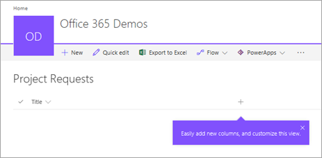
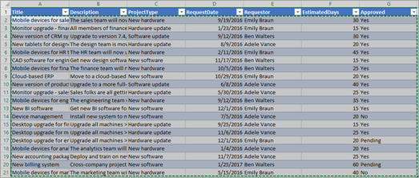
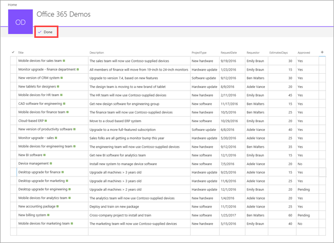

# Set up lists for SharePoint Online integration with Power Apps, Power Automate, and Power BI
> [!NOTE]
> This article is part of a tutorial series on using Power Apps, Power Automate, and Power BI with SharePoint Online. Make sure you read the [series introduction](sharepoint-scenario-intro.md) to get a sense of the big picture, as well as related downloads.

SharePoint has a ton of features for sharing and collaboration, but we will focus on one feature for this scenario: [SharePoint lists](https://support.office.com/article/Introduction-to-lists-0A1C3ACE-DEF0-44AF-B225-CFA8D92C52D7). A list is just a collection of data that you can share with team members and other site users. We'll review the lists used for this scenario, then you can create them in your own SharePoint Online site.

## Step 1: Understand the lists
The first list is **Project Requests**, where a project requestor adds a request. The project approver then reviews the request and approves or rejects it.

| **List Column** | **Data Type** | **Notes** |
| --- | --- | --- |
| Title |Single line of text |Default column, used for project name |
| Description |Single line of text | |
| ProjectType |Single line of text |Values: new hardware, upgraded hardware, new software, upgraded software |
| RequestDate |Date | |
| Requestor |Single line of text | |
| EstimatedDays |Number |Enables comparison of requestor estimate to project manager estimate to actual |
| Approved |Single line of text |Values: pending, yes, no |

> [!NOTE]
> We also use the **ID** column, which is generated by SharePoint and hidden by default. We use basic data types for simplicity, but a real app might use more complex types, like **Person or Group** for the **Requestor** column. For information on data types supported by Power Apps, see [Connect from Microsoft Power Apps to SharePoint](connections/connection-sharepoint-online.md#known-issues).

The second list is **Project Details**, which tracks details for all approved projects, like which project manager is assigned.

| **List Column** | **Data Type** | **Notes** |
| --- | --- | --- |
| Title |Single line of text |Default column, used for project name |
| RequestID |Number |Matches the value in the **Project Requests** list **ID** column |
| ApprovedDate |Date | |
| Status |Single line of text |Values: not started, in progress, completed |
| ProjectedStartDate |Date |When the project manager estimates that the project will start |
| ProjectedEndDate |Date |When the project manager estimates that the project will end |
| ProjectedDays |Number |Working days; would typically be calculated, but isn't in this scenario |
| ActualDays |Number |For completed projects |
| PMAssigned |Single line of text |Project manager |

## Step 2: Create and review the lists
To continue with the scenario, you need to create the two SharePoint lists and populate them with sample data. We'll show you how to do this by creating the list and pasting sample data into it. Make sure you have [downloaded](https://download.microsoft.com/download/d/f/6/df6682e2-c625-47f2-9627-b78a86217cd8/project-requests.xlsx) the sample Excel file.

> [!NOTE]
> Use Microsoft Edge for this step.

### Create the lists

1. In Microsoft Edge, in your SharePoint site, click or tap **New**, then **List**.
   
    

2. Enter the name "Project Requests", then click or tap **Create**.
   
    
   
    The **Project Requests** list is created, with the default **Title** field.
   
    

### Add columns to the list

1. Click or tap , then **Single line of text**.
   
    

2. Enter the name "Description", then click or tap **Save**.
   
3. Repeat steps **1.** and **2.** for the other columns in the list:
   
   1. **Single line of text** > "ProjectType"
   2. **Date** > "RequestDate"
   3. **Single line of text** > "Requestor"
   4. **Number** > "EstimatedDays"
   5. **Single line of text** > "Approved"

### Copy data into the list
1. Click or tap **Quick edit**.
   
    
2. Select the cells in the grid.
   
    
3. Open the [downloaded workbook](https://download.microsoft.com/download/d/f/6/df6682e2-c625-47f2-9627-b78a86217cd8/project-requests.xlsx) and select all the data (not the headings).
   
    
4. Copy the data and paste it into the grid in SharePoint, then click or tap **Done**.
   
    
5. Repeat the list creation and copy process for the "Project Details" list, using the project-details.xlsx workbook. Refer to the Project Details table in [Step 1: Understand the lists](#step-1-understand-the-lists) for the column names and data types.

## Next steps
The next step in this tutorial series is to [generate an app to handle project requests](sharepoint-scenario-generate-app.md).

### See also

- [SharePoint integration scenarios](sharepoint/scenarios-intro.md)

[!INCLUDE[footer-include](../../includes/footer-banner.md)]
