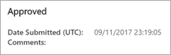
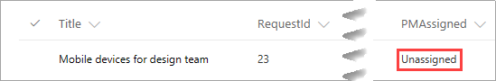

# Walk end-to-end through the completed SharePoint Online integration scenario
> [!NOTE]
> This article is part of a tutorial series on using Power Apps, Power Automate, and Power BI with SharePoint Online. Make sure you read the [series introduction](sharepoint-scenario-intro.md) to get a sense of the big picture, as well as related downloads.

We have covered a huge amount of ground in this series of tutorials, from building canvas apps and flows, to creating reports and embedding them in SharePoint. We hope you've learned a lot and have enough exposure to how these technologies integrate, so that you can integrate canvas apps, flows, and reports into SharePoint based on your own needs. Before we finish, we want to walk through the scenario end-to-end and see how all the parts work together.

## Step 1: Add a project to the Project Requests list
1. In the **Project Requests** list, click or tap **All Items**, then **Project Requests app**.
   
    
2. Click **Open**, which opens the app in a new browser tab.
   
    
3. In the app, click or tap  to create a new item.
4. Fill out the form with the following values:
   
   * **Title** = "Mobile devices for design team"

   * **Approved** = "Pending"

   * **Description** = "The design team will now use Contoso-supplied devices"

   * **EstimatedDays** = "30"

   * **ProjectType** = "New hardware"

   * **RequestDate** = "03/01/2017"

   * **Requestor** = "Emily Braun"
     
     
5. Click or tap , then close the browser tab.
6. Go back to the **Project Requests** list, click or tap **Project Requests app**, then **All Items**.
   
    
7. Verify the new entry in the list.
   
    

## Step 2: Approve the project
1. When you add the item in Step 1, the flow should run and send out an approval mail. Check the inbox of the approver's email account.
   
    
2. Click **Approve**. The flow runs another process, and you get feedback like the following directly in the email.
   
    
3. Check the inbox of the requestor's email account, and you should see an approval email.
   
    
4. Verify the updated entry in the list.
   
    

## Step 3: Assign a manager to the project
1. First, let's look at the **Project Details** list in SharePoint. The new project has a value of **Unassigned** in the **PMAssigned** column.
   
    
2. In the SharePoint site, in the left navigation, click or tap **Project Management app**.
3. On the first screen, click or tap **Assign Manager**.
   
    
4. On the **Assign Manager** screen, you see the two unassigned projects from the list. Select the **Mobile devices for design team** project.
   
    
5. In the **Manager** text input, enter "Joni Sherman", then click **OK**.
   
    The change is applied to the list, and the gallery refreshes so only the remaining unassigned project is displayed.
   
    
6. Close the app, and go back to the SharePoint list. You'll see that the project entry is now updated with the project manager name.
   
    

## Step 4: Add time estimates for the project
1. Click or tap  to go back to the first screen, then click or tap **Update Details**.
   
    
2. On the **View Projects** screen, enter "Mobile" in the search box.
   
    
3. Click  for the **Mobile devices for design team** item.
   
    
4. On the **Update Details** screen, set the following values:
   
   * The **Status** field = "Not started"

   * The **ProjectedStartDate** field = "3/6/2017"

   * The **ProjectedEndDate** field = "3/24/2017"

   * The **ProjectedDays** field = "15"
     
     
5. Click or tap  to apply the change to the SharePoint list.
6. Close the app, and go back to the list. You'll see that the project entry is now updated with the date and day changes.
   
   

## Step 5: Review report data for existing projects
1. In SharePoint Online, click or tap **Site contents**, then **Site Pages**.
2. Open the **Project Analysis** page that we created earlier.
   
    
3. Review the variance visualization.
   
    
   
    As we noted when we created this visualization, there is a lot more variance for projects that were run by Irvin Sayers versus Joni Sherman.
4. Drill into the visualization, and you see that much of the variance comes from two projects that took a lot longer than projected.
   
    
5. Review the table that shows how long it takes for projects to go from approval to projected start date.
   
    
   
    As we noted when we created this visualization, the projects that Irvin Sayers is assigned to take longer to start, with two projects taking much longer than the rest.

## Step 6: Respond to pending project delays
1. In the Power BI service, click or tap the **project-analysis** dataset, then click or tap **REFRESH NOW**. The refresh triggers the alert we set up for pending projects.
   
    
2. After the refresh is complete, the **Notification Center** at top right shows a new notification icon.
   
    
   
    This can take some time, so check back if you don't see it right away.
3. Open the Notification Center to see the details of the alert that fired.
   
    
4. Check the inbox for the person who created the alert (Megan Bowen in our case).
   
    
5. Check the inbox for the person you added in the data alerts flow (Allan DeYoung in our case).
   
    
6. Now that you have information on pending projects, you can go back and approve any that have been waiting for your attention.

That brings us to the conclusion of our end-to-end walkthrough and this series of tutorials. We encourage you to continue your journey at the following sites:

* [Power Apps](https://www.powerapps.com/)
* [Power Automate](https://flow.microsoft.com)
* [Power BI](https://www.powerbi.com)
* [Power Users Community](https://powerusers.microsoft.com/)
* [SharePoint](https://sharepoint.microsoft.com)
* [Microsoft Tech Community](https://techcommunity.microsoft.com/)

Let us know in the comments if you have any feedback on this series, suggestions for additions, or ideas for additional content that will help you work with the technologies that we covered.

### See also

- [SharePoint integration scenarios](sharepoint/scenarios-intro.md)

[!INCLUDE[footer-include](../../includes/footer-banner.md)]