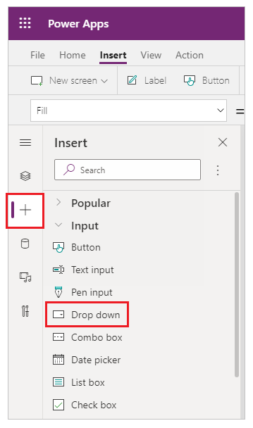
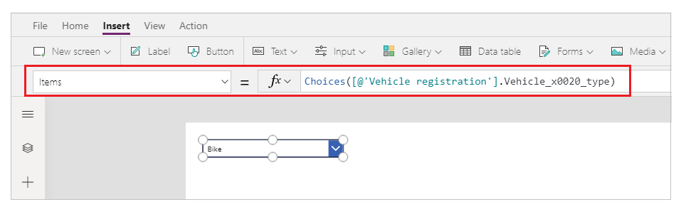
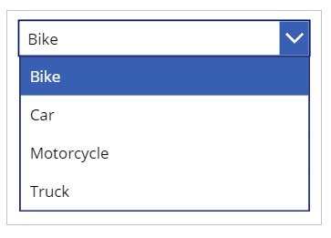

# Use drop-down lists with choices from lookup columns in a SharePoint list

In this scenario article, you'll learn how to use a drop-down list with choices from a lookup column in a SharePoint list.

## Prerequisites

- You must have created an app using SharePoint connector that connects to a SharePoint list.
- The SharePoint list should consist of a lookup column with values from another column.

## Scenario details

You can use lookup columns in SharePoint that consume values from other lists or libraries.

When using such columns as a field in a canvas app, you can use a drop-down list with choices.

To use the choices in a drop-down list, you have to use the function [choices](../functions/function-choices.md). For example, `Choices([@'Vehicle registration'].Vehicle_x0020_type)` uses the SharePoint list **Vehicle Registration** and the column **Vehicle type** for the lookup of the type of the vehicle.

## Example

1. Sign in to [Power Apps](https://make.powerapps.com).

1. [Create](../app-from-sharepoint.md) a new app, or [edit](../edit-app.md) an existing app.

    > [!NOTE]
    > Ensure the app uses a SharePoint connection and connects to a SharePoint list as described in the prerequisites.

1. Select **+** (insert) from the left pane.

1. Select **Drop down**.

    

1. Update the **Items** property with the following formula:

    `Choices([@'Vehicle registration'].Vehicle_x0020_type)`

    Replace **Vehicle registration** with the name of your SharePoint list and **Vehicle type** with the name of the lookup column in the list.

    

1. Play the app, or press **Alt** on the keyboard and select the drop-down list.

    

### See also

- [Formula reference](../formula-reference.md) for Power Apps
- [Control reference](../reference-properties.md) for Power Apps

[!INCLUDE[footer-include](../../../includes/footer-banner.md)]