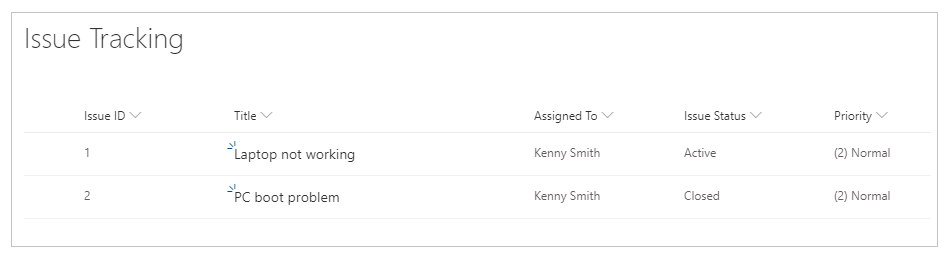
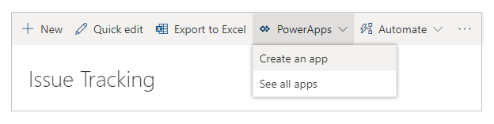
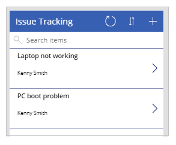
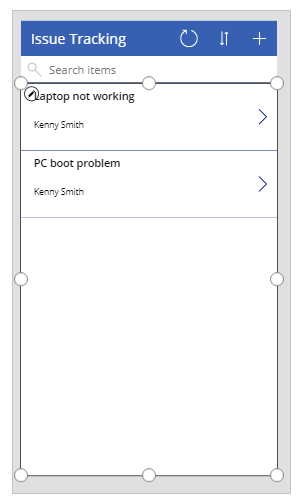
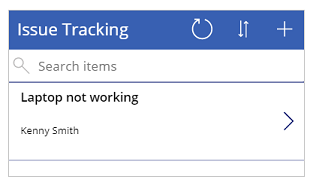

# Customize an app screen based on column status inside a SharePoint list

In this scenario article, you'll learn how to customize an app screen based on column status inside a SharePoint list. You can customize forms for supported lists or libraries, and you can also create apps for lists or libraries.

Limiting access to SharePoint objects can be achieved using fine-grained permissions inside SharePoint. However, it can become difficult to scan through all items in your app screen, especially when using different devices. 

One of the most common problems is how to limit the items in a canvas app screen based on the status of columns, instead of controlling access using the permissions.

This method allows you to create multiple screens to show different SharePoint objects based on column status, while at the same time without customizing permissions or overwhelming the app user with the entire list.

## Prerequisites

- You must have created an app using a SharePoint connector that connects to a SharePoint list.
- You need two user accounts with access to the app and SharePoint site hosting the lists.
- You need to be knowledgeable about how to configure SharePoint lists and list/item permissions.

## Scenario details

You can use the function [filter](../functions/function-filter-lookup.md) for a specific column from SharePoint and apply the filter with a particular condition. With this approach, you can set up multiple screens with filtered SharePoint list items.

For example, you created a list named Issue Tracking, based on the out-of-the-box SharePoint app template **Issue Tracking**. And you want to create an app that only shows **Active** issues on the app screen. 

## Example

1. Create a list based on the out-of-the-box SharePoint app template **Issue Tracking**.

1. Create a few sample issue items.

    

    Ensure the issue items have both *Active* and *Closed* items.

1. Share the list with a user—for example, Kenny Smith.

1. Select **Integrate** -> **Power Apps** -> **Create an app** from the SharePoint list page.

    

    You can see all issues listed in the app inside the studio.

    

    The sample list only has two items. However, when the number of issues increases, it becomes overwhelming to scan through issues or search them, especially when the objective is to show only active issues.

1. Select the items gallery, by default named BrowseGallery1.

    

1. Update the formula for the default **Items** property to include filter criteria for issues status.

    Default:

    ```powerapps-dot
    SortByColumns(Filter([@'Issue Tracking'], StartsWith(Title, TextSearchBox1.Text)), "Title", If(SortDescending1, Descending, Ascending))
    ```

    Update to:

    ```powerapps-dot
    SortByColumns(Filter('Issue Tracking', 'Issue Status'.Value = "Active", StartsWith(Title, TextSearchBox1.Text)), "Title", If(SortDescending1, Descending, Ascending))
    ```

    The formula contains the following functions:

    - [SortByColumns](../functions/function-sort.md) for sorting columns.
    - [Filter](../functions/function-filter-lookup.md) to filter items.
    - [StartsWith](../functions/function-startswith.md) to allow search based on entered text in the search box on the top.
    - [If](../functions/function-if.md) for sorting items based on the sort icon selection.

1. [Save and publish](../save-publish-app.md) the app.

1. [Share the app](../share-app.md) with another user. For example, Kenny Smith.

1. Run the app as the user that you shared the app with (Kenny Smith in this example).

    

Similarly, you can use different screens in your app based on the column value, such as a separate screen to view all the **Closed** issues.

### See also

- [Formula reference](../formula-reference.md) for Power Apps
- [Control reference](../reference-properties.md) for Power Apps


[!INCLUDE[footer-include](../../../includes/footer-banner.md)]