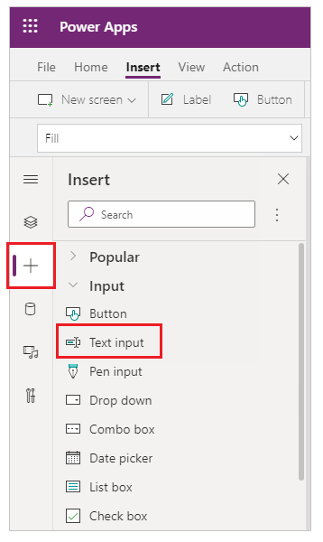
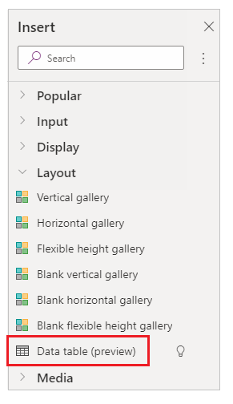
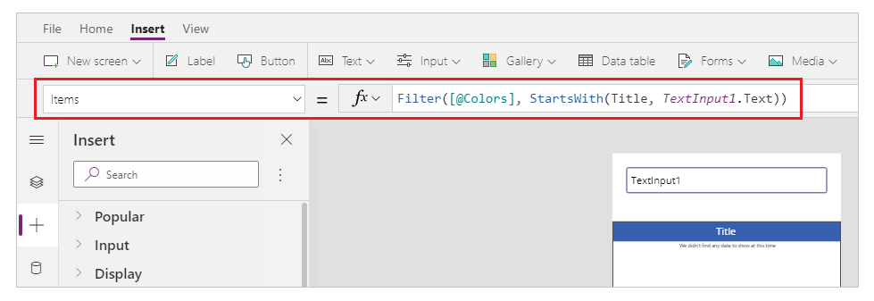
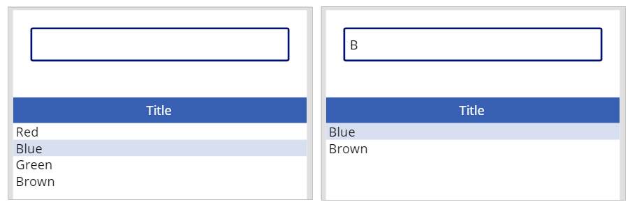

# Filter a search list in an app

In this scenario article, you'll learn how to filter a search list in a canvas app.

## Prerequisites

- You must have created an app using a SharePoint connector that connects to a SharePoint list.
- The SharePoint list should consist of several list items to filter data inside the canvas app.

## Scenario details

You can use text input control in a canvas app to input text and filter the list such as a data table to filter list items from the connected SharePoint list.

To search using text input and to filter the records, you have to use the function [filter](../functions/function-filter-lookup.md). For example, `Filter([@Colors], StartsWith(Title, TextInput1.Text))` uses the SharePoint list connection **Colors** and the column **Title** to filter the records.

## Example

1. Sign in to [Power Apps](https://make.powerapps.com).

1. [Create](../app-from-sharepoint.md) a new app, or [edit](../edit-app.md) an existing app.

    > [!NOTE]
    > Ensure the app uses SharePoint connection and connects to a SharePoint list as described in the prerequisites.

1. Select **+** (insert) from the left pane.

1. Select **Text input**.

    

1. Likewise, insert a **Data table**.

    

1. Update the **Items** property of the data table with the following formula:

    `Filter([@Colors], StartsWith(Title, TextInput1.Text))`

    Replace **Colors** with the name of your SharePoint list, **Title** with the name of the column in the list, and **TextInput1** with your text input control name.

    

1. Play the app.

1. Enter text, such as 'B,' to filter items starting with 'B'.

    

### See also

- [Formula reference](../formula-reference.md) for Power Apps
- [Control reference](../reference-properties.md) for Power Apps

[!INCLUDE[footer-include](../../../includes/footer-banner.md)]