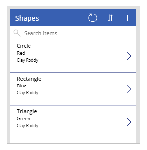
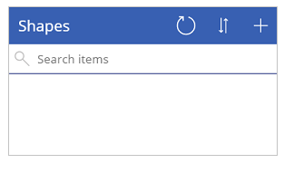
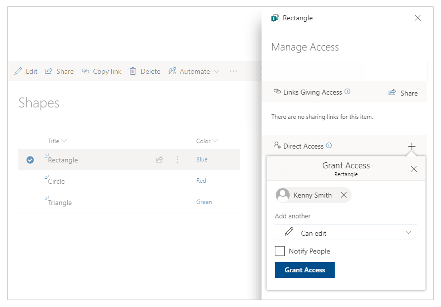
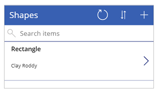
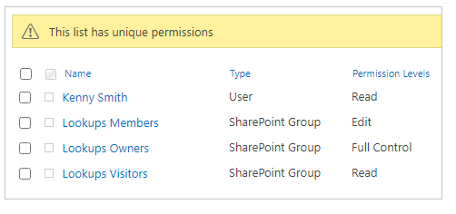
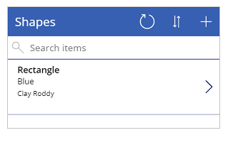

# Work with permissions in a lookup list from a SharePoint site

In this scenario article, you'll learn how to configure permissions for fields that use lookup columns from SharePoint lists. When you create a canvas app that connects to SharePoint, the app follows permissions configured inside SharePoint. Unique permissions at different levels inside SharePoint can become confusing when surfacing lists, libraries, or items on a canvas app screen.

The example in this tutorial explains how you can work with a canvas app that connects to SharePoint with such broken inheritance.

## Prerequisites

- You must have created an app using a SharePoint connector that connects to a SharePoint list.
- The SharePoint list should consist of a lookup column with values from another column.
- You need two user accounts with access to the app and the SharePoint site hosting the lists.
- You need to be knowledgeable about how to configure SharePoint lists and list/item permissions.

## Scenario details

You can customize permissions for a SharePoint list or list item when you [stop inheriting permissions](https://support.office.com/en-us/article/share-sharepoint-files-or-folders-1fe37332-0f9a-4719-970e-d2578da4941c). Consider, for example, that you connect your app with a SharePoint site that has a broken inheritance at different levels. The app behavior might appear confusing if the user doesn't have access to the correct SharePoint objects as intended. Ensure the user can browse to the list and work with the objects with the same permissions that you expect the canvas app to surface.

## Example

1. Create two SharePoint lists with one list consuming columns as lookups from the other list. In this tutorial, we'd use two lists:

    | List | Columns
    | - | - |
    | Shapes | - Title   - Color (lookup column)
    | Colors | - Title (for color of the shape)

     The Shapes list has a Color lookup column. This lookup column is connected to the Color column from the Colors list for values. You can also use your own lists instead.

1. If necessary, create sample items:

    | Shapes | Color 
    | - | - |
    | Circle | Red
    | Rectangle | Blue
    | Triangle | Green

    The shape colors are through the lookup column from the Colors list.

1. Sign in to [Power Apps](https://make.powerapps.com).

1. [Create](../app-from-sharepoint.md) a new app.

    

1. [Save and publish](../save-publish-app.md) the app.

1. [Share the app](../share-app.md) with another user. For example, Kenny Smith.

1. Run the app as the user that you shared the app with (Kenny Smith in this example).

    

    Since the SharePoint site, list or items aren't shared with the user, the app will show no available items.

1. Grant the user item-level permission to a SharePoint list item.

    

1. Refresh the app as the user (Kenny Smith in this example).

    

    The user, Kenny Smith, is unable to see the color since color is from a separate list and is looked up by the color column. There are no permission changes to the app from Power Apps.

    > [!NOTE]
    > If the user can see the lookup column, check the permissions for the lookup column list. If the lookup column list has unique permissions and the user is added, you can skip the next step.

1. Go to Colors list permissions and add the other user (Kenny Smith in this example) explicitly.

    

1. Refresh the app as the user (Kenny Smith in this example).

    

As you can see, SharePoint permissions for lists and lookup lists directly cause the items to show (or not) depending on how permissions are configured.

### See also

- [Formula reference](../formula-reference.md) for Power Apps
- [Control reference](../reference-properties.md) for Power Apps

[!INCLUDE[footer-include](../../../includes/footer-banner.md)]