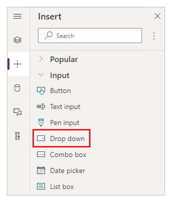
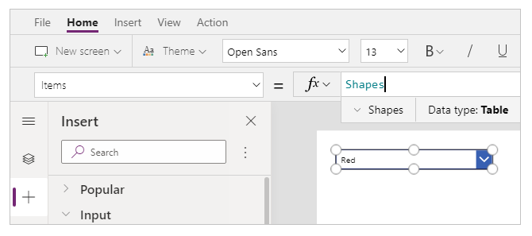
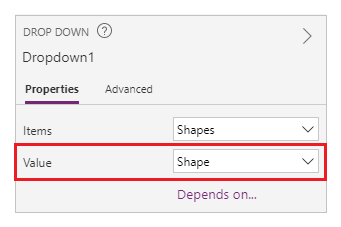
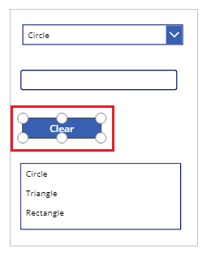
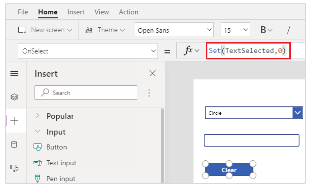

# How to create SharePoint integrated canvas app from scratch to view, edit, add and delete SharePoint list items?

In this scenario article, you'll learn how to create an app with SharePoint form functionality from scratch. The app will demonstrate to you how to view, edit, add and delete SharePoint list items using canvas app without visiting SharePoint site. 

> [!NOTE]
> For more details about different scenarios working with SharePoint forms and additional examples, go to [SharePoint scenarios overview](scenarios-intro.md).

## Prerequisites

- You must have access to a SharePoint site to create a list and list items.
- You must be knowledgeable about [creating](https://support.microsoft.com/en-us/office/create-a-list-in-sharepoint-0d397414-d95f-41eb-addd-5e6eff41b083) and [setting up](https://support.microsoft.com/en-us/office/training-create-and-set-up-a-list-1ddc1f5a-a908-478b-bb6d-608f34b71f94) SharePoint lists.

## Scenario details

The purpose of this scenario is to demonstrate how to create a canvas app from scratch to work with a SharePoint list. At the end of this example demo, you'll be able to do the following tasks from inside the canvas app without the need to access the SharePoint list or its item:

- View all items from the SharePoint list.
- Search for items in a SharePoint list based on text value of a specific column.
- Select a SharePoint list item.
- Edit a SharePoint list item.
- Create a new SharePoint list item.
- Delete a SharePoint list item.

The scenario is a basic illustration of the canvas app capabilities when integrated with SharePoint. To enhance the layout with improved design or additional screens, go to the following relevant articles:

- [Add and configure controls](add-configure-controls.md)
- [Add and configure screen](add-screen-context-variables.md)
- [Understand forms, layouts and cards](working-with-forms.md)

> [!IMPORTANT]
> The example in this scenario creates a sample app to view, edit, add and delete SharePoint list items. You can change the approach to customize the app differently based on your choices or business objective. When you customize your app with custom names for controls, ensure to use the correct control names in formula when following steps in this example.

## Example

This scenario example walks you through the steps to create an app and connect it to a SharePoint list to view, edit, add and delete SharePoint list items.

## Step 1 - Create a SharePoint list

Create a SharePoint list with columns and list items. For the purpose of this scenario, we've used a list with the following columns and list items:

  

> [!NOTE]
> Both columns are *Single line of text*.

## Step 2 - Create a blank canvas app

1. Sign in to [Power Apps](https://make.powerapps.com).

1. Select **Canvas app from blank**.

    

1. Enter app name of your choice. For example, *SharePoint list from scratch*.

1. Select layout of your choice. This scenario uses *Tablet* layout.

    

1. Select **Create**. The app opens in canvas app Studio for authoring.

    

## Step 3 - Connect app to SharePoint

1. Select **Data sources** from the left pane.

    

1. Select **SharePoint** data source. You can also search for the name in search box.

    

1. Select **Add a connection** to add a new connection.

    

1. Select a connection type. You can connect to SharePoint Online or an on-premises SharePoint site with a data gateway when configured. This scenario connects to a SharePoint Online site.

    

1. Select the SharePoint site where the list you created resides for the purpose of this scenario.

    

1. Select SharePoint list that you created. This scenario uses a list named *Shapes*.

    

1. Select **Connect**. Data source is added to the app.

    

## Step 4 - Add data table to view SharePoint list items

1. Select "**+**" (Insert) from the left pane.

    

1. Expand **Layout**.

1. Select **Data table**.

    

1. Select the data source as your SharePoint connection.

    

1. Move data table to the bottom-left inside the screen to make space for additional components.

    

## Step 5 - Add drop-down to select a SharePoint item

1. Insert **Drop down** control on the form.

    

1. Update the *Items* property to use the SharePoint connection. In this scenario, its *Shapes*.

    

1. From the right-side of the Studio screen, set the **Value** property for the drop-down control to **Shape** instead of **Color** for this example.

    

    > [!TIP]
    > You can quickly preview the behavior of a component using the keyboard key **Alt** and a mouse **Left-click**. For example, instead of selecting the **Preview the app** button from top-right, or **F5** from the keyboard that runs the app in preview, use **Alt+Left-click** and select the drop-down control to view all items as if the app is running in preview.
    > 
    > <br> In addition, keep the **Alt** key pressed on the keyboard and you can continue to run the preview inside the canvas apps Studio. For example, selecting multiple components for different actions or checks.

## Step 6 - Add the capability to search and select item

1. Insert a **Text input** control to the canvas, and move it below the drop-dwon.

    

1. Update the search box **Default** property to the value *Search by shape*.

    

1. Insert a **List box** control to the canvas, and move it below the text input control added in the previous step.

    

1. From the right-side of the Studio screen, set the **Value** property for the list box control to **Shape** instead of **Color** for this example.

    

1. Update the **Items** property of the list box added in the previous step to the following formula:

    ```powerapps-dot
    Filter([@Shapes], StartsWith(Shape, TextInput1.Text))
    ```

    

    The formula contains following functions:

    - [Filter()](../functions/function-filter-lookup.md) - Used in this formula to filter items in the list box based on the defined parameters. `[@Shapes]` in this function defines which data source to filter.
    - [StartsWith()](../functions/function-startswith.md) - Used in this formula to filter the SharePoint list items based on **Shape** column that start with the characters entered in the *TextInput1* control added earlier.

## Step 7 - Add the capability to edit item

1. Insert the **Edit form** control.

    

1. From the right-side of the Studio screen, set the **Data source** property for the edit form control to **Shapes**.

    

1. From the right-side of the Studio screen, set **Edit fields** for the edit form control and add the **Shape** and **Color** fields.

    

1. Re-arrange the screen layout to ensure the **Edit form** control is visible and doesn't overlay with other controls.

    

1. Set the **OnSelect** property of the list box control to the following function:

    ```powerapps-dot
    Set(TextSelected,1)
    ```

    

    The [Set()](../functions/function-set.md) function sets a new variable named *TextSelected* to the value of *1* when a value in the list box is selected. The *TextSelected* variable is used in this scenario as a flag to control the actions and behavior of add, edit and delete capabilities as you'll see in the following sections.

1. Set the **Item** property of the edit form control to the following formula:

    ```powerapps-dot
    Switch(TextSelected,1,ListBox1.Selected,Dropdown1.Selected)
    ```

    

    The [Switch()](../functions/function-if.md) function checks first if the value of the variable *TextSelected* is *1* or not. If it is, the edit form shows the selected item from the list box. If not, the edit form shows the selected item from the drop-down control.

1. Insert a button.

    

1. From the right-side of the Studio screen, set the **Text** property of the button added in the previous step to **Save**.

    

1. Set the **OnSelect** property of the **Save** button to the following formula:

    ```powerapps-dot
    SubmitForm(Form1);
    Set(TextSelected,0)
    ```

    

    The formula contains following functions:

    - [SubmitForm()](../functions/function-form.md) - Used in this formula to submit the edit form and save the values to SharePoint list.
    - [Set()](../functions/function-set.md) function resets the *TextSelected* variable back to *o* so that a new item can be selected from the list box.

1. Insert a button.

1. Update **Text** property of the button added in the previous step to **Clear**.

1. Re-arrange the screen to add the **Clear** button above the list box.

    

1. Set the **OnSelect** property of the **Clear** button to the following formula:

    ```powerapps-dot
    Set(TextSelected,0)
    ```

    

    The [Set()](../functions/function-set.md) function resets the *TextSelected* variable back to *o* so that a new item can be selected from the list box.

1. Insert **Text label** control.

    

1. Update **Text** property for the **Text label** control added in the previous step to *To edit, select from drop-down, or search.*.

    

1. Re-arrange the controls on the screen to order the edit controls.

    

## Step 8 - Add the capability to add item

1. Insert a button.

1. Update **Text** property of the button added in the previous step to **Add**.

1. Set the **OnSelect** property of the **Add** button to the following function:

    ```powerapps-dot
    NewForm(Form1)
    ```

    

    The [NewForm()](../functions/function-form.md) function clears the edit form control added on form named *Form1* so that you can add a new SharePoint list item.

## Step 9 - Add the capability to delete item

1. Insert a button.

1. Move the button added in the previous step below the **Save** button.

1. Update **Text** property of the button added in the previous step to **Delete**.

1. Set the **OnSelect** property of the **Delete** button to the following formula:

    ```powerapps-dot
    Remove([@Shapes], Switch(TextSelected,1,ListBox1.Selected,Dropdown1.Selected))
    ```

    

    The formula contains following functions:

    - [Remove()](../functions/function-remove-removeif.md) - Used in this formula to delete the selected SharePoint list item.
    - [Switch()](../functions/function-if.md) function checks first if the value of the variable *TextSelected* is *1* or not. If it is, the **Delete** button deletes the item selected from the list box. If not, the **Delete** button deletes the item selected from the drop-down control.

## Step 10 - Save, publish and share the app

Now that the app has view, edit, add and delete capability added, [save and publish the app](../save-publish-app.md). You can also [share the app](../share-app.md) with others.

## Use the sample app

To play the app:

1. Go to [Power Apps](https://make.powerapps.com).

1. Select **Apps**.

1. Select the app created.

    

If you're not the creator of the app, you can also use the link from the email notification received when the app is shared with you.


### See also

- [Formula reference](../formula-reference.md) for Power Apps
- [Control reference](../reference-properties.md) for Power Apps
