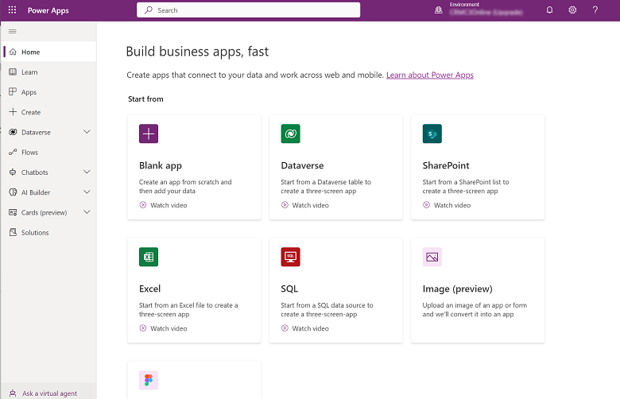

# Sign in to Power Apps 

To create, edit, or play an app, sign in to Power Apps at [make.powerapps.com](https://make.powerapps.com).

## Choose an environment

Whether you're creating an app, a flow, a data connection, or a table in Microsoft Dataverse, much of what you do in Power Apps is contained in a specific environment. Environments create boundaries between different types of work. For example, an organization might have separate environments for different departments. Many organizations use environments to separate apps that are still being developed from those that are ready for widespread use. You might have access to multiple environments or only one. If you have the appropriate permissions, you might even be able to create your own environments.

To verify which environment you're in, find the environment switcher near the right side of the header.

With the environment selector, environments are grouped into two categories:  **Build apps with Dataverse** and **Other environments**. Select **Filter** to filter the list of environments by your role, data platform (Dataverse or none), and environment type, such as production or sandbox.

:::image type="content" source="media/intro-maker-portal/environment-picker2.png" alt-text="Environment selector to filter and select an environment" lightbox="media/intro-maker-portal/environment-picker2.png":::

Environments where you have either system administrator and/or system customizer security role membership appear under **Build apps with Dataverse**. The **Other environments** list displays environments where you have only environment maker or editing privileges to at least one of the canvas apps in the environment.

> [!TIP]
> Hover over an environment in the list to view the details of the environment.

#### Filter environments by role

|Filter role  |Power Platform role or description  |
|---------|---------|
|Admin     | System administrator   Environment admin        |
|Maker with data access     | System administrator    System customizer        |
|Maker without full data access     | Environment maker (with or without Dataverse)     |
|Shared app contributor     | User without a maker-level security role assigned but with edit permission to at least one canvas app in the environment        |

> [!IMPORTANT]
> - To view the environment list in the environment switcher in Power Apps, you must have the Environment Maker, System Customizer, or System Administrator security role in the environment. For information about predefined security roles, see [Predefined security roles](/power-platform/admin/database-security#predefined-security-roles) in the Microsoft Power Platform admin guide.
> - Make sure that you're in the right environment *before* you create an app, a flow, or a similar component. You can't easily move components from one environment to another.

> [!NOTE]
> - Every member in an organization can access [the default environment](/power-platform/admin/environments-overview#the-default-environment). Like any environment, users can see apps where they have sufficient privileges to access an app.
> - All users with the Environment Maker security role in an environment can see all model-driven apps in that environment, including the default environment. More information: [Model-driven app privileges to view and access apps](../model-driven-apps/app-visibility-privileges.md).
> - When you create an app in one environment, you won't be able to see it from another environment. In addition, people who want to run your app must have access to the environment in which you created it.

For more information, see [Environments overview](/power-platform/admin/environments-overview).

## Sign in using Azure B2B collaboration (preview)

> [!IMPORTANT]
> - This is a preview feature.
> - [!INCLUDE[cc_preview_features_definition](../../includes/cc-preview-features-definition.md)] 

> [!NOTE]
> - A **resource tenant** is the Azure Active Directory tenant where an app is expected to exist, and where the user is expected to create and edit the app. For Azure B2B makers, this tenant is different from the tenant their account resides. 
> - A **home tenant** is where the user's account resides and authenticates against.
> - To create and edit apps in a resource tenant, an admin must [follow these steps](/power-platform/admin/invite-users-azure-active-directory-b2b-collaboration#power-apps-support-for-b2b-guest-maker-preview) to give Azure B2B users the prerequisite privileges to build apps. 

When a user signs into [Power Apps](https://make.powerapps.com), they sign into their **home tenant**&mdash;the Azure Active Directory (Azure AD) tenant where their credentials are provisioned. After signing in, a user can change the directory they intend to build apps in using the **Switch directory** link as shown below:

:::image type="content" source="media/intro-maker-portal/intro_to_maker_portal_switch_directory_1.png" alt-text="Azure B2B Maker - switch directory option.":::

The switch directory link opens Power Apps settings that contain a **Directories** tab that lists all the Azure AD tenants the user exists in as a member or an Azure B2B guest. By selecting **Switch**, it will trigger [Power Apps](https://make.powerapps.com) to sign out of the current tenant and then sign into the selected tenant.

:::image type="content" source="media/intro-maker-portal/intro_to_maker_portal_switch_directory_2.png" alt-text="Azure B2B Maker - switch tenant.":::

### Frequently Ask Questions

#### As an Azure B2B maker, why am I unable to share apps?

The Power Apps sharing experience requires users to have permissions in the tenant included when the Azure Azure Active Directory [external collaboration settings has guest user access to "(most inclusive)"](/azure/active-directory/b2b/delegate-invitations). Azure B2B makers without sufficient privileges will see the following error dialog in the sharing experience.

:::image type="content" source="media/intro-maker-portal/intro_to_maker_portal_Azure_B2B_share_error.png" alt-text="Invalid domain name in the request url.":::

#### Can I work in [Power Apps](https://make.powerapps.com) in both my home tenant and a resource tenant?

- Yes, but in separate browser sessions. For example, Microsoft Edge may be open in its standard mode and a separate session may be started in a new **InPrivate** window.
- If multiple tabs in the same browser session are open, only resources in the most recently signed in tenant are accessible.

[!INCLUDE[footer-include](../../includes/footer-banner.md)]
