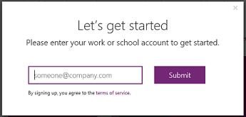

# Self-service signup for PowerApps
Signing up for PowerApps as an individual is easy! This article walks you through the steps to get up and running with a free trial account for PowerApps.

For administration information, see [Purchase PowerApps for your organization](../../administrator/signup-for-powerapps-admin.md) or [PowerApps in your organization Q&A](../../administrator/signup-question-and-answer.md).

> [!NOTE]
> If you're in an organization, individual signup may be disabled. If you get an error indicating it's been turned off, see [Individual signup has been turned off](signup-for-powerapps.md#individual-signup-has-been-turned-off) (in this topic) for more information.

## What email addresses can you use?
To sign up for PowerApps, enter your work or school email address.

> [!NOTE]
> Currently, consumer email services, telecommunication providers, government, and military addresses are not supported, including:  
> 
> * outlook.com, hotmail.com, gmail.com, and so on  
> * .gov and .mil

If you try to sign up with a personal email address, a message indicates that you must use a work or school email address.

## Access through Office 365 or Dynamics 365
Select Office 365 and Dynamics 365 plans include PowerApps, so if you already have access, you can just sign in. See [PowerApps pricing][3] to determine whether your license includes PowerApps.

If your Office 365 or Dynamics 365 plan includes PowerApps:

* Browse to [powerapps.microsoft.com][4], and then select **Sign in**.

    

    You're then taken to [powerapps.com][2], and you can start to use PowerApps.

    

## Try PowerApps Plan 2 for free
PowerApps does not offer a free account, but you can try PowerApps Plan 2 for free for 90 days. You will have access to all of the PowerApps Plan 2 features for the duration of the trial. PowerApps Plan 2 has all of the features of Plan 1, plus access to the Common Data Service and administrative features. Plan 2 also provides higher flow-run capacity and data and file storage capacity in the Common Data Service.

### Start a free trial from scratch
If you already have access to PowerApps through Office 365, Dynamics 365, or PowerApps Plan 1, go to the next section. Otherwise, follow these steps:

1. Browse to [powerapps.microsoft.com][4], and then do either of the following:

   * Near the upper-right corner, click or tap **Sign up free**.

       If you're viewing this content on a phone, click or tap the menu icon in the upper-right corner, and then click or tap **Sign up free**.

       

   * Select **Pricing** (near the middle of the screen), and then select **Start free trial**.

     

2. Under **Let's get started**, type your work or school email address, and then click or tap **Submit**.  

    

3. If your account doesn't exist within an organization, you get a message to check your email:

    

    If your account is part of an existing organization, you get a message asking you to sign in with that account. Select **Sign in**, and sign in with your work account:  

    

4. If you received an email message, select the link within the message to verify your email address. After you verify your address, you may need to enter some additional information about yourself.

5. If you have an existing organizational account, you see a message asking you to click **Start**:

    

6. You're then taken to [powerapps.com][2], and you can start to use PowerApps.

    

### Start a free trial from within PowerApps
If you already have access to PowerApps as a user of Office 365, Dynamics 365, or PowerApps Plan 1, you can try PowerApps Plan 2 for free. To start a 90-day free trial of Plan 2, sign into PowerApps, and then try one of these PowerApps Plan 2 features:

* [Create and manage instances](../../administrator/signup-for-powerapps-admin.md) of the Common Data Service.
* [Model your data](../common-data-service/data-platform-intro.md) using the Common Data Service.
* [Create and manage environments](../../administrator/environments-administration.md) from the [PowerApps admin center][5].
* [Manage an on-premises data gateway](gateway-management.md) in PowerApps.  

When you try any of these features, you will be prompted to start your free trial. Just select **Start my trial**.

  

To start your trial, you will need to consent to the terms of use by selecting **Start my trial**.

  

> [!NOTE]
> If you need more time to evaluate PowerApps, you can request to extend your trial period for 90 more days.

> [!NOTE]
> Users who take advantage of this in-product PowerApps trial do not appear in the Office 365 admin portal as PowerApps Plan 2 trial users (unless they have another license to Office 365, Dynamics 365, or PowerApps).

> [!NOTE]
> If you're an IT administrator who wants to acquire and deploy PowerApps trial licenses to multiple users in your organization without requiring individual users to accept terms, you can sign up for a [PowerApps Plan 2 subscription trial][6]. You'll need to be an Office 365 Global or Billing Admin or create a new tenant to sign up for an admin trial.  [Learn more](../../administrator/signup-for-powerapps-admin.md)

## Individual signup has been turned off
When trying to sign up for PowerApps, you may encounter the following message.

This could be because your organization has disabled signups for individuals. It could also be because you purchased Office 365 through a partner. Learn more.

If your organization has disabled signups for individuals, work with your IT group to get a PowerApps license assigned to your account.

## Troubleshoot
In many cases, you can sign up for PowerApps by following the steps in this topic. However, signup may fail because of any of several reasons. The following table summarizes some of the most common reasons and ways you can work around these issues.

| Symptom / Error Message | Cause and Workaround |
| --- | --- |
| **Personal email addresses (e.g. nancy@gmail.com)**     You receive a message like the following during signup:     `You entered a personal email address: Please enter your work email address so we can securely store your company's data.`     or     `That looks like a personal email address. Enter your work address so we can connect you with others in your company. And don’t worry. We won’t share your address with anyone.` |PowerApps does not support email addresses provided by consumer email services or telecommunications providers.     To complete signup, try again using an email address assigned by your work or school. |
| **.gov or .mil addresses**     You receive a message like the following during signup:     `PowerApps unavailable: PowerApps is not available for users with .gov or .mil email addresses at this time. Use another work email address or check back later.`     or     `We can't finish signing you up. It looks like Microsoft PowerApps isn't currently available for your work or school.` |PowerApps does not support .gov or .mil addresses at this time. |
| **Self-service signup disabled**     You receive a message like the following during signup:     `We can't finish signing you up. Your IT department has turned off signup for Microsoft PowerApps. Contact them to complete signup.`     or     `That looks like a personal email address. Enter your work address so we can connect you with others in your company. And don’t worry. We won’t share your address with anyone.` |Your organization’s IT administrator has disabled self-service signup for PowerApps.     To complete signup, contact your IT administrator and ask them to allow users to sign up for PowerApps and to allow new users to join your existing tenant. |
| **Email address is not an Office 365 ID**      You receive a message like the following during signup:     `We can't find you at contoso.com.  Do you use a different ID at work or school? Try signing in with that, and if it doesn't work, contact your IT department.` |Your organization signs in to Office 365 and other Microsoft services with IDs other than email addresses. For example, your email address might be Nancy.Smith@contoso.com, but your ID is nancys@contoso.com.     To complete signup, use the ID that your organization has assigned to you for signing in to Office 365 or other Microsoft services.  If you don't know what this is, contact your IT administrator. |

## See also
[PowerApps in your organization Q&A](../../administrator/signup-question-and-answer.md)  
[Purchase PowerApps for your organization](../../administrator/signup-for-powerapps-admin.md)  
More questions? [Try the PowerApps Community][7]

<!--Reference links in article-->
[1]: http://go.microsoft.com/fwlink/p/?LinkId=715583
[2]: http://go.microsoft.com/fwlink/p/?LinkId=708209
[3]: https://go.microsoft.com/fwlink/?linkid=832550
[4]: https://go.microsoft.com/fwlink/?linkid=832551
[5]: https://go.microsoft.com/fwlink/?linkid=832552
[6]: https://portal.office.com/Signup?OfferId=767ad45e-9508-479c-8109-2022f6ea4362
[7]: https://community.powerapps.com
