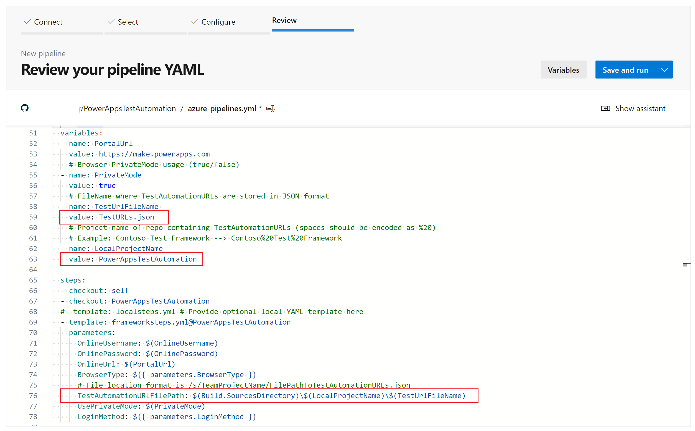
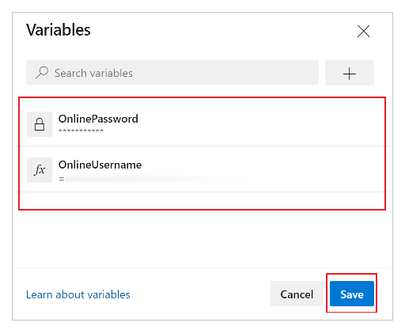

# Automate tests with Azure Pipelines using YAML

In this article, you'll learn how to set up and run your canvas app tests built in the Test Studio by using a [YAML pipeline](/azure/devops/pipelines/get-started/pipelines-get-started#define-pipelines-using-yaml-syntax) in [Azure DevOps Services](/azure/devops/user-guide/what-is-azure-devops).

You can use a public project on GitHub&mdash;[Microsoft/PowerAppsTestAutomation](https://GitHub.com/microsoft/PowerAppsTestAutomation)&mdash;to:

- Automate the operations of signing in to your application.
- Open a browser on the build agent and execute a set of test cases and suites.
- View the status of the test execution in the Azure DevOps pipeline.

## Prerequisites

Before you begin, you must complete the following steps:

- [Fork](#step-1---fork-the-powerappstestautomation-project) the [Microsoft/PowerAppsTestAutomation](https://GitHub.com/microsoft/PowerAppsTestAutomation) project on GitHub.

    > [!NOTE]
    > Public forks can't be made private. If you want to create a private repo, you need to [duplicate the repository](https://help.GitHub.com/GitHub/creating-cloning-and-archiving-repositories/duplicating-a-repository).

- Create a new [Test URLs .json file](#step-2---create-a-test-url-json-file) that includes the app test URLs you want to run from the pipeline.

- Create a new [Azure Pipelines YAML file](#step-3---create-an-azure-pipeline-yaml-file). 

- Create a [GitHub service connection](#step-4---create-a-github-service-connection) to your repo.

### Step 1 - Fork the PowerAppsTestAutomation project

A *[fork](https://help.GitHub.com/GitHub/getting-started-with-GitHub/fork-a-repo)* is a copy of a repository. By forking a repository, you can make changes without affecting the original project.

1. Sign in to [GitHub](https://GitHub.com/).

1. Go to the [microsoft/PowerAppsTestAutomation](https://GitHub.com/microsoft/PowerAppsTestAutomation) repository. You can also search for **microsoft/PowerAppsTestAutomation** instead, and then select the repository.

    

1. Select **Fork**.

    

1. Select where you want to locate the fork.

    

Your forked repository will now be available.

### Step 2 - Create a test URL .json file

The test URL .json file will contain the test suite and test case URLs for validating your app. The app test suite and test case URLs can be retrieved by selecting the [copy play link](working-with-test-studio.md#playing-tests-in-a-browser) in Test Studio.

You can find a sample file, Samples/TestAutomationURLs.json, in the repo you created earlier.

1. Create a new file named TestURLs.json file in your repo, or use any file name you want. The file name and location will be mapped in the pipeline variables later in the document.

1. Copy the format from the Samples/TestAutomationURLs.json file.

1. Update the **Test URLs** section with the tests that you want to validate in your app.

1. Commit the changes to your repo.

    

### Step 3 - Create an Azure Pipeline YAML file

You can find a sample file, Samples/azure-pipelines.yml, in the repo you created earlier.

1. Create a new file named azure-pipelines.yml file in your repo.

1. Copy the content from the Samples/azure-pipelines.yml file.

1. Commit the changes to your repo. You'll reference and update the azure-pipelines.yml file when you're configuring your pipeline in Step 4.

### Step 4 - Create a GitHub service connection

1. Sign in to your Azure DevOps instance.

1. Select an existing project, or create a new project.

1. Select **Project settings** at the bottom of the left navigation pane.

    

1. Under **Pipelines**, select **Service connections**.

    

1. Select **Create service connection**.

1. Select the **GitHub** service.

1. Select **Next**.

    

1. Under **OAuth Configuration**, select **AzurePipelines**.

1. Select **Authorize**.

    

1. Optionally, you can update the **Service connection name**.

1. Select **Save**.

    

## Create a pipeline

1. Select **Pipelines** in the left navigation pane.

1. Select **Create Pipeline**.

    

1. Select **GitHub YAML**.

    

1. Search for or select your repo.

    

1. Select **Existing Azure Pipelines YAML file**.

1. Set the path to the [Azure YAML pipeline file](#step-3---create-an-azure-pipeline-yaml-file) you created earlier.

1. Select **Continue**:

    

    The azure-pipelines.yml file appears.

    

1. Update **repositories name** to your repo. 

1. Update **endpoint** to the name of the [GitHub service connection](#step-4---create-a-github-service-connection) you created earlier.

    

1. Update the **TestAutomationURLs** file name. This is the [test URLs .json file](#step-2---create-a-test-url-json-file) file you created earlier.

1. Update the **LocalProjectName** value to your repo name, if you changed it.

1. Update the **TestAutomationURLFilePath** to the location of the test URLs .json file in your repo.

    

1. Select **Variables**.

1. Add a variable named **OnlineUsername**, and set the value to the Azure Active Directory (Azure AD) email address of the user context who will sign in to the application. Tests will run under the context of this user account.

1. Select **OK**.

1. Add another variable named **OnlinePassword**. Set the value to the password of the Azure AD account created earlier.

1. Select **Keep this value secret** and **Let users override this value when running this pipeline**.
 
    

1. **Save** and **Commit** the changes to your repo.  

    

## Run and analyze tests

To validate whether your tests are being successfully executed, select **Run**. Optionally, you can optionally select the server image to run your tests and also the browser types.

As the job runs, select it to see detailed status for each of the tasks that are running.

When the job is completed, you can view the high-level job summary and any errors or warnings. By selecting the **Test** tab, you can view specific details on the test cases you've executed.

The following example indicates that at least one of our test cases has failed while executing the tests by using the Chrome browser.

Select **RunTestAutomation** to drill into the details about the failed test cases<!--Edit okay?-->. On the **Attachments** tab, you can see the summary of the test execution and which test cases have failed or passed in your test suite.

> [!NOTE]
> If you execute a test suite, you'll see a summary of test cases that have passed and failed. If you execute a test case, you'll see specific details about the failure with any trace information, if available.

## Known limitations

- Multi-factor authentication isn't supported.

- Internet Explorer 11 and Microsoft Edge aren't supported browsers.

- The test summary will report a single test result per browser. The test result will contain one or more test cases or test suite results.

- For any authentication process other than Azure AD sign-in, you'll need to customize the sign-in process in the **PowerAppsTestAutomation** solution.

### See also

- [Test Studio overview](test-studio.md)
- [Working with Test Studio](working-with-test-studio.md)
- [Automate tests with Azure Pipelines using classic editor](test-studio-classic-pipeline-editor.md)

[!INCLUDE[footer-include](../../includes/footer-banner.md)]
