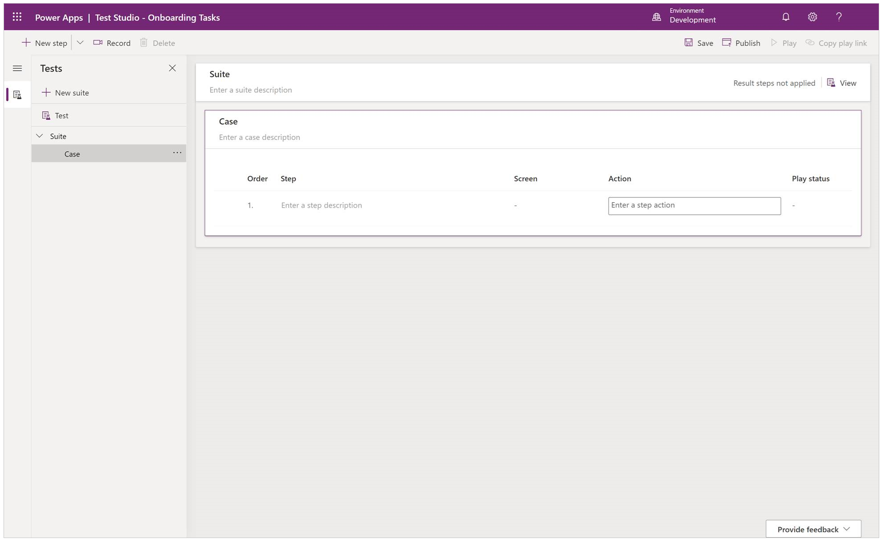

# Test Studio

Build end-to-end UI tests for your canvas app using Test Studio. Maintain your app quality by continually validating that your app works as expected when new changes or updates are deployed. 

## Overview

Testing is an important part of the software development life cycle (SDLC). Testing can help ensure the quality of the app delivered to customers. It can identify issues or defects early in the release process and provides an opportunity to fix these issues to make the app more reliable before releasing changes. Depending on the size and usage of the app, manual testing of new changes might be enough. However, as the app grows in complexity and usage, you might need to consider a test strategy instead of manual testing. If the app is mission-critical, even a small mistake can have a significant impact.

Increased app changes can result in longer testing cycles. Eventually, regression testing of the app might be longer than the time spent to develop new features. In fast-paced development, thoroughly testing every feature in the app becomes a bottleneck to releasing software updates. One option to reduce the time taken during a test cycle and on regression testing is test automation. Test automation can help you test your app with minimal effort, reducing testing time and identifying critical issues before release.

Power Apps Test Studio is a low-code solution to write, organize, and automate tests for canvas apps. In Test Studio, you can write tests using Power Apps expressions or use a recorder to save app interaction to automatically generate the expressions. You can play written tests back within the Test Studio to validate app functionality, and also run the tests in a web browser and build the automated tests into your app deployment process.

## Test Studio terminology

The following section explains key Test Studio terminology.

### Test cases

Test cases are made up of a series of instructions or actions, called test steps. Test cases are executed to validate that your app, or specific features in your app, is working as you expect. For example, in an Expense app, you would like to ensure that only expenses with associated actual cost can be submitted. A test case can help verify that this condition or requirement is always met.

In Test Studio, test steps are written using the Power Apps expression language. Test expressions can consist of both the functions available when building your app and additional expressions to support automated testing.

### Test suites

Test suites are used to organize or group test cases together. As the number of test cases in the app grows, you might consider organizing the test cases in specific features or functionality. For example, you might have one test suite with test cases to validate expense report submissions and another test suite that focuses just on expense approvals.

Test cases contained in test suites are run sequentially. The app state is persisted across all test cases in a suite. For example, if you have a test case that completes on Screen 5 in your app, the next test case in your test suite will begin running from Screen 5. It allows you to break down a complex test scenario into multiple test cases within a single suite, and the state is shared across all test cases. If your second test case expects to begin at the start screen of the app, you can navigate to the start screen as the first step in your test case. It's important to remember that the app is not reloaded at the beginning of every test case in a test suite when planning your test execution.

### Test assertions

Every test case should have an expected result. To validate the expected result of a test against the actual result of your test, you can write test assertions. An assertion is an expression that evaluates to true or false in the test. If the expression returns false, the test case will fail.

In the expense app example above, you can write an assertion to validate whether an expense report is created with an expense line item having zero cost associated.

## Best practices

When testing canvas apps using Test Studio, consider the following best practices to gain maximum benefits to improve your app quality:

1. **Determine which test cases should be automated.**

    It's difficult to automate all tests and we do not recommend that you completely rely on test automation. Manual testing should be performed in addition to test automation. Tests best suited to automation are:

    - Repetitive tests.
    - High business impact functionality tests.
    - Features that are stable and not undergoing significant change.
    - Features that require multiple data sets.
    - Manual testing that takes significant time and effort.

2. **Keep test cases small.**

    While a single test case can support testing all functionality in your app, we recommend that you avoid writing a monolithic test case and try to divide it into multiple test cases. Each test case could test a specific feature or functionality in your app. A failed assertion in a large test case might cause other functionality to remain untested. Using multiple test cases contained in a test suite allows other functionality to get tested regardless of whether a previous test case failed. This strategy also makes it easier to isolate test failures.

3. **Keep expressions to a single test action.**

    A test action can contain multiple expressions. Large multi-action test expressions for a single step might impact your ability to debug and isolate any test failures. Consider dividing a test step with multiple actions into more test steps of single actions to identify issues faster.  

4. **Every test case should have an expected result.**

    Each test case should have one or more expected results. Test assertions should be used to validate the expected outcomes of your test against the actual outcomes. Multiple assertions can be written for a single test case.

5. **Use test suites.**

    For maintenance, group or categorize similar test cases together and describe the purpose and expected results of your test.

## Known limitations

While work to provide full control coverage in Power Apps Test Studio is in progress, the following functionality is currently unavailable:

- Components.
- Code components written in the Power Apps Component Framework.
- Nested galleries.
- Media controls.
- Formula-level error management experimental feature needs to be turned on for the app.
- Support for controls not listed in the [Select](./functions/function-select.md) and [SetProperty](./functions/function-setproperty.md) functions.
- Person-type columns.

## Next steps

- [Working with Test Studio](working-with-test-studio.md)

### See also

- [Automate tests with Azure Pipelines using classic editor](test-studio-classic-pipeline-editor.md)

[!INCLUDE[footer-include](../../includes/footer-banner.md)]
