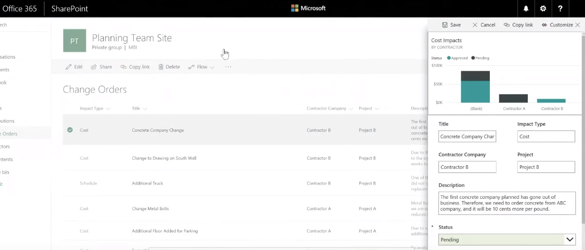
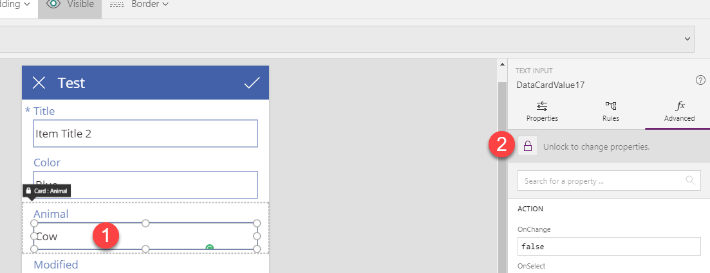
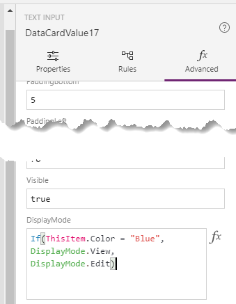
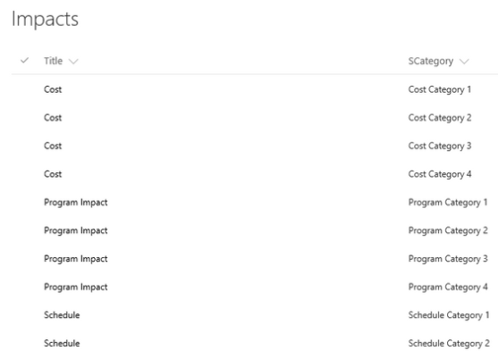

# Transform your InfoPath form to Power Apps

Are you a builder of great things in InfoPath who's looking to learn how to deliver those great things on a more robust platform?

## Key advantages of Power Apps over InfoPath

Like most InfoPath power users, you've been using your unique skill set to build awesome forms for a while. You're very satisfied with your forms, but you also know their limitations: the &quot;classic&quot; feel, a less-than-ideal experience for mobile devices, the uncertainty of their future viability, and always being trapped in a box when it comes to connecting to other services without writing code.

The Power Apps team has heard these and many other challenges. They've worked hard to incorporate a better experience and enable you to create canvas apps by leveraging your existing business and technology skills. By using Power Apps, you can quickly build and deploy the right business solutions without writing code.

**Power Apps enable a powerful future**  
Power Apps is a Software as a Service (SaaS) platform that's designed to let you quickly build high-functioning apps that you can deploy to the web, SharePoint, Dynamics 365, Teams, Power BI, or a mobile device without any extra work. Because you can deploy them by just giving someone the URL to your published app, they're also just as easy to update.

**Share your apps**  
Have you ever tried to build an app and then publish it for iOS or Android devices? It's complicated. If you want to deploy a second app or update that existing one, your users must take a lot more steps. Not with Power Apps. Your users install Power Apps Mobile on their devices and sign in. Voila, they have all of the highly functional apps that you have shared with them. In the future, when you update those apps or push new apps out to them, those apps will show up on your users' devices. Mobile apps without the pain of managing devices is a big win for you and your business.

**Speaking of mobile**  
With Power Apps, you can leverage the power of the user's mobile device. You have access to acceleration, the camera, the compass, the connection information, and location signals: all from within your app. This opens up a whole world of possibilities for building apps to get work done. Of course, touch functionality is just automatic in Power Apps: nothing extra to code when you build your app.

**Get out of the box**  
With InfoPath, you normally work with data from one source. However, things got tricky if you wanted to update another source (such as a SharePoint list in another site collection) or connect to external services. Concepts such as code behind kept you awake at night. Power Apps is designed to allow you to work with multiple data sources and service connections in one app. Currently, [more than 200 connectors](connections-list.md#all-standard-connectors) support a combination of on-premises and cloud data, including Microsoft Office 365 and Azure services such as Power Automate and Dynamics 365. You can also connect to a multitude of third-party services such as Dropbox, Google, Salesforce, Slack, and other popular targets.

Now you can build solutions to scale where your users need to take you, not just where the original data lived.

## Power Apps and SharePoint: even better together

Power Apps is a great tool for making your SharePoint experience better in two ways. You have the option to either customize the forms for a SharePoint list or to create a standalone app for working with SharePoint data.

**Customizing a SharePoint form** is great if you want to customize how users add, view, or edit items in a list that they use for their everyday work. Clicking **Customize Forms** will create a single-screen &quot;forms app&quot; that will change modes (new/edit/view) based on context. SharePoint manages these apps; their permissions are the same as the list permissions for editing/viewing.

**Creating a Power Apps canvas app from SharePoint** allows you to run the app by itself on a mobile device. You can also embed the app in a SharePoint page. Clicking this will create a three-screen app (browse list, view details, and create/update an item). The permission/sharing model for these apps isn't tied to SharePoint but instead is managed from Power Apps.

Now that you understand the difference between the two options, the following section will give you an overview of using each.

## SharePoint forms

The Power Apps and SharePoint teams have worked together to create a customization story for you to use with SharePoint. If you're like most InfoPath developers, you learned InfoPath to interact with SharePoint. SharePoint is great, but the default forms are a bit pedestrian and don't allow for customization or business logic without InfoPath. Well, that was the old way.

With Power Apps you can now customize your list forms as native functionality. And when you do so, you get the full power of Power Apps. In the screenshot below, you can see an example of a Power Apps form with a Power BI report embedded. The entire solution was done in less than 15 minutes.



Another important feature of Power Apps is the ability to easily connect to another SharePoint site collection or a different environment from the same form. For example, do you want to make one form that displays and updates data from your SharePoint Online and SharePoint on-premises environment at the same time? No problem. If you install the [on-premises data gateway](gateway-management.md), you are up and running in a few minutes, connecting Power Apps, Power BI, Power Automate, and Azure Logic Apps with your on-premises data. No changes to firewall rules are required. You can go a step further by connecting this app with Power Automate.

## A standalone SharePoint app

Use this technique if, instead of just updating the list-form experience, you want to build a full, standalone app based on your SharePoint data. This is also the best way to get started, so you can start to learn how the Power Apps canvas works and build future apps from any of the multitudes of data sources.

To get started, follow these steps:

1. Open the SharePoint list from which you would like to build an app.
1. On the menu bar, select **Integrate** -> **Power Apps** -> **Create an app**.
1. Provide a name, and then select **Create**.

Power Apps will build you an app that you can customize.

Start with a simple custom list that contains just a couple of fields of different types for your first app. This will let you build a solid foundation without being overwhelmed. Don't worry; you'll be a pro in no time and ready to tackle those complex apps. For help walking through this first app, check out this [documentation](app-from-sharepoint.md#create-an-app-from-within-sharepoint-online) or this community [video](https://youtu.be/BnYe_7fpZRM). The examples below will show common InfoPath tasks and how to do them in Power Apps. Each of these builds on a simple SharePoint list app.

## How do you do that with Power Apps?

Now that you know the fundamental concepts, let's go further. With your first app under your belt, this section will help you apply some of the common InfoPath concepts in Power Apps.

**Hide/show/lock a field based on a value**  
Successful forms often enforce strong business logic by, for example, changing the state of a field based on a value or an action. With Power Apps, you can set the **DisplayMode** property of a control to **Edit** or **View** to specify whether a user can change the field. You can also use a simple **If** formula to do so conditionally. First, select the card that you want to edit, and then select the lock icon. This step unlocks the card so that you can change the value.



In the right-hand pane, scroll to the **DisplayMode** property so that you can edit it.



In this example, use an **If** formula:

```If(ThisItem.Color = "Blue", DisplayMode.View, DisplayMode.Edit)```

This formula says that, if the current item's **Color** field is **Blue**, the **Animal** field is read-only. Otherwise, the field is editable.

To hide the card instead of making it read-only, insert a similar function in the **Visible** property right above **DisplayMode**.

You can also play with, for example, showing an approval button only if the user's email address matches the approver's email address. (Hint: Use **User().Email** to access the current user's email address.) So you could store the approver's email address in **YourDataCard** and then set the button's **Visible** property to this formula:

```If( YourDataCard.Text = User().Email, true, false )```

**Conditional formatting**  
In a similar manner as above where you hid the field, you can also provide visual feedback to users. Maybe you want to highlight text in red if the entered value falls out of the acceptable range or change an upload button's text and color after the user uploads a file. You can do both by using a function, such as **If**, in properties such as **Color** or **Visible**.

For example, you could use the **If** function paired with the [IsMatch](functions/function-ismatch.md) function to change the text color of the email field to red if the user doesn't enter a properly formatted email in the input box. You would do this by setting the **Color** value of **TextInput1** (where the user types in an email address) to this formula:

```If( IsMatch(TextInput1.Text, Email), Black, Red )```

**IsMatch** supports a plethora of predefined patterns, such as Email, or you can create your own. For more information about conditional formatting, check out this [community video](https://powerusers.microsoft.com/t5/Video-Webinar-Gallery/PowerApps-Conditional-Formatting-and-Popups/m-p/84962).

**Implementing role-based security**  
The first function to consider is [DataSourceInfo](functions/function-datasourceinfo.md). What information you get back from the data source will vary, but often you can use this formula to confirm whether the user has access to edit the data (replace *YourDataSource* with the name of your data source):

```DataSourceInfo( YourDataSource, DataSourceInfo.EditPermission )```

With this, you can show a form or button only if the user has access to edit. Check out the [DataSourceInfo](functions/function-datasourceinfo.md) documentation for the full list of information for which you can query in the function.

You'll need to dig deeper if you want to use Active Directory groups to manage access to buttons or forms in your app. To do this, you'll take advantage of the flexibility of Power Apps and create your own connector using the Microsoft Graph API. If that sounds daunting, you can follow this [blog post](https://powerapps.microsoft.com/blog/implementing-role-based-permission/) for step-by-step guidance.

**Send an email from your app**  
You can send an email message from Power Apps in many ways, but the easiest is to use the Office 365 Outlook Connector. With this connector, you can send a message as yourself from your app. You can also get email messages and other tasks that interact with your mailbox. There is [documentation](connections/connection-office365-outlook.md) or this community [video](https://powerusers.microsoft.com/t5/Video-Webinar-Gallery/Send-an-email-from-PowerApps/m-p/74349) about sending email.

You can send more complex message (for example, as part of a SharePoint approval workflow) by using Power Automate and connecting your app to the flow that you create. Once you connect your app to Power Automate, you've opened up the full power of a workflow engine that, like Power Apps, is very well connected to external data and services. For more information about how to connect Power Apps and Power Automate, check out this [documentation](using-logic-flows.md).

If you still haven't found the email option you're looking for, you can also leverage the Power Apps connectors for Benchmark Email, Gmail, MailChimp, Outlook.com, SendGrid, or SMTP. Connectivity is the beauty of Power Apps.

**Workflows**  
It's hard to talk about business apps and business logic without a workflow engine. The good news is the Power Apps team didn't reinvent the wheel and give you another workflow engine. Instead, they provide you with a robust connector to the Power Automate service. You can automate processes and tasks across more than [200 different services](https://flow.microsoft.com/connectors/) through their easy-to-use workflow engine. For more information about how to connect Power Apps and Power Automate, check out this [documentation](using-logic-flows.md).

**Variables with Power Apps**  
When you build solutions, it's natural to think variables must be involved. Power Apps offers multiple types of variables, but use them only when necessary. Instead of thinking about getting data, storing it in a variable, and then referencing that variable, think about just referencing that data directly. You can better understand this model if you compare it to Excel. In Excel, Total isn't a variable; it's the sum of other fields. So, if you want to use that value elsewhere on the sheet, you specify the cell in which you calculated the total. The [documentation](working-with-variables.md) has a great explanation of all of this. Be open to a different thought process.

If you still need a variable (there are many cases that you do), this will help you understand the different options. Keep in mind that, with Power Apps, you don't have to define variables. Just use a function to specify a name and a value to store, and your variable is created. You can view the variables you've created by selecting **Variables** on the **View** tab. Variables are held in memory, and their values are lost when you close the app. You can create these types of variables:

- Global variables are what you most commonly think of first. Use the [Set](functions/function-set.md) function to specify a value for a global variable and make it available throughout your app:

    ```Set( YourVariable, YourValue )```

    Then you can reference *YourVariable* by name throughout your app.

- Context variables are available only on the screen where they're defined. When you leave the screen, they're reset. They're often used, for example, to store information passed from a previous screen or to track if the form has been submitted. To set a context variable, use the [UpdateContext](functions/function-updatecontext.md) function, as in this example:

    ```UpdateContext( { Submitted: "true" } )```

    This example sets the value of a variable, named **Submitted**, to **true**. You might add this formula to the **OnSelect** property of a submit button to track that the information has been submitted and change all of the fields to read-only.

- Collections store tables of information that can be updated individually. Use the [Collect](functions/function-clear-collect-clearcollect.md) to create a shopping cart, for example, as the user tags various SharePoint items they want to send. A community [video](https://powerusers.microsoft.com/t5/Video-Webinar-Gallery/Learn-about-PowerApps-Collections/m-p/89180) shows that concept in action.

**Cascading dropdowns**  
Cascading dropdowns are very useful because you can, for example, filter the choices in one dropdown based on the value selected in the previous dropdown. In Power Apps, these are often created by having two data sources in your app. The first data source is the data you're viewing or updating, and the second data source stores the values to build the cascading effect. This graphic shows an example of the second data source with the choice options.



In this example, you could add a dropdown named **ddSelectType** and set its **Items** property to this formula:

```Distinct( Impacts, Title )```

The dropdown would show only show Cost, Program Impact, and Schedule. Then you could add a second dropdown and set its **Items** property to this formula:

```Filter( Impacts, ddSelectType.Selected.Value in SCategory )```

Just like that you have cascading dropdowns. For more information, check out this post from the Power Apps team [SharePoint: Cascading Dropdowns in 4 Easy Steps!](https://powerusers.microsoft.com/t5/PowerApps-Community-Blog/SharePoint-Cascading-Dropdowns-in-4-Easy-Steps/ba-p/16248) or this [community video](https://powerusers.microsoft.com/t5/Video-Webinar-Gallery/PowerApps-Cascading-Dropdown/m-p/92813). Don't worry: you can do it just as easily without SharePoint.

**Don't build one super app**  
With Power Apps, you can call one app from another. So, instead of the mass InfoPath form you built that's held together with bubble gum, you can build a group of apps that call each other, and even pass data across, making development simpler.

## Next steps

With Power Apps and the information in this topic, you're now ready to go out into the world and start to conquer it one app at a time. As you continue on your journey, below are some handy links to help, such as the link to the Power Apps community site. Engage today with the community, and grow your skills much faster than you would on your own.

[**Formula reference**](formula-reference.md) - Always a great way to become inspired, just browsing some of the default functions.

[**Power Apps community**](https://powerusers.microsoft.com/t5/PowerApps-Community/ct-p/PowerApps1) - See examples, engage with others, ask and answer questions, and help the Power Apps community grow.


[!INCLUDE[footer-include](../../includes/footer-banner.md)]