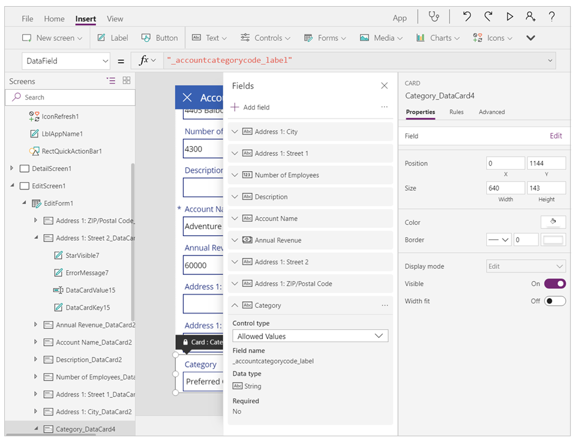
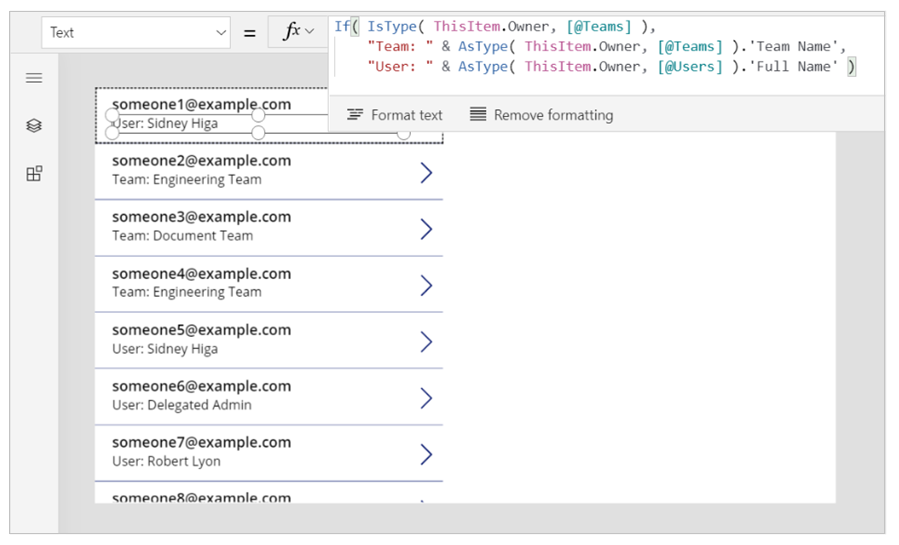

# Microsoft Dataverse and the improve data source experience

> [!NOTE]
> Power Apps mobile app on Windows platform supports legacy Microsoft Dataverse connector without the need to upgrade the connector.

## Overview

If you created a canvas app with either the Dataverse or the Dynamics 365 connector before November 2019, then you might not have the benefits of using the current native connection experience for the Dataverse. This article explains both the benefits of using the new experience and how to convert from the legacy Dataverse or Dynamics 365 connectors to this current and native connection experience enabled by the **Improve data source experience and Microsoft Dataverse views** option.

The **Improve data source experience and Microsoft Dataverse views** option has following benefits:

1. Significant speed gains.
2. Increased reliability.
3. Access to Dataverse **views** and **File and Image field attributes**.

The **Improve data source experience and Microsoft Dataverse views** option appears in the general settings section:


The **Relational data, choices, and other new features for Microsoft Dataverse** now appears in the Deprecated features section.

## How do I upgrade?

Upgrade your app by inspecting the settings of the features and then by following the directions below:

### *Improve data source experience and Microsoft Dataverse views* is On:

Either you already converted your canvas app to use this feature, or you started an app with default setting of *On* for this feature. No further actions required. 

You may also want to enable the **Explicit Column Selection** feature:


> [!NOTE]
> - **Improve data source experience and Microsoft Dataverse views** is not supported on [Power Apps for Windows](https://www.microsoft.com/p/power-apps/9nblggh5z8f3). You must turn this feature *Off* when using Power Apps for Windows.
> - When this feature is *Off*, you'll see the following message. You can ignore this message when using Power Apps mobile app for Windows platform.
> <br> `This app is using a connector for the Microsoft Dataverse or Dynamics 365 that will not be supported past Oct 1, 2020.`

### *Relational data, option sets and other new features for Microsoft Dataverse* is Off:

Check *Retired* section under *Upcoming features*.  If set to *Off*, continue with the following instructions as a first step in the conversion. 

> [!IMPORTANT]
> If you don't see **Relational data, option sets and other new features for Microsoft Dataverse** in *General settings*, or if it’s already *On*, skip the following steps and continue to the [next section](#improve-data-source-experience-and-microsoft-dataverse-views-is-off).

- **Step 1**: Turn **Use display names** feature **On**:
    
    1. Turn **Use display names** feature *On*.
    1. Wait for the health monitor to finish analyzing your app.
    1. Save, close, and reopen your app.
    1. Resolve all formula errors.
    1. Save, close, and reopen your app.
    
    *Possible errors and suggestions*:
    
    It’s possible that some of the newly shown display names may conflict with the display names for other tables, fields, or controls. For example, you may have a control and a field with the same name. You can change the name of the control with a unique value to fix.
    
    For any field and table display name conflict, you may see a formula that expects a table but resolves to a locally scoped field name.

    Use the square bracket with an **@** symbol to indicate a global scope so it resolves to the table; for example, **[@tableName]**.
    
    
- **Step 2**: Turn **Relational data, option sets and other new features for Microsoft Dataverse** and **Use GUID data types instead of strings** features **On**:
    
    1. Turn **Relational data, option sets and other new features for Microsoft Dataverse** feature *On*.
    1. Turn **Use GUID data types instead of strings** feature *On*.
    1. Wait for the health monitor to finish analyzing your app.
    1. Resolve all formula errors.
    1. Save, close, and reopen your app.  
    
    *Possible errors and suggestions*:
    
    It’s possible to have errors at this stage if you're using an choice field or hard-coded GUID text values.  <br><br> 
    
    - *Choice values*: If you're using choice field with a text identifier for the choice value, use the dot notation instead to reference the choice value. For example, change `Patch(Accounts, OptionSet1 = “12345”)` to `Patch(Accounts, OptionSet.Item1)` where `Item1` corresponds to the `12345` value. <br>
    More information: [Detailed Examples](#detailed-examples).
    - *GUIDs*: If you're using a static GUID string such as `015e45e1044e49f388115be07f2ee116`, convert it to a function that returns a GUID object; for example `GUID(“015e45e1044e49f388115be07f2ee116”)`. 
    - *Lookups*: If you're using Lookup functions to get first-level lookup values such as `Lookup(Contacts, ‘contactID’ = ThisItem.ContactID”)`, consider using `ThisItem.PrimaryContacts` (where PrimaryContacts is the name of the table) instead.

### *Improve data source experience and Microsoft Dataverse views* is Off:

Use the following instruction to turn **Improve data source experience and Microsoft Dataverse views** feature *On*:

1. Remove your existing Dataverse data source connections. 
1. Turn *On* the **Improve data source experience and Microsoft Dataverse views** feature.
1. Add the Dataverse connection using the new data source selection experience.
1. Save your application.

> [!NOTE]
> If your application is extremely large, adding your data source connections back may take a while. Don't close the application during this process.

## Converting canvas apps with the Dynamics 365 connector

To convert your app that uses the Dynamics 365 connector, you'll need to remove and add the connections to your data sources. Use the steps below to convert your connections to your data sources.

1. Ensure the **Improve data source experience and Microsoft Dataverse views** feature is turned *On*.
2. Remove your existing Dynamics 365 data source connections.
3. Add the connections to your data sources to the Dataverse using the new data source selection experience. 

    > [!NOTE] 
    > - If you have connections to other environments (other than current), select the *Table* category and then the *More* (...) option to change the environment. You can then select a table from a different environment to add to your application. Cross-tenant connections don't work with the improved native connector. You'll need to use data integration to access data cross-tenant.
    > - You need to meet one of the following requirements to be able to see an environment that you want to add the connection to:
    >   - You're the **Owner** of the app, or the app is [shared](share-app.md) with you as a **Co-owner**.
    >   - You're a member of at least one of these security roles: **Environment Admin**, **Environment Maker**, or **System Administrator**. For more information about the security roles in an environment, go to [Configure user security to resources in an environment](/power-platform/admin/database-security).

4.	Save your application.

*Possible errors and suggestions*:

It’s possible to have errors as you convert if: you aren't using Display Names, if you're using GUID strings, or if you're using a choice.

- If control name conflicts, change the name of the control to be different and unique. 
- For field and table display name conflicts, you may see a formula that is expecting a table but is resolving to a more locally scoped field name. Use the square bracket with an *@* symbol to indicate a global scope so it resolves to the table; for example, **[@tableName]**.
- *Choice values*: If you're using a choice field with a text identifier for the choice value, use the dot notation instead to reference the choice value. For example, change `Patch(Accounts, OptionSet1 = “12345”)` to `Patch(Accounts, OptionSet.Item1)` where `Item1` corresponds to the `12345` value. <br>
More information: [Detailed Examples](#detailed-examples).
- *GUIDs*: If you're using a static GUID string such as `015e45e1044e49f388115be07f2ee116`, convert it to a function that returns a GUID object; for example `GUID(“015e45e1044e49f388115be07f2ee116”)`. 
- *Lookups*: If you're using Lookup functions to get first-level lookup values such as `Lookup(Contacts, ‘contactID’ = ThisItem.ContactID”)`, consider using `ThisItem.PrimaryContacts` (where PrimaryContacts is the name of the table) instead.
- For any Polymorphic references, refer to the Detailed Examples section below. 

## Detailed Examples

Converting your app to use the new **Option sets** and **Two options** data types with supporting controls can be challenging while upgrading an app to use the new *Improve data source experience and Microsoft Dataverse views* feature.

### Choices

Separate `_myfield` and `_myfield_label` fields were used for choice earlier. Now, there's a single `myfield` that can be used both for locale-independent comparisons and to obtain the locale-specific label.

#### Removing and adding choice Data cards

It's recommended to remove existing data cards and add them back to work with your choice. For example, if you're working with the Account table and the Category choice, you'll see that the *DataField* property of the data card was set to `_accountcategorycode_label`. In the field list you can see that the data card has a type of *String*:



With the new *Improved data source experience and Microsoft Dataverse views* feature, you no longer see `_accountcategorycode_label`. It's replaced by `accountcategorycode`. Your card is now be marked as **custom** and you'll see errors. Remove the old data card and add the *Choice* back. The new data card is *Choice* aware.


#### Editing the Choice Filter expressions to use new syntax

Previously, if you wanted to use an Choice value in a Filter expression you would need to use the *Value* field. For example:

```powerapps-dot
Filter(Account,'Category Value' = "1")
```

You'll need to edit this formula. Choice text identifer is no longer used for the value. This expression should be updated to:

```powerapps-dot
Filter(Account, Category= ‘Category (Accounts)’.’Preferred Customer’)
```

'Category(Accounts)' is the name of enum used in the Category field of the Accounts table. This is a local choice.  You can read more about local and global choices here: [Global choices.](../data-platform/create-edit-global-option-sets.md)

#### Editing choices patch statements to use new syntax

Following is an example of earlier Patch statement for choice:

```powerapps-dot
Patch( Accounts, First(Accounts), { ‘Category Value’: 1 } ) )
```

You'll need to update your statements to follow this form:

```powerapps-dot
Patch( Accounts, First(Accounts), { Category: ‘Category (Accounts)’.’Preferred Customer’ } )
```

#### Choice disambiguation

If the display name of an choice **field** and the name of the choice are the same, you'll need to disambiguate the formula. To continue using the Accounts Category Code example, the **@** implies to use the choice, not the field.

```powerapps-dot
Filter(Accounts, 'Category Code' = [@’Category Code’].'Preferred Customer')
```

### Two Options

#### Removing and adding Yes/No Data cards

Remove existing data cards and add them back to work with your Yes/No. The data types were earlier recognized as simple boolean - such as true/on and false/off with no labels:


With the new *Improved data source experience and Microsoft Dataverse views* feature, your card will now be marked as **custom** and you'll see errors.  Remove the old data card and add the choice back. You'll see an edit control with two options by default after you add.


If you prefer the toggle switch for your boolean field, you can unlock the data card and replace the control in the data card with a toggle instead.  You'll also need to set these properties on the Toggle.

```powerapps-dot
Toggle1.Default = ThisItem.’Do not allow Bulk Emails’
Toggle1.TrueText = ‘Do not allow Bulk Emails (Accounts)’.’Do Not Allow’
Toggle1.FalseText = ‘Do not allow Bulk Emails (Accounts)’.Allow
DataCard.Value = If( Toggle1.Value,
    ‘Do not allow Bulk Emails (Accounts)’.’Do Not Allow’,
    ‘Do not allow Bulk Emails (Accounts)’.Allow )
```


#### Refining Two Option Patch statements

Using the [Patch](./functions/function-patch.md) function with Two option should work 'as is'. It supports direct use of true and false, similar to Boolean. The only difference is being if you had put the value in a Label control earlier that showed true and false, it will now show the Two option labels instead.

### Polymorphic lookups

Following guidelines help to upgrade your application if it referenced [polymorphic](working-with-references.md) fields. Polymorphic lookups, from the same field, support references to a restricted set of multiple tables.  Similar to references in other languages, a record reference is a pointer to a specific record in a specific table. A record reference carries the table information allowing it to point to a record in several different other table, which differs from a normal lookup that can only point to records in one table.  

#### Access, Set, and Filter on the Owner field of a record

For instance, the Owner field in a table can refer to a record in the Users table or the Teams table. The same lookup field in different records could refer to records in different tables.
 

 
##### Polymorphic with Filter and Patch

Record references can be used just like a full record:

```powerapps-dot
Filter( Accounts, Owner = First( Teams ) )
Patch( Accounts, First( Accounts ), { Owner: First( Users ) })
```

##### Polymorphic with a Gallery displaying Owner name

Since a reference can point to different tables, you must be specific. You can't use **ThisItem.Owner.Name**, as the name field in the **Team** table is **Team Name**, and the name field in the **User** table is **Full Name**. Power Apps won’t know which type of lookup you're referring to, until you run the app.

To fix this issue: 

1. Add the data sources for the entity types that Owner could be; in current example, Users and Teams).
2. Use more functions to make your intent clear.

There are two new functions you can make use of:

- IsType – Checks if a record reference is of a particular table type.
- AsType – Casts a record reference to a particular table type.

With these functions, you can write a formula that displays the name of the Owner taken from two differently named fields, based on the table type of the Owner:

```powerapps-dot
If( IsType( ThisItem.Owner,  [@Teams]), 
    AsType( ThisItem.Owner, [@Teams]).'Team Name', 
    AsType( ThisItem.Owner, [@Users]).'Full Name' )
```



Global disambiguation operator for `[@Teams]` and `[@Users]` is used to ensure that you reference the global table type. Though in this case it's not necessary, it's a recommended to always be clear. One-to-many relationships often conflict in the gallery's record scope, and this practice avoids that confusion.
 
#### Access and set the Company Name field (a Customer data type) of the Contacts table

Customer lookup field is another polymorphic lookup that's similar to Owner. You can only have one Owner field per table. But a table can include zero, one, or more Customer lookup fields. The Contacts system table includes the Company Name field, which is a Customer lookup field. Read [show the fields of a customer](./working-with-references.md#show-the-columns-of-a-customer) for more details.
 
#### Access and set the Regarding field of activity tables such as Faxes, Phone Calls, Email Messages

Polymorphic lookups aren't limited to Accounts and Contacts. The list of tables is extensible with custom tables. For example, the Faxes table has a polymorphic Regarding lookup field, which can refer to Accounts, Contacts, and other tables. If you have a gallery with data source set to Faxes, you can use the following formula to display the name associated with the Regarding lookup field. 
 
 ```powerapps-dot
If( IsBlank( ThisItem.Regarding ), "",
    IsType( ThisItem.Regarding, [@Accounts] ),
        "Account: " & AsType( ThisItem.Regarding, [@Accounts] ).'Account Name',
    IsType( ThisItem.Regarding, [@Contacts] ),
        "Contacts: " & AsType( ThisItem.Regarding, [@Contacts] ).'Full Name',
    "" )
```


 
Read [Regarding lookup fields](./working-with-references.md#understand-regarding-lookup-columns) and [Regarding relationships](./working-with-references.md#understand-regarding-relationships) for more details.

#### Access the list of all Activities for a record

In Dataverse, tables such as Faxes, Tasks, Emails, Notes, Phone Calls, Letters, and Chats are designated as [activities](../../developer/data-platform/activity-entities.md). You can also create your own [custom activity tables](../../developer/data-platform/custom-activities.md).

You can show activities of a specific type (such as Faxes or Taxes), or all activities associated with a table such as account. Add the Activities table and other individual tables whose data you plan to display in the canvas app.

Each time you add a record to (for example the Tasks table), a record in the Activity table with the fields common across all activity tables is created. Read [activity table](./working-with-references.md#activity-table) for more details.

The following example shows that as you select an Account, all the Activities associated with that account will be displayed:
 
 
 
The records are being displayed from the Activity table. But you can still use the [IsType](./functions/function-astype-istype.md) function to identify which kind of activity they are. Again, before you use IsType with a table type, you must add the necessary data source.
 
By using this formula, you can show the record type in a label control within the gallery:

 ```powerapps-dot
If( IsType( ThisItem, [@Faxes] ), "Fax",
    IsType( ThisItem, [@'Phone Calls'] ), "Phone Call",
    IsType( ThisItem, [@'Email Messages'] ), "Email Message",
    IsType( ThisItem, [@Chats] ), "Chat",
    "Unknown")
```

 

#### Access the list of Notes for a record

When you create a table, you can enable attachments. If you select the check box for enabling attachments, you'll create a Regarding relationship with the Notes table, as this graphic shows for the Accounts table:


##### Filtering

You can't read or filter based on the Regarding field. However, the reverse Notes one-to-many relationship is available. To list all the Notes associated to an Account table, you can use the following formula:

```powerapps-dot
First( Accounts ).Notes
```

##### Patch

You can't set the Notes field on a table by using Patch. To add a record to a table's Notes table, you can use the Relate function. Create the note first, as in this example:

```powerapps-dot
Relate( ThisItem.Notes, Patch( Notes, Defaults( Notes ), { Title: "A new note", isdocument:'Is Document (Notes)'.No } ) )
```

## Next steps

- [Formula reference](./formula-reference.md)
- [Controls reference](./reference-properties.md)

### See also

[What is Dataverse?](../data-platform/data-platform-intro.md)


[!INCLUDE[footer-include](../../includes/footer-banner.md)]