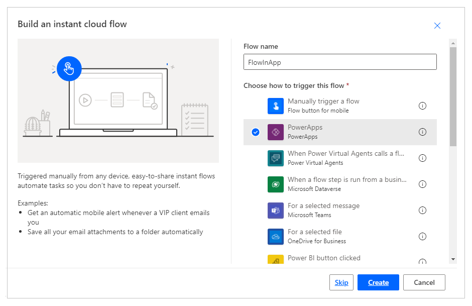

# Start a flow in a canvas app

You can use Power Automate to create logic that performs one or more tasks when an event occurs in a canvas app. For example, configure a button so that, when a user selects it, an item is created in a SharePoint list, an email or meeting request is sent, a file is added to the cloud, or all of these. You can configure any control in the app to start the flow, which continues to run even if you close Power Apps.

> [!NOTE]
> When a user runs a flow from within an app, that user must have permission to perform the tasks that are specified in the flow. Otherwise, the flow will fail.

## Prerequisites

- [Sign up](../signup-for-powerapps.md) for Power Apps.
- Learn how to [configure a control](add-configure-controls.md).
- A SharePoint site with 2 lists.
    - List **RepairShop** contains Title, and ContactEmail columns. 
    - List **Assets** contains Title, AssetType, and RepairShop columns. The AssetType column is a choice column with choices such as "Desktop", "Laptop".
    - The RepairShop column in Assests list is a lookup column that gets values from the ContactEmail column in RepairShop list.
    - Create a few items in the **RepairShop** list for sample contacts.

## Create a flow

In this section, you'll create a flow using Power Automate that creates an item in a SharePoint list using the input value for the list column from an app created using Power Apps. You'll create the app that uses this flow in the next section.

1. Sign in to [Power Apps](https://make.powerapps.com).

1. On the left-pane, select **Flows**.

1. Select **+ New flow** > **Instant cloud flow**.

1. Enter flow name, such as **FlowInApp**.

1. Under **Choose how to trigger this flow**, select **Power Apps**.

    

1. Select **Create**.

1. Select **+ New step**.

1. Under **Choose an operation**, search for or select **SharePoint** connector.

    

1. Search for, or select **Create item** action.

    

1. For **Site Address**, enter or choose your SharePoint site that has the lists **Assets** and **RepairShop**.

1. For **List Name**, select the **Assets** list.

    

1. For **Title**, choose **Ask in Power Apps** from **Dynamic content** tab. The action automatically updates to **Createitem_Title**.

    

1. Choose values for **AssetType Value**, and **RepairShop Id** of your choice.

    

1. Select **Save**.

## Add a flow to an app

In this section, you'll learn about creating an app using Power Apps that uses the flow created in the earlier section. The app uses text entered in a text box when the button is selected to trigger the flow to create an item in the selected SharePoint list.

1. Go to [Power Apps](https://make.powerapps.com), or select **Home** in Power apps.

1. Under **Make your own app**, select **Canvas app from blank**.

1. Enter an app name, such as **AppWithFlow**. You can also select or change layout between phone and tablet.

1. Select **Create**.

1. Select **+** (Insert) on the left-pane.

1. Select **Text input** control.

1. Select **Button** control.

1. On the canvas, move the button control below the text input control.

    

1. Select **Action** menu at the top, and then select **Power Automate**.

    

1. Select **FlowInApp**.

1. In the formula bar, remove the formula for the selected **OnVisible** property.

1. Select the text input control.

1. From the top-left side of the screen, select the property list drop-down, and then select the **Default** property.

1. In the formula bar, change the default property value from `"Text input"` to `"Enter Asset Title"`.

1. Select the button control.

1. From the top-left side of the screen, select the property list drop-down, and then select the **Text** property.

1. In the formula bar, change the text property value from `"Button"` to `"Create Asset"`.

1. From the top-left side property list, select the **OnSelect** property for the button.

1. Enter the following formula in the formula bar.

    ```powerapps-dot
    FlowInApp.Run(TextInput1.Text)
    ```

    In this formula, **FlowInApp** is the name of the flow you added using Power Automate. the **.Run** specifies the flow to execute. The flow executes with **TextInput1** text input control added to this canvas, with the value entered in this text box (**.Text**). 

    In other words, when this button is selected, the app will run the flow with the value from the text input control, passing the text value to the flow to execute. And the flow will create the SharePoint list item with this text input value along with rest of the selection inside the flow configuration.

    

1. [Save and publish](save-publish-app.md) the app.

## Test the flow

Now that you have both the flow, and the app created, you'll run the app and verify the creation of an item inside the selected SharePoint list.

1. In [Power Apps](https://make.powerapps.com), select **Apps**, and then, select the **AppWithFlow** app.

    

1. Enter a value in the text input box, and then select **Create Asset**.

    

1. Verify that the item is created in your SharePoint list.

    

Now that you've created a sample app that runs a flow and adds item inside a SharePoint list, you can create more complex applications that interact with Power Automate and manipulate data inside various data sources.

### See also

[Create a rule in canvas apps](working-with-rules.md)
<br> [Add and configure controls](add-configure-controls.md)

[!INCLUDE[footer-include](../../includes/footer-banner.md)]
