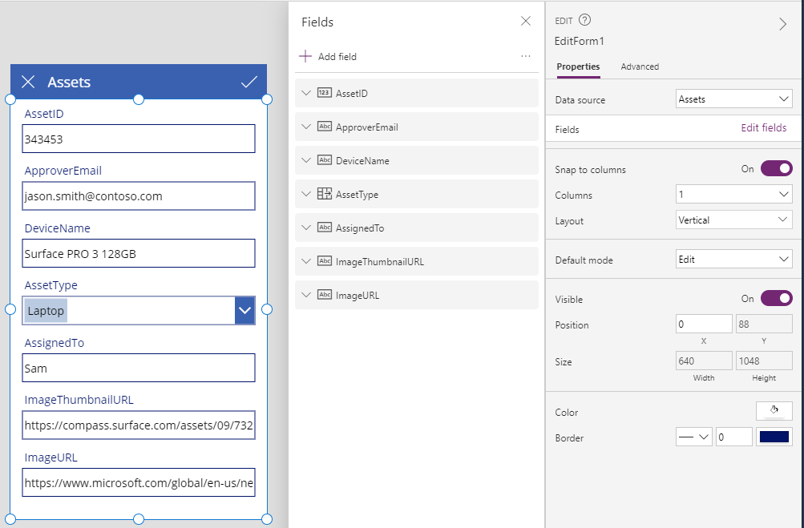
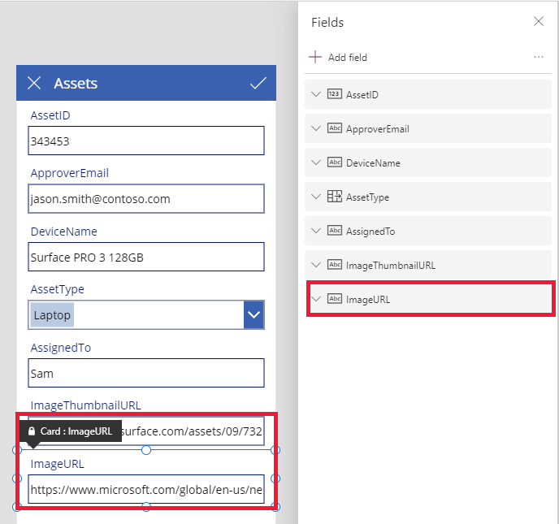
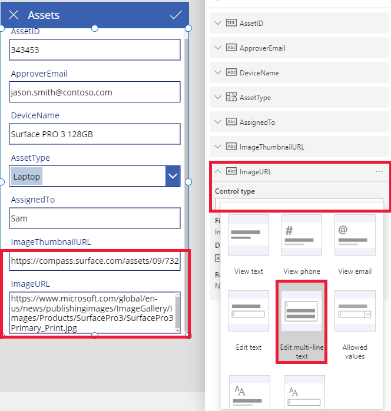
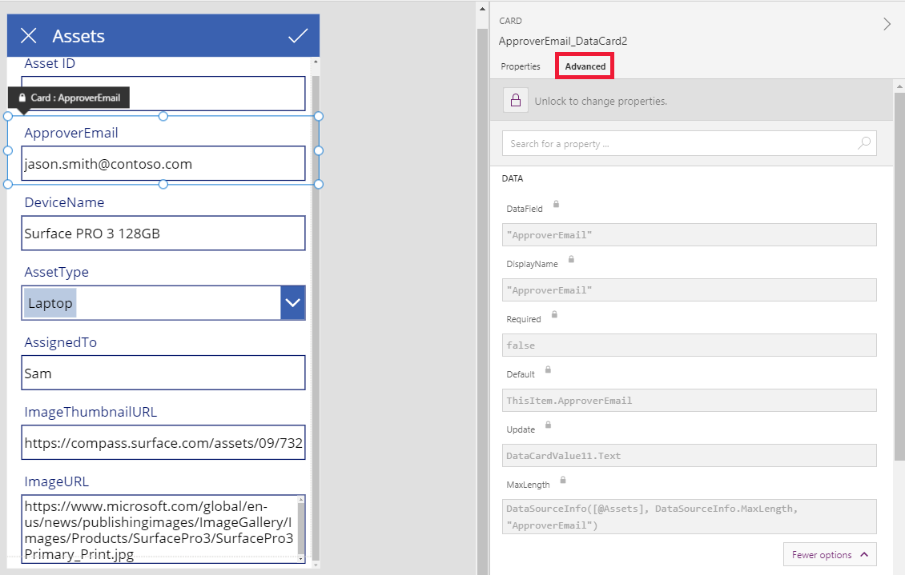
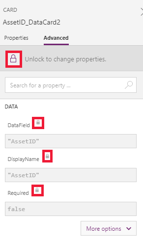
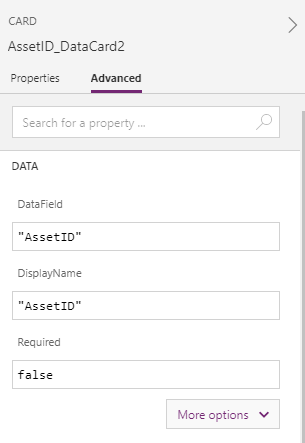
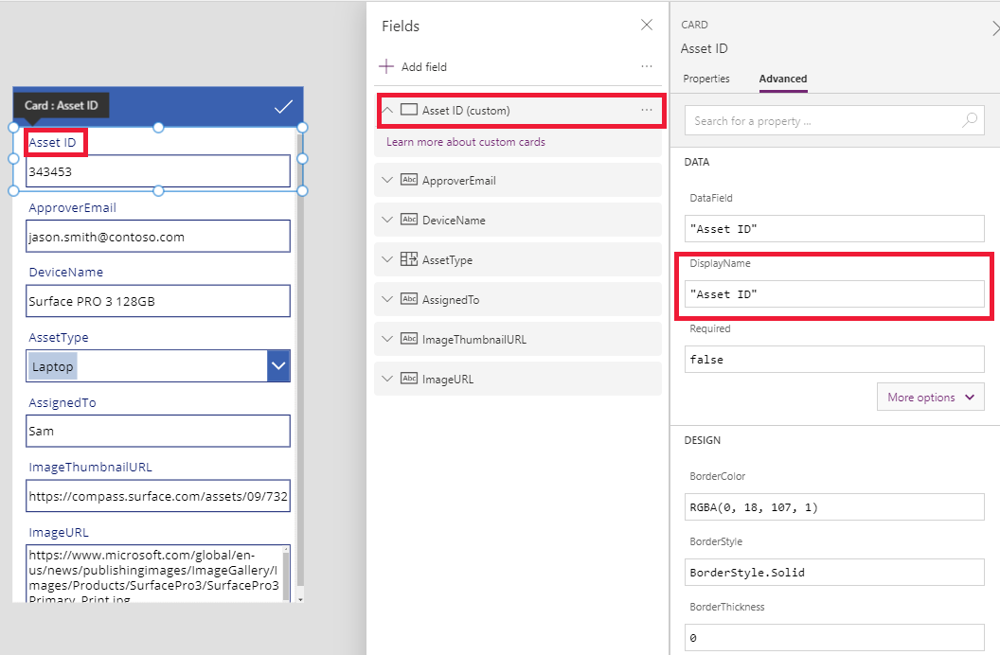
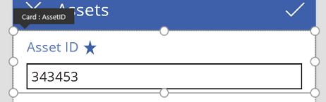

# Understand data cards in canvas apps

**[Card](controls/control-card.md)** controls are the building blocks of the **[Edit form](controls/control-form-detail.md)** and **[Display form](controls/control-form-detail.md)** controls in canvas apps. The form represents the entire record, and each card represents a single field of that record.

You can interact with cards most easily in the right-hand pane after you select a form control in the design workspace. In that pane, you can choose which fields to show, how to show each field, and in what order to show them. This example shows an **Edit form** control in an app built from a SharePoint list that's named **Assets**.

To get started with cards, see [add a form](add-form.md) and [understand data forms](working-with-forms.md). The remainder of this article goes into more detail about how cards work and how you can customize or even create your own.

## Predefined cards

Power Apps offers a predefined set of cards for strings, numbers, and other data types. In the right-hand pane, you can see the variations available and change the card used for a field:

In this example, a single-line text card is selected, but the URL's text is longer than can be shown on a single line. Let's change this to a multi-line text card to give our users more room to edit:

Several fields of this data source aren't being shown, but you can show or hide a field by selecting its checkbox. This example illustrates how to show the **SecurityCode** field.

## Customize a card

Cards comprise other controls. In an **Edit form** control, the user enters data in a standard **[Text input](controls/control-text-input.md)** control that you add from the **Insert** tab.  

Let's walk through an example of how to change a card's appearance by manipulating controls in it.

1. First, let's return to the card that we inserted most recently, for the **SecurityCode** field. Select this card by clicking or tapping it once:
   
    
2. Select the **[Text input](controls/control-text-input.md)** control inside the card by clicking or tapping the input control itself.
   
    
3. Move this control within the card by dragging the selection box, and resize the control by dragging the handles along the edge of the selection box:
   
      

You can resize, move, and make other modifications to controls within a card, but you can't delete it without unlocking it first.

## Unlock a card
In addition to containing controls, cards themselves are controls that have properties and formulas just like any other control. When you choose to display a field on a form, the right-hand pane automatically creates the card for you and generates the needed formulas.  We can see these formulas in the **Advanced** tab of the right-hand pane:

We immediately see one of the most important properties of the card: the **[DataField](controls/control-card.md)** property. This property indicates which field of the data source the user sees and can edit in this card.  

On the **Advanced** tab, the banner at the top indicates that the properties of this card are locked. A lock icon also appears next to the **[DataField](controls/control-card.md)**, **[DisplayName](controls/control-card.md)**, and **[Required](controls/control-card.md)** properties. The right-hand pane created these formulas, and the lock prevents accidental changes to these properties.

Click or tap the banner at the top to unlock the card so that you can modify these properties:

Let's modify the **[DisplayName](controls/control-card.md)** to put a space between **Asset** and **ID**. By making this change, we're altering what was generated for us.  In the right-hand pane, this card has a different label:

We've now taken control over this card and can modify it further to fit our need. But we've lost the ability to change the card from one representation to another (for example, single-line text to multi-line text) as we did before. We've transformed the predefined card into a "custom card" that we now control.  

> [!IMPORTANT]
> You can't relock a card if you unlock it. To get a card back to a locked state, remove it, and reinsert it in the right-hand pane.

You can change the appearance and behavior of an unlocked card in a variety of ways, such as adding and deleting controls within it. For example, you can add a star shape from the **Icons** menu on the **Insert** tab.

The star is now a part of the card and will travel with it if, for example, you reorder the cards within the form.

As another example, unlock the **ImageURL** card, and then add an **Image** control to it from the **Insert** tab:

In the formula bar, set the **Image** property of this control to *TextBox*.**Text**, where *TextBox* is the name of the **Text input** control that holds the URL:

And now we can see the images and edit their URLs. Note that we could have used **Parent.Default** as the **Image** property, but it wouldn't have updated if the user changed the URL.

We can do the same thing on the second screen of this app, where we use a **Display form** control to display the details of a record. In this case, we may want to hide the label (set the **Visible** property of the label, not the card, to **false**) because the user won't edit the URL on that screen:

## Interact with a form
After you unlock a card, you can change how it interacts with the form that contains it.

Below are some guidelines for how controls should work with their card and how the cards should work with the form. These are only guidelines. As with any control in Power Apps, you can create formulas that reference any other control in Power Apps, and that's no less true for cards and controls within cards. Be creative: you can create an app in many ways.  

### DataField property
The most important property on the card is the **[DataField](controls/control-card.md)** property.  This property drives validation, what field is updated, and other aspects of the card.

### Information flowing in
As a container, the form makes **ThisItem** available to all cards within it. This record contains all of the fields for the current record of interest.  

The **[Default](controls/properties-core.md)** property of every card should be set to **ThisItem**.*FieldName*.  Under certain circumstances, you might want to transform this value on the way in. For example, you might want to format a string or translate the value from one language to another.

Each control within the card should reference **Parent.Default** to get at the field's value. This strategy provides a level of encapsulation for the card so that the card's **[Default](controls/properties-core.md)** property can change without changing the internal formulas of the card.

By default, **DefaultValue** and **[Required](controls/control-card.md)** properties are taken from the data source's metadata based on the **[DataField](controls/control-card.md)** property. You can override these formulas with your own logic, integrating the data source's metadata by using the **[DataSourceInfo](functions/function-datasourceinfo.md)** function.

### Information flowing out
After the user modifies a record by using controls in the cards, the **[SubmitForm](functions/function-form.md)** function saves those changes to the data source. When that function runs, the form control reads the values of each card's **[DataField](controls/control-card.md)** property to know what field to change.  

The form control also reads the value of each card's **[Update](controls/control-card.md)** property. This value will be stored in the data source for this field. This is the place to apply another transform, perhaps to reverse the transform that was applied in the card's **[Default](controls/properties-core.md)** formula.

The **Valid** property is driven from the metadata of the data source, based on the **[DataField](controls/control-card.md)** property. It's also based on the **[Required](controls/control-card.md)** property and whether the **[Update](controls/control-card.md)** property contains a value. If the value on the **[Update](controls/control-card.md)** property isn't valid, the **Error** property provides a user-friendly error message.

If the **[DataField](controls/control-card.md)** property of a card is *blank*, the card is just a container of controls. Its **Valid** and **[Update](controls/control-card.md)** properties don't participate when the form is submitted.

## Dissecting an example
Let's look at the controls that make up a basic data-entry card. The space between controls has been increased to show each more clearly:

In this graphic, the controls within the data card have been labeled:

Four controls make this card work:

| Name | Type | Description |
| --- | --- | --- |
| **TextRequiredStar** |**[Label](controls/control-text-box.md)** control |Displays a star, which is commonly used on data-entry forms to indicate that a field is required. |
| **TextFieldDisplayName** |**[Label](controls/control-text-box.md)** control |Displays the user-friendly name of this field. This name can differ from what is in the data source's schema. |
| **InputText** |**Input text** control |Displays the initial value of the field and allows the user to change that value. |
| **TextErrorMessage** |**[Label](controls/control-text-box.md)** control |Displays a user-friendly error message to the user if a problem occurs with validation. Also ensures that the field has a value if one is required. |

To populate these controls with data, their properties can be driven from the properties of the card, through these key formulas. Note that formulas refer to a specific field. Instead, all information comes from the card.

| Control property | Formula | Description |
| --- | --- | --- |
| **TextRequiredStar.Visible** |**Parent.Required** |The star appears only if the field is required. Required is a formula that's driven by you or the metadata of the data source. |
| **TextFieldDisplayName.Text** |**Parent.DisplayName** |The text-box control shows the user-friendly name, which you or the data source's metadata provides, and which is set on the card's **[DisplayName](controls/control-card.md)** property. |
| **InputText.Default** |**Parent.Default** |The text-input control initially shows the value of the field from the data source, as provided by the card's default value. |
| **TextErrorMessage.Text** |**Parent.Error** |If a validation problem occurs, the card's **Error** property provides an appropriate error message. |

> [!NOTE]
> The **Parent.Error** property is an output-only property that you can't set by using a formula. Therefore, this property won't appear in list of properties near the upper-left corner or in the **Properties** or **Advanced** tabs near the right edge. The formula bar suggests this property if you're writing a formula that could reference the property.

To pull information out of these controls and push it back into the data source, we have the following key formulas:

| Control name | Formula | Description |
| --- | --- | --- |
| **DataCard.DataField** |**"ApproverEmail"** |The name of the field that the user can display and edit in this card. |
| **DataCard.Update** |**InputText.Text** |The value to validate and push back into the data source when **[SubmitForm](functions/function-form.md)** runs. |

[!INCLUDE[footer-include](../../includes/footer-banner.md)]