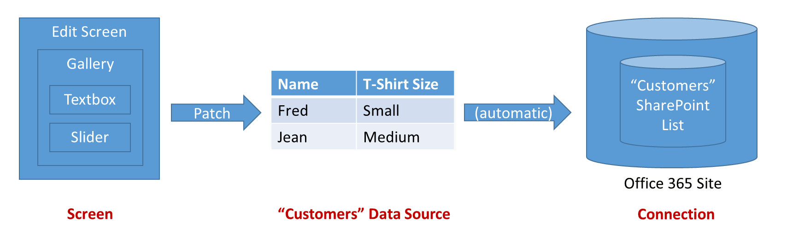

# Understand data sources for canvas apps

In Power Apps, most canvas apps use external information stored in cloud services called **Data Sources**. A common example is a table in an Excel file stored in OneDrive for Business. Apps access these data sources by using **Connections**.

This article discusses the different kinds of data sources and how to work with table data sources.

It's easy to create an app that does basic reading and writing to a data source. But sometimes you want more control over how data flows in and out of your app.  This article describes how the **[Patch](functions/function-patch.md)**, **[DataSourceInfo](functions/function-datasourceinfo.md)**, **[Validate](functions/function-validate.md)**, and **[Errors](functions/function-errors.md)** functions provide more control.

## Kinds of data sources

Data sources can be connected to a cloud service, or they can be local to an app.

### Connected data sources

The most common data sources are **tables**, which you can use to retrieve and store information. You can use **connections** to data sources to read and write data in Microsoft Excel workbooks, SharePoint lists, SQL tables, and many other formats, which can be stored in cloud services such as OneDrive for Business, DropBox, and SQL Server.

Data sources other than tables include email, calendars, Twitter, and notifications, but this article doesn't discuss these other kinds of data sources.

### Local data sources

Using the **[Gallery](controls/control-gallery.md)**, **[Display form](controls/control-form-detail.md)**, and **[Edit form](controls/control-form-detail.md)** controls, it is easy to create an app that reads and writes data from a data source.  To get started, read the article [Understand data forms](working-with-forms.md).  

When you ask Power Apps to create an app from data, these controls are used. Behind the scenes, the app uses an internal table to store and manipulate the data that comes from the data source.

A special kind of data source is the [Collection](working-with-data-sources.md#collections), which is local to the app and not backed by a connection to a service in the cloud, so the information can not be shared across devices for the same user or between users. Collections can be loaded and saved locally.

### Kinds of tables

Tables that are internal to a Power Apps app are fixed values, just as a number or a string is a value. Internal tables aren't stored anywhere, they just exist in your app's memory. You can't directly modify the structure and data of a table. What you can do instead is to create a new table through a formula: you use that formula to make a modified copy of the original table.

External tables are stored in a data source for later retrieval and sharing.  Power Apps provides "connections" to read and write stored data.  Within a connection, you can access multiple tables of information.  You'll select which tables to use in your app, and each will become a separate *data source*.  

To learn more, [Working with tables](working-with-tables.md) goes into more detail about internal tables, but it is also applicable to external tables residing in a cloud service.

## Working with tables
You can use table data sources the same way that you use an internal Power Apps table.  Just like an internal table, each data source has [records](working-with-tables.md#records), [columns](working-with-tables.md#columns), and properties that you can use in formulas. In addition:

* The data source has the same column names and data types as the underlying table in the connection.
  
    > [!NOTE]
  > For SharePoint and Excel data sources that contain column names with spaces, Power Apps will replace the spaces with **"\_x0020\_"**. For example, **"Column Name"** in SharePoint or Excel will appear as **"Column_x0020_Name"** in Power Apps when displayed in the data layout or used in a formula.
* The data source is loaded from the service automatically when the app is loaded.  You can force the data to refresh by using the **[Refresh](functions/function-refresh.md)** function.
* As users run an app, they can create, modify, and delete records and push those changes back to the underlying table in the service.
  * Records can be created with the **[Patch](functions/function-patch.md)** and **[Collect](functions/function-clear-collect-clearcollect.md)** functions.  
  * Records can be modified with the **[Patch](functions/function-patch.md)**, **[Update](functions/function-update-updateif.md)**, and **[UpdateIf](functions/function-update-updateif.md)** functions.
  * Records can be removed with the **[Remove](functions/function-remove-removeif.md)** and **[RemoveIf](functions/function-remove-removeif.md)** functions.
  * Errors when working with a data source are available through the **[Errors](functions/function-errors.md)** function.
* The **[DataSourceInfo](functions/function-datasourceinfo.md)**, **[Defaults](functions/function-defaults.md)**, and **[Validate](functions/function-validate.md)** functions provide information about the data source that you can use to optimize the user experience.

### Creating data sources
Power Apps can't be used to create a connected data source, or modify its structure; the data source must already exist in a service somewhere. For example, to create a table in an Excel workbook stored on OneDrive, you first use Excel Online on OneDrive to create a workbook. Next you create a connection to it from your app.  

However, collection data sources *can* be created and modified inside an app, but are only temporary.

### Display one or more records

The diagram above shows the flow of information when an app reads the information in a data source:

* The information is stored and shared through a storage service (in this case, a SharePoint list of an Office 365 site).
* A connection makes this information available to the app.  The connection takes care of authentication of the user to access the information.
* When the app is started or the **[Refresh](functions/function-refresh.md)** function is pressed, information is drawn from the connection into a data source in the app for local use.
* Formulas are used to read the information and expose it in controls that the user can see. You can display the records of a data source by using a gallery on a screen and wiring the **[Items](controls/properties-core.md)** property to the data source: **Gallery.Items = DataSource**.  You wire controls within the gallery, to the gallery, using the controls' **[Default](controls/properties-core.md)** property.  
* The data source is also a table.  So you can use **[Filter](functions/function-filter-lookup.md)**, **[Sort](functions/function-sort.md)**, **[AddColumns](functions/function-table-shaping.md)**, and other functions to refine and augment the data source before using it as a whole.  You can also use the **[Lookup](functions/function-filter-lookup.md)**, **[First](functions/function-first-last.md)**, **[Last](functions/function-first-last.md)**, and other functions to work with individual records.

### Modify a record
In the preceding section, you saw how to read a data source.  Note that the arrows in the diagram above are one way.  Changes to a data source aren't pushed back through the same formulas in which the data was retrieved.  Instead, new formulas are used.  Often a different screen is used for editing a record than for browsing records, especially on a mobile device.

Note that, to modify an existing record of a data source, the record must have originally come from the data source.  The record may have traveled through a gallery, a [context variable](working-with-variables.md#use-a-context-variable), and any number of formulas, but its origin should be traceable back to the data source.  This is important because additional information travels with the record that uniquely identifies it, ensuring that you modify the correct record.    

The diagram above shows the flow of information to update a data source:

* An **[Edit form](controls/control-form-detail.md)** control provides a container for input cards, which are made up of user input controls such as a text-input control or a slider.  The **[DataSource](controls/control-form-detail.md)** and **[Item](controls/control-form-detail.md)** properties are used to identify the record to edit.
* Each input card has a **[Default](controls/properties-core.md)** property, which is usually set to the field of the form's **ThisItem** record.  The controls within the input card will then take their input values from **[Default](controls/properties-core.md)**.  Normally you do not need to modify this.
* Each input card exposes an **[Update](controls/control-card.md)** property.  This property maps the user's input to a specific field of the record for writing back to the data source.  Normally you do not need to modify this.
* A button or an image control on the screen enables the user to save changes to the record.  The **[OnSelect](controls/properties-core.md)** formula of the control calls the **[SubmitForm](functions/function-form.md)** function to do this work.  **[SubmitForm](functions/function-form.md)** reads all the **[Update](controls/control-card.md)** properties of the cards and uses this to write back to the data source.
* Sometimes there will be issues.  A network connection may be down, or a validation check is made by the service that the app didn't know about.  The **Error** and **[ErrorKind](controls/control-form-detail.md)** properties of the form control makes this information available, so you can display it to the user.  

For more fine grained control over the process, you can also use the **[Patch](functions/function-patch.md)** and **[Errors](functions/function-errors.md)** function.  The **[Edit form](controls/control-form-detail.md)** control exposes an **[Updates](controls/control-form-detail.md)** property so that you can read the values of the fields within the form.  You can also use this property to call a custom connector on a connection, completely bypassing the **Patch** and **SubmitForm** functions.

### Validation
Before making a change to a record, the app should do what it can to make sure the change will be acceptable.  There are two reasons for this:

* *Immediate feedback to the user*.  The best time to fix a problem is right when it happens, when it is fresh in the user's mind.  Literally with each touch or keystroke, red text can appear that identifies an issue with their entry.
* *Less network traffic and less user latency*.  More issues detected in the app means fewer conversations over the network to detect and resolve issues.  Each conversation takes time during which the user must wait before they can move on.

Power Apps offers two tools for validation:

* The data source can provide information about what is and isn't valid.  For example, numbers can have minimum and maximum values, and one or more entries can be required.  You can access this information with the **[DataSourceInfo](functions/function-datasourceinfo.md)** function.  
* The **[Validate](functions/function-validate.md)** function uses this same information to check the value of a single column or of an entire record.

### Error handling
Great, you've validated your record.  Time to update that record with **[Patch](functions/function-patch.md)**!

But, alas, there may still be a problem.  The network is down, validation at the service failed, or the user doesn't have the right permissions, just to name a few of the possible errors your app may encounter.  It needs to respond appropriately to error situations, providing feedback to the user and a means for them to make it right.  

When errors occur with a data source, your app automatically records the error information and makes it available through the **[Errors](functions/function-errors.md)** function.  Errors are associated with the records that had the problems.  If the problem is something the user can fix, such as a validation problem, they can resubmit the record, and the errors will be cleared.

If an error occurs when a record is created with **[Patch](functions/function-patch.md)** or **[Collect](functions/function-clear-collect-clearcollect.md)**, there is no record to associate any errors with.  In this case, *blank* will be returned by **[Patch](functions/function-patch.md)** and can be used as the record argument to **[Errors](functions/function-errors.md)**.  Creation errors are cleared with the next operation.

The **[Errors](functions/function-errors.md)** function returns a table of error information.  This information can include the column information, if the error can be attributed to a particular column.  Use column-level error messages in label controls that are close to where the column is located on the edit screen.  Use record-level error messages where the **Column** in the error table is *blank*, in a location close to the **Save** button for the entire record.  

### Working with large data sources
When you are creating reports from large data sources (perhaps millions of records), you want to minimize network traffic. Let's say you want to report on all Customers having a StatusCode of "Platinum" in New York City. And that your Customers table contains millions of records.

You do **not** want to bring those millions of Customers into your app, and then choose the ones you want. What you want is to have that choosing happen inside the cloud service where your table is stored, and only send the chosen records over the network.

Many, but not all, functions that you can use to choose records can be *delegated*, which means that they are run inside the cloud service. You can learn how to do this by reading about [Delegation](delegation-overview.md).

## Collections
Collections are a special kind of data source.  They're local to the app and not backed by a connection to a service in the cloud, so the information can not be shared across devices for the same user or between users.  They operate like any other data source, with a few exceptions:

* Collections can be created dynamically with the **[Collect](functions/function-clear-collect-clearcollect.md)** function.  They don't need to be established ahead of time, as connection-based data sources do.
* The columns of a collection can be modified at any time using the **[Collect](functions/function-clear-collect-clearcollect.md)** function.
* Collections allow duplicate records.  More than one copy of the same record can exist in a collection.  Functions such as **[Remove](functions/function-remove-removeif.md)** will operate on the first match they find, unless the **All** argument is supplied.
* You can use the **[SaveData](functions/function-savedata-loaddata.md)** and **[LoadData](functions/function-savedata-loaddata.md)** functions to save and reload a copy of the collection.  The information is stored in a private location that other users, apps, or devices can't access.
* You can use the **[Export](controls/control-export-import.md)** and **[Import](controls/control-export-import.md)** controls to save and reload a copy of the collection to a file that the user can interact with.  

For more information on working with a collection as a data source, see [create and update a collection](create-update-collection.md).

Collections are commonly used to hold global state for the app.  See [working with variables](working-with-variables.md) for the options available for managing state.

[!INCLUDE[footer-include](../../includes/footer-banner.md)]
