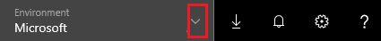

# Working with environments and Microsoft PowerApps
With PowerApps, you can work in different environments and easily switch among them. For an overview of environments, see [Environments overview](../../administrator/environments-overview.md), which explains in detail why you use environments and how you can create and manage them. The scope of this article will cover the following topics on environment:

* how to switch the environment on powerapps.com
* how to create an app in the right environment
* how to view an app in the right environment

## Switch the environment
When you sign up and first sign in to powerapps.com, you will likely land in a default environment. You can verify this by looking at the upper-right corner of the page.

The *Default environment* is accessible to everyone. You can start creating apps in this environment and share your apps with other users. You may also have access to other environments, such as those you [create yourself](../../administrator/environments-administration.md) or those created by others but you have access to. You can switch environments by clicking the environment dropdown in the upper-right corner and selecting a different environment. This example shows switching from *Default environment* to *Environment 1*.

Once you switch to a different environment (such as Environment 1), you will see all the apps you created or have access to in this new environment.

## Create apps in the right environment
You can create apps in an environment that you create or for which you've been given access. Creating your own environment, however, requires a [specific plan](../../administrator/pricing-billing-skus.md). Before you create an app, always **make sure you select the environment you want to app to be in**. Otherwise, you will have to deal with moving apps between environments.

To create an app in the right environment, do either of the following:

- If PowerApps Studio isn't open, [sign in](http://web.powerapps.com?utm_source=padocs&utm_medium=linkinadoc&utm_campaign=referralsfromdoc), select the environment you would like to create your app in, select **Apps** near the left edge, and then select **Create an app**.

- If PowerApps Studio is open, select the environment again at the top right corner.

5. On the **Account** page, select **Change** next to the name of the current environment.

6. Select the environment you want to create your app in.

    

7. Select **New** to start creating an app. Your app now will reside in the environment you selected in step 6.

    

## View apps in the right environment
Whether you are working in [powerapps.com](http://web.powerapps.com?utm_source=padocs&utm_medium=linkinadoc&utm_campaign=referralsfromdoc) or PowerApps Studio, the list of apps, connections, etc. that you see is always filtered based on the environment that's selected in the dropdown. If you don't see the apps you are looking for, always confirm whether the right environment is selected.

For more information about environments, see [this overview](../../administrator/environments-overview.md).
