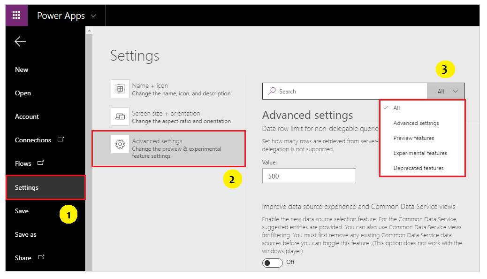

# Understand experimental, preview, and retired features in Power Apps

With every release, we make changes and add features to make Power Apps the best tool to fit your needs. We move the product forward.  

We take backward compatibility very seriously. However, with any change or improvement, we might introduce an unintended side effect, and your app might not work exactly the way it did before.

To help balance improvement against impact on existing apps, we take larger features through a progression of stages. This article describes this process and how you can control your exposure to features that are under development.

In general, when creating a _new_ app:
- **Preview switches are On.**  These features are ready for wide circulation, have been documented, and are fully supported.  One day, the option to turn off these features will be removed and they will become a permanent part of the product.
- **Experimental switches are Off.**  These features should only be used with caution, they can be changed or removed at any time.  If you don't know what the switch is referring to or its possible impact, you likely should not turn it on.
- **Retired switches are Off.**  These features are ready to be removed.  Documentation will explain the alternatives to using these features.

As _existing_ apps go through their lifecycle, you may want to adjust these switches to take advantage of new features or to remove a dependency on a feature that will be retired.  Turning **Preview** switches On and **Retired** switches Off brings existing apps into alignment with new apps and the future of the product.

## Feature roll-out stages

Features move through three stages on their way to becoming official parts of the product:

1. **Experimental**:  This feature is a work in progress. Don't depend on it yet; it may go through significant changes.
1. **Preview**:  This feature is almost done and is stable. Start to migrate existing apps to it now.
1. **Shipped**:  This feature is done. All apps have this feature enabled, and you can't turn it off.

At each stage, the number of people who use the feature increases, helping us to validate that the feature is what you need and that we're not introducing unintended side effects.

**Your feedback is critical to this process.**  Please post your feedback in the [Power Apps Community Forum](https://powerusers.microsoft.com/t5/PowerApps-Community/ct-p/PowerApps1).

How long does a feature remain in each stage? This varies from feature to feature. We look at many factors, including the number of apps that use the feature, the number of issues reported, and how urgently the feature is needed. Features can remain in a stage for weeks to many months.  We may also skip some stages if we don't believe it would be helpful.

This table may help you decide when you should jump in: 

| Stage | When should I use it? | Can I use it with confidence?  Is it enabled by default for new apps? | 
|----|----|----|
| **Experimental** | If you're an early adopter, see something useful to you, and would like to help test the feature. | No. Experimental features can radically change or completely disappear at any time. For this reason the feature is not enabled by default and you must explicitly opt in to use it. |  
| **Preview** | New apps automatically include this feature but it can still be turned off.  Start enabling and testing in existing apps because this feature will be eventually turned on for them too.  |Yes.  This feature is on track to become a permanent part of the product. You may want to turn it off if you run into a problem.  Please report issues; this is the main reason the feature is in Preview.  | 
| **Preview (Final&nbsp;validation)** | For a few features that would have broad impact, we may take the additional step beyond **Preview** of forcing the feature switch on once for existing apps when they are opened in the Studio.  If you encounter an issue, the feature can still be turned off, and your feedback is critical before we take the next step. | Yes. You can use this feature with confidence, it is very close to becoming permanent. You may want to turn it off if you run into a problem.  Please report any issues encountered. |
| **Shipped** for&nbsp;new&nbsp;apps | All new apps have this feature turned on and it cannot be turned off.  For existing apps where the feature is turned off, the feature will continue to show as a Preview feature until it is turned on.  If turned on and the switch becomes unavailable, you can [restore the app to a previous version](restore-an-app.md) to return to a state before the feature was enabled. | Yes. |
| **Shipped** for&nbsp;all&nbsp;apps | All apps have this feature and it cannot be disabled. | Yes. | 

> [!NOTE]
> Features listed as **Retired** are planned to be replaced, or removed soon. Consider using alternatives, and review the timelines as listed in the feature [details](#controlling-which-features-are-enabled).

## Documentation

Where can you find information about these features?  We treat Preview features as finished features, and you can learn more about them just as you do any other product features: 
- [Power Apps documentation](./getting-started.md). We'll provide the basics on the new feature: the benefits, how to get started, and reference information.
- [Power Apps community forum](https://powerusers.microsoft.com/t5/PowerApps-Community/ct-p/PowerApps1).  Others will explore the new feature along with you. Learn from their experience, and share yours.
- [Power Apps blog](https://powerapps.microsoft.com/blog/).  Often, but not always, a blog post accompanies a new feature.

Experimental features are different.  They are works in progress, and we don't consider them finished. The short description in the **App settings** pane (see below) might be the only information about them. Experimental features don't normally appear in the documentation. The community forum is likely your best source of information.  In some cases, an early blog post describes the feature.  If you aren't finding enough information, ask in the forums, or wait for the feature to move to the Preview stage.

## Controlling which features are enabled

Experimental and preview features are listed in the app's **Settings** > **Upcoming features**.  From within the app, select the **File** menu, select **Settings**, and then select **Upcoming features**. Select **Preview**, **Experimental**, or **Retired** features using the available tabs.

Each feature has a toggle switch.  **Off** means that the feature is disabled.  Having all switches turned off is the baseline and safest way to run your app.

In some cases, you might need to close and reopen the app after you change a setting.  The feature description should indicate when you must perform this step.

At the top of the **Advanced settings** panel, you can find settings for fully shipped features that aren't preview or experimental and that you can completely depend on. 

These settings are specific to each app, so changing a toggle switch affects only the app that's currently open. If you create an app, these switches revert to their default settings for that app.

## Feature retirement

Sometimes a feature needs to be retired, sometimes referred to as being deprecated.  Often this occurs when there is a new, better way to accomplish a task.  Unpopular features are also pruned too as all features require some overhead to keep up with product changes around them.

Feature retirement also goes through stages.  Features are unique and not every stage will be used by all features.

| Stage | When should I use it? | Can I use it with confidence?  Is it enabled by default for new apps? | 
|----|----|----|
| **Retired** | Existing apps may continue using this feature for a limited time. You can still turn on the feature for new apps.  It is time to evaluate alternatives.  | Yes, you can still use the feature with confidence. But it will be going away soon. For this reason you must explicitly opt in to use the feature in new apps and it is not recommended.  |
| **Retired (Final&nbsp;warning)** | For a few features that would have broad impact, we may take the additional step beyond **Retired** of forcing the feature switch off once for existing apps the next time they are opened in the Studio.  If there is a issue, the feature can still be turned back on, and your feedback is critical before we take the next step.|  No.  The feature is about to be permanently removed. You must explicitly opt in to use the feature and it is not recommended. |
| **Removed** for&nbsp;new&nbsp;apps | All new apps have this feature turned off and it cannot be enabled.  For existing apps where the feature is turned on, the feature will continue to show as a Retired feature until it is turned off.  If turned off and the feature switch becomes unavailable, you can [restore the app to a previous version](restore-an-app.md) to return to a state before the feature was disabled. | No.  The feature is about to be permanently removed. The feature is no longer available for new apps. |
| **Removed** for&nbsp;all&nbsp;apps | The feature is unavailable for all apps. | No. |  

[!INCLUDE[footer-include](../../includes/footer-banner.md)]
