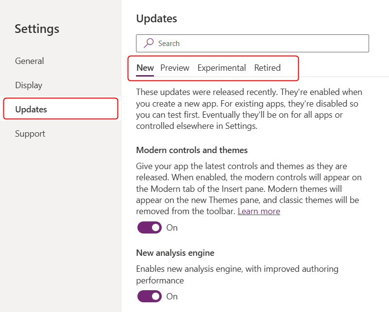

# Understand new, preview, experimental, and retired features in canvas apps

With every release, we make changes and add features to make Power Apps the best tool to fit your needs. We move the product forward. 

At the same time, keeping your apps running smoothly is our top priority. Despite our best efforts, any change or improvement might unintentionally introduce a side effect, and your app might not work exactly the way it did before.

To ensure enhancements don't adversely affect current apps, we take features through a progression of stages. These stages give you a chance to try out the feature and provide us with feedback, and for us to gradually roll out the feature while watching for any problems. This article describes this process and how you can control your exposure to features that are under development.

At each stage, the number of people who use the feature increases, helping us to validate that the feature is what you need and that we're not introducing an unintended side effect.

**Your feedback is critical throughout this process.** Post your feedback in the [Power Apps Community Forum](https://powerusers.microsoft.com/t5/PowerApps-Community/ct-p/PowerApps1).

## Feature roll out stages

In short, the stages are:
- **New:** These features are new and generally available (GA), fully supported, and documented. Generally these features are on by default for new apps, but might take time to deploy everywhere. Enable for existing apps on your own schedule.
- **Preview:** These features are almost done and will be **New** soon. But at this stage there still might be some changes made. This stage is the last opportunity for feedback. These features are generally turned off by default and are documented. These features aren't GA, shouldn't be used in production, and are covered by the [Preview terms of service](https://go.microsoft.com/fwlink/?linkid=2189520).
- **Experimental:** An early stage "Preview," these features truly are experiments and might never reach GA. We're assessing the value proposition and design of the feature, and the feature might radically change or be removed completely at any time. These features are off by default and aren't generally documented. These features aren't GA, shouldn't be used in production, and are covered by the [Preview terms of service](https://go.microsoft.com/fwlink/?linkid=2189520).
- **Retired:** These features are GA features but are on their way to being removed from the product. They're still fully supported and document, but we either have a new, better way to do the same thing or usage is low. Disable for existing apps on your own schedule. Generally, these features are off by default.

How long does a feature remain in each stage? It varies from feature to feature. We look at many factors, including the number of apps that use the feature, the number of issues reported, and how urgently the feature is needed. Features can remain in a stage for weeks to many months. We might also skip some stages if we don't believe it would be helpful.

## New

Enable **New** features for all your new apps, and enable for existing apps when you're ready.

**New** features are recently added to the product. They're generally available and fully supported. You can use **New** features with confidence.

In general, **New** features are enabled by default when you create a new app. When a **New** feature is first introduced, it might not be enabled in all regions initially, allowing us time to deploy and gather information on usage and any problems. If you run into a problem with a feature, the switch can be used as a workaround to disable it until we can correct the problem.

Eventually, **New** features are no longer "new". If there's no breaking change, the switch is removed and the feature is enabled for all apps. If there's a breaking change, the old behavior is available in the app settings under **Retired** as a disable switch.

**New** features are fully documented in the [Power Apps documentation](./getting-started.md).

## Preview

Enable **Preview** features if you want to test upcoming functionalities before the feature is enabled for everyone.

**Preview** features are well on their way to being a valued part of the product. But, they aren't generally available yet and aren't fully supported, instead offered under the [preview terms of service](https://aka.ms/pa-preview-terms). **Preview** features shouldn't be used in production. 

In general, **Preview** features aren't enabled by default when creating a new app. You should only enable a **Preview** feature for testing purposes and to provide feedback before the feature becomes generally available. This stage is the last stop for feedback before the feature is finalized. 

Generally, **Preview** features graduate to **New**.

**Preview** features are documented in the [Power Apps documentation](./getting-started.md). Use the [Power Apps Experimental Features forum](https://aka.ms/pa-early-feedback) or [Power Apps blog](https://powerapps.microsoft.com/blog/) for more information. Use the "Experimental" forum as many **Preview** features start out as **Experimental** features and there may already be information or comments there that can be helpful to you.

Provide feedback on **Preview** features in the [Power Apps Experimental Features forum](https://aka.ms/pa-early-feedback). Again, "Experimental" also covers **Preview** features in the forum.

## Experimental

Enable **Experimental** features if you're an early adopter, see something useful to you, and would like to help test the feature. 

**Experimental** features are in an early-stage preview that is true to the name "experiment". This feature might significantly change or be removed at any time. These features are far from being generally available, aren't fully supported, and are offered under the [preview terms of service](https://aka.ms/pa-preview-terms). **Experimental** features shouldn't be used in production. 

**Experimental** features are never enabled by default when creating a new app. You should only enable an **Experimental** feature for testing purposes and to provide feedback. If you don't know what the feature is referring to or its possible impact, you likely shouldn't turn it on. 

Eventually **Experimental** features either graduate to **Preview** or are removed from the product.

**Experimental** features typically aren't documented. The short description in the **App settings** pane might be the only information about them. Use the [Power Apps Experimental Features forum](https://aka.ms/pa-early-feedback) or [Power Apps blog](https://powerapps.microsoft.com/blog/) for more information.

Provide feedback on **Experimental** features in the [Power Apps Experimental Features forum](https://aka.ms/pa-early-feedback). 

## Retired

Enable **Retired** features only if you need an old behavior. When appropriate, disable these features in your existing apps.

**Retired** features, while fully supported and widely available, might be phased out in favor of newer, improved methods or due to low usage. Maintaining every feature alongside ongoing product updates incurs overhead.

When a feature moves from **New** to **Retired**, the meaning of its switch is often inverted. For example, where "Delayed load" was on by default as a **New** feature, the **Retired** version becomes "Disable delayed load" and is off by default.

**Retired** features are generally not enabled when creating a new app. They're provided for existing apps that still depend on the old behavior.

**Retired** features will eventually be removed from the product after enough time has passed and usage is low. Removals are well communicated ahead of time for breaking changes.

**Retired** features are fully documented in the [Important changes (deprecations) coming in Power Platform](/power-platform/important-changes-coming).

## Defaults

In general, when creating a _new_ app:

- **New switches are On.** These features are generally available and fully supported. There might be a small delay for the switch to be turned on by default as we continue rolling out. 
- **Preview switches are Off, but can be enabled for testing and feedback.** Enable the features that are interesting to you before they're enabled for all apps, for testing and feedback. Preview features aren't ready for production.
- **Experimental switches are Off.** These features are for early adopters and should only be used with caution; they can be changed or removed at any time. Experimental features aren't ready for production.
- **Retired switches are Off.** These features are generally available and fully supported, but will eventually be removed from the product. Avoid using these features.

As _existing_ apps go through their lifecycle, you might want to take advantage of new features or to remove dependencies on retired features by adjusting these switches in your app. Turning **New** switches On and **Retired** switches Off brings existing apps into alignment with new apps and the future of the product.

## Controlling which features are enabled

Experimental and preview features are listed in the app's **Settings** > **Updates**. From within the app, select **Settings**, and then select **Updates**. Select **New**, **Preview**, **Experimental**, or **Retired** features using the available tabs.

Each feature has a toggle switch. **Off** generally means that the feature is disabled, except in the **Retired** section where the title of the feature indicates if the switch disables the feature.

In some cases, you might need to close and reopen the app after you change a setting. The feature description should indicate when you must perform this step.

At the top of the **Settings** panel, **General** settings provide control over fully shipped, generally available features that don't belong in any of these feature categories and are a stable part of the product. We limit the number of these settings as much as possible to keep things simple and to reduce the size of our testing matrix.

These settings are specific to each app, so changing a toggle switch affects only the app that's currently open. If you create an app, these switches revert to their default settings for that app.

## Preview and Experimental features without a switch

Sometimes a tag is added in the product to indicate that a particular feature is Preview or Experimental without having a switch in **Updates**. For example, a control in an **Insert** menu might have the name **Grid (Preview)** or the entry point for the [Monitor](../monitor-overview.md) was once **Monitor (Preview)**. In these cases, the feature can't be used without first seeing this tag.

Like the **Preview** and **Experimental** feature categories previously described, these features shouldn't be used in production and are offered under the [preview terms of service](https://aka.ms/pa-preview-terms). 

[!INCLUDE[footer-include](../../includes/footer-banner.md)]
