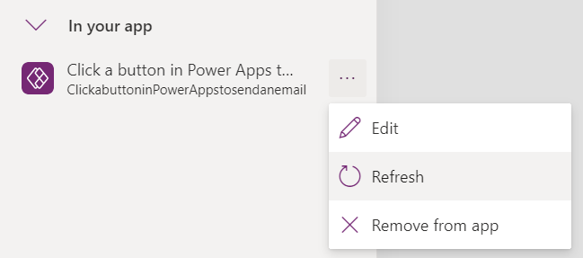

---
title: Using Power Automate pane (preview)
description: Learn about how to use Power Automate pane to work with flows in Power Apps
author: TashasEv
ms.service: powerapps
ms.topic: conceptual
ms.custom: canvas
ms.reviewer: tapanm
ms.date: 01/21/2022
ms.subservice: canvas-maker
ms.author: tashas
search.audienceType: 
  - maker
search.app: 
  - PowerApps
contributors:
  - tapanm-msft
  - TashasEv
---

# Using Power Automate pane (preview)

[This article is pre-release documentation and is subject to change.]

> [!IMPORTANT]
> - This feature is being rolled out and depending on your region, it may not be available for your tenant yet.
> - This is a preview feature.
> - Preview features aren’t meant for production use and may have restricted functionality. These features are available before an official release so that customers can get early access and provide feedback.

With this feature, you can create new flows, or add existing flows, and even edit existing flows using Power Automate pane within Power Apps Studio. You don't have to browse to Power Automate to work with flows and return to Power Apps Studio any longer.

> [!NOTE]
> - This feature must be enabled on a per-app basis.
> - Flows that you create or edit, and save from inside Power Apps Studio are also visible and available using Power Automate interface. Saving the canvas app that you use to work with such flows only saves the app, and the app integration with the flow. The saved changes to the flows will still remain even if you close the canvas app without saving.

## Enable Power Automate pane

Power Automate pane needs to be enabled manually through the feature switch. To enable the pane:

1. Open a [new](data-platform-create-app.md) or [existing](edit-app.md) an app in Power Apps Studio.

1. Select **Settings** at the top.

1. Select **Upcoming Features**.

1. Under the **Preview** tab, select **Enable Power Automate pane** to turn on this feature. You may be prompted to close and reopen your canvas app to see the change.

   :::image type="content" source="media/working-with-flows/power-automate-pane-feature.png" alt-text="A screenshot of the Upcoming Features dialog box showing the Enable Power Automate feature toggle.":::

    Save the app and relaunch Power Apps Studio. The Power Automate option is now added to the left-pane.

   :::image type="content" source="media/working-with-flows/power-automate-button.png" alt-text="A screenshot highlighting the Power Automate option in the left pane":::

## Create a new flow

To start with flows inside Power Apps Studio, select **Create new flow** in Power Automate pane.

   :::image type="content" source="media/working-with-flows/create-new-flow.png" alt-text="A screenshot showing Create your flow screen having several options to choose a flow template from.":::

This action opens the **Create your flow** modal dialog within Power Apps Studio. You can choose to create the flow from available templates, or start with a blank template.

### Start with a template

Power Automate provides several flow templates that you can choose from by default. This section explains how to create a flow using such available templates from within Power Apps Studio.

1. From the list of available templates, select a template of your choice. For this example, we'll use **Click a button in Power Apps to send an email**.

   :::image type="content" source="media/working-with-flows/selected-flow-template.png" alt-text="A screenshot showing Click a button in Power Apps to send an email template.":::

1. The next step shows the connections required to create a flow based on the  selected template. More information: [Connectors overview](connections-list.md)

   :::image type="content" source="media/working-with-flows/connections.png" alt-text="A screenshot showing connections required by the flow.":::

1. (Optional) If you want, you can use **Edit in advanced mode** to update the connection, and customize the flow template. When done, select **Save** to save the flow. Skip the next step since this completes your flow creation process.

1. Select **Next** > **Create** to create the flow.

    The flow now appears in the list of flows inside the Power Automate pane, under the **In your app** section.

    :::image type="content" source="media/working-with-flows/flow-in-your-app.png" alt-text="A screenshot showing the flow added to your app.":::

    > [!TIP]
    > For more information about creating cloud flows from templates, see [Create a cloud flow from a template](/power-automate/get-started-logic-template).

### Create from blank

Instead of using the available templates, you can also create a flow from scratch, and customize the steps as per your requirement.

1. Select **Create from blank**.

1. Add and customize the flow with steps and actions, as showin in the below example.

    :::image type="content" source="media/working-with-flows/customize-blank-flow.png" alt-text="A screenshot showing example workflow.":::

1. When done, select **Save** from top-right corner of the screen.

    > [!TIP]
    > For more information about customizing and configuring cloud flows, see **How-to** articles starting from [Add multiple actions and advanced options to a cloud flow](/power-automate/multi-step-logic-flow).

## Add an existing flow

You may have access to the existing flows in the environment where you're creating your app. To add and use these flows in your app, select **Add flow**, and then choose the flow from the **Add a flow from this environment** section.

:::image type="content" source="media/working-with-flows/add-existing-flow.png" alt-text="A screenshot showing the option to add existing flows from the current environment.":::

> [!TIP]
> You can hover over the flow to see more details about the flow before adding to your app.

You must meet the following requirements to be able to add an existing flow to a canvas app:

- You must have access to the flow.
- If the canvas app is part of a solution, you'll only see the flows that are part of the same solution.
- Flows must have a Power Apps trigger.

After added, the flow will appear under **In your app** section inside the Power Automate pane.

## Edit an existing flow

You can now edit flows added to your app without leaving Power Apps Studio.

**To edit a flow:**

1. Under the **In your app** section of the Power Automate pane, select **..** (ellipsis) to the right of a flow.

1. Select **Edit**.

    :::image type="content" source="media/working-with-flows/edit-flow.png" alt-text="A screenshot showing the option to edit an existing flow.":::

    Flow opens in the editor for you to make changes.

    :::image type="content" source="media/working-with-flows/edit-flow-editor.png" alt-text="A screenshot showing the flow open in editor for customization.":::

2.  The flow designer opens, allowing you to edit and save your flow. &lt;&lt;TODO: Add screen capture&gt;&gt;

3.  If you attempt to close the designer without saving, you'll be prompted that you may lose unsaved changes if you continue &lt;&lt;TODO: Add screen capture&gt;&gt;

4.  Save the changes, and close the designer

5.  The flow refreshes to include the new changes

## Refresh a Flow

If you make changes to your flow in Power Automate instead of Power Apps while the app is open, you will need to refresh your flow to get the changes. To refresh the flow:

1.  Under the "In your app" section of the Power Automate pane, click the ellipsis to the right of a flow to open the context menu. Select "Refresh"  
    

2.  A loading spinner appears and the flow is refreshed

## Remove a Flow

To remove a flow from your app:

1.  Under the "In your app" section of the Power Automate pane, click the ellipsis to the right of a flow to open the context menu. Select "Remove from app"  
    

2.  The flow is removed from the app. The flow is not deleted from the environment; however, so you can re-add the flow to your app or another app as required.

### See also

[Add and configure controls](add-configure-controls.md)

[!INCLUDE[footer-include](../../includes/footer-banner.md)]

 

