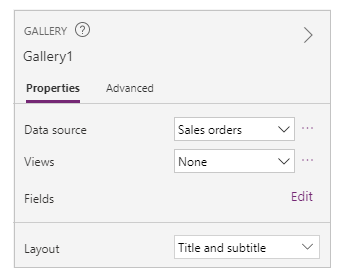

# Understand data-form layout for canvas apps

Easily create an attractive and efficient form when you build a canvas app in Power Apps. For example, consider this basic form for recording sales orders:

In this tutorial, we'll walk through the steps to create this form. We'll also look at some advanced topics, such as dynamic sizing of fields to fill available space.

## Before you start

If you're new to Power Apps (or have only generated apps automatically), you'll want to [build an app from scratch](get-started-create-from-blank.md) before you dive into this article. By building an app from scratch, you'll become familiar with required concepts, such as adding data sources and controls, that are mentioned but not explained in this article.

This article is written as though you have a data source that's named **Sales order** and that contains the fields in the previous graphic. If you have a Power Apps per user, per app, or trial license and system administrator or system customizer permissions, you can [create a table](../data-platform/data-platform-create-entity.md) in Microsoft Dataverse and add similar fields.

## Add a gallery

1. Create a tablet app from scratch, and add your data source.

    Everything discussed in this article also applies to phone layouts, but phone apps often have only one vertical column.
    
2. Add a vertical **Gallery** control, and set its **Items** property to **'Sales order'**.
   
    (optional) To match the examples in this tutorial, change the gallery's **Layout** to show only **Title and subtitle**.
   
    
3. In the gallery, click or tap **SO004**.
   
    
   
    This record will appear in the form that you build by following steps later in this article.

## Add a title bar
1. Add a blank screen where you'll put the form.
   
    Outside of this tutorial, you can put the **Gallery** and **[Edit form](controls/control-form-detail.md)** controls on the same screen, but you'll have more room to work with if you put them on separate screens.
2. At the top of the new screen, add a **[Label](controls/control-text-box.md)** control, and set its **Text** property to this expression:
    **"Sales Order " & Gallery1.Selected.SalesOrderId**
   
    The label shows the sales-order number of the record that you selected in the gallery.
3. (optional) Format the label as follows:
   
   1. Set its **Align** property to **Center**.
   
   2. Set its **Size** property to **20**.
   
   3. Set its **Fill** property to **Navy**.
   
   4. Set its **Color** property to **White**.
   
   5. Set its **Width** property to **Parent.Width**.
   
   6. Set its **X** and **Y** properties to **0**.
      
      

## Add a form
1. Add an **Edit form** control, and then move and resize it to fill the screen under the label.
   
    In the next step, you'll connect the form control to the **Sales order** data source by using the right-hand pane, not the formula bar. If you use the formula bar, the form won't show any fields by default. You can always show any fields that you want by selecting one or more check boxes in the right-hand pane.
2. In the right-hand pane, click or tap the down arrow next to **No data source selected**, and then click or tap **Sales order**.
   
    A default set of fields from the **Sales order** data source will appear in a simple, three-column layout. However, many are blank, and they may take a few moments to settle into their final positions.  
3. Set the form's **Item** property to **Gallery1.Selected**.
   
    The form shows the record that you selected in the gallery, but the default set of fields might not match what you want in your final product.
4. In the right-hand pane, hide each of these fields by clearing its checkbox:
   
   * **Sales order ID**
   * **Account**
   * **Sales person**
   * **Account contact**
5. Move the **Order status** field by dragging it to the left and then dropping it on the other side of the **Customer purchase order reference** field.
   
    Your screen should resemble this example:
   
    

## Select a data card
Each field displayed has a corresponding data card on the form. This card includes a set of controls for the field title, an input box, a star (which appears if the field is required), and a validation error message.

You can also select cards directly on the form. When a card is selected, a black caption appears above it.

> [!NOTE]
> To delete a card (not just hide it), select it, and then press Delete.

## Arrange cards in columns
By default, forms in tablet apps have three columns, and in phone apps have one. You can specify not only how many columns a form has but also whether all cards should fit within column borders.

In this graphic, the number of columns in the form was changed from three to four with the **Snap to columns** check box selected. The cards in the form were arranged automatically to fit the new layout.

## Resize cards across multiple columns
Depending on the data in each card, you might want some cards to fit in a single column and other cards to span multiple columns. If a card contains more data than you want to show in a single column, you can widen the card by selecting it and then dragging the grab handle on the left or right border of its selection box. As you drag the handle, the card will "snap" to column boundaries.

To make your design more flexible but keep some structure, you can increase the number of columns to 12. With that change, you can easily configure each card to span the entire form, half of the form, one-third, one-quarter, one-sixth, and so forth. Let's see this in action.

1. In the right-hand pane, set the number of columns in the form to **12**.
   
    
   
    The form doesn't visibly change, but you have more snap points as you drag the left or right grab handle.
2. Increase the width of the **Order date** card by dragging the grab handle on the right one snap point to the right.
   
    The card spans four of the form's 12 columns (or 1/3 of the form), instead of only three of the form's 12 columns (or 1/4 of the form). Whenever you increase a card's width by one snap point, the card spans an additional 1/12 of the form.
   
    
3. Repeat the previous step with the **Order status** and **Customer purchase order reference** cards.
   
    

4. Resize the **Name** and **Description** cards to take up six columns (or 1/2) of the form.

5. Make the first two lines of the delivery address stretch entirely across the form:

All done. We have our desired form, mixing rows with different numbers of columns:

## Manipulate controls in a card
The delivery address includes several pieces of information that we want to visually group together for the user. Each field will remain in its own data card, but we can manipulate the controls within the card to make them fit better together.

1. Select the **First line of Delivery address** card, select the label within that card, and then delete the first three words from the text.
   
    
2. Select the **Second line of Delivery address** card, select the label within that card, and then delete all of the text in it.
   
    It may be tempting to remove the label control and, in many cases, that will work fine. But formulas might depend on that control being present. The safer approach is to remove the text or to set the **Visible** property of the control to **false**.
   
    
3. In the same card, move the text input box over the label to reduce the space between the first and second lines of the address.
   
    The height of the card shrinks when its contents take up less space.
   
    

Now let's turn our attention to the third line of the address. Similar to what we just did, let's shorten the text of each label for these cards and arrange the Text input box to be to the right of each label. Here are the steps for the **State** card:

| Step | Description | Result |
| --- | --- | --- |
| 1 |Select the **State** card so that grab handles appear around it. | |
| 2 |Select the label within this card so that grab handles appear around it. | |
| 3 |Place the cursor to the right of the text, and then delete the portion that we don't need. | |
| 4 |Using the grab handles on the sides, size the label control to fit the new text size. | |
| 5 |Select the text input control within this card. | |
| 6 |Using the grab handles on the sides, size the text input control to the size that you want. | |
| 7 |Drag up the text input box and to the right of the label control, and then drop the text input box. | |
| Our modifications to the **State** card are now complete. | | |

The result for the complete third address line:

Many of the cards start out with dynamic formulas for their properties. For example, the Text input control that we resized and moved above had a **Width** property based on the width of its parent. When you move or resize a control, these dynamic formulas are replaced with static values. If you want, you can restore the dynamic formulas by using the formula bar.

## Turning off Snap to columns
Sometimes you'll want finer control than the standard 12 columns can provide. For these cases, you can turn off **Snap to columns** and then position cards manually. The form will continue snapping to 12 columns, but you can also hold down the Alt or Ctrl+Shift keys after starting a resize or reposition to override the snap points.  For more information, see [alternate behavior keyboard shortcuts](keyboard-shortcuts.md#alternate-behavior). 

In our example, the four components that make up the third line of the address all have exactly the same width. But this may not be the best layout, as city names are longer than state abbreviations, and the Text input box for countries/regions is short because of the length of its label.  To optimize this space, turn off **Snap to columns** in the right-hand pane and then hold down the Alt or Ctrl+Shift keys after starting to size and position these cards.

After careful positioning, the result has appropriate sizes for each field and even spacing horizontally between fields:

In summary, what are the differences when **Snap to columns** is on versus off?

| Behavior | Snap to columns On | Snap to columns Off |
| --- | --- | --- |
| Resize snaps to |Number of columns you select: 1, 2, 3, 4, 6, or 12 |12 columns |
| Resize snap can be overridden |No |Yes, with Alt or Ctrl+Shift keys after starting the resize |
| Cards automatically relayout between rows (more on this later) |Yes |No |

## Set width and height
As with everything in Power Apps, the form's layout is governed by properties on the card controls. As already described, you can change the values of these properties by dragging controls to different locations or dragging grab handles to resize controls. But you'll discover situations in which you'll want to understand and manipulate these properties more precisely, especially when making your forms dynamic with formulas.

### Basic Layout: X, Y, and Width
The **X** and **Y** properties control the position of cards. When we work with controls on the raw canvas, these properties provide an absolute position. In a form, these properties have a different meaning:

* **X**: Order within a row.
* **Y**: Row number.

Similar to controls on the canvas, the **Width** property specifies the minimum width of the card (more on the minimum aspect in a moment).

Let's take a look at the **X**, **Y**, and **Width** properties of the cards in our form:

### Overflowing rows
What happens if the cards on a row are too wide to fit on that row? Normally you don't need to worry about this possibility. With **Snap to columns** on, these three properties will automatically be adjusted so that everything fits nicely within rows without overflowing.

But with **Snap to columns** turned off or a formula-based **Width** on one or more of your cards, overflowing a row can happen. In this case, the cards will automatically wrap so that, effectively, another row is created. For example, let's manually change the **Width** property of our **Customer purchase order reference** card (first row, third item) to **500**:

The three cards on the top row no longer fit horizontally, and another row has been created to wrap the overflow. The **Y** coordinate for all these cards is still the same at 0, and the **Name** and **Description** cards still have a **Y** of 1. Cards that have different **Y** values aren't merged across rows.

You can use this behavior to create a fully dynamic layout, where cards are placed based on a Z-order, filling across as much as possible before moving to the next row. To achieve this effect, give all the cards the same **Y** value, and use **X** for the order of the cards.

### Filling spaces: WidthFit
The overflow in the last example created a space after the **Order status** card, which was the second card in the first row. We could manually adjust the **Width** properties of the two remaining cards to fill this space, but this approach is tedious.

As an alternative, use the **WidthFit** property. If this property is set to **true** for one or more cards in a row, any remaining space on the row will be evenly divided between them. This behavior is why we said earlier that the **Width** property of a card is a *minimum*, and what is seen can be wider. This property will never cause a card to shrink, only expand.

If we set **WidthFit** to **true** on the **Order status** card, it fills the available space, while the first card remains unchanged:

If we also set **WidthFit** to **true** on the **Order date** card, both cards will evenly split the available space:

Grab handles on these cards take into account the extra width provided by **WidthFit**, not the minimum width provided by the **Width** property. It can be confusing to manipulate the **Width** property while **WidthFit** is turned on;     you may want to turn it off, make changes to **Width**, and then turn it back on.

When might **WidthFit** be useful? If you have a field that is used  only in certain situations, you can set its **Visible** property to **false**, and the other cards on the row will automatically fill the space around it. You might want to use a formula that shows a field only when another field has a particular value.

Here, we'll set the **Visible** property of the **Order status** field to a static **false**:

With the second card effectively removed, the third card can now return to the same row as the first card. The first card still has **WidthFit** set to **true**, so it alone expands to fill the available space.

Because **Order status** is invisible, you can't select it as easily on the canvas. However, you can select any control, visible or not, in the hierarchical list of controls on the left side of the screen.

### Height
The **Height** property governs the height of each card. Cards have the equivalent of **WidthFit** for **Height**, and it's always set to **true**. Imagine that a **HeightFit** property exists, but don't look for it in the product because such a property isn't yet exposed.

You can't turn off this behavior, so changing the heights of cards can be challenging. All cards within a row appear to be the same height as the tallest card. You might look at a row like this:

Which card is making the row tall? In the previous graphic, the **Total amount** card is selected and appears tall, but its **Height** property is set to **80** (same as the height of the first row). To reduce the height of a row, you must reduce the **Height** of the tallest card in that row, and you can't identify the tallest card without reviewing the **Height** property of each card.

### AutoHeight
A card might also be taller than you expect if it contains a control for which the **AutoHeight** property is set to **true**. For example, many cards contain a label that displays an error message if the field's value causes a validation problem.

Without any text to display (no error), the label collapses to zero height. If you didn't know any better, you wouldn't know it was there, and that's as it should be:

On the left side of the screen, the list of controls shows **ErrorMessage1**, which is our label control. As you update an app, you can select this control to give it some height and show grab handles with which you can position and size the control. The "A" in a blue box indicates that the control has **AutoHeight** set to **true**:

The **Text** property of this control is set to **Parent.Error**, which is used to obtain dynamic error information based on validation rules. For illustration purposes, let's statically set the **Text** property of this control, which will increase its height (and, by extension, the height of the card) to accommodate the length of the text:

Let's make the error message a little longer, and again the control and the card grow to accommodate. The row overall grows in height, keeping vertical alignment between the cards:

[!INCLUDE[footer-include](../../includes/footer-banner.md)]