# Understand canvas-app forms

Add three types of controls to a canvas app so that the user can browse for a record, display details about that record, and edit or create a record:

| Activity | Control | Description |
| --- | --- | --- |
| **Browse for a record** |**[Gallery](controls/control-gallery.md)** control |Filter, sort, search, and scroll through records in a data source, and select a specific record. Display only a few fields from each record to show several records at a time, even on a small screen. |
| **Show details of a record** |**[Display form](controls/control-form-detail.md)** control |For a single record, display many or all fields in that record. |
| **Edit or create a record** |**[Edit form](controls/control-form-detail.md)** control |Update one or more fields in a single record (or create a record starting with default values), and save those changes back to the underlying data source. |

Put each control on a different screen to make them easier to distinguish:

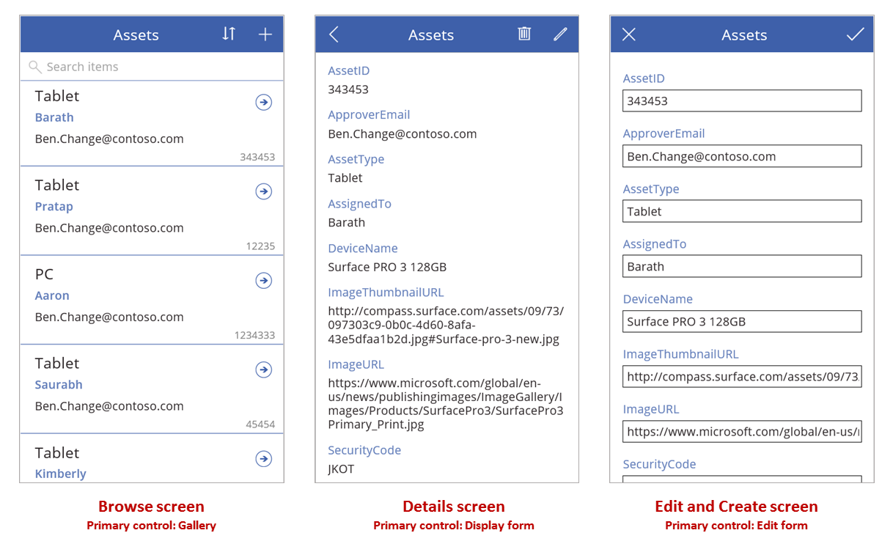

As this topic describes, combine these controls with formulas to create the overall user experience.

## Prerequisites

* [Sign up](../signup-for-powerapps.md) for Power Apps, and then [sign in](https://make.powerapps.com?utm_source=padocs&utm_medium=linkinadoc&utm_campaign=referralsfromdoc) by providing the same credentials that you used to sign up.
* Learn how to [configure a control](add-configure-controls.md) in Power Apps.

## Explore a generated app
Power Apps can automatically generate an app based on a data source that you specify. Each app contains three screens with the controls described earlier and formulas that connect them. Run these apps "out of the box," customize them for your specific goals, or examine how they work so that you can learn useful concepts that apply to your own apps. In the following sections, inspect the screens, controls, and formulas that drive a generated app.  

### Browse screen
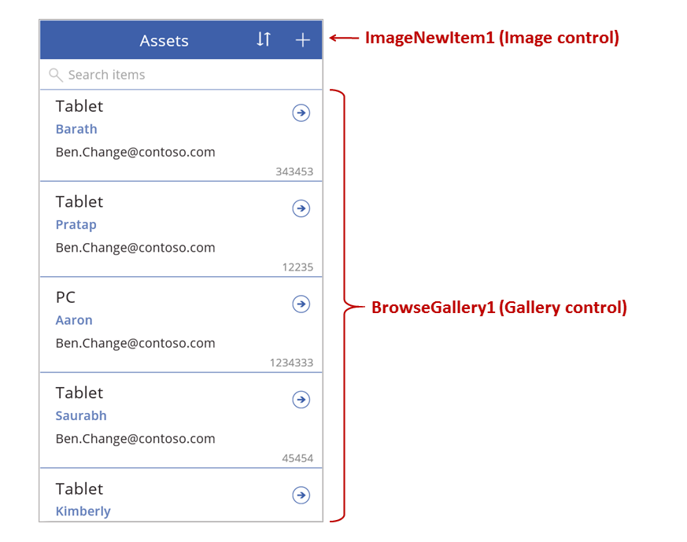

This screen features these key formulas:

| Control | Supported behavior | Formula |
| --- | --- | --- |
| **BrowseGallery1** |Display records from the **Assets** data source. |The **[Items](controls/properties-core.md)** property of the gallery is set to a formula that's based on the **Assets** data source. |
| **ImageNewItem1** |Display the **Edit and Create** screen with each field set to a default value, so that the user can easily create a record. |The **[OnSelect](controls/properties-core.md)** property of the image is set to this formula:<br> **NewForm( EditForm1 );<br>Navigate( EditScreen1, None )** |
| **NextArrow1** (in the gallery) |Display the **Details** screen to view many or all fields of the currently selected record. |The **[OnSelect](controls/properties-core.md)** property of the arrow is set to this formula:<br>**Navigate( DetailScreen1, None )** |

The primary control on this screen, **BrowseGallery1**, covers most of the area of the screen. The user can scroll through the gallery to find a specific record to display more fields or to update.

Set the **[Items](controls/properties-core.md)** property of a gallery to show records from a data source in it. For example, set that property to **Assets** to show records from a data source of that name.

> [!NOTE]
> In a generated app, **[Items](controls/properties-core.md)** is set to a significantly more complicated formula by default so that the user can sort and search for records. You'll learn how to build that formula later in this topic; the simpler version is enough for now.

Instead of finding a record to display or edit, the user can create a record by selecting the "+" symbol above the gallery. Create this effect by adding an **[Image](controls/control-image.md)** control, showing a "+" symbol in it, and setting its **[OnSelect](controls/properties-core.md)** property to this formula:
<br>**NewForm( EditForm1 ); Navigate( EditScreen1, None )**

This formula opens the **Edit and Create** screen, which features an **[Edit form](controls/control-form-detail.md)** control named **EditForm1**. The formula also switches that form into **New** mode, in which the form shows default values from the data source so that the user can easily create a record from scratch.

To examine any control that appears in **BrowseGallery1**, select that control in the first section of that gallery, which serves as a template for all other sections. For example, select the middle **[Label](controls/control-text-box.md)** control on the left edge:

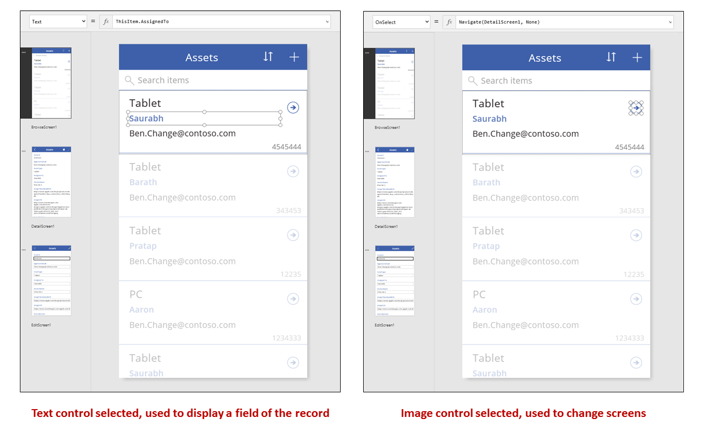

In this example, the control's **[Text](controls/properties-core.md)** property is set to **ThisItem.AssignedTo**, which is a field in the **Assets** data source. The **[Text](controls/properties-core.md)** property of the other three **[Label](controls/control-text-box.md)** controls in the gallery are set to similar formulas, and each control shows a different field in the data source.  

Select the **[Shape](controls/control-shapes-icons.md)** control (the arrow), and confirm that its **[OnSelect](controls/properties-core.md)** property is set to this formula:
<br>**Navigate( DetailScreen1, None )**

If the user finds a record in **BrowseGallery1**, the user can select the arrow for that record to show more information about it in **DetailScreen1**. By selecting an arrow, the user changes the value of the **Selected** property of **BrowseGallery1**. In this app, that property determines which record appears in not only **DetailScreen1** but also, if the user decides to update the record, the **Edit and Create** screen.

### Detail screen
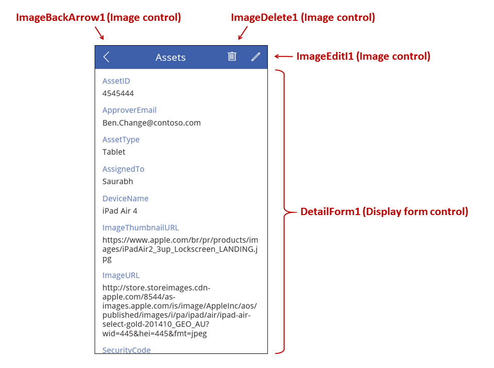

This screen features these key formulas:

| Control | Supported behavior | Formula |
| --- | --- | --- |
| **DetailForm1** |Displays a record in the **Assets** data source |Set the **[DataSource](controls/control-form-detail.md)** property to **Assets**. |
| **DetailForm1** |Determines which record to display. In a generated app, displays the record that the user selected in the gallery. |Set the **[Item](controls/control-form-detail.md)** property of this control to this value:<br>**BrowseGallery1.Selected** |
| **[Card](controls/control-card.md)** controls |In a **[Display form](controls/control-form-detail.md)** control, displays a single field in a record. |Set the **[DataField](controls/control-card.md)** property to the name of a field, enclosed in double quotation marks (for example, **"Name"**). |
| **ImageBackArrow1** |When the user selects this control, opens **BrowseScreen1**. |Set the **[OnSelect](controls/properties-core.md)** property to this formula:<br>**Back()** |
| **ImageDelete1** |When the user selects this control, deletes a record. |Set the **[OnSelect](controls/properties-core.md)** property to this formula:<br>**Remove( Assets, BrowseGallery1.Selected )** |
| **ImageEdit1** |When the user selects this control, opens the **Edit and Create** screen to the current record. |Set the **[OnSelect](controls/properties-core.md)** property to this formula:<br>**Navigate( EditScreen1, None )** |

At the top of the screen, three images sit outside of **DetailForm1** and act as buttons, orchestrating between the three screens of the app.

**DetailForm1** dominates this screen and displays the record that the user selected in the gallery (because the form's **[Item](controls/control-form-detail.md)** property is set to **BrowseGallery1.Selected**). The **[DataSource](controls/control-form-detail.md)** property of the form also provides metadata about the data source, such as a user-friendly display name for each field.

**DetailForm1** contains several **[Card](controls/control-card.md)** controls. You can select either the **[Card](controls/control-card.md)** control itself or the control that it contains to discover additional information.

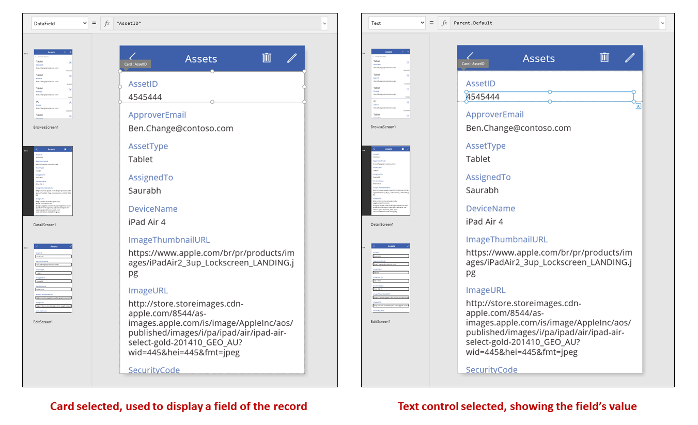

The **[DataField](controls/control-card.md)** property of a **[Card](controls/control-card.md)** control determines which field the card displays. In this case, that property is set to **AssetID**. The card contains a **[Label](controls/control-text-box.md)** control for which the **[Text](controls/properties-core.md)** property is set to **Parent.Default**. This control shows the **Default** value for the card, which is set through the **[DataField](controls/control-card.md)** property.

In a generated app, **[Card](controls/control-card.md)** controls are locked by default. When a card is locked, you can't modify some properties, such as **[DataField](controls/control-card.md)**, and the formula bar is unavailable for those properties. This restriction helps ensure that your customizations don't break the basic functionality of the generated app. However, you can change some properties of a card and its controls in the right-hand pane:


In the right-hand pane, you can select which fields to display and in which kind of control each field displays.

### Edit/Create screen
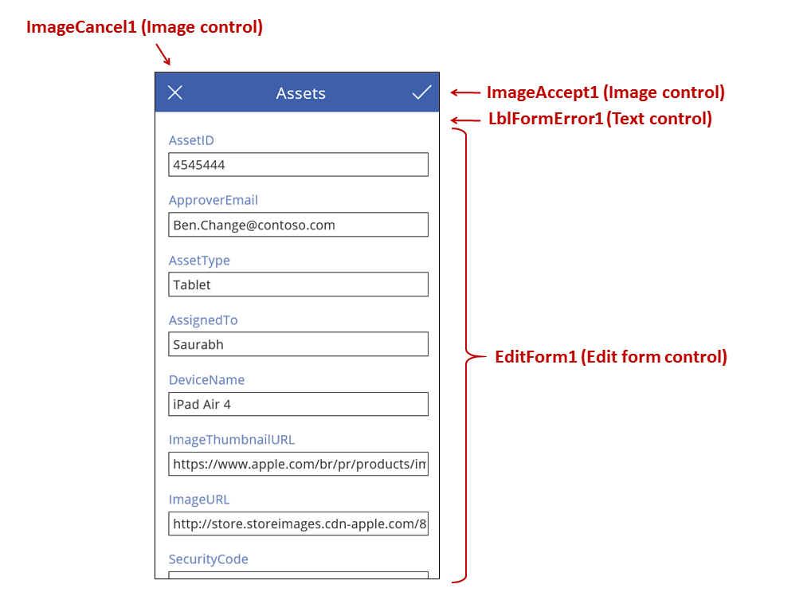

This screen features these key formulas:

| Control | Supported behavior | Formula |
| --- | --- | --- |
| **EditForm1** |Displays a record in the **Assets** data source. |Set the **[DataSource](controls/control-form-detail.md)** property to **Assets**. |
| **EditForm1** |Determines which record to display. In a generated app, displays the record that the user selected in **BrowseScreen1**. |Set the **[Item](controls/control-form-detail.md)** property to this value:<br>**BrowseGallery1.Selected** |
| **[Card](controls/control-card.md)** controls |In a **[Edit form](controls/control-form-detail.md)** control, provides controls so that the user can edit one or more fields in a record. |Set the **[DataField](controls/control-card.md)** property to the name of a field, enclosed in double quotation marks (for example, **"Name"**). |
| **ImageCancel1** |When the user selects this control, discards any changes in progress, and opens the **Details** screen. |Set the **[OnSelect](controls/properties-core.md)** property to this formula:<br>**ResetForm( EditForm1 ); Back()** |
| **ImageAccept1** |When the user selects this control, submits changes to the data source. |Set the **[OnSelect](controls/properties-core.md)** property to this formula:<br>**SubmitForm( EditForm1 )** |
| **EditForm1** |If changes are accepted, returns to the previous screen. |Set the **[OnSuccess](controls/control-form-detail.md)** property to this formula:<br>**Back()** |
| **EditForm1** |If changes aren't accepted, remain on the current screen so that the user can fix any issues and try to submit again. |Leave the **[OnFailure](controls/control-form-detail.md)** property blank. |
| **LblFormError1** |If changes aren't accepted, shows an error message. |Set the **[Text](controls/properties-core.md)** property to this value:<br>**EditForm1.Error** |

As in the **Details** screen, a form control, named **EditForm1**, dominates the **Edit and Create** screen. In addition, the **[Item](controls/control-form-detail.md)** property of **EditForm1** is set to **BrowseGallery1.Selected**, so the form displays the record that the user selected in **BrowseScreen1**. While the **Details** screen shows each field as read-only, the user can update the value of one or more fields by using the controls in **EditForm1**. It also uses the **[DataSource](controls/control-form-detail.md)** property to access metadata about this data source, such as the user-friendly display name for each field and the location where changes should be saved.

If the user selects the "X" icon to cancel an update, the **[ResetForm](functions/function-form.md)** function discards any unsaved changes, and the **[Back](functions/function-navigate.md)** function opens the **Details** screen. Both the **Details** screen and the **Edit and Create** screen show the same record until the user selects a different one on **BrowseScreen1**. The fields in that record remain set to the values that were most recently saved, not any changes that the user made and then abandoned.

If the user changes one or more values in the form and then selects the "checkmark" icon, the **[SubmitForm](functions/function-form.md)** function sends the user's changes to the data source.

* If the changes are successfully saved, the form's **[OnSuccess](controls/control-form-detail.md)** formula runs, and the **Back()** function opens the detail screen to show the updated record.
* If the changes aren't successfully saved, the form's **[OnFailure](controls/control-form-detail.md)** formula runs, but it doesn't change anything because it's *blank*. The **Edit and Create** screen remains open so that the user can either cancel the changes or fix the error. **LblFormError1** shows a user-friendly error message, to which the form's **Error** property is set.

As with a **[Display form](controls/control-form-detail.md)** control, an **[Edit form](controls/control-form-detail.md)** control contains **[Card](controls/control-card.md)** controls, which contain other controls that show different fields in a record:

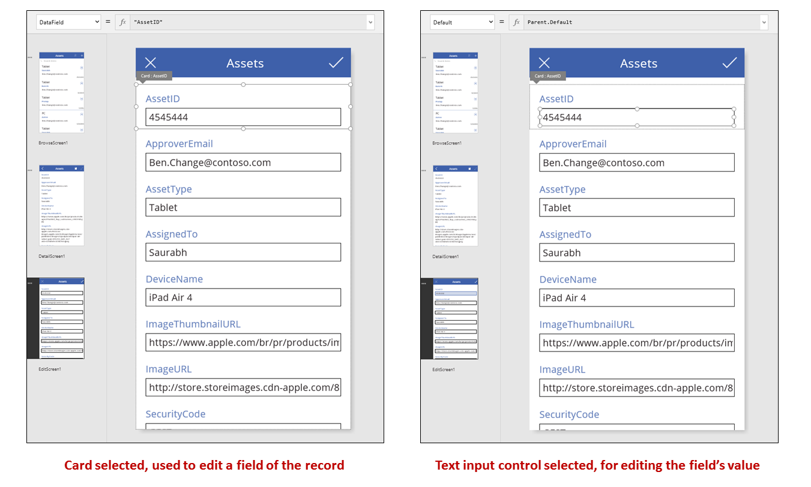

In the previous image, the selected card shows the **AssetID** field and  contains a **[Text input](controls/control-text-input.md)** control so that the user can edit the value of that field. (In contrast, the detail screen shows the same field in a **[Label](controls/control-text-box.md)** control, which is read-only.) The **[Text input](controls/control-text-input.md)** control has a **[Default](controls/properties-core.md)** property, which is set to **Parent.Default**. If the user were creating a record instead of editing one, that control would show an initial value that the user can change for the new record.

In the right-hand pane, you can show or hide each card, rearrange them, or configure them to show fields in different types of controls.


## Build an app from scratch
By understanding how Power Apps generates an app, you can build one yourself that uses the same building blocks and formulas discussed earlier in this topic.

## Identify test data
To get the most from this topic, start with a data source with which you can experiment. It should contain test data that you can read and update without concern.

> [!NOTE]
> If you use a SharePoint list or an Excel table that contains column names with spaces as your data source, Power Apps will replace the spaces with **"\_x0020\_"**. For example, **"Column Name"** in SharePoint or Excel will appear as **"Column_x0020_Name"** in Power Apps when displayed in the data layout or used in a formula.

To follow the rest of this topic exactly, create a SharePoint list named "Ice Cream" that contains this data:

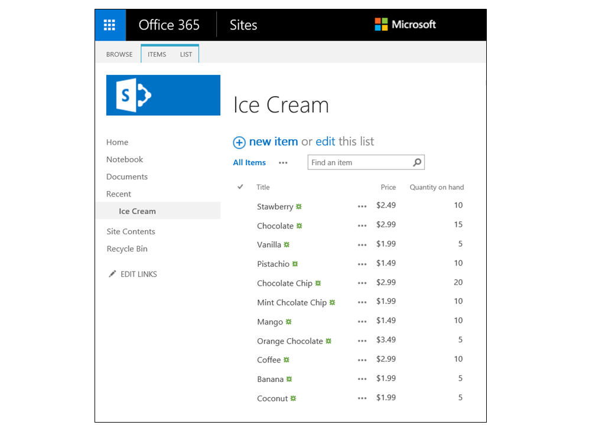

* Create an app from blank, for phones, and [connect it to your data source](add-data-connection.md).
  
    > [!NOTE]
  > Tablet apps are very similar, but you may want a different [screen layout](#screen-design) to make the most of the extra screen space.
  
    The examples in the rest of the topic are based on a data source named **Ice Cream**.

## Browse records
Get a quick piece of information from a record by finding it in a gallery on a browse screen.

1. Add a **Vertical** gallery, and change the layout to **Title** only.
   
    
2. Set the gallery's **[Items](controls/properties-core.md)** property to **Ice Cream**.
3. Set the **[Text](controls/properties-core.md)** property of the first label in the gallery to **ThisItem.Title** if it's set to something else.
   
    The label now shows the value in the **Title** field for each record.
   
    
4. Resize the gallery to fill the screen, and set its **[TemplateSize](controls/control-gallery.md)** property to **60**.
   
    The screen resembles this example, which shows all records in the data source:
   
    

## View details
If the gallery doesn't show the information that you want, select the arrow for a record to open the details screen. A **[Display form](controls/control-form-detail.md)** control on that screen shows more, possibly all, fields for the record that you selected.

The **[Display form](controls/control-form-detail.md)** control uses two properties to display the record:

* **[DataSource](controls/control-form-detail.md)** property.  The name of the data source that holds the record. This property populates the right-hand panel with fields and determines the display name and data type (string, number, date, etc.) of each field.  
* **[Item](controls/control-form-detail.md)** property.  The record to display.  This property is often connected to the **Selected** property of the **[Gallery](controls/control-gallery.md)** control so that the user can select a record in the **[Gallery](controls/control-gallery.md)** control and then drill into that record.

When the **[DataSource](controls/control-form-detail.md)** property is set, you can add and remove fields through the right-hand pane and change how they're displayed.

On this screen, users can't intentionally or accidentally change any values of the record. The **[Display form](controls/control-form-detail.md)** control is a read-only control, so it won't modify a record.

To add a **[Display form](controls/control-form-detail.md)** control:

1. Add a screen, and then add a **[Display form](controls/control-form-detail.md)** control to it
2. Set the **[DataSource](controls/control-form-detail.md)** property of the form control to **'Ice Cream'**.

In the right-hand pane, you can select the fields to display on your screen and which type of card to display for each field. As you make changes in the right-hand pane, the **[DataField](controls/control-card.md)** property on each **[Card](controls/control-card.md)** control is set to the field that the user will interact with. Your screen should resemble this example:


Finally, we need to connect the **[Display form](controls/control-form-detail.md)** control to the **[Gallery](controls/control-gallery.md)** control so that we can look at details for a specific record.  As soon as we complete setting the **[Item](controls/control-form-detail.md)** property, the first record from the gallery will appear in our form.

* Set the **[Item](controls/control-form-detail.md)** property of the **[Display form](controls/control-form-detail.md)** control to **Gallery1.Selected**.
   
    The details for the selected item appear in the form.
   
    

Great!  We now turn to navigation: how a user opens the details screen from the gallery screen and opens the gallery screen from the details screen.

* Add a **[Button](controls/control-button.md)** control to the screen, set its **[Text](controls/properties-core.md)** property to show **[Back](functions/function-navigate.md)**, and set its **[OnSelect](controls/properties-core.md)** property to **Back()**.
   
    This formula returns the user back to the gallery when they finish viewing details.

    

Now, let's return to the **[Gallery](controls/control-gallery.md)** control and add some navigation to our detail screen.

1. Switch to the first screen, which is hosting our **[Gallery](controls/control-gallery.md)** control, and select the arrow in the first item in the gallery.

2. Set the **[OnSelect](controls/properties-core.md)** property of the shape to this formula:
   <br>**Navigate( Screen2, None )**
   
    

3. Press F5, and then select an arrow in the gallery to show the details for an item.

4. Select the **[Back](functions/function-navigate.md)** button to return to the gallery of products, and then press Esc.

## Editing details
Finally, our last core activity is changing the contents of a record, which users accomplish in an **[Edit form](controls/control-form-detail.md)** control.

The **[Edit form](controls/control-form-detail.md)** control uses two properties to display and edit the record:

* **[DataSource](controls/control-form-detail.md)** property.  The name of the data source that holds the record.  Just as with the **[Display form](controls/control-form-detail.md)** control, this property populates the right-hand panel with fields and determines the display name and data type (string, number, date, etc.) for each field. This property also determines whether each field's value is valid before submitting it to the underlying data source.
* **[Item](controls/control-form-detail.md)** property.  The record to edit, which is often connected to the **Selected** property of the **[Gallery](controls/control-gallery.md)** control. That way, you can select a record in the **[Gallery](controls/control-gallery.md)** control, show it in the details screen, and edit it in the **Edit and Create** screen.

To add an **[Edit form](controls/control-form-detail.md)** control:

1. Add a screen, add an **[Edit form](controls/control-form-detail.md)** control, and then set the form's **[DataSource](controls/control-form-detail.md)** property to **'Ice Cream'**.
2. Set the **[Item](controls/control-form-detail.md)** property to **Gallery1.Selected**.

You can now select the fields to display on your screen. You can also select which type of card to display for each field. As you make changes in the right-hand pane, the **[DataField](controls/control-card.md)** property on each **[Card](controls/control-card.md)** control is set to the field your user will interact with.  Your screen should resemble this example:

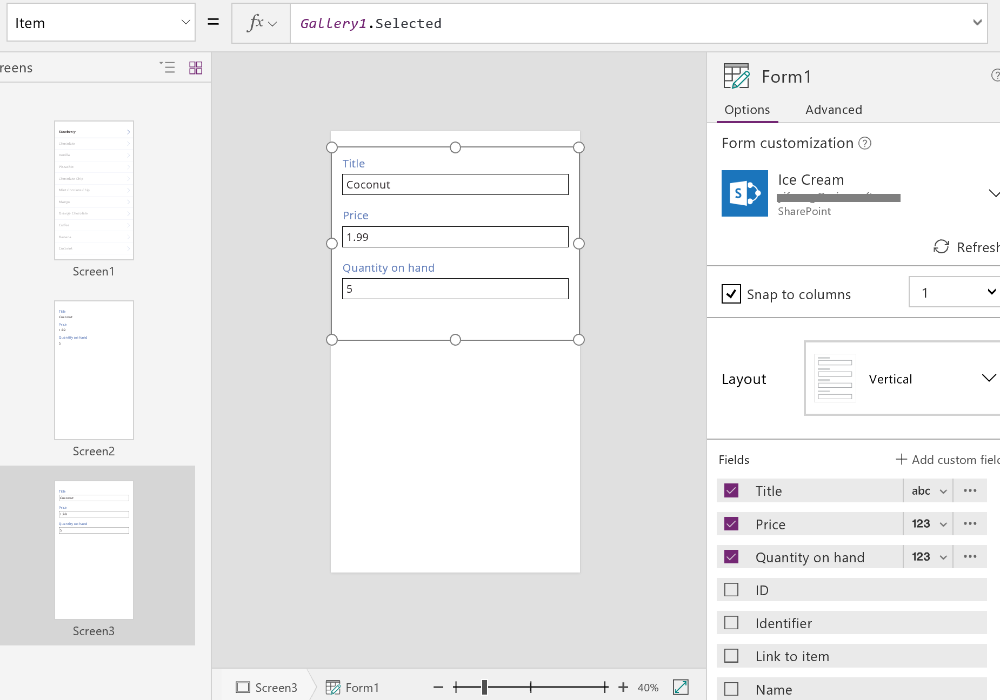

These two properties are the same as the properties on the **[Display form](controls/control-form-detail.md)** control.  And with these alone, we can display the details of a record.  

The **[Edit form](controls/control-form-detail.md)** control goes further by offering the **[SubmitForm](functions/function-form.md)** function to write back changes to the data source. You use this with a button or image control to save a user's changes.

* Add a **[Button](controls/control-button.md)** control, set its **[Text](controls/properties-core.md)** property to show **Save**, and set its **[OnSelect](controls/properties-core.md)** property to this formula:<br>
  **SubmitForm( Form1 )**


To add navigation to and from this screen:

1. Add another **[Button](controls/control-button.md)** control, set its **[Text](controls/properties-core.md)** property to show **Cancel**, and set its **[OnSelect](controls/properties-core.md)** property to this formula: <br>**ResetForm( Form1 ); Back()**
   
    This formula discards any unsaved edits and opens the previous screen.
   
    
2. Set the **[OnSuccess](controls/control-form-detail.md)** property of the form to **Back()**.
   
    When updates are successfully saved, the previous screen (in this case, the details screen) opens automatically.
   
    
3. On the **Display** screen, add a button, set its **[Text](controls/properties-core.md)** property to show **Edit**, and set its **[OnSelect](controls/properties-core.md)** property to this formula:<br> **Navigate( Screen3, None )**
   
    

You've built a basic app with three screens for viewing and entering data.  To try it out, show the gallery screen, and then press F5 (or select the forward arrow "Preview" button near the upper-left corner of the screen). The pink dot indicates where the user clicks or taps the screen at each step.


## Create a record
The user interacts with the same **Edit** form to both update and create records. When the user wants to create a record, the **[NewForm](functions/function-form.md)** function switches the form to **New** mode.

When the form is in **New** mode, the value of each field is set to the defaults of the data source. The record that's provided to the form's **[Item](controls/control-form-detail.md)** property is ignored.  

When the user is ready to save the new record, **[SubmitForm](functions/function-form.md)** runs. After the form is successfully submitted, the form is switched back to **EditMode**.  

On the first screen, you'll add a **New** button:

1. On the screen with the gallery, add a **[Button](controls/control-button.md)** control.
2. Set the button's **[Text](controls/properties-core.md)** property to **New** and its **[OnSelect](controls/properties-core.md)** property to this formula:<br>
   **NewForm( Form1 ); Navigate( Screen3, None )**
   
    This formula switches the **[Edit form](controls/control-form-detail.md)** control on **Screen3** to **New** mode and opens that screen so that the user can fill it in.


When the Edit and Create screen opens, the form is empty, ready for the user to add an item. When the user selects the **Save** button, the **[SubmitForm](functions/function-form.md)** function ensures that a record is created instead of being updated. If the user selects the **Cancel** button, the **[ResetForm](functions/function-form.md)** function switches the form back to **Edit** mode, and the **[Back](functions/function-navigate.md)** function opens the screen for browsing the gallery.

## Delete a record
1. On the **Display** screen, add a button, and set its **[Text](controls/properties-core.md)** property to show **Delete**..
2. Set the button's **[OnSelect](controls/properties-core.md)** property to this formula:
   <br>**Remove( 'Ice Cream', Gallery1.Selected ); Back()**
   
    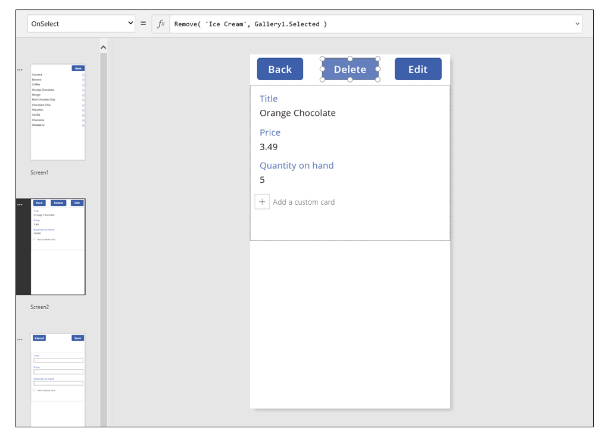

## Handling errors
In this app, an error occurs when the value of a field is not valid, a required field is blank, you're disconnected from the network, or any number of other problems pop up.  

If **[SubmitForm](functions/function-form.md)** fails for any reason, the **Error** property of the **[Edit form](controls/control-form-detail.md)** control contains an error message to show the user. With this information, the user should be able to correct the issue and resubmit the change, or they can cancel the update.

1. On the Edit and Create screen, add a **[Label](controls/control-text-box.md)** control, and move it just below the **Save** button. Any error will be easy to see after the user selects this control to save changes.

2. Set the **[Text](controls/properties-core.md)** property of the **[Label](controls/control-text-box.md)** control to show **Form1.Error**.

    

In an app that Power Apps generates from data, the **[AutoHeight](controls/control-text-box.md)** property on this control is set to *true* so that no space is consumed if no error occurs. The **[Height](controls/properties-size-location.md)** and **[Y](controls/properties-size-location.md)** properties of the **[Edit form](controls/control-form-detail.md)** control are also adjusted dynamically to account for this control growing when an error occurs. For more details, generate an app from existing data, and inspect these properties. The text-box control for errors is very short when no error has occurred, you may need to open the **Advanced** view (available on the **View** tab) to select this control.


## Refresh data
The data source is refreshed whenever the user opens the app, but the user might want to refresh the records in the gallery without closing the app. Add a **Refresh** button so that the user can select it to manually refresh the data:

1. On the screen with the **[Gallery](controls/control-gallery.md)** control, add a **[Button](controls/control-button.md)** control and set its **[Text](controls/properties-core.md)** property to show **Refresh**.

2. Set the **[OnSelect](controls/properties-core.md)** property of this control to this formula:<br> **Refresh( 'Ice Cream' )**

    

## Search and sort the gallery
In the app that Power Apps generated from data, we neglected to discuss two controls at the top of the Browse screen. By using these controls, the user can search for one or more records, sort the list of records in ascending or descending order, or both.

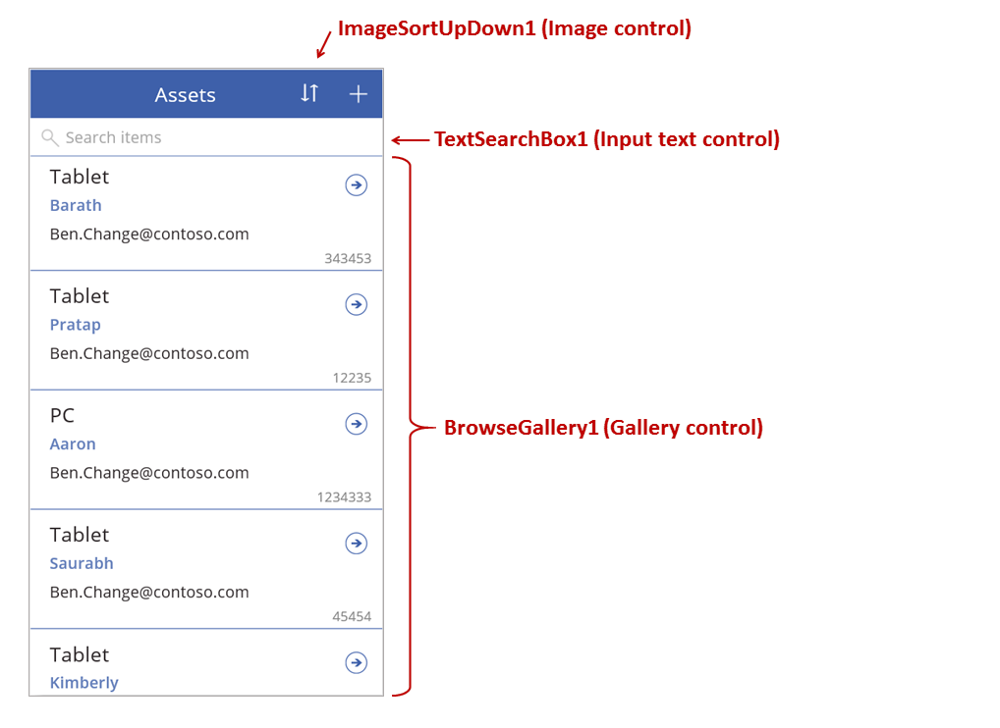

When the user selects the sort button, the sort order of the gallery reverses. To create this behavior, we use a *context variable* to track the direction in which the gallery is sorted. When the user selects the button, the variable is updated, and the direction reverses. The **[OnSelect](controls/properties-core.md)** property of the sort button is set to this formula:
**UpdateContext( {SortDescending1: !SortDescending1} )**

The **[UpdateContext](functions/function-updatecontext.md)** function creates the **SortDescending1** context variable if it doesn't already exist. The function will read the value of the variable and set it to the logical opposite by using the **!** operator. If the value is *true*, it becomes *false*. If the value is *false*, it becomes *true*.

The formula for the **[Items](controls/properties-core.md)** property of the **[Gallery](controls/control-gallery.md)** control uses this context variable, along with the text in the **TextSearchBox1** control:

```powerapps-dot
Sort( 
	If( IsBlank(TextSearchBox1.Text),
		Assets,
        Filter( Assets, TextSearchBox1.Text in Text(ApproverEmail) ) 
	),
	ApproverEmail,
    If(SortDescending1, Descending, Ascending) 
)
```

Let's break this down:

* On the outside, we have the **[Sort](functions/function-sort.md)** function, which takes three arguments: a table, a field on which to sort, and the direction in which to sort.  
  
  * The sort direction is taken from the context variable that toggles when the user selects the **ImageSortUpDown1** control. The *true*/*false* value is translated to the constants **Descending** and **Ascending**.
  * The field to sort on is fixed to **ApproverEmail**. If you change the fields that appear in the gallery, you'll need to change this argument too.
* On the inside, we have the **[Filter](functions/function-filter-lookup.md)** function, which takes a table as an argument and an expression to evaluate for each record.
  
  * The table is the raw **Assets** data source, which is the starting point before filtering or sorting.
  * The expression searches for an instance of the string in **TextSearchBox1** within the **ApproverEmail** field.  Again, if you change the fields that appear in the gallery, you'll also need to update this argument.
  * If **TextSearchBox1** is empty, the user wants to show all records, and the **[Filter](functions/function-filter-lookup.md)** function is bypassed.

This is but one example; you can craft your own formula for the **[Items](controls/properties-core.md)** property, depending on the needs of your app, by composing **[Filter](functions/function-filter-lookup.md)**, **[Sort](functions/function-sort.md)**, and other functions and operators together.    

## Screen design
So far, we haven't discussed other ways to distribute controls across screens. That's because you have many options, and the best selection depends on your specific app's needs.

Because real estate on phone screens is so limited, you probably want to browse, display, and edit/create on different screens. In this topic, the **[Navigate](functions/function-navigate.md)** and **[Back](functions/function-navigate.md)** functions open each screen.  

On a tablet, you can browse, display, and edit/create on two or even one screen. For the latter, no **[Navigate](functions/function-navigate.md)** or **[Back](functions/function-navigate.md)** function would be required.

If the user is working on the same screen, you need to be careful that the user can't change the selection in the **[Gallery](controls/control-gallery.md)** and potentially lose edits in the **[Edit form](controls/control-form-detail.md)** control.  To keep the user from selecting a different record when changes to another record haven't been saved yet, set the **[Disabled](controls/properties-core.md)** property of the gallery to this formula:<br>
**EditForm.Unsaved**


[!INCLUDE[footer-include](../../includes/footer-banner.md)]