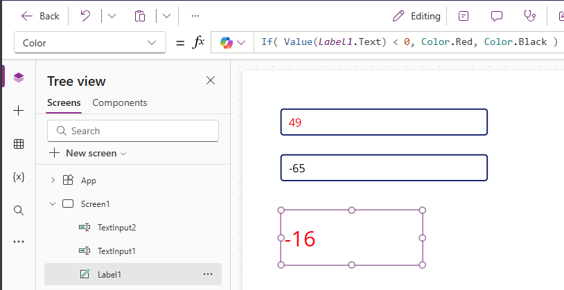

# Get started with formulas in canvas apps

Configure your canvas app with formulas that not only calculate values and perform other tasks (as they do in Excel) but also respond to user input (as an app requires).

* In Excel, you build formulas that, for example, populate cells and create tables and charts.
* In Power Apps, you build similar formulas as you configure controls instead of cells. In addition, you build formulas that apply specifically to apps instead of spreadsheets.

For example, you build a formula to determine how your app responds when users select a button, adjust a slider, or provide other input. These formulas might show a different screen, update a data source that's external to the app, or create a table that contains a subset of the data in an existing table.

You can use formulas for a wide variety of scenarios. For example, you can use your device's GPS, a map control, and a formula that uses **Location.Latitude** and **Location.Longitude** to display your current location. As you move, the map automatically tracks your location.

This article provides only an overview of working with formulas. Browse the [formula reference](formula-reference.md) for more details and the complete list of functions, operators, and other building blocks you can use.

## Prerequisites

1. [Sign up](../signup-for-powerapps.md) for Power Apps and [sign in](https://make.powerapps.com?utm_source=padocs&utm_medium=linkinadoc&utm_campaign=referralsfromdoc) with your credentials.
1. Learn how to [configure a control](add-configure-controls.md) in Power Apps.
  
## Use Power Fx formula bar

The Power Fx formula bar offers a more intuitive and efficient way to write formulas for your apps. Follow these steps to use the formula bar:

1. Open your app for editing in Power Apps Studio.
1. Open the formula bar by selecting it at the top of the screen.
1. Start typing your formula in the bar. As you type, the formula bar provides suggestions for functions that match your input.
1. Continue typing your formula or select the suggestions until you're done.

## Show a value

In Excel, you can enter a specific piece of data, such as the number **42** or the phrase **Hello World**, by typing it into a cell. That cell shows the data exactly as you type it. In Power Apps, you can similarly specify a piece of data that doesn't change by setting the **[Text](controls/properties-core.md)** property of a label to the exact sequence of characters that you want, surrounded by double quotation marks.

1. Create a [blank canvas app](create-blank-app.md).

    The formula bar sits at the top of the screen.

    :::image type="content" source="media/working-with-formulas/formula-bar.png" alt-text="Formula bar." lightbox="media/working-with-formulas/formula-bar.png" :::

    1. *Property list*: Each control and screen has a [set of properties](reference-properties.md). Use this list to select a specific property.  
    1. *Formula*: The formula to be calculated for this property, made up of [values, operators, and functions](formula-reference.md). As you type, Intellisense helps you with recommendations for formula, syntax, and errors.
    1. *Selected control*: In the formula bar, you can see and edit properties for the selected control or for the screen if no controls are selected.

1. Add a **[Label](controls/control-text-box.md)** control to the screen.

    When you add a label, the property list automatically shows the **[Text](controls/properties-core.md)** property, which drives what the control shows. By default, the value of this property is **"Text"**.  

1. Set the value of the **[Text](controls/properties-core.md)** property to **"Hello World"** by typing that string, surrounded by double quotes, into the formula bar:

    :::image type="content" source="media/working-with-formulas/label-hello-world.png" alt-text="Using the label Hello World.":::

    The label reflects this new value as you type it. The screen might show yellow exclamation-point icons while you type. These icons indicate errors, but go away when you finish entering a valid value. For example, a string without double quotation marks on both ends isn't valid.

    In Excel, you can show a number, such as **42**, by typing it into a cell or by typing a formula that resolves to that number, such as **=SUM(30,12)**. In Power Apps, you can achieve the same effect by setting the **Text** property of a control, such as a label, to **42** or **Sum(30,12)**. The cell and the label show that number regardless of what else changes in the worksheet or the app.

    > [!NOTE]
   > In Power Apps, you don't precede a formula with an equals sign or a plus sign as you do in Excel. The formula bar treats anything you type there as a formula by default. You also don't surround a formula with double quotation marks ("), as you did earlier to specify a string of text.

1. In the **[Text](controls/properties-core.md)** property of the label, replace **"Hello World"** with **Sum(1,2,3)**.

   While you type, the formula bar helps you by showing the description and the expected arguments for this function. As with the final double quotation mark in **"Hello World"**, the screen shows a red cross, showing an error, until you type the final parenthesis of this formula.

    :::image type="content" source="media/working-with-formulas/label-sum-partial.png" alt-text="Using the label - typing the partial function without a closing parenthesis shows errors.":::

    Completed formula with the final parenthesis added:

    :::image type="content" source="media/working-with-formulas/label-sum.png" alt-text="Using the complete formula Sum(1,2,3).":::

## Change a value based on input

In Excel, you type **=A1+A2** into a cell to show the sum of whatever values cells **A1** and **A2** contain. If either or both of those values change, the cell that contains the formula automatically shows the updated result.

In Power Apps, you can achieve a similar result by adding controls to a screen and setting their properties. This example shows a label control named **Label1** and two **[Text input](controls/control-text-input.md)** controls, named **TextInput1** and **TextInput2**. You can add a formula to the **Label1** control so that when you input a number into **TextInput1** and **TextInput2**, they're added together and display in **Label1**.

:::image type="content" source="./media/working-with-formulas/recalc1.png" alt-text="Screenshot of Power Apps recalculating the sum of two numbers.":::

Regardless of what numbers you type in the text-input controls, the label always shows the sum of those numbers because its **[Text](controls/properties-core.md)** property is set to this formula: `TextInput1.Text + TextInput2.Text`.

In Excel, you can use conditional-formatting formulas to show, for example, negative values in red. In Power Apps, you can use formulas to determine not only the primary value of a control but also properties such as color.

In this example, a formula for the **[Color](controls/properties-color-border.md)** property of the label automatically shows negative values in red. The **[If](functions/function-if.md)** function should look familiar from Excel:

`If( Value(Label1.Text) < 0, Color.Red, Color.Black )`

## Change a color based on user input

You can configure your app with formulas so that users can change your app's appearance or behavior. For example, you can create a filter to show only data that contains a string of text that the user specifies. You can let users sort a set of data based on a certain column in the data set.

In this example, you can let users change the color of the screen by adjusting one or more sliders.

1. Remove the controls from the previous procedures, or create a blank app as you did previously, and add three slider controls to it. You can search for the slider control in the search box of the **Insert** page to find the control under **Input**. To add the sliders, drag and drop the control to the canvas.

    :::image type="content" source="media/working-with-formulas/insert-slider.png" alt-text="Insert a slider control.":::

1. Arrange the sliders so they don't overlap, add three labels, and configure the labels to show **Red**, **Green**, and **Blue** text.

1. Set the **Max** property of each slider to 255 (default is 100), which is the maximum value of a color component for the **[RGBA](functions/function-colors.md)** function.

   :::image type="content" source="media/working-with-formulas/three-sliders.png" alt-text="Screenshot that shows the sliders and labels arrangement, including the Max property set to 255.":::

1. Select the screen to unselect any control, and then set the screen's **[Fill](controls/properties-color-border.md)** property to this formula: **RGBA( Slider1.Value, Slider2.Value, Slider3.Value, 1 )**. Your screen turns dark gray, which reflects the sliders' current positions.

    In the formula, you can access control properties by using the [property selector](/power-platform/power-fx/reference/operators). For example, **Slider1.Value** refers to the slider's **[Value](controls/properties-core.md)** property, which represents where the user placed the slider between the **Min** and **Max** values.

1. **Preview the app** and adjust the sliders. You see how each control is color coded to change the background color of the screen.

    :::image type="content" source="media/working-with-formulas/three-sliders-partial-rgba.png" alt-text="Screenshot that shows the color of the screen when you adjust the sliders.":::

    As each slider changes, the formula that contains the **[RGBA](functions/function-colors.md)** function is recalculated, which immediately changes how the screen appears.

## Manage app behavior

You can use formulas not only to perform calculations and change appearance but also to take action. For example, you can set the **[OnSelect](controls/properties-core.md)** property of a button to a formula that includes the **[Navigate](functions/function-navigate.md)** function. When a user selects that button, the screen that you specify in the formula appears.

You can use some functions, such as **[Navigate](functions/function-navigate.md)** and **[Collect](functions/function-clear-collect-clearcollect.md)**, only in behavior formulas. The formula reference calls out if you can use a function only in this context.  

You can take more than one action in a behavior formula if you separate functions with a semi-colon (;). For example, you might want to update a context variable, push data to a data source, and finally navigate to another screen.

## View a list of properties by category

The properties list shows properties alphabetically, but you can also view all the properties of a control, organized by category, if you select a control, for example **Label1**, and then select the **Advanced** tab in the **Properties** pane, you see a long list of properties for that control.

:::image type="content" source="media/working-with-formulas/advanced-open.png" alt-text="Advanced view.":::

You can edit formulas directly within this view. With the property search, you can quickly find a property of that control and change a control's behavior and appearance.

## Formula syntax

As you type a formula in the formula bar, different syntax elements appear in different colors to improve readability and help you understand long formulas. Here's the color code list in Power Apps.

:::image type="content" source="./media/working-with-formulas/syntax-highlighting.png" alt-text="Screenshot that shows a table list of syntax highlighting.":::

### Related information

[Use Find and Replace capability in the formula bar](formula-bar-find-replace.md)

[!INCLUDE[footer-include](../../includes/footer-banner.md)]
