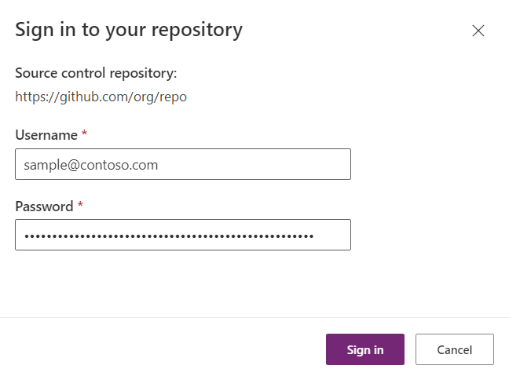
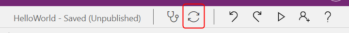

# Work with Experimental Co-authoring

> [!IMPORTANT]
> This feature is being provided to you as a private preview under a non-disclosure agreement.  Please do not distribute information about this feature to others.  Please send feedback or questions to [PAGit@microsoft.com](mailto:PAGit@microsoft.com).

Use Git version control to enable more than one person to edit a Canvas app at the same time.  No longer will others be locked out of the app while one person is editing it.  As changes are made and synchronized, they are automatically merged with other changes, and made avaialble to all other editors of the app.  This is a first step toward a Microsoft Office style co-authoring experience.

[Git](https://git-scm.com/) is used as the backing store for this feature.  Someone on your project will need to be Git savvy to setup the initial Git connection, but after this is done, any user can use this feature without needing to know anything about Git (beyond authentication credentials).

Any Git provider can be used with Studio, such as [GitHub](https://github.com/) or [Azure DevOps](https://azure.microsoft.com/en-us/services/devops/).  Use existing Git tools to see version history, create and manage pull requests, and perform other version control tasks.

## Known limitations

This is very much an experimental feature and we welcome your feedback.  Here is a list of known limitations, most of which we plan to eliminate in a future version.

1. This feature is not compatible with [code components](../../developer/component-framework/create-custom-controls-using-pcf). Do not use this feature with apps that make of use of code components.
1. This feature does not work with public Git repository.  Use a private repo instead until this limitation is relaxed.
1. This feature does not work with on-premisis Git repositories.  The Git repo must be hosted on the web and accessible via username and personal access token.
1. Edits to the same property on the same control are not merged.  The last edit made will win.

## Enabling Git version control

> [!IMPORTANT]
> Git version control is an experimental feature.  It is currently being offered through a private preview program and not to all customers yet.  We would like to hear your feedback before making it available to others.  Please send feedback or questions to [PAGit@microsoft.com](mailto:PAGit@microsoft.com).  As with all experimental features, this feature may significantly change or be removed at any time.  See [Understand experimental, preview, and retired features](working-with-experimental-preview.md) for more details.

Git version control is managed on a per app basis.  Each app must be individually addded to Git version control.

1. Create a new app or open an existing app that you would like to add to Git version control.
1. Open the **Settings** for this app.
1. Select **Upcoming features**.
1. Select **Experimental**.
1. Scroll down to **Show the Git version control setting** and enable the switch below it.
1. You will immediately see a new **Git version control** item on the left hand side of the settings.

When complete, your screen should look like this:

If the **Show the Git version control setting** experimental feature is not shown, it may be that your tenant has not been properly enabled for this feature.  Send mail to [PAGit@microsoft.com](mailto:PAGit@microsoft.com) for help.

## Connecting an app to Git

Select **Git version control** in settings:

Press the **Connect** button to fill in Git connection information for this app:  

- **Git Repository URL**: The URL you would normally use with Git tools.  For Azure DevOps, be sure to include the **_git/repo** portion of the URL, as in `https://org.visualstudio.com/_git/repo`.  
- **Branch**: The branch name to use.
- **Directory**: The directory within the branch to use.  You cannot store a Canvas app at the root of the branch.

If the branch or directory does not exist, you will be prompted to create them.  If the branch and directory already contains a canvas app, the current app will be closed and the existing app loaded from Git.

Once connected, the connection information will be displayed.  At this time, the app cannot be unlinked from Git, but we plan to add that in the future.

## Git authentication

> [!IMPORTANT]
> Each maker must use their own Git user name and **personal access token**.  **These are not the same as your Power Apps credentials.  These are not the same as your Git user name and password.**  A personal access token must be created for the user and used in the credentials dialog.

Follow these instructions to obtain a personal access token:
- **GitHub**: [https://docs.github.com/en/github/authenticating-to-github/keeping-your-account-and-data-secure/creating-a-personal-access-token](https://docs.github.com/en/github/authenticating-to-github/keeping-your-account-and-data-secure/creating-a-personal-access-token)
- **Azure DevOps**: [https://docs.microsoft.com/en-us/azure/devops/organizations/accounts/use-personal-access-tokens-to-authenticate](https://docs.microsoft.com/en-us/azure/devops/organizations/accounts/use-personal-access-tokens-to-authenticate)
- **Other**: Any Git provider can be used with Git version control, check your provider's help for how to create a personal access token.

Plug the user name and personal access token when prompted:

The Git credentials are not stored by Power Apps between sessions.  Fortunately, if desired, the browser can cache these values in its saved passwords so that you do not need to enter it fresh each time.  With robust password caching, you should only need to add the credentials once.

## Making changes to the app

After linking to Git, you can load, save, publish, and close apps as you normally would in Studio.  If makers can get past the Git credentials discussed above, they do not need to understand Git concepts to be effective making and sharing changes.

Use the new synchronize button at the top of the Studio screen, between the App Checker and Undo buttons, to merge any current changes with what is in Git and bring the result into the Studio for further editing:

The app will need to be loaded each time there is a merge.  If the app is large, this load could take some time.

After being connected to Git, changes are stored in Git rather than in Power Apps.  Additional versions will not appear in the Power Apps portal.

## Merge results

At this time, there is no UI to present or ask for help with merge conflicts.  Studio will do its best to merge automatically.  It will draw upon semantic knowledge of the app, for example the types of objects and other clues, and will do a much better job than a straight text based merge.

But Studio may get this wrong and we would very much like to hear your feedback about when it does.  If it gets it wrong, all changes are still stored in Git and can be retrieved from there and reapplied.

## Publishing the app

For end users to experience your app, publish your app as you normally would.

This is the only time a version is stored in Power Apps is if you publish the app, since Power Apps needs a runnable copy of the app to share with users.  

## Pull requests, viewing history, blaming, ...

At this time, we have no UI in Studio for doing Git operations other that pulling the top commit and pushing a new commit.  Working with pull requets or any other Git operations must be done through other Git tools, including the Git provider's website.

Each save or synchronize which includes changes will result in a commit in Git.  If other changes occured in Git, for example by other makers, then there will be attiional commits made in order to merge the result of all the changes.  No changes will be lost, even if a merge would override an edit, all of the changes by all users is in the commits somewhere.

## Feedback to PAGit@microsoft.com

**Let us know what you think!**  This is but a first small step in a long journey to enable a great team development experience.  Please send us email at [PAGit@microsoft.com](mailto:PAGit@microsoft.com) with your thoughts.
