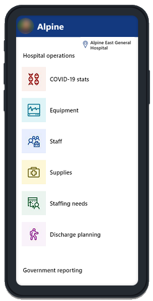

# Build large apps

Most of the articles in this section cover the runtime performance of apps as experienced by end users.  For example, articles include optimizations to reduce the time needed to load an app into Power Apps player, see the first screen of information, and become interactive.  

This article covers a different aspect of performance: the maker's experience.  As apps become large and complex, Power Apps Studio needs to load and manage a large number of controls, formulas, and data sources, with interdependencies that grow exponentially.  App load time for Studio can slow and features such as IntelliSense and color coding can lag.  

Use the recommendations in this article to better work with large and complex apps in Power Apps Studio.  Fortunately these recommendations also help with runtime performance too.

All of the sample in this article are based on the [Hospital Emergency Response sample solution](../../sample-apps/emergency-response/overview.md).  

## Use App.Formulas instead of App.OnStart

> [!IMPORTANT]
> - Named formulas is an experimental feature.
> - Experimental features aren’t meant for production use and may have restricted functionality. These features are available before an official release so that customers can get early access and provide feedback.
> - Canvas component custom output properties can be used as an alternative to named formulas.  They are harder to use than named formulas, but are fully supported.  See below fore more details.

By far, the easiest and best way to improve both Studio app load time and end user app load time is to replace variable initialization in **App.OnStart** with *Named formulas*.  For example:

```powerapps-dot
// Get the color of text on a dark background.
Set(varColorOnDark,RGBA(0, 0, 0, 1));

// Get the color of the menu icons.
Set(varColorMenuIcon,"#0070a9");

// Get the styles for a form.
Set(varFormStyle,
    {
        DataCard: { Height: 50 },
        Title: { Height: 50, Size: 21, Color: varColorOnDark },
        Control: { Height: 50, Size: 18 },
        Label: { Size: 18, Color: varColorOnDark }
    }
);

ClearCollect(
    FacilitiesList,
    ForAll(
        Facilities,
        { Name: 'Facility Name', Id: Facility }
    )
);
If(
    Not IsBlank(Param("FacilityID")),
    Set(ParamFacility,
        LookUp(
            FacilitiesList,
            Id = GUID(Param("FacilityID"))
        ).Name
    );
);
```

As imperative logic, these **Set** and **Collect** calls must be evaluated, in order, before the first screen is displayed, which slows end user app load time.  This formula is also complex for Studio to analyze as the entire **App.OnStart** must be considered as a whole.

There is a better way.  Use **App.Formulas** instead of **App.OnStart** and define these variables and collections as named formulas instead:

```powerapps-dot
// Get the color of text on a dark background.
varColorOnDark = RGBA(0, 0, 0, 1);

// Get the color of the menu icons.
varColorMenuIcon = "#0070a9";

// Get the styles for a form.
varFormStyle = 
    {
        DataCard: { Height: 50 },
        Title: { Height: 50, Size: 21, Color: varColorOnDark },
        Control: { Height: 50, Size: 18 },
        Label: { Size: 18, Color: varColorOnDark }
    };

FacilitiesList =
    ForAll(
        Facilities,
        { Name: 'Facility Name', Id: Facility }
    );

ParamFacility = 
    If( Not IsBlank(Param("FacilityID")),
        LookUp(
            FacilitiesList,
            Id = GUID(Param("FacilityID"))
        ).Name,
        Blank()
    );
```

This may seem like a small change, but it isn't.  **Each of these named formulas is completely independent and can be analyzed by Studio independently.**  Which effectively means we have split a large **App.OnStart** into smaller pieces.  This can make a huge difference for Studio app load time.

End user app load time has also improved because we don't need to evaluate these formulas until they are actually needed.  The first screen of the app is displayed immediately without waiting.

Note that named formulas are immutable.  You cannot use **Set** with them.  Some situations require the use of a state variable that can be modified, and **Set** is perfect for these situations and should be continue to be used.  But, more often than not, a global variable does not need to be changed and a named formula is a better alternative.

## Split up long formulas

**App.OnStart** is one of the worst offenders for long formulas and definitely where you should start.  But it isn't the only case.

Our studies has shown that nearly all apps with a long Studio load time have at least one formula that is over 256,000 characters.  Some of the longest load times have formulas that are over 1 million characters.  For a single formula, that is a lot of characters and puts a significant strain on Studio.

Making matters worse, copy and paste of a control will duplicate long formulas on the control's properties without it being realized.  Power Apps is modeled after Excel where multiple copies of a formula are common, but in Excel formulas are limited to one expression and are capped at 8,000 characters.  Power Apps formulas can grow much longer with the introduction of imperative logic and the chaining operator (`;` or `;;` depending on locale).

The general solution is to split long formulas into smaller parts and to reuse those parts, as was done with the transition of **App.OnStart** to **App.Formulas** above.  In other programming languages, these parts are often referred to as subroutines or user defined functions.  

### Use Named formulas everywhere

Named formulas were used above as a replacement for **App.OnStart**.  But they can be used anywhere in an app to replace a calculation.  For example, this logic appears in **App.OnVisible** for one of the sample screens:

```powerapps-dot
ClearCollect(
    MySplashSelectionsCollection,
    {
        MySystemCol: First(
            Filter(
                Regions,
                Region = MyParamRegion
            )
        ).System.'System Name',
        MyRegionCol: First(
            Filter(
                Regions,
                Region = MyParamRegion
            )
        ).'Region Name',
        MyFacilityCol: ParamFacility,
          MyFacilityColID:  LookUp(
            FacilitiesList,
            Id = GUID(Param("FacilityID"))
        ).Id
    }
); 
```

This can be split into a set of named formulas, which also improves the readability:

```powerapps-dot
MyRegion = LookUp(
                    Regions,
                    Region = MyParamRegion
           );

MyFacility = LookUp(
                    FacilitiesList,
                    Id = GUID(Param("FacilityID")
            );

MySplashSelectionsCollection = 
    {
        MySystemCol: MyRegion.System.'System Name',
        MyRegionCol: MyRegion.'Region Name',
        MyFacilityCol: ParamFacility,
        MyFacilityColID:  MyFacility.Id
    };
```

A large formula has been split up, making Studio analysis much faster.

### Use Canvas components

Canvas component custom output properties can be used as an alternative to named formulas.  They are harder to use than named formulas, but are fully supported.

To split logic out:
1. Switch to the **Components** tab in the **Tree view**.
1. Create a new component.
1. In the **Properties** pane, turn on **Access app scope**.
1. Add a custom property.
1. Set the **Property type** to **Output** and the **Data type** as appropriate.  
1. Select **Create** at the bottom of the pane.
1. Select the newly created property in property picker next to the formula bar at the top of the screen.
1. Write the formula for the logic to split out and reuse.

To use the logic:
1. Switch to the **Screens** tab in the **Tree view**.
1. On the **Insert** pane on the left side of Studio, expand **Custom**, and insert your component.
1. To calculate a value with the property, use *ComponentName.PropertyName*.

At this time, Canvas component custom output properties do not support imperative logic.

### Use Select with a hidden control

Named formulas are great, but at this time they cannot be used with imperative logic.

A common trick for splitting up imperative logic is to use the **OnSelect** property of a hidden control.  Here's how it works:
1. Add a **Button** control to a screen.
1. Set the **OnSelect** property to the imperative logic you want to execute.
1. Set the **Visible** property to false.  No need for the end user to see it or interact with it.
1. Call `Select( Button )` when you want to execute the imperative logic. 

For example, one of the screens of our sample has this **OnSelect** property on a **Button** control.  This is a simple example for illustration purposes only, normally you would only do this for longer formulas:

```powerapps-dot
btnAction_17.OnSelect = 
    Trace("Feedback Screen: Submit Button",TraceSeverity.Information);
    If(
        // Proceed if all forms are validated.
        And(
            FormFeedback.Valid
        ),
    
        // Set the updates to static variables.
        Set(updatesFeedback,Patch(Defaults('App Feedbacks'), FormFeedback.Updates));
        // Submit the first form. Subsequent actions can be found in the OnSuccess properties of each form.
        SubmitForm(FormFeedback);
        ,
    
        Notify("Please complete all fields before proceeding",NotificationType.Warning,2000)
    );
```

To split this logic into parts, we can put portions onto separate **Button** controls and **Select** them from the original:

```powerapps-dot
btnTrace.OnSelect = 
    Trace("Feedback Screen: Submit Button",TraceSeverity.Information);

btnSubmit.OnSelect = 
    If(
        // Proceed if all forms are validated.
        And(
            FormFeedback.Valid
        ),
    
        // Set the updates to static variables.
        Set(updatesFeedback,Patch(Defaults('App Feedbacks'), FormFeedback.Updates));
        // Submit the first form. Subsequent actions can be found in the OnSuccess properties of each form.
        SubmitForm(FormFeedback);
        ,
    
        Notify("Please complete all fields before proceeding",NotificationType.Warning,2000)
    );

btnAction_17.OnSelect = 
    Select( btnTrace );
    Select( btnSubmit );
```

And just like that, we have split up imperative logic.  Note that the above technique only works on the same screen, but there are also techniques that work across screens, for example using the **Toggle** control and then the toggling of a bound variable.

## Partition the app

As with long formulas, large apps can be split into smaller apps that work together as one user experience.  The **Launch** function used to navigate between the smaller apps including any needed context.

This approach was used in the [Hospital Emergency Response sample solution](../../sample-apps/emergency-response/overview.md).  An app was created for each of the major area of the overall app, one each for staffing, equipment, supplies, etc.  A canvas component was created that was shared between the apps through a component library that served as a switchboard, that each app would initially display shown here in the section of the screen:



When the end user selects an area, the component uses metadata about the apps available and which app is hosting the component.  If the desired screen is in this app (**ThisItem.Screen** is not blank), a **Navigate** call is made.  But if the desired screen is in a different app (**ThisItem.PowerAppID** is not blank), a **Launch** is used with the App Id of the target and the FacilityID context:

```powerapps-dot
If(
    IsBlank(ThisItem.Screen),
    If(IsBlank(ThisItem.PowerAppID), 
        Launch(ThisItem.URL),           
        Launch("/providers/Microsoft.PowerApps/apps/" & ThisItem.PowerAppID, "FacilityID", Home_Facility_DD.Selected.Id)
    ),
    Navigate(
        ThisItem.Screen,
        Fade
    )
);
```

[!INCLUDE[footer-include](../../includes/footer-banner.md)]
