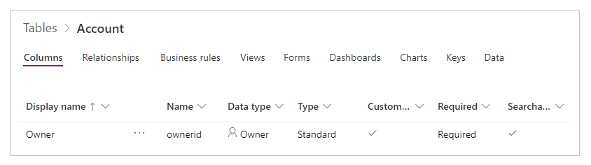
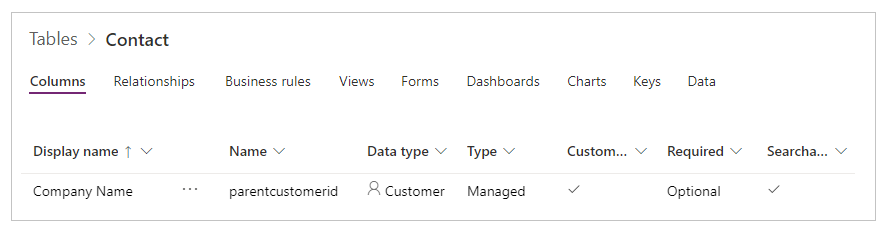
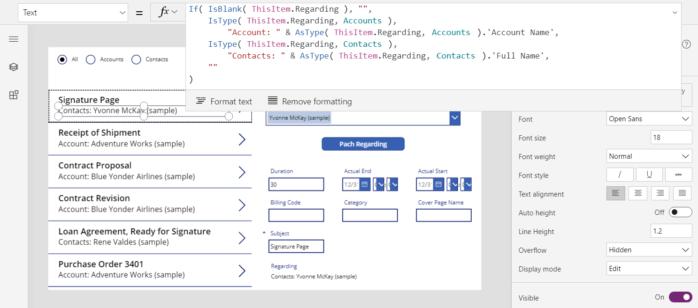
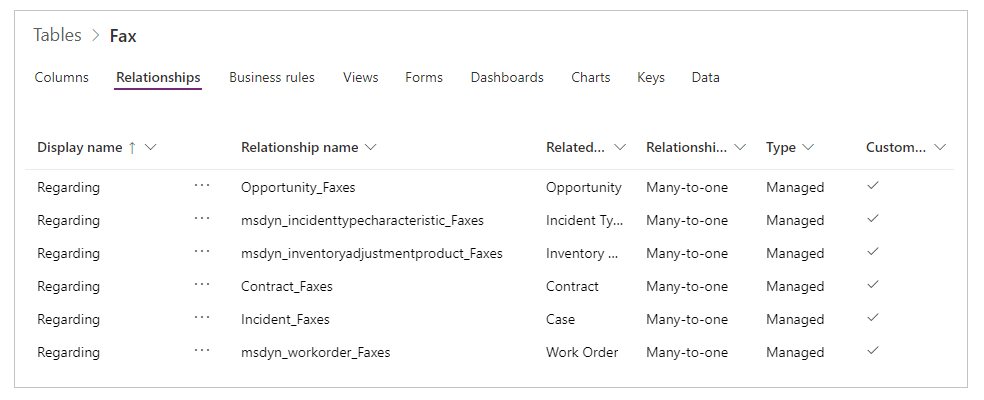
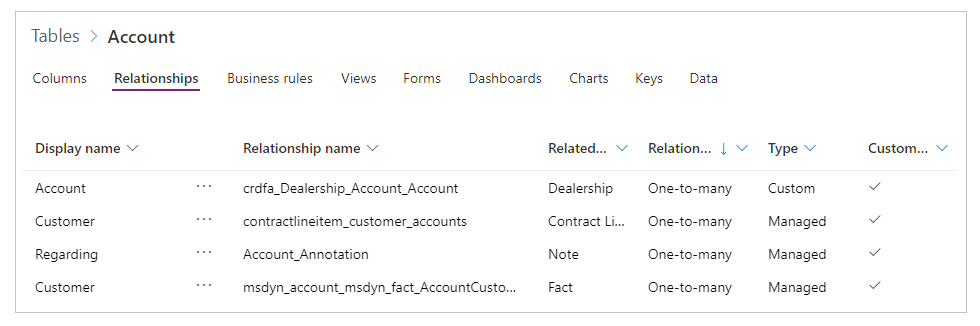
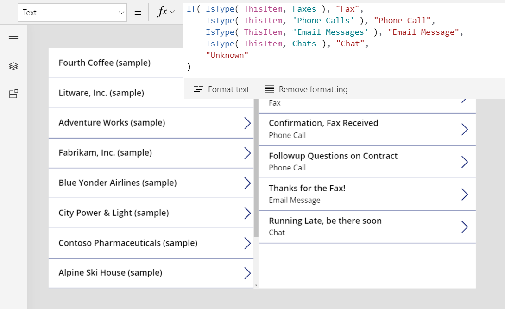
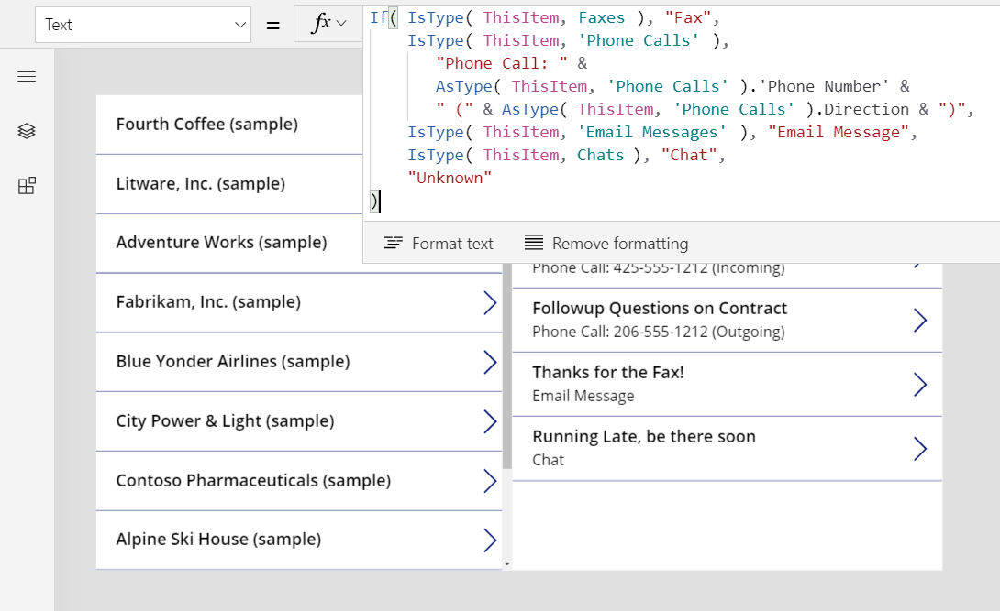
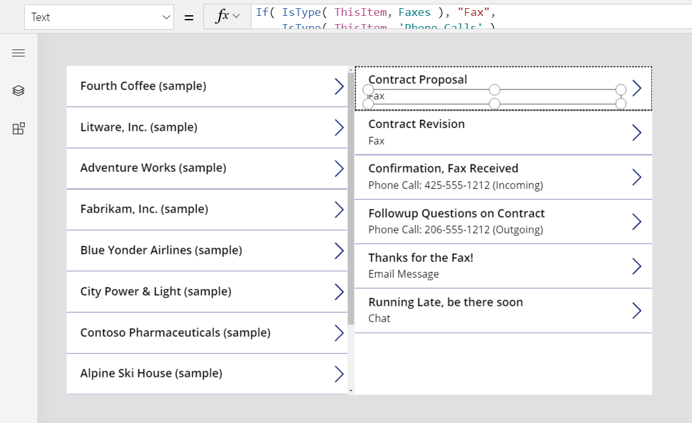
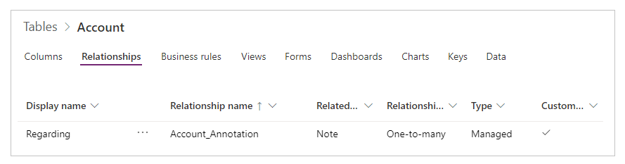

# Understand Record References and Polymorphic Lookups in Canvas apps

When you wrote a research paper in school you probably provided a list of your references at the end.  You didn't include a copy of the actual background material you used, but rather a web link, book title and author, or other information so someone could track down the original source.  You mixed different kinds of sources in a single list, newspaper articles next to audio recordings, each with their own specific details for a proper citation.  For example, Wikipedia articles often include a [long list of references](https://en.wikipedia.org/wiki/Microsoft#References).

In Canvas apps, we often work with copies of records downloaded from data sources.  We use the [**LookUp** and **Filter** functions](functions/function-filter-lookup.md) and the [**Gallery** control's](controls/control-gallery.md) **Selected** property to identify the specific record we want.  All the records from **Filter** or **Selected** will be of the same entity type, making it possible to use fields with a simple *.field* notation.  These copies often include reference information so we can use the [**Patch** function](functions/function-patch.md) to make a change in the original. 

Canvas apps also support *Record References*.  Much like a research paper reference, record references refer to a record without including a complete copy of the record.  Record references can refer to a record in *any* entity allowing us to mix records from the **Users** and **Teams** entities in a single **Owner** column.  They were designed for working with the polymorphic lookup fields of the Common Data Service but are not limited to CDS.

When setting and comparing records, record references can be used just like any normal record.  But since record references can refer to a record in any entity, we can't use the simple *.field* notation directly, first we must pin down the entity type with the **IsType** and **AsType** functions before we can pull fields from it.

## Polymorphic lookups

The Common Data Service supports relationships between records.  Each **Account** record has a **Primary Contact** lookup field to a record in the **Contacts** entity.  The lookup can only refer to a record in **Contacts** and can't refer to a record in say the **Teams** entity.  That last detail is important because we always know what fields will be available for the lookup.

CDS also supports *polymorphic* lookups that can refer to a record from a set of entities.  For example, the **Owner** field can refer to a record in the **Users** entity or the **Teams** entity.  Each record's lookup field could refer to records in different entities.  Here we don't always know the fields that will be available.

In Canvas app, record references are used to work with polymorphic lookups.  Let's start by looking at how to work with the **Owner** lookup.

## Displaying fields of an Owner  

Every entity includes one **Owner** field that cannot be removed and another cannot be added.  Here is the field as shown on the **Account** entity in the maker portal.



An **Owner** lookup can refer to a record from either the **Teams** or **Users** entities.  Not all records in these entities have permissions to be an **Owner**, check the supported roles if you run into a problem.

Let's look at a simple gallery of **Accounts**:


To show the owner of each account in the gallery, we are tempted to use the formula **ThisItem.Owner.Name**.  But there's a problem with this approach: the name field on a **Team** is **Team Name** while the name field on a **User** is **Full Name**.  We won't know which type of lookup we are working with until we run the app and it can vary between **Account** records.  We need to use a formula that can adapt: 

```powerapps-dot
If( IsType( ThisItem.Owner, [@Teams] ),
    "Team: " & AsType( ThisItem.Owner, [@Teams] ).'Team Name',
    "User: " & AsType( ThisItem.Owner, [@Users] ).'Full Name' )
```


Let's unpack what this formula is doing.  The **IsType** function is used to test the **Owner** field against **Teams** entity.  If it is of that entity type, then the **AsType** function is used to cast it to a **Team** record.  From here we can access all the fields of the **Team** including the 'Team Name'.  If **IsType** determines that the **Owner** is not a **Team**, the only other options is that it is a **User** as the **Owner** field is a required field that cannot be *blank*.

We are using the [global disambiguation operator](functions/operators.md#disambiguation-operator) for **[@Teams]** and **[@Users]** to ensure we are using the global entity type.  It isn't needed in this case but it is a good habit to get into.  Often there will be conflicting one-to-many relationships in the gallery's record scope and this avoids that confusion.     

To use any fields of a record reference we must first use the **AsType** function to cast it to a specific entity type.  Direct access to fields from the **Owner** field is not possible as the system doesn't know what entity type you would like to use.

Since the **AsType** function will return an error if the **Owner** field does not match the entity type being requseted, you can use the **IfError** function to simplify this formula.  First turn on the experimental feature "Formula-level error management":


And then replace the formula above with:

```powerapps-dot
IfError( 
    "Team: " & AsType( ThisItem.Owner, [@Teams] ).'Team Name',
    "User: " & AsType( ThisItem.Owner, [@Users] ).'Full Name' )
```

Finally, note that the **IsType** and **AsType** functions require the second argument's entity to be added as a data source.  In our simple example app, we have three data sources:


## Filtering based on an Owner

Congratulations, you're through the hardest aspect of working with a record reference.  Other use cases are more straightforward as we know the entity types being used with it.

Case in point: filtering.  Let's add a **Combo box** control above our gallery and set these properties:
- Items: `Users`
- SelectMultiple: `false`


If we want to filter our **Accounts** gallery by a specific **User** selected from this combo box, we can do so with a simple **Filter** formula.  

```powerapps-dot
Filter( Accounts, Owner = ComboBox1.Selected )
```


No **IsType** or **AsType** is required here because we are doing a record to record comparison.  We know the entity type of **ComboBox1.Selected** because it is derived from the **Users** entity.  Accounts for which the owner is a team will not match the filter criteria.

Note that there is no delegation warning on this **Filter**.  This query is delegated to CDS.

Let's get a little fancier and support filtering by either a user or a team.  

1. Open up some space at the top of the screen and insert a **Radio** control.  

1. Set these properties on this new control:
    - Items: `[ "All", "Users", "Teams" ]`
    - Layout: `Layout.Horizontal`

1. On the existing combo box control, set this property:
    - Visible: `Radio1.Selected.Value = "Users"
    If the control disappears, select *Users* in the radio control.

1. Copy and paste the combo box control, positioning it directly above the original.
 
2. Change these properties on the copy:
    - Items: `Teams`
    - Visible: `Radio1.Selected.Value = "Teams"`

1. Finally, set the **Items** property of the gallery control to this formula:
    ```powerapps-dot
    Filter( Accounts, 
        Radio1.Selected.Value = "All"
        Or (Radio1.Selected.Value = "Users" And Owner = ComboBox1.Selected) 
        Or (Radio1.Selected.Value = "Teams" And Owner = ComboBox1_1.Selected) 
    )
    ```


With our changes we can show all records or filter on either a user or a team:


Note that our formula is still fully delegable.  The portion that is comparing the radio button values is a constant across all records is evaluated before sending the rest of the filter to CDS.

If we want to filter on the type of the owner, we can do so with the **IsType** function but it is not yet delegable:


## Updating the Owner with Patch

Updating the **Owner** field is done in the same manner as any other lookup.  To set the currently selected account's owner to the first team:

```powerapps-dot
Patch( Accounts, Gallery1.Selected, { Owner: First( Teams ) } )
```

This isn't any different form a normal lookup because we know the type of **First( Teams )**.  If we wanted the first user instead, simply replace that portion with **First( Users )**.  The **Patch** function knows that the **Owner** field can be set to either of these two entity types.

Let's use this capability in our app:

1. Using the Tree view, multi-select the radio control and our two combo box controls.

1. On the elipses menu, select **Copy these items**:
    

1. On the same elipses menu, select **Paste**:
    

1. Move the controls to the right of the gallery:
    
 
1. Select the copied radio control and change these properties:
    - Items: `[ "Users", "Teams" ]`
    - Default:` If( IsType( Gallery1.Selected.Owner, Users ), "Users", "Teams" )`
     

1. Select **Users** in the radio control so that the users combo box control is visible.

1. Select the visible combo box control.  Set the **DefaultSelectedItems** property to this formula:
    ```powerapps-dot
    If( IsType( Gallery1.Selected.Owner, Users ),
        AsType( Gallery1.Selected.Owner, Users ), 
        Blank() 
    )
    ```

     

1. Select **Teams** in the radio control so that the teams combo box control is visible.

1. Select the radio control, to take selection away from the now invisible combo box control for users, and then select the visible combo box control for teams.  Set the **DefaultSelectedItems** property to this formula:
    ```powerapps-dot
    If( IsType( Gallery1.Selected.Owner, Teams ),
        AsType( Gallery1.Selected.Owner, Teams ), 
        Blank() 
    )
    ```

     

1. Insert a **Button** control below our combo box and set it's **Text** property to **"Patch Owner"**.

2. Set the **OnSelect** property of our button to this formula:
    ```powerapps-dot
    Patch( Accounts, Gallery1.Selected,
        { Owner: If( Radio1_1.Selected.Value = "Users", 
                ComboBox1_2.Selected, 
                ComboBox1_3.Selected ) } )
    ```

    

Our copied radio button and combo boxes will show the owner for the currently selected account in the gallery.  And with these same controls, we can set the owner of the account to any team or user by pressing our button:


## Updating the Owner with the Edit form control

Unfortunately, this it not yet supported but is coming soon. 

You can show the owner field inside a form with a custom card.  

1. Insert an **Edit form** control.  Resize and move this form control to the bottom right of the screen.  Select **Accounts** in the property pane for **Data source**:
      

1. Set the **Item** property to **Gallery1.Selected**:
    

1. Select **Edit fields** in the property pane.  Using the ellipses, select **Add a custom card**:
    

1. The new custom card will be inserted at the bottom of the form control.  Resize it as needed to fully see it:
    

1. Insert a **Label** control into the custom card.  Set it's **Text** property to the formula we used in the gallery:
    ```powerapps-dot
    If( IsType( ThisItem.Owner, Teams ),
        "Team: " & AsType( ThisItem.Owner, Teams ).'Team Name',
        "User: " & AsType( ThisItem.Owner, Users ).'Full Name' )
    ```

    

Now as we change selection in the gallery, we can see more fields of the account in the form including the owner.  If we change the owner field with our **Patch** button, that change is also shown in the form control.


## Customer lookup

Shifting gears, let's turn our attention to another polymorphic lookup in CDS that is very similar to owner: the **Customer** lookup.

Unlike **Owner** which is limited to one per entity, entities can include zero, one, or more **Customer** lookups.  The system **Contacts** entity includes the **Company Name** field which is a **Customer** lookup:



You can add additional **Customer** lookups to an entity by selecting the **Customer** data type for a new field:


A **Csutomer** lookup can refer to a record from either the **Accounts** or **Contacts** entities.

The treatment of **Customer** and **Owner** are so similar that we can literally make a copy of our app and make these simple replacements:

| Location | **Owner** sample | **Customer** sample |
|----------|-----------|------------------|
| Throughout | **Owner** | **'Customer Name'**<br>For example **Gallery1.Selected.'Customer Name'** |
| Throughout | **Users** | **Accounts** |
| Throughout | **Teams** | **Contacts** |
| Gallery's **Items** property | **Accounts** | **Contacts** |
| Form's **Items** property | **Accounts** | **Contacts** |
| Button's **OnSelect**, first argument of **Patch** | **Accounts** | **Contacts** |
| Filter radio's **Items** property | **[ "All", "Users", "Teams" ]** | **[ "All", "Accounts", "Contacts" ]** |
| Patch radio's **Items** property | **[ "Users", "Teams" ]** | **[ "Accounts", "Contacts" ]** |
| Combo box **Visible** property | **"Users"** and **"Teams"** | **"Accounts"** and **"Contacts"** |

For example, here is how the new **Items** property looks on the gallery:


There are two important difference between **Customer** and **Owner** that will require an update to the formulas inside the gallery and form:
1. There are one-to-many relationships between **Accounts** and **Contacts** that will take precedence when referring to these entity types by name.  Instead of **Accounts** we must use **[@Accounts]** and instead of **Contacts** we must use **[@Contacts]**.  By using the [global disambiguation operator](functions/operators.md#disambiguation-operator) we ensure we are referring to the entity type in the **IsType** and **AsType** calls.  This is only a problem in the record context of the gallery and form controls.
2. **Owner** is a required field which must have a value, while **Customer** fields can be *blank*.  To show the correct result without a type name, we need to test for this case and show an empty text string instead.

Both of these changes are in the same formula, the **Text** property of the label control in the gallery and our custom card in the form:
```powerapps-dot
If( IsBlank( ThisItem.'Company Name' ), "",
    IsType( ThisItem.'Company Name', [@Accounts] ), 
        "Account: " & AsType( ThisItem.'Company Name', [@Accounts] ).'Account Name',
    "Contact: " & AsType( ThisItem.'Company Name', [@Contacts] ).'Full Name' 
)
```


With these changes, we can now look at and change the **Company Name** field on the **Contacts** entity:


> ![NOTE]
> At first release, there are some limitations when working with **Customer** lookups:
> - Filtering on a specific **Contact** or **Account** is not yet implemented.  The filter radio button control in the above example will not work.
> - The only customer field that is working is the system defined **'Company Name'** on the **Contacts** entity which was used above in the example.  Adding a custom customer field is not yet supported.  
> - The customer field cannot be cleared by setting it to *blank* with **Patch**.

## Regarding lookup

Now for something a little different: **Regarding** and **Activities**.  We'll start by applying the patterns we have already seen and then learn some new tricks.

To begin, let's start simple.  The **Faxes** entity has a polymorphic **Regarding** lookup field that can refer to **Accounts**, **Contacts**, and a few other entities.  We can take our last app for **Customers** and apply it to this **Faxes** with these modifications:

| Location | **Customer** sample | **Faxes** sample |
|----------|-----------|------------------|
| Throughout | **'Customer Name'** | **Regarding**<br>For example **Gallery1.Selected.Regarding** |
| Gallery's **Items** property | **Contacts** | **Faxes** |
| Form's **Items** property | **Contacts** | **Faxes** |
| Button's **OnSelect**, first argument of **Patch** | **Contacts** | **Faxes** |

An important difference for **Regarding** is that it is not limited to **Accounts** and **Contacts**.  In fact the list of entities is extensible with custom entities.  The bulk of our app doesn't need to do anything different to take this into account, but the formula for the label in the gallery and form will need an update:
```powerapps-dot
If( IsBlank( ThisItem.Regarding ), "",
    IsType( ThisItem.Regarding, [@Accounts] ), 
        "Account: " & AsType( ThisItem.Regarding, [@Accounts] ).'Account Name',
    IsType( ThisItem.Regarding, [@Contacts] ),
        "Contacts: " & AsType( ThisItem.Regarding, [@Contacts] ).'Full Name',
    "" 
)
```



With these changes we work with the **Regarding** lookup just as we did the **Owner** and **Customer** lookups:


> ![NOTE]
> At first release, there are some limitations when working with **Regarding** lookups:
> - Filtering on a specific **Account**, **Contact**, or other record is not yet implemented.  The filter radio button control in the above example will not work.
> - The regarding field cannot be cleared by setting it to *blank* with **Patch**.

## Regarding relationships 

**Regarding** is different from **Owner** and **Customer** lookups because there is a many-to-one relationships involved.  Which also means there is a reverse one-to-many relationship, allowing you to write **First( Accounts ).Faxes**. 

Let's backup and look at the entity definitions.  Entities in CDS can be designated as [*activities*](https://docs.microsoft.com/en-us/powerapps/developer/common-data-service/activity-entities).  The standard entities **Faxes**, **Tasks**, **Emails**, **Notes**, **Phone Calls**, **Letters**, and **Chats** are designated as activities.  You can also create your own [custom activity entities](https://docs.microsoft.com/en-us/powerapps/developer/common-data-service/custom-activities).  When viewing or creating an activity entity, the settings for the entity will show (under More settings):


Other entities can be related to an activity entity if they are enabled as an *activity task* in the entity's settings.  The standard entities **Accounts**, **Contacts**, and many others are so designated (again under More settings):


There is an implied relationship between all activities entities and activity task entities.  If we look at the relationships for **Faxes** (changing the filter to **All** at the top of the screen), we see all the entities that can be a target of the **Regarding** lookup: 



Conversely, if we look at the relationships for **Accounts** (again changing the filter to **All** at the to  of the screen), we see all the entities that can be :



What does it all mean?
- There list of activity entities is not fixed.  You can create your own.  When writing formulas we need to take this into account and do something reasonable if we encounter an activity entity we didn't expect.
- There is a one-to-many relationship between activity tasks and activities. We can easily ask for the faxes that are related to an account.

Let's explore this with an app:

1. Add another screen to your app:
 

1. Insert a gallery control. In the property pane, set the gallery's items to **Accounts**.  Resize and move the gallery to the left side of the screen:
 

2. Set the layout to **Title**.  Edit the fields to show the **Account Name** field:
 

1. Add a second gallery.  Resize and move the second gallery to the right side of the screen.  Set the **Item** property to **Gallery2.Selected.Faxes**, this will return the filtered list of faxes for a given account.
 

1. Set the layout to **Title** and **Subtitle**.  Edit the fields to show the **Subject** field (which may be lowercase **subject**):
  

As we select different accounts on the left, the faxes that are related to those accounts will display on the right.

  

## Activity entity

Of course it's very helpful to see all the faxes for an account.  But what if you want a list of all the activities for an account, be they a fax, email, phone call, or some other interaction.

There's a special entity for that.  Go to your entities list and turn on **All** in the upper right hand corner.  You'll see the **Activity** entity:   


This entity is special.  Any time you add a record to the **Faxes** entity, a record is effectively created here as well with the fields that are common across all activity entities.  One of the most interesting common fields is **Subject**.  

Let's modify our last example to show all activities with a one line change. **Gallery2.Selected.Faxes** becomes **Gallery2.Selected.Activities**: 


Even though records are coming from the **Activity** entity, we can still test to see which kind of activity they are with the **IsType** function.  We can use this information to show the type in the gallery per record in a label control within the gallery using this formula:

```powerapps-dot
If( IsType( ThisItem, [@Faxes] ), "Fax", 
    IsType( ThisItem, [@'Phone Calls'] ), "Phone Call",
    IsType( ThisItem, [@'Email Messages'] ), "Email Message",
    IsType( ThisItem, [@Chats] ), "Chat", 
    "Unknown" 
)
```



We can also use **AsType** to get to the fields of the specific type.  For example, here we are showing the phone number and call direction from the **Phone Numbers** entity, but only if it is a phone call since these fields do not exist on a Chat:

```powerapps-dot
If( IsType( ThisItem, [@Faxes] ), "Fax", 
    IsType( ThisItem, [@'Phone Calls'] ), 
       "Phone Call: " & 
       AsType( ThisItem, [@'Phone Calls'] ).'Phone Number' &
       " (" & AsType( ThisItem, [@'Phone Calls'] ).Direction & ")", 
    IsType( ThisItem, [@'Email Messages'] ), "Email Message",
    IsType( ThisItem, [@Chats] ), "Chat", 
    "Unknown" 
)
```



The result is a complete list of activities.  The **Subject** field will be shown for all activities, whether our formulas take them into account or not.  But for activity types we know about, we can show their type by name and detailed information about each that is type specific:



## Notes entity

All of the **Regarding** examples so far have been based on activities.  There is another case: the **Notes** entity.  

When you create an entity, you have an option to enable attachments:


    
Selecting this box will create a **Regarding** relationship with the **Notes** entity, shown here for the **Accounts** entity:



Other than this difference, the **Regarding** lookup is used in the same manner that it is for activities.  Entity's that are enabled for attachments have a one-to-many relationship to **Notes**, for example **First( Accounts ).Notes**.

> ![NOTE]
> At first release, the **Regarding** lookup is not available for the **Notes** entity.  It is not possible to read or filter based on the **Regarding** field, nor is it possible to set the field with **Patch**.
> 
> However, the reverse **Notes** one-to-many relationship is available so it is possible to obtain a filtered list of notes for a record that is enabled for attachments.  You can also use the [**Relate** function](functions/function-relate-unrelate.md) to add a note to a record's **Notes** table.  The **Note** must be created first.  For example, **Relate( ThisItem.Notes, Patch( Notes, Defaults( Notes ), { Title: "A new note" } ) )**.       

## Activity Parties

At this time, Activity Parties are not supported.
 