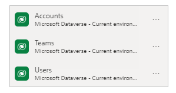
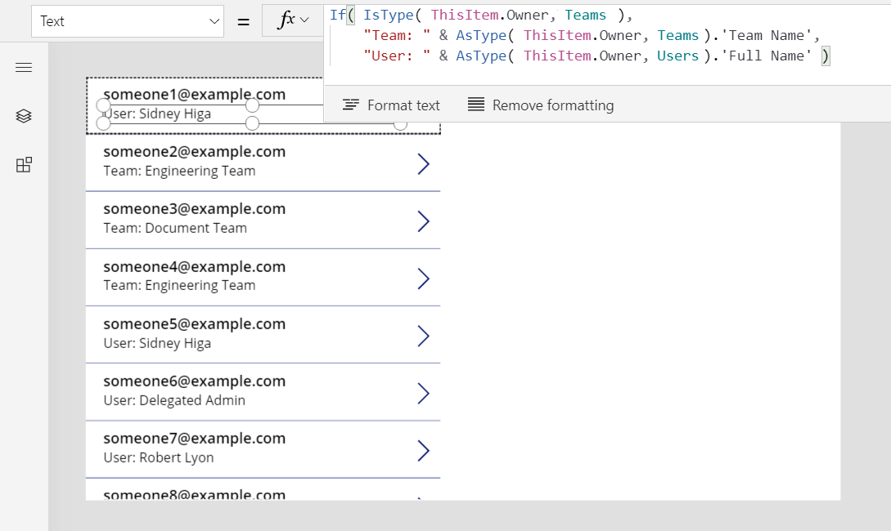
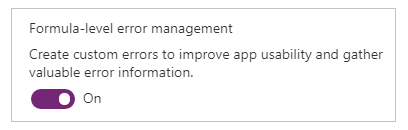
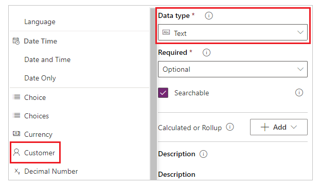
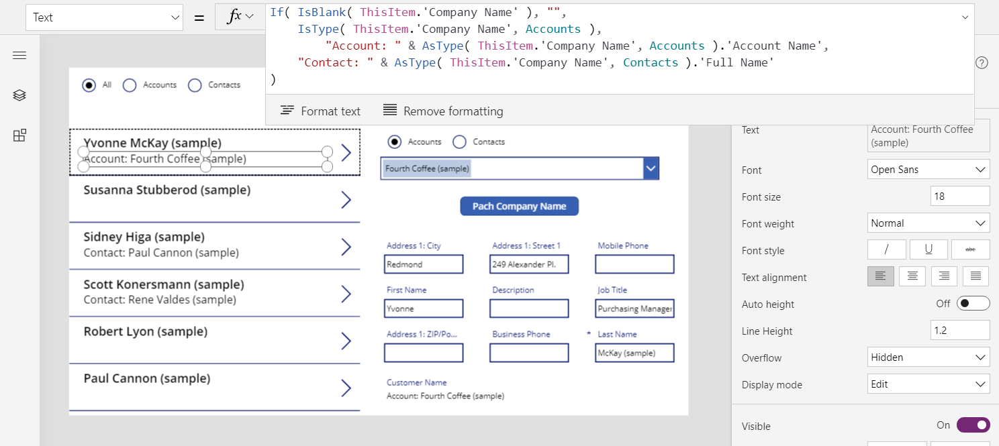
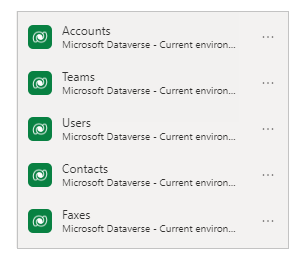
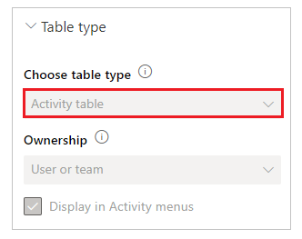
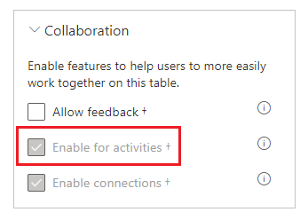
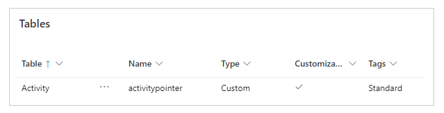
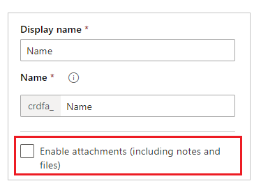

# Understand record references and polymorphic lookups in canvas apps

When you wrote a research paper in school, you probably provided a list of your references at the end. You didn't include a copy of the actual background material you used but rather a web link, book title and author, or other information so that someone could track down the original source. You mixed different kinds of sources in a single list, newspaper articles next to audio recordings, each with their own specific details for a proper citation. For example, Wikipedia articles often include a [long list of references](https://en.wikipedia.org/wiki/Microsoft#References).

In canvas apps, you often work with copies of records downloaded from data sources. You use the [**LookUp**](functions/function-filter-lookup.md) and [**Filter**](functions/function-filter-lookup.md) functions and the [**Gallery**](controls/control-gallery.md) control's **Selected** property to identify the specific record that you want. All the records from **Filter** or **Selected** will be of the same table type, so you can use fields with a simple .*Field* notation. These copies often include reference information so you can use the [**Patch**](functions/function-patch.md) function to update the original source.

Canvas apps also support *record references*. Much like a research-paper reference, a record reference refers to a record without including a complete copy of it. Such a reference can refer to a record in any table. Also like research-paper references, you can mix records from different tables in a single column.

Many operations on record references are identical to working with records. You can compare record references to each other and to full records. You can set a record reference's value with the **Patch** function just as you would a lookup with a full record.

There is one important usage difference: you can't directly access the fields of a record reference without first establishing to which table it refers. This is because canvas apps require that all types be known when you write formulas. Because you don't know the type of a record reference until the app is running, you can't use the simple .*Field* notation directly. You must first dynamically determine the table type with the [**IsType**](functions/function-astype-istype.md) function and then use .*Field* notation on the result of the [**AsType**](functions/function-astype-istype.md) function.

*Table type* refers to the schema of each record in a table. Each table has a unique set of fields with different names and data types. Each record of the table inherits that structure; two records have the same table type if they come from the same table.

> [!NOTE]
> You can choose from many different connectors to connect to different types of data sources for canvas apps. However, when working with canvas apps inside Power Apps Studio, **columns** in Microsoft Dataverse are referred to as **fields** similar to all other data sources. **Column** is only used when referring to a column inside Dataverse. More information: [Dataverse terminology updates](../data-platform/data-platform-intro.md#terminology-updates)

## Polymorphic lookups

Microsoft Dataverse supports relationships between records. Each record in the **Accounts** table has a **Primary Contact** lookup column to a record in the **Contacts** table. The lookup can only refer to a record in **Contacts** and can't refer to a record in, say, the **Teams** table. That last detail is important because you always know what columns will be available for the lookup.

Dataverse also supports polymorphic lookups, which can refer to a record from any table in a set. For example, the **Owner** column can refer to a record in the **Users** table or the **Teams** table. The same lookup column in different records could refer to records in different tables. In this case, you don't always know what columns will be available.

Canvas record references were designed for working with polymorphic lookups in Dataverse. You can also use record references outside of this context, which is how the two concepts differ.

In the next section, you'll start to explore these concepts by working with the **Owner** lookup.

## Show the columns of a record owner

Every table in Dataverse includes an **Owner** column. This column can't be removed, you can't add another, and it always requires a value.

To show that column in the **Account** table:

1. Sign in to [Power Apps](https://make.powerapps.com?utm_source=padocs&utm_medium=linkinadoc&utm_campaign=referralsfromdoc).
1. In the left pane bar, select **Data** > **Tables**.
1. In the list of tables, select **Account**.
1. In the upper-right corner, open the filter list (which is set to **Default** by default), and then select **All**.
1. Scroll down until the **Owner** column appears.

    

This lookup column can refer to a record from either the **Teams** table or the **Users** table. Not every record in these tables has permission to be an **Owner**; check the supported roles if you run into a problem.

This graphic shows a simple gallery of **Accounts**, where the **Accounts** table has been added to the app as a data source:

> [!div class="mx-imgBorder"]
> 

> [!IMPORTANT]
> Throughout this topic, the graphics show some names and other values that aren't part of the sample data that ships with Dataverse. The steps accurately demonstrate how to configure controls for a particular result, but your experience will vary based on the data for your organization.

To show the owner of each account in the gallery, you might be tempted to use the formula **ThisItem.Owner.Name**. However, the name field in the **Team** table is **Team Name**, and the name field in the **User** table is **Full Name**. The app can't know which type of lookup you're working with until you run the app, and it can vary between records in the **Accounts** table.

You need a formula that can adapt to this variance. You also need to add the data sources for the table types that **Owner** could be (in this case, **Users** and **Teams**). Add these three data sources to your app:



With these data sources in place, use this formula to display the name of either a user or a team:

```powerapps-dot
If( IsType( ThisItem.Owner, Teams ),
    "Team: " & AsType( ThisItem.Owner, Teams ).'Team Name',
    "User: " & AsType( ThisItem.Owner, Users ).'Full Name' )
```

> [!div class="mx-imgBorder"]
> 

In this formula, the **IsType** function tests the **Owner** field against the **Teams** table. If it's of that table type, the **AsType** function casts it to a **Team** record. At this point, you can access all the fields of the **Teams** table, including **Team Name**, by using the *.Field* notation. If **IsType** determines that the **Owner** isn't a record in the **Teams** table, that field must be a record in the **Users** table because the **Owner** field is required (can't be *blank*).

To use any fields of a record reference, you must first use the **AsType** function to cast it to a specific table type. You can't access fields directly from the **Owner** field because the system doesn't know what table type you want to use.

The **AsType** function returns an error if the **Owner** field doesn't match the table type being requested, so you can use the **IfError** function to simplify this formula. First, turn on the experimental feature **Formula-level error management**:



Then replace the previous formula with this one:

```powerapps-dot
IfError(
    "Team: " & AsType( ThisItem.Owner, Teams ).'Team Name',
    "User: " & AsType( ThisItem.Owner, Users ).'Full Name' )
```

## Filter based on an owner

Congratulations—you've finished the hardest aspect of working with a record reference. Other use cases are more straightforward because they don't access fields of the record. As a case in point, take filtering, which you'll explore in this section.

Add a **Combo box** control above the gallery, and set these properties of the new control:

- **Items**: `Users`
- **SelectMultiple**: `false`

> [!div class="mx-imgBorder"]
> 

To filter the gallery by a specific user selected from this combo box, set the gallery's **Items** property to this formula:

```powerapps-dot
Filter( Accounts, Owner = ComboBox1.Selected )
```

> [!div class="mx-imgBorder"]
> 

> [!IMPORTANT]
> The instructions in this topic are accurate if you follow the steps exactly. However, any formula that refers to a control by its name fails if the control has a different name. If you delete and add a control of the same type, the number at the end of the control's name changes. For any formula that shows an error, confirm that it contains the correct names of all controls.

You don't need to use **IsType** or **AsType** because you're comparing record references to other record references or to full records. The app knows the table type of **ComboBox1.Selected** because it's derived from the **Users** table. Accounts for which the owner is a team won't match the filter criterion.

You can get a little fancier by supporting filtering by either a user or a team.

1. Make some space near the top of the screen by resizing the gallery and moving the combo box, insert a [**Radio** control](controls/control-radio.md) above the gallery, and then set these properties for the new control:

    - **Items**: `[ "All", "Users", "Teams" ]`
    - **Layout**: `Layout.Horizontal`

1. For the **Combo box** control, set this property (if the combo box disappears, select **Users** in the radio control):

    - **Visible**: `Radio1.Selected.Value = "Users"`

1. Copy and paste the **Combo box** control, move the copy directly over the original, and then set these properties for the copy:

    - **Items**: `Teams`
    - **Visible**: `Radio1.Selected.Value = "Teams"`

    The app will display only one combo box at a time, depending on the state of the radio control. Because they're directly above one another, they'll appear to be the same control that changes its contents.

1. Finally, set the **Items** property of the **Gallery** control to this formula:

    ```powerapps-dot
    Filter( Accounts,
        Radio1.Selected.Value = "All"
        Or (Radio1.Selected.Value = "Users" And Owner = ComboBox1.Selected)
        Or (Radio1.Selected.Value = "Teams" And Owner = ComboBox1_1.Selected)
    )
    ```

    > [!div class="mx-imgBorder"]
    > 

With these changes, you can show all records or filter them based on either a user or a team:

> [!div class="mx-imgBorder"]
> 

The formula is fully delegable. The portion that's comparing the radio-button values is a constant across all records and is evaluated before the rest of the filter is sent to Dataverse.

If you want to filter on the type of the owner, you can use the **IsType** function, but it's not yet delegable.

> [!div class="mx-imgBorder"]
> 

## Update the owner by using Patch

You can update the **Owner** field in the same manner as any other lookup. To set the currently selected account's owner to the first team:

```powerapps-dot
Patch( Accounts, Gallery1.Selected, { Owner: First( Teams ) } )
```

This approach doesn't differ from a normal lookup because the app knows the type of **First( Teams )**. If you want the first user instead, replace that portion with **First( Users )**. The **Patch** function knows that the **Owner** field can be set to either of these two table types.

To add this capability to the app:

1. In the **Tree view** pane, select the **Radio** control and the two **Combo box** controls at the same time.

1. On the ellipsis menu, select **Copy these items**.

    > [!div class="mx-imgBorder"]
    > 

1. On the same menu, select **Paste**.

    > [!div class="mx-imgBorder"]
    > 

1. Move the copied controls to the right of the gallery.

    > [!div class="mx-imgBorder"]
    > 

1. Select the copied **Radio** control, and then change these properties:

    - Items: `[ "Users", "Teams" ]`
    - Default: `If( IsType( Gallery1.Selected.Owner, Users ), "Users", "Teams" )`

    > [!div class="mx-imgBorder"]
    >  

1. In the **Radio** control, select **Users** so that the **Combo box** control that lists users is visible.

1. Select the visible **Combo box** control, and then set the **DefaultSelectedItems** property to this formula:

    ```powerapps-dot
    If( IsType( Gallery1.Selected.Owner, Users ),
        AsType( Gallery1.Selected.Owner, Users ),
        Blank()
    )
    ```

    > [!div class="mx-imgBorder"]
    > 

1. In the **Radio** control, select **Teams** so that the **Combo box** control that lists teams is visible.

1. Select the **Radio** control to take selection away from the now-invisible **Combo box** control for users.

1. Select the visible **Combo box** control for teams, and then set its **DefaultSelectedItems** property to this formula:

    ```powerapps-dot
    If( IsType( Gallery1.Selected.Owner, Teams ),
        AsType( Gallery1.Selected.Owner, Teams ),
        Blank()
    )
    ```

    > [!div class="mx-imgBorder"]
    > 

1. Insert a **Button** control, move it under the **Combo box** control, and then set the button's **Text** property to `"Patch Owner"`.

1. Set the **OnSelect** property of the button to this formula:

    ```powerapps-dot
    Patch( Accounts, Gallery1.Selected,
        { Owner: If( Radio1_1.Selected.Value = "Users",
                     ComboBox1_2.Selected,
                     ComboBox1_3.Selected ) } )
    ```

    > [!div class="mx-imgBorder"]
    > 

The copied **Radio** and **Combo box** controls show the owner for the currently selected account in the gallery. With the same controls, you can set the owner of the account to any team or user by selecting the button:

> [!div class="mx-imgBorder"]
> 

## Show the owner by using a form

You can show an **Owner** field inside a form by adding a custom card. As of this writing, you can't change the value of the field with a form control.

1. Insert an **Edit form** control, and then resize and move it to the lower-right corner.

1. On the **Properties** tab near the right side of the screen, open the **Data source** list, and then select **Accounts**.

    > [!div class="mx-imgBorder"]
    >   

1. Set the form's **Item** property to `Gallery1.Selected`.

    > [!div class="mx-imgBorder"]
    > 

1. On the **Properties** tab near the right side of the screen, select **Edit fields**.

1. In the **Fields** pane, select the ellipsis, and then select **Add a custom card**.

    > [!div class="mx-imgBorder"]
    > 

    The new card appears at the bottom of the form control.

1. Resize the card as needed to show all the text.

    > [!div class="mx-imgBorder"]
    > 

1. Insert a **Label** control into the custom card, and then set the label's **Text** property to the formula that you used in the gallery:

    ```powerapps-dot
    If( IsType( ThisItem.Owner, Teams ),
        "Team: " & AsType( ThisItem.Owner, Teams ).'Team Name',
        "User: " & AsType( ThisItem.Owner, Users ).'Full Name' )
    ```

    > [!div class="mx-imgBorder"]
    > 

For each selection in the gallery, more fields of the account, including the record's owner, appear in the form. If you change the owner by using the **Patch** button, the form control also shows that change.

> [!div class="mx-imgBorder"]
> 

## Show the columns of a customer

In Dataverse, the **Customer** lookup column is another polymorphic lookup that's very similar to **Owner**.

**Owner** is limited to one per table, but tables can include zero, one, or more **Customer** lookup column. The **Contacts** system table includes the **Company Name** column, which is a **Customer** lookup column.


You can add more **Customer** lookup columns to a table by selecting the **Customer** data type for a new column.



A **Customer** lookup field can refer to a record from either the **Accounts** table or the **Contacts** table. You'll use the **IsType** and **AsType** functions with these tables, so now is a good time to add them as data sources (you can leave **Teams** and **Users** in place).


The treatment of the **Customer** and **Owner** fields is so similar that you can literally copy the app (**File** > **Save as**, and then specify a different name) and make these simple replacements:

| Location | **Owner** sample | **Customer** sample |
|----------|-----------|------------------|
| Throughout | **Owner** | **'Customer Name'** |
| Throughout | **Users** | **Accounts** |
| Throughout | **Teams** | **Contacts** |
| Gallery's **Items** property | **Accounts** | **Contacts** |
| Form's **Items** property | **Accounts** | **Contacts** |
| The first argument of **Patch**<br>in the button's **OnSelect** property | **Accounts** | **Contacts** |
| Filter radio's **Items** property | **[&nbsp;"All",&nbsp;"Users",&nbsp;"Teams"&nbsp;]** | **[&nbsp;"All",&nbsp;"Accounts",&nbsp;"Contacts"&nbsp;]** |
| Patch radio's **Items** property | **[ "Users", "Teams" ]** | **[ "Accounts", "Contacts" ]** |
| Combo box's **Visible** property | **"Users"** and **"Teams"** | **"Accounts"** and **"Contacts"** |

For example, the new gallery should have this **Items** property:

```powerapps-dot
Filter( Contacts,
    Radio1.Selected.Value = "All"
    Or (Radio1.Selected.Value = "Accounts" And 'Company Name' = ComboBox1.Selected)
    Or (Radio1.Selected.Value = "Contacts" And 'Company Name' = ComboBox1_1.Selected)
)
```

> [!div class="mx-imgBorder"]
> 

Two important differences between **Customer** and **Owner** require an update to the formulas inside the gallery and the form:

1. One-to-many relationships between **Accounts** and **Contacts** take precedence when you refer to these table types by name. Instead of **Accounts**, use **\[\@Accounts]**; instead of **Contacts**, use **\[\@Contacts]**. By using the [global disambiguation operator](functions/operators.md#disambiguation-operator), you ensure that you're referring to the table type in **IsType** and **AsType**. This problem exists only in the record context of the gallery and form controls.

1. The **Owner** field must have a value, but **Customer** fields can be *blank*. To show the correct result without a type name, test for this case with the [**IsBlank** function](functions/function-isblank-isempty.md), and show an empty text string instead.

Both of these changes are in the same formula, which appears in the custom card in the form, as well as in the **Text** property of the gallery's label control:

```powerapps-dot
If( IsBlank( ThisItem.'Company Name' ), "",
    IsType( ThisItem.'Company Name', Accounts ),
        "Account: " & AsType( ThisItem.'Company Name', Accounts ).'Account Name',
    "Contact: " & AsType( ThisItem.'Company Name', Contacts ).'Full Name'
)
```

> [!div class="mx-imgBorder"]
> 

With these changes, you can view and change the **Company Name** field in the **Contacts** table.

> [!div class="mx-imgBorder"]
> 

## Understand Regarding lookup columns

The **Regarding** lookup column differs a little from those that you've already worked with in this topic. You'll start by applying the patterns that this topic described earlier, and then you'll learn other tricks.

You can start simply with the **Faxes** table. This table has a polymorphic **Regarding** lookup column, which can refer to **Accounts**, **Contacts**, and other tables. You can take the app for **Customers** and modify it for **Faxes**.

| Location | **Customer** sample | **Faxes** sample |
|----------|-----------|------------------|
| Throughout | **'Customer Name'** | **Regarding** |
| Gallery's **Items** property | **Contacts** | **Faxes** |
| Form's **Items** property | **Contacts** | **Faxes** |
| The first argument of **Patch**<br> in the button's **OnSelect** property | **Contacts** | **Faxes** |

Again, you'll need to add a data source: this time for **Faxes**. On the **View** tab, select **Data sources**:



An important difference for **Regarding** is that it isn't limited to **Accounts** and **Contacts**. In fact, the list of tables is extensible with custom tables. Most of the app can accommodate this point without modification, but you must update the formula for the label in the gallery and the form:

```powerapps-dot
If( IsBlank( ThisItem.Regarding ), "",
    IsType( ThisItem.Regarding, Accounts ),
        "Account: " & AsType( ThisItem.Regarding, Accounts ).'Account Name',
    IsType( ThisItem.Regarding, Contacts ),
        "Contacts: " & AsType( ThisItem.Regarding, Contacts ).'Full Name',
    ""
)
```

> [!div class="mx-imgBorder"]
> 

After you make these changes, you work with the **Regarding** lookup just as you did the **Owner** and **Customer** lookups.

> [!div class="mx-imgBorder"]
> 

## Understand Regarding relationships

**Regarding** differs from **Owner** and **Customer** because the former involves a many-to-one relationship. By definition, a reverse, one-to-many relationship allows you to write **First( Accounts ).Faxes**.

Let's back up and look at the table definitions. In Dataverse, tables such as **Faxes**, **Tasks**, **Emails**, **Notes**, **Phone Calls**, **Letters**, and **Chats** are designated as [*activities*](../../developer/data-platform/activity-entities.md). You can also create your own [custom activity tables](../../developer/data-platform/custom-activities.md). When you view or create an activity table, its settings appear under **More settings**.



Other tables can be related to an activity table if they're enabled as an *activity task* in the table's settings. **Accounts**, **Contacts**, and many other standard tables are so designated (again, under **More settings**).



All activity tables and activity-task tables have an implied relationship. If you change the filter to **All** at the top of the screen, select the **Faxes** table, and then select the **Relationships** tab, all tables that can be a target of a **Regarding** lookup appear.


If you show the relationships for the **Accounts** table, all the tables that can be a source of a **Regarding** lookup field appear.


What does it all mean?

- When you write formulas, you must consider that the list of activity tables isn't fixed, and you can create your own. The formula must appropriately handle an activity table that you didn't expect.
- Activity tasks and activities have a one-to-many relationship. You can easily ask for all faxes that relate to an account.

To explore this concept in the app:

1. Add another screen.

    > [!div class="mx-imgBorder"]
    > 

1. Insert a gallery control, resize it, and then move it to the left side of the screen.

1. On the **Properties** tab near the right side of the screen, set the gallery's **Items** to **Accounts**.

    > [!div class="mx-imgBorder"]
    > 

1. Set the gallery's layout to **Title**, and then set the title field to **Account Name**.

    > [!div class="mx-imgBorder"]
    > 

1. Add a second gallery, resize it, and then move it to the right side of the screen.

1. Set the new gallery's **Items** property to `Gallery2.Selected.Faxes`.

    This step returns the filtered list of faxes for a given account.

    > [!div class="mx-imgBorder"]
    > 

1. Set the gallery's layout to **Title and subtitle**, and then set the title field to show the **Subject** field (which might be lowercase **subject**).

    > [!div class="mx-imgBorder"]
    > 

As you select an item in the list of accounts, the list of faxes shows faxes for only that account.

> [!div class="mx-imgBorder"]
> 

## Activity table

As the previous section describes, you can show all the faxes for an account. However, you can also show all the activities for an account, including faxes, email messages, phone calls, and other interactions.

For the latter scenario, you use the **Activity** table. You can show this table by turning on **All** in the upper-right corner to remove the filter from the list of tables.



The **Activity** table is special. Whenever you add a record to the **Faxes** table, the system also creates a record in the **Activity** table with the columns that are common across all activity tables. Of those columns, **Subject** is one of the most interesting.

You can show all activities by changing only one line in the previous example. Replace `Gallery2.Selected.Faxes` with `Gallery2.Selected.Activities`.

> [!div class="mx-imgBorder"]
> 

Records are coming from the **Activity** table, but you can nevertheless use the **IsType** function to identify which kind of activity they are. Again, before you use **IsType** with a table type, you must add the data source.


By using this formula, you can show the record type in a label control within the gallery:

```powerapps-dot
If( IsType( ThisItem, Faxes] ), "Fax",
    IsType( ThisItem, 'Phone Calls' ), "Phone Call",
    IsType( ThisItem, 'Email Messages' ), "Email Message",
    IsType( ThisItem, Chats ), "Chat",
    "Unknown"
)
```

> [!div class="mx-imgBorder"]
> 

You can also use **AsType** to access the fields of the specific type. For example, this formula determines the type of each activity and, for phone calls, shows the phone number and call direction from the **Phone Numbers** table:

```powerapps-dot
If( IsType( ThisItem, Faxes ), "Fax",
    IsType( ThisItem, 'Phone Calls' ),
       "Phone Call: " &
       AsType( ThisItem, 'Phone Calls' ).'Phone Number' &
       " (" & AsType( ThisItem, 'Phone Calls' ).Direction & ")",
    IsType( ThisItem, 'Email Messages' ), "Email Message",
    IsType( ThisItem, Chats ), "Chat",
    "Unknown"
)
```

> [!div class="mx-imgBorder"]
> 

As a result, the app shows a complete list of activities. The **Subject** field appears for all types of activities, whether the formula takes them into account or not. For types of activities that you know about, you can show their type names and type-specific information about each activity.

> [!div class="mx-imgBorder"]
> 

## Notes table

So far, all of the **Regarding** examples have been based on activities, but the **Notes** table represents another case.

When you create a table, you can enable attachments.



If you select the check box for enabling attachments, you'll create a **Regarding** relationship with the **Notes** table, as this graphic shows for the **Accounts** table:


Other than this difference, you use the **Regarding** lookup in the same manner in which you use activities. Tables that are enabled for attachments have a one-to-many relationship to **Notes**, as in this example:

`First( Accounts ).Notes`

> [!NOTE]
> As of this writing, the **Regarding** lookup isn't available for the **Notes** table. You can't read or filter based on the **Regarding** column, and you can't set the column by using **Patch**.
>
> However, the reverse **Notes** one-to-many relationship is available, so you can filter a list of notes for a record that's enabled for attachments. You can also use the [**Relate**](functions/function-relate-unrelate.md) function to add a note to a record's **Notes** table, but the note must be created first, as in this example:
>
>`Relate( ThisItem.Notes, Patch( Notes, Defaults( Notes ), { Title: "A new note" } ) )`

## Activity parties

As of this writing, canvas apps don't support activity parties.


[!INCLUDE[footer-include](../../includes/footer-banner.md)]