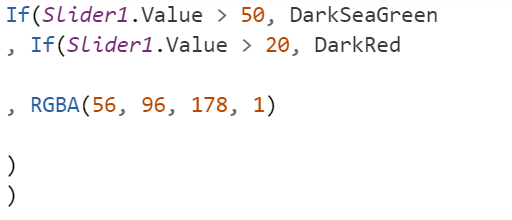

# Convert rules to expressions

The capability to create rules in canvas apps for automated app modification based on specified criteria will be removed. This feature was retired in 2019 and will now be fully removed.

You'll have a few months to convert the rules into expressions using a converter. If there are any rules remaining in your canvas app that haven't been converted by the end of this period, the system will perform the conversion automatically.

> [!IMPORTANT]
> Effective October 14, 2019, the rules feature in canvas apps is deprecated. More information: [Blog: Canvas Rules feature deprecation](https://powerapps.microsoft.com/blog/canvas-rules-feature-deprecation/).

## Convert rules

When you edit an app that has rules, you'll receive a prompt to convert them. The converter helps in migrating the rules within your app to a format that is compatible with future versions of Power Apps Studio. By utilizing the rules conditions in your app, the converter substitutes the references with corresponding inline expressions.

Follow these steps to convert rules in your app:

1. Open your app for editing and go to the Rules panel.
2. On the warning message, select **Convert rules**.

   > [!div class="mx-imgBorder"] 
   > 

3. A dialog opens, which shows all the rules which will be converted. The rule name is shown on the left, and its associated conditional expression is shown on the right. On the **Convert rules** dialog box, select **Convert now**.

   > [!div class="mx-imgBorder"] 
   >

When the conversion is complete, a notification appears to alert you whether the conversion was successful. Formulas that previously referenced rule names have been updated to directly use their associated conditional expression instead.

Before the conversion, the Power Fx formula references rule names in the formula in place of their associated conditional expressions.

> [!div class="mx-imgBorder"] 
> 

After the conversion, rule name references have been removed and replaced. In this example, **Rule2** was converted to **Slider1.Value > 50**.

> [!div class="mx-imgBorder"] 
> 

## Reverting the conversion

When the conversion is done, the rules are converted to the corresponding expression. During the conversion period, you can revert your changes to bring the rules back to your app for review and troubleshooting if necessary. While in the same session, you can use the Undo button or Ctrl-Z to revert the rule conversion. If you save the app, you can restore the previous version to revert the change. However, you will be prompted to convert the rules again the next time the app is opened for editing.

## Known Issues

If your rules are in an error state or are empty, they will be replaced with the following formula: Boolean(Blank()). This formula preserves the behavior of rules in this state.

[!INCLUDE[footer-include](../../includes/footer-banner.md)]
