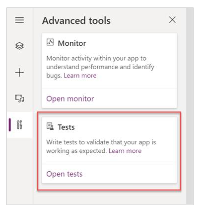
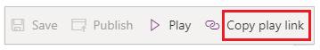

# Working with Test Studio

In this quickstart, you'll create tests for a canvas app called Kudos. You can also explore and discover testing concepts and apply them to writing tests for your own canvas apps. The sample Kudos app is part of a suite of employee engagement apps available to download from [Employee Experience Starter Kit](https://powerapps.microsoft.com/en-us/blog/powerapps-employee-experience-starter-kit).

Watch this video to learn how to work with Test Studio:
> [!VIDEO https://www.microsoft.com/videoplayer/embed/RWLvMa]

## Open Test Studio

1. Sign in to [Power Apps](https://make.powerapps.com).

2. Create a [new app](get-started-test-drive.md) or [edit an existing app](edit-app.md).

3. Save your app to Power Apps to open Test Studio. 
    
    > [!NOTE]
    > You must save an app before you can write tests for the app.

4. Select **Advanced tools** in the left navigation.

5. Select **Open tests** to open the Test Studio for this application. This action opens Test Studio in a new browser tab.

    

> [!NOTE]
> Tests are published and stored in the app package. Exporting and importing a canvas app package to another environment will also include all the test definitions such as test suites and test cases you have created. 

## Create a test suite

By default, a test suite and test case are created for you in Test Studio. Test suites are used to organize your test cases. An app can contain one or more test suites. You can use the default test suite and case to begin writing your tests immediately or create a new test suite.

1. Select **New suite**.
2. Update the **Test suite name and description** by selecting the fields on the main grid.

    

## Create a test case

Depending on how you want to organize or group your tests, you can create multiple test cases in a test suite. Each case can test a specific feature or a subset of functionalities in your app.

1. Select a test suite.
2. Select **New Case** in the top menu to create a new case.
3. Update the **Test case name and description** by selecting the fields on the main grid.

 

## Record a test case

A test case consists of test steps that contain actions. Test actions are written using Power Apps expressions that perform a task. You can use the recorder to automatically generate the test steps as you interact with your app. After you record, you can update the test case, add new steps, delete steps, and write test assertions to validate the result of your test.

> [!NOTE]
> Only a published app plays in record mode. Publish any recent changes to the app before you start recording a test case. Recording without publishing recent changes causes the last published version of the app to play in record mode.

1. Select **Record** from the top menu. This action opens the published app with recording mode in a new browser tab.

    > [!IMPORTANT]
    > Recording on an existing test case overrides any existing test steps already present.

    

2. Interact with your app. Your actions are  **recorded** in the left pane.

3. Once interaction completes, select **Done**. Optionally, you can select **Cancel** to return to Test Studio without your interactions getting recorded. 

    

4. View the test steps and the expressions that were automatically generated for you in Test Studio.

5. Edit the step description text in the main grid if necessary. You can also update the test step actions by selecting the formula on the main grid.

    

### Add test steps and test assertions

Every test case should have an expected result. In the Kudos example, one of the expected results of sending a kudo is creating a new record in the Microsoft Dataverse (Dataverse) database. You'll now update the test case and add additional test steps to validate that a record was created successfully.

Follow these steps to verify a successful record creation:

- Initialize a variable for the kudo record count in the database at the beginning of the test case.
- Initialize a variable for the kudo record count in the database at the end of the test case.
- Write a test assertion expression to validate it incremented by one count. If the count doesn't increase by one, the test assertion fails, and your test case fails.

To add test steps and test assertions in the Kudos app:

1. Select Step 1 or the step above which you want to insert a new step. 

2. Select **Insert a step above** from the top menu or by selecting the option from the active row. This action creates an empty step.

    

    > [!NOTE]
    > When you select **Insert step above**, a new blank step is added above the current step. You can also use **Assert**, **SetProperty**, **Select** or **Trace** actions instead. This adds a step with a respective action formula that you can edit.

3. Update the step description. For example, "Count Kudo in database".

4. Enter an expression or formula into the action input to count the records in the database before executing the test.

    You can use any supported expression. You can also query any data sources, collections, variables, or run flows that are contained in your app, and create new global variables or collections to use in your tests.

    ```powerapps-dot
    Set(kudosBeforeTest, CountRows(Filter(Kudos, Receiver.Email = "someone@example.com")))```

5. Select Step 2 or the step above which you want to insert a new step.

6. Select **Insert a step above** from the top menu or by selecting the option from the active row. This action creates an empty step.

7. Enter an expression or formula in the action input to [Trace](./functions/function-trace.md) and write the *kudosBeforeTest* value to the test results record.

    ```powerapps-dot
    Trace("kudosBeforeTest : " & kudosBeforeTest);
    ```

    

8. Go to the bottom of the test case and insert a new step to count the records in the database after the test has completed.

    ```powerapps-dot
    Set(kudosAfterTest, CountRows(Filter(Kudos, Receiver.Email = "someone@example.com")))```

9. Add a final step to validate that the record count in the database has increased by a count of 1, and enter the following assertion action to verify:

    ```powerapps-dot
    Assert(kudosAfterTest = kudosBeforeTest + 1, "Kudos count incorrect. Expected : " & kudosBeforeTest + 1  & " Actual :" & kudosAfterTest)
    ```

    

10. Save the test case from the top-right menu in Test Studio. 

## Play back your test

You can play back your recorded test to validate app functionality. You can play back all tests within a single test suite, or a single test case. 

Before you play the recording back with recent changes, you must publish the app:


> [!IMPORTANT]
> If you skip publishing, the recording  playback will not contain your recent test changes. The last published test case or suite will play  against the app.

1. Select **Publish** to automatically save and publish your test.

    

2. Select either a test suite or a single test case.

3. Select **Play**. The published app opens in **Play** mode, and you can see your test steps playing back automatically. A green check mark indicates when a test step is executed successfully. If a step fails, a red failure indicator along with a failure message is displayed.

    

4. Select **Done** to return to Test Studio.

### Failed assertion

In this section, you'll change the test assertion to experience a failed test:

1. Edit the assertion step by selecting the expression box.

2. Update ```+ 1``` to ```+ 2``` in test action. This update means that the test  expects two records to be created, which is incorrect. If the test is successful, only one record should be created in the database.

    ```powerapps-dot
    Assert(kudosAfterTest = kudosBeforeTest + 2, "Kudos count incorrect. Expected : " & kudosBeforeTest + 2  & " Actual :" & kudosAfterTest)
    ```

    

3. Select **Publish**.

4. Select **Play**.

5. View the test playing back. The final step now fails and shows an error and the message you provided in the assertion step.  

    

### Playing tests in a browser

You can copy a link to play a test in separate browser outside Test Studio. It helps integrate your tests in a continuous build and release pipeline such as **Azure DevOps**.

The play link for the selected test is persisted. It doesn't change for the test suite or test case. You can update your tests  without the need to modify build and release processes.

To play tests in your browser:

1. Select a test suite or test case in the right pane.

2. Select **Copy play link**.

    

3. You're prompted to publish your tests if there are any unpublished changes.

    

4. You can select to skip the publish process and copy the play link. New test changes don't play if you skip.

    

5. Open a browser and paste the URL into the address bar to play the test.

6. View your test playing back.

## Setup your tests

The **OnTestCaseStart** property of a Test Suite can be used to setup your test. The expression entered for this property triggers for every test case in a suite before the case begins executing. **OnTestCaseStart** helps you avoid writing the same test steps at the beginning of every case. You can customize this property to run set up tasks that are common to all cases in the suite such as:

- Always starting test execution from the first screen. 
- Initializing common collections or variables. 
- Fetching test data from a data source for the current executing test 

The **TestCaseInfo** record contains details for the current test that is executing. It contains the following properties:

- *TestCaseName* – the name of the test case.
- *TestCaseDescription* – the description of the test case.
- *TestCaseId* – the ID of the test case.
- *TestSuiteName* – the test suite name that the case belongs to.
- *TestSuiteDescription* – the description of the test suite.
- *TestSuiteId* – the test suite ID that the case belongs to.

In the below example, you'll customize the **OnTestCaseStart** property so every test case begins from the first screen in your app. You'll also fetch the test data from a data source that can be referenced in the steps for the test case.

1. Select **Test** in the left pane or **View** on the suite header.

    

2. Select the **OnTestCaseStart** action.

3. Input an expression to Navigate to first screen and fetch the test data for your test. 

    ```powerapps-dot
    //Start every cases on the first screen in the Kudos app
    Navigate('Dashboard Screen');

    //Initialize my test data for the current case. 
    Set(currentTestData, LookUp(KudosTestData, TestCase = TestCaseInfo.TestCaseName));

    //Set kudosBeforeTest to 0
    Set(kudosBeforeTest, 0)
    ```
    

## Processing test results

The test panel visible when playing back tests in Test Studio isn't visible when using a browser. Because of this behavior, you can't determine the specific test step that executes, or if a test passes or fails.

To determine test results outside of Test Studio, there are two properties called **OnTestCaseComplete** and **OnTestSuiteComplete** available in the test object that you can use to process the results of your tests. When integrating tests into a continuous build and release pipeline like **Azure DevOps**, these properties can be used to determine if you should proceed with the app deployment.

The expression entered for these properties triggers when each case or suite completes. You can customize these properties to process and send the results of your tests to various data sources or services such as:

- SQL Server.
- Dataverse.
- Power Automate.
- Email using Office 365.

These settings apply to every test suite or test case in your app. After each test suite or test case completes, the test results and any trace messages contained in the tests are available in the **TestCaseResult** and **TestSuiteResult** records.

The **TestCaseResult** record contains the following properties:

- *TestCaseName* – the name of the test case.
- *TestCaseDescription* – the description of the test case.
- *TestCaseId* – the ID of the test case.
- *TestSuiteName* – the test suite name that the case belongs to.
- *TestSuiteDescription* – the description of the test suite.
- *TestSuiteId* – the test suite ID that the case belongs to.
- *StartTime* – the start execution time of the test.
- *EndTime* – the end execution time of the test.
- *Traces* – the result of any test assertions and any messages from the Trace function.
- *Success* – indicates if the test case completed successfully.
- *TestFailureMessage* – if the case failed, the failure message.

The **TestSuiteResult** record contains the following properties: 

- *TestSuiteName* – the test suite name.
- *TestSuiteDescription* – the description of the test suite. 
- *TestSuiteId* – the test suite ID.
- *StartTime* – the start execution time of the test suite.
- *EndTime* – the end execution time of the test suite.
- *TestsPassed* – the number of test cases that completed successfully in the suite.
- *TestsFailed* - the number of test cases that failed in the suite.

In this quickstart, you'll create two custom tables in the Dataverse database to store the test results by customizing the **OnTestCaseComplete** and **OnTestSuiteComplete** properties:

1. Select **Test** in the left pane or **View** on the suite header.

    

2. Select the **OnTestCaseComplete** action.

3. Input an expression to process the results of your test. The following sample saves each test case's results to the custom AppTestResults table in Dataverse. The test results can optionally be stored to SQL, SharePoint, or any other data source. You might need to set or increase the Trace field in your data source as required.

    > [!NOTE]
    > The following samples connect to Microsoft Dataverse. You can create a [simple app](data-platform-create-app.md) or [build an app from scratch](data-platform-create-app-scratch.md) using Dataverse. Also, refer to the [Patch](./functions/function-patch.md) function reference for more details to modify records of a data source used in the following samples.

    ```powerapps-dot
    //Save to Dataverse
    Patch(AppTestResults
    , Defaults(AppTestResults)
    , {
             TestPass: TestCaseResult.TestCaseName & ":" & Text(Now())
             ,TestSuiteId: TestCaseResult.TestSuiteId
             ,TestSuiteName: TestCaseResult.TestSuiteName
             ,TestCaseId: TestCaseResult.TestCaseId
             ,TestCaseName: TestCaseResult.TestCaseName
             ,StartTime: TestCaseResult.StartTime
             ,EndTime: TestCaseResult.EndTime
             ,TestSuccess: TestCaseResult.Success
             ,TestTraces: JSON(TestCaseResult.Traces)
             ,TestFailureMessage: TestCaseResult.TestFailureMessage
    }
    );
    ```
    

4. Select the **OnTestSuiteComplete** action.

5. Input an expression to process the results of your test. In the following sample, you'll save each test suite's results to the custom AppTestSuiteResults table in Dataverse. 

    ```powerapps-dot
    //Save to Dataverse
    Patch(AppTestSuiteResults
        , Defaults(AppTestSuiteResults)
        , {
             TestSuiteId: TestSuiteResult.TestSuiteId
             ,TestSuiteName: TestSuiteResult.TestSuiteName
             ,StartTime: TestSuiteResult.StartTime
             ,EndTime: TestSuiteResult.EndTime
             ,TestPassCount: TestSuiteResult.TestsPassed
             ,TestFailCount: TestSuiteResult.TestsFailed
        }
    );
    ```

    

Other examples of expressions you could use in these properties are:

- Send results to a flow in Power Automate.

    ```powerapps-dot
    MyTestResultsFlow.Run(JSON(TestCaseResult))
    ```

- Email your results.

    ```powerapps-dot
    Office365.SendMailV2("someone@example.com", "Test case results", JSON(TestCaseResult, JSONFormat.IndentFour))
    ```

- Receive an app notification of the test result.

  For example, receive a notification after the test completes when playing the test in a browser, outside of Test Studio.

    ```powerapps-dot
    Notify(TestCaseResult.TestCaseName & " : "
            & If( TestCaseResult.Success
                , " Passed"
                , TestCaseResult.TestFailureMessage)
            ,If(  TestCaseResult.Success
                , NotificationType.Success
                , NotificationType.Error)
    )
    ```

## Test Functions

In addition to the [functions](formula-reference.md) available in Power Apps, the following are common functions that you'll typically use when authoring tests:

- [Select](./functions/function-select.md)
- [SetProperty](./functions/function-setproperty.md)
- [Assert](./functions/function-assert.md)
- [Trace](./functions/function-trace.md)

## Next steps

- [Automate tests with Azure Pipelines using classic editor](test-studio-classic-pipeline-editor.md)


[!INCLUDE[footer-include](../../includes/footer-banner.md)]
