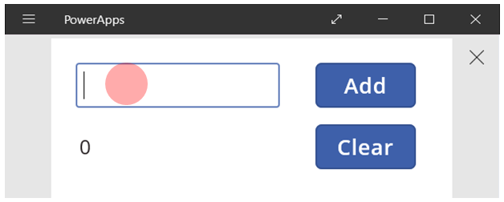
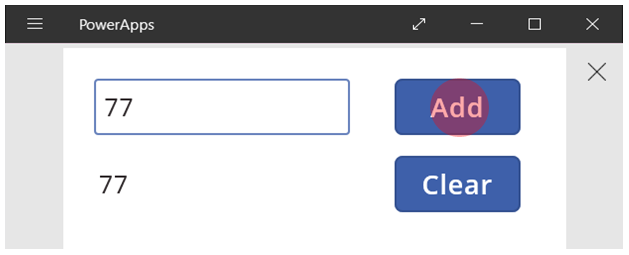
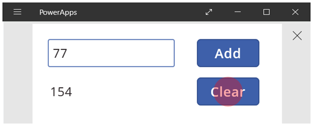
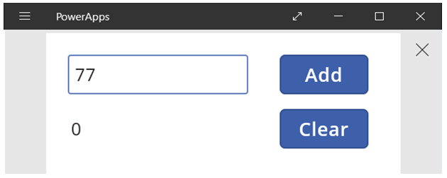
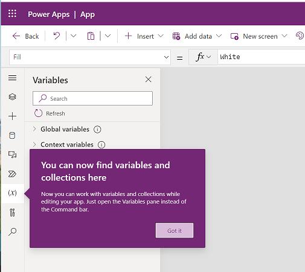
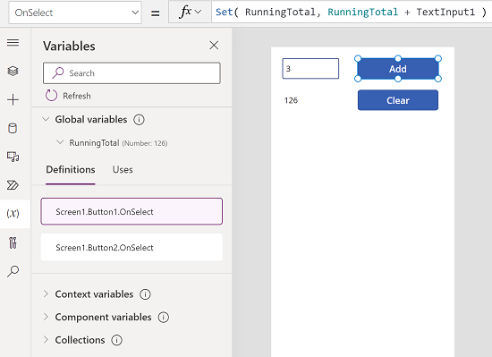

# Understand variables in canvas apps

If you've used another programming tool, like Visual Basic or JavaScript, you might ask: **Where are the variables?** Power Apps works differently and needs a different approach. Instead of reaching for a variable when you build a canvas app, ask yourself: **What would I do in Excel?**

In other tools, you might explicitly perform a calculation and store the result in a variable. But Power Apps and Excel automatically recalculate formulas as the input data changes, so you usually don't need to create or update variables. By using this approach, you more easily create, understand, and maintain your app.

Sometimes, you need to use variables in Power Apps, which extends Excel's model by adding [behavior formulas](working-with-formulas-in-depth.md). These formulas run when, for example, a user selects a button. Within a behavior formula, it's often helpful to set a variable for use in other formulas.

In general, avoid using variables. But sometimes only a variable lets you create the experience you want. Variables are implicitly created and typed when they appear in functions that set their values. 

## Translate Excel into Power Apps

### Excel

Let's review how Excel works. A cell can have a value, like a number or a string, or a formula that's based on the values of other cells. When you enter a different value into a cell, Excel automatically recalculates any formulas that depend on the new value. You don't need to do any programming to enable this behavior.

In the following example, cell **A3** uses the formula **A1+A2**. If **A1** or **A2** changes, **A3** automatically recalculates to show the change. This behavior doesn't require any coding outside of the formula itself.

Excel doesn't have variables. The value of a cell with a formula changes based on its input, but there's no way to remember the result of a formula and store it in a cell or anywhere else. If you change a cell's value, the entire spreadsheet can change, and any previously calculated values are lost. You can copy and paste cells, but that's manual and isn't possible with formulas.

### Power Apps

Apps you create in Power Apps work a lot like Excel. Instead of updating cells, you add controls anywhere on a screen and name them for use in formulas.

For example, you can copy the Excel behavior in an app by adding a **[Label](controls/control-text-box.md)** control named **Label1**, and two **[Text input](controls/control-text-input.md)** controls named **TextInput1** and **TextInput2**. If you set the **[Text](controls/properties-core.md)** property of **Label1** to **TextInput1 + TextInput2**, it always shows the sum of the numbers in **TextInput1** and **TextInput2** automatically.

Notice that the **Label1** control is selected, showing its **[Text](controls/properties-core.md)** formula in the formula bar at the top of the screen. The formula **TextInput1 + TextInput2** creates a dependency between these controls, just like dependencies between cells in an Excel workbook. Let's change the value of **TextInput1**:

The formula for **Label1** automatically recalculates and shows the new value.

In Power Apps, you use formulas to set not only the main value of a control but also properties like formatting. In the next example, a formula for the **[Color](controls/properties-color-border.md)** property of the label automatically shows negative values in red. The **[If](functions/function-if.md)** function looks familiar from Excel:

`If( Value(Label1.Text) < 0, Red, Black )`

You use formulas for many scenarios:

* When your device's GPS is on, a map control shows your current location with a formula that uses **Location.Latitude** and **Location.Longitude**. As you move, the map automatically tracks your location.
* Other users update [data sources](working-with-data-sources.md). For example, others on your team might update items in a list. When you refresh a data source, any dependent formulas automatically recalculate to show the updated data. For example, you might set a gallery's **[Items](controls/properties-core.md)** property to the formula **Filter( SharePointList )**, which automatically shows the newly filtered set of [records](working-with-tables.md#records).

### Benefits

Using formulas to build apps has many advantages:

* If you know Excel, you know Power Apps. The model and formula language are the same.
* If you've used other programming tools, think about how much code you'd need to do these examples. In Visual Basic, you'd write an event handler for the change event on each text-input control. The code to do the calculation in each is redundant and can get out of sync, or you'd need to write a common subroutine. In Power Apps, you do all of that with a single, one-line formula.
* To see where **Label1**'s text comes from, you know exactly where to look: the formula in the **[Text](controls/properties-core.md)** property. There's no other way to change the text of this control. In a traditional programming tool, any event handler or subroutine can change the value of the label, from anywhere in the program. This makes it hard to track down when and where a variable changed.
* If you change a slider control and then change your mind, you can change the slider back to its original value. It's as if nothing ever changed: the app shows the same control values as before. There are no consequences for experimenting and asking "what if," just like in Excel.  

In general, if you can do something with a formula, you're better off. Let the formula engine in Power Apps work for you.  

## Know when to use variables

Let's change our simple adder to act like an old-fashioned adding machine with a running total. When you select the **Add** button, you add a number to the running total. When you select the **Clear** button, you reset the running total to zero.

| Display | Description |
|----|----|
|   | When the app starts, the running total is 0.  The red dot represents the user's finger in the text-input box, where the user enters **77**. |
|  | The user selects the **Add** button. |
|  | 77 is added to the running total.  The user selects the **Add** button again. |
|  | 77 is again added to the running total, resulting in 154.  The user selects the **Clear** button. |
|  | The running total is reset to 0. |

Our adding machine uses something that doesn't exist in Excel: a button. In this app, you can't use only formulas to calculate the running total because its value depends on a series of actions that the user takes. Instead, you record and update the running total manually. Most programming tools store this information in a *variable*.

Sometimes you need a variable for your app to behave the way you want, but this approach comes with caveats:

* You manually update the running total. Automatic recalculation doesn't do it for you.
* The running total isn't calculated based on the values of other controls. It depends on how many times the user selects the **Add** button and what value is in the text-input control each time. Did the user enter 77 and select **Add** twice, or did they enter 24 and 130 for each addition? You can't tell the difference after the total reaches 154.
* Changes to the total can come from different actions. In this example, both the **Add** and **Clear** buttons update the total. If the app doesn't behave the way you expect, which button causes the problem?

## Use a global variable

To create an adding machine, you need a variable to hold the running total. The simplest variables to use in Power Apps are *global variables*.  

How global variables work:

* Set the value of a global variable with the **[Set](functions/function-set.md)** function.  **Set( MyVar, 1 )** sets the global variable **MyVar** to a value of **1**.
* Use the global variable by referencing the name used with the **Set** function.  In this case, **MyVar** returns **1**.
* Global variables can hold any value, including strings, numbers, records, and [tables](working-with-tables.md).

Rebuild the adding machine by using a global variable:

1. Add a text-input control named **TextInput1**, and two buttons named **Button1** and **Button2**.

1. Set the **[Text](controls/properties-core.md)** property of **Button1** to **"Add"**, and set the **Text** property of **Button2** to  **"Clear"**.

1. To update the running total when a user selects the **Add** button, set its **[OnSelect](controls/properties-core.md)** property to this formula:

    **Set( RunningTotal, RunningTotal + TextInput1 )**

    This formula creates **RunningTotal** as a global variable that holds a number because of the **+** operator. Reference **RunningTotal** anywhere in the app. When the user opens the app, **RunningTotal** has an initial value of *blank*.

    The first time a user selects the **Add** button and **[Set](functions/function-set.md)** runs, **RunningTotal** is set to the value **RunningTotal + TextInput1**.

    

1. To set the running total to **0** when the user selects the **Clear** button, set its **[OnSelect](controls/properties-core.md)** property to this formula:

    **Set( RunningTotal, 0 )**

    

1. Add a **[Label](controls/control-text-box.md)** control, and set its **[Text](controls/properties-core.md)** property to **RunningTotal**.

    This formula automatically recalculates and shows the user the value of **RunningTotal** as it changes based on the buttons the user selects.

    

1. Preview the app. Enter a number in the text box and select the **Add** button a few times. When ready, return to the authoring experience using the <kbd>Esc</kbd> key.

    

1. To show the global variable's value, select **Variables** on the app authoring menu.

      
      

1. To show all the places where the variable is defined and used, select it under **Global variables**.

      

## Types of variables

Power Apps has three types of variables:

| Variable type | Scope | Description | Functions that establish |
| --- | --- | --- | --- |
| Global variables |App |Use global variables to hold a number, text string, Boolean, record, table, or other value that you reference anywhere in the app. |[**Set**](functions/function-set.md) |
| Context variables |Screen |Use context variables to pass values to a screen, like parameters in other languages. You reference them from only one screen. |[**UpdateContext**](functions/function-updatecontext.md) [**Navigate**](functions/function-navigate.md) |
| Collections |App |Use collections to hold a table that you reference anywhere in the app. You can change the contents of the table, and save it to the local device for later use. |[**Collect**](functions/function-clear-collect-clearcollect.md) [**ClearCollect**](functions/function-clear-collect-clearcollect.md) |

## Create and remove variables

Variables are created implicitly when they appear in a **Set**, **UpdateContext**, **Navigate**, **Collect**, or **ClearCollect** function. To declare a variable and its type, just include it in any of these functions anywhere in your app. These functions don't create variables; they only fill variables with values. You never declare variables explicitly like you might in another programming tool, and all typing is implicit from usage.

For example, you might have a button control with an **OnSelect** formula equal to **Set( X, 1 )**. This formula establishes **X** as a variable with a type of number. You use **X** in formulas as a number, and that variable has a value of *blank* after you open the app but before you select the button. When you select the button, you give **X** the value of **1**.

If you add another button and set its **OnSelect** property to **Set( X, "Hello" )**, an error occurs because the type (text string) doesn't match the type in the previous **Set** (number). All implicit definitions of the variable must agree on type. Again, all this happens because you mention **X** in formulas, not because any of those formulas actually run.

Remove a variable by removing all the **Set**, **UpdateContext**, **Navigate**, **Collect**, or **ClearCollect** functions that implicitly establish the variable. Without these functions, the variable doesn't exist. Also remove any references to the variable because they cause an error.

## Variable lifetime and initial value

Variables stay in memory while the app runs. When the app closes, the values in variables are lost.

Store the contents of a variable in a data source by using the **Patch** or **Collect** functions. Store values in collections on the local device by using the [**SaveData**](functions/function-savedata-loaddata.md) function.

When the user opens the app, all variables start with an initial value of *blank*.

## Reading variables

Use the variable's name to read its value. For example, define a variable with this formula:

`Set( Radius, 12 )`

Then use **Radius** anywhere you use a number, and it's replaced with **12**:

`Pi() * Power( Radius, 2 )`

If you give a context variable the same name as a global variable or a collection, the context variable takes precedence. You can reference the global variable or collection by using the [disambiguation operator](functions/operators.md#disambiguation-operator) **[@Radius]**.

### Reserved variable names

Don't use any of the following variable names. These names are app properties, and using them can cause variable name collisions that result in unexpected app behavior.

- ActiveScreen
- DesignHeight
- DesignWidth
- Height
- MinScreenHeight
- MinScreenWidth
- SizeBreakpoints
- StudioVersion
- TestCaseId
- Testing
- TestSuiteId
- Theme
- Width

## Use a context variable

Let's look at how you create an adding machine by using a context variable instead of a global variable.

How context variables work

* You implicitly establish and set context variables by using the **[UpdateContext](functions/function-updatecontext.md)** or **[Navigate](functions/function-navigate.md)** function. When the app starts, the initial value of each context variable is *blank*.
* You update context variables with records. In other programming tools, you usually use "=" for assignment, like "x = 1". For context variables, use **{ x: 1 }** instead. When you use a context variable, use its name directly without the record syntax.
* You can also set a context variable when you use the **[Navigate](functions/function-navigate.md)** function to show a screen. If you think of a screen as a kind of procedure or subroutine, this approach is like parameter passing in other programming tools.
* Except for **[Navigate](functions/function-navigate.md)**, context variables are limited to the context of a single screen, which is where they get their name. You can't use or set them outside this context.
* Context variables can hold any value, including strings, numbers, records, and [tables](working-with-tables.md).

Rebuild the adding machine by using a context variable:

1. Add a text-input control, named **TextInput1**, and two buttons, named **Button1** and **Button2**.

2. Set the **[Text](controls/properties-core.md)** property of **Button1** to **"Add"**, and set the **Text** property of **Button2** to  **"Clear"**.

3. To update the running total whenever a user selects the **Add** button, set its **[OnSelect](controls/properties-core.md)** property to this formula:

    **UpdateContext( { RunningTotal: RunningTotal + TextInput1 } )**

    This formula establishes **RunningTotal** as a context variable that holds a number because of the **+** operator. You reference **RunningTotal** anywhere in this screen. When the user opens the app, **RunningTotal** has an initial value of *blank*.

    The first time the user selects the **Add** button and **[UpdateContext](functions/function-updatecontext.md)** runs, **RunningTotal** is set to the value **RunningTotal + TextInput1**.

    

4. To set the running total to **0** whenever the user selects the **Clear** button, set its **[OnSelect](controls/properties-core.md)** property to this formula:

    **UpdateContext( { RunningTotal: 0 } )**

    Again, use **[UpdateContext](functions/function-updatecontext.md)** with the formula **UpdateContext( { RunningTotal: 0 } )**.

    

5. Add a **[Label](controls/control-text-box.md)** control, and set its **[Text](controls/properties-core.md)** property to **RunningTotal**.

    This formula will automatically be recalculated and show the user the value of **RunningTotal** as it changes based on the buttons that the user selects.

    

1. Preview the app. Enter a number in the text box and select the **Add** button a few times. When you're ready, return to the authoring experience by using the <kbd>Esc</kbd> key.

    

1. Set the value of a context variable while navigating to a screen to pass "context" or "parameters" from one screen to another. To demonstrate this technique, insert a screen, insert a button, and set its **OnSelect** property to this formula:

    **Navigate( Screen1, None, { RunningTotal: -1000 } )**

    

    Hold down the <kbd>Alt</kbd> key while you select this button to show **Screen1** and set the context variable **RunningTotal** to -1000.

    

1. To show the value of the context variable, do one of the following:

   - If you're using the preview version of Power Apps Studio, select **Variables** in the app authoring menu.
    
   - If you're using the classic version of Power Apps Studio, select the **File** menu, and then select **Variables** in the left pane.

1. To show where the context variable is defined and used, select it under **Context variables**.

## Use a collection

Let's create an adding machine by using a collection. Because a collection holds a table that's easy to change, this adding machine keeps a "paper tape" of each value as you enter it.

How collections work

* Create and set collections by using the **[ClearCollect](functions/function-clear-collect-clearcollect.md)** function. You can use the **[Collect](functions/function-clear-collect-clearcollect.md)** function instead, but it requires another variable instead of replacing the old one.
* A collection is a type of data source and a table. To get a single value in a collection, use the **[First](functions/function-first-last.md)** function, and get one field from the resulting record. If you use a single value with **[ClearCollect](functions/function-clear-collect-clearcollect.md)**, this is the **Value** field, as in this example: 
**First(** *VariableName* **).Value**

Create an adding machine by using a collection:

1. Add a **[Text input](controls/control-text-input.md)** control, named **TextInput1**, and two buttons, named **Button1** and **Button2**.

2. Set the **[Text](controls/properties-core.md)** property of **Button1** to **"Add"**, and set the **Text** property of **Button2** to **"Clear"**.

3. To update the running total whenever a user selects the **Add** button, set its **[OnSelect](controls/properties-core.md)** property to this formula:

    **Collect( PaperTape, TextInput1.Text )**

    The mere existence of this formula establishes **PaperTape** as a collection that holds a single-column table of text strings. You can reference **PaperTape** anywhere in this app. Whenever a user opens this app, **PaperTape** is an empty table.

    When this formula runs, it adds the new value to the end of the collection. Because we're adding a single value, **Collect** automatically places it in a single-column table, and the column's name is **Value**, which you'll use later.

    

4. To clear the paper tape when the user selects the **Clear** button, set its **[OnSelect](controls/properties-core.md)** property to this formula:

    **Clear( PaperTape )**

    label.](media/working-with-variables/papertape-3.png)

6. To run the adding machine, press F5 to open Preview, enter numbers in the text-input control, and select buttons.

    

1. To return to the default workspace, select <kbd>Esc</kbd>.

8. To display the paper tape, insert a **Data table** control, and set its **[Items](controls/properties1. To see the values in your collection, do one of the following:

   - If you're using the preview version of Power Apps Studio, select **Variables** in the app authoring menu, and then select **Collections**.

   - If you're using the classic version of Power Apps Studio, select **Collections** on the **File** menu.. To see the values in your collection, do one of the following:

   - If you're using the preview version of Power Apps Studio, select **Variables** in the app authoring menu and then select **Collections**. 
    
   - If you're using the classic versionof Power Apps Studio, select **Collections** on the **File** menu.

1. To store and get your collection, add two more button controls, and set their **Text** properties to **Load** and **Save**. Set the **OnSelect** property of the **Load** button to this formula:

     **Clear( PaperTape ); LoadData( PaperTape, "StoredPaperTape", true )**

     You need to clear the collection first because **LoadData** will append the stored values to the end of the collection.

     

11. Set the **OnSelect** property of the **Save** button to this formula:

     **SaveData( PaperTape, "StoredPaperTape" )**

     

1. Preview again by selecting <kbd>F5</kbd>, enter numbers in the text input control, and select buttons. Select the **Save** button. Close and reload the app, and select the **Load** button to reload your collection.

> [!NOTE]
> **SaveData** and **LoadData** functions work in Power Apps Mobile but not Power Apps Studio or the web player for Power Apps.

[!INCLUDE[footer-include](../../includes/footer-banner.md)]
