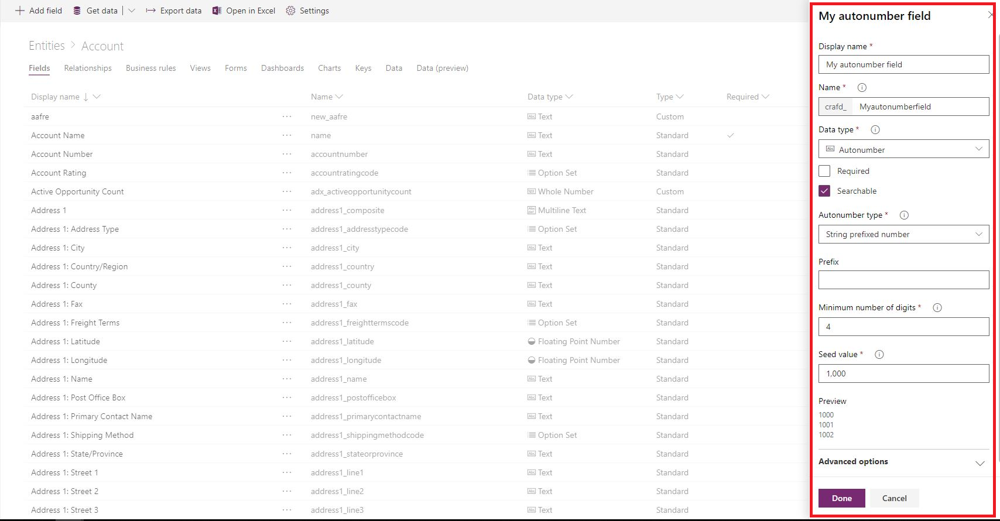

# Autonumber fields

Autonumber fields are fields that automatically generate alphanumeric strings whenever they are created. Makers can customize the format of these fields to their liking, and then rely on the system to generate matching values that automatically fill them in at runtime.

While autonumber fields are formally just text fields with additional functionality built on top of them, [PowerApps](https://web.powerapps.com/?utm_source=padocs&utm_medium=linkinadoc&utm_campaign=referralsfromdoc) simplifies this concept by simply exposing **Autonumber** as a distinct data type under the **Text** category. It is important to note that the [classic solution explorer](use-solution-explorer.md#classic-solution-explorer) doesn't support creating or managing autonumber fields.

To create an autonumber field, follow the same steps to [create a field](create-edit-field-portal.md#create-a-field) and simply select **Autonumber** from the **Data type** drop-down list box. 

You may also activate autonumber functionality on an existing text field by opening the field and selecting **Autonumber** from the **Data type** drop-down list box. Similarly, autonumber functionality can also be disabled at any time by opening the field and selecting a different option in the **Data type** drop-down list box.

> [!NOTE]
>Autonumber values are preselected by the database when the record is started. If a record is started but cancelled, the number it was assigned is not used. If, during this time, another record is completed with the next sequential number, gaps will be present in the autonumbering of records.

## Autonumber types

In order to make the creation of autonumber fields easier, there are a few pre-defined default autonumber types to capture the most common scenarios. 

### String prefixed number

The most common autonumber format is a simple string prefixed number. When this type is selected, the autonumber will consist of an automatically incrementing number with an optional string constant prefix. 
For example, a string prefixed number with the prefix *Contoso* would generate records such as *Contoso-1000*, *Contoso-1001*, *Contoso-1002*, and so on.

### Date prefixed number

Another common autonumber format is a date prefixed number. When this type is selected, the autonumber will consist of an automatically incrementing number with a formatted date prefix. The date portion of the record will reflect the current date and time at which the record was created in UTC time. We have provided a number of various date formats to choose from.
For example, a date prefixed number would generate records such as *2019-26-02-1000*, *2019-27-02-1000*, *2019-28-02-1000*, and so on, depending on the current date and selected date format.

### Custom

For more advanced makers with specific use cases, we provide the option to fully customize the desired format of an autonumber field. The format may consist of string constants, automatically incrementing numbers, formatted dates, or random alphanumeric sequences.
For detailed information about how to define custom formats, see [AutoNumberFormat options](https://docs.microsoft.com/dynamics365/customer-engagement/developer/create-auto-number-attributes#autonumberformat-options).

## Seed values

The seed value of an autonumber field is the starting number that is used for the number portion of the format. 
For example, if you want an autonumber field to generate records such as *Contoso-1000*, *Contoso-1001*, *Contoso-1002*, and so on, then the desired seed value is 1000, because that is the value that your number sequence starts with. 
Autonumber fields have a default seed value of 1000, but you may set a custom seed value if you wish. 

> [!IMPORTANT]
> Setting the seed only changes the current number value for the specified attribute in the current environment. The seed value is not included in a solution when it's imported in a different environment. 

## Create an autonumber field
  
1.  Sign in to the [PowerApps portal](https://web.powerapps.com/?utm_source=padocs&utm_medium=linkinadoc&utm_campaign=referralsfromdoc).
  
2.  On the left pane expand **Data** and select **Entities**.
  
3.  Select the entity that you would like to add an autonumber field to and then select the **Fields** tab.
  
4.  On the toolbar, select **Add** field.  
  
5.  On the right pane, enter a **Display name** and select **Autonumber** for the **Data type**.

    > [!div class="mx-imgBorder"] 
    > 
  
6. Set optional fields as needed. More information: [Create and edit fields](create-edit-field-portal.md#create-a-field)

7. Select an autonumber type or keep the default **String prefixed number** option.

8. Customize a seed value or keep the default value of **1000**.

9. Select **Done**.

## See also
 [Create and edit fields for Common Data Service using PowerApps portal](create-edit-field-portal.md)
