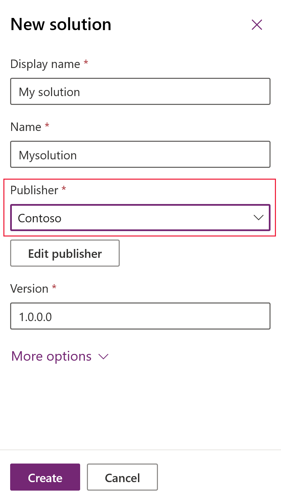
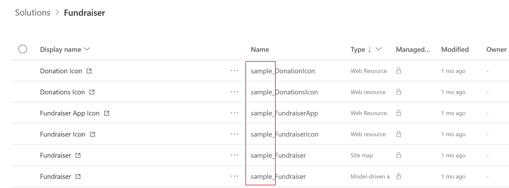

# Solution publisher overview

Every app you create or customization you make is part of a solution. Every solution has a publisher. You specify the publisher when you create a solution. 

> [!div class="mx-imgBorder"] 
> 

The solution publisher specifies who developed the app. The prefix can provide a quick way to understand which solution added the item. For these reasons, you should create a solution publisher and specify a prefix that is meaningful. This is especially important when viewing metadata items included from imported solutions. For example, the solution that contains the fundraiser sample app uses *sample* as the publisher prefix. 

> [!div class="mx-imgBorder"] 
> 

> [!NOTE]
> When you change a solution publisher prefix, you should do it before you create any new apps or metadata items. You can't change the names of metadata items. 

## Common Data Services Default Solution
The default solution in Power Apps is the Common Data Services Default Solution, which is associated with the Common Data Service Default Publisher. The default publisher prefix will be randomly assigned for this publisher, for example it could be *cr8a3*. This means that the name of every new item of metadata created in the default solution will have this prepended to the names used to uniquely identify the items. If you create a new entity named *Animal*, the unique name used by Common Data Service would be *cr8a3_animal*. The same is true for any new fields (attributes), relationships, or optionset options. If you will be customizing the default solution, consider changing the publisher prefix. 

## Create a solution publisher
1.	In the Power Apps portal, select Settings (gear), and then select Advanced settings. 
2.	Select **Settings** > **Customizations** > **Publishers**. 
3.	In the **Publisher Main View** command bar, select **New**. 
4.	Enter the required information: 
   - **Display Name**. Enter the display name for the publisher. 
   - **Name**. Enter the unique name for the publisher. 
   - **Prefix**. Enter the publisher prefix you want. 
   -	**Option Value Prefix**. This field generates a number based on the publisher prefix. This number is used when you add options to option sets and provides an indicator of which solution was used to add the option. 
   - **Contact Details**. Optionally, you can add contact and address information.

## Change a solution publisher
You can change a solution publisher for an unmanaged solution by following these steps:
1.	In the Power Apps portal, select **Solutions**, select **…** next to the solution you want, and then select **Settings**. 
2.	In the **Solution settings** pane, select **Edit publisher**. 
3.	Edit the **Display name** and **Prefix** fields to the values you want. The **Option Value Prefix** field generates a number based on the publisher prefix. This number is used when you add options to option sets and provides an indicator of which solution was used to add the option. 
4.	In addition to the prefix, you can also change the solution publisher display name, contact information, and address in the **Contact Details** section. 
5.	Select **Save and Close**.

### See also
[Create a solution](create-solution.md)