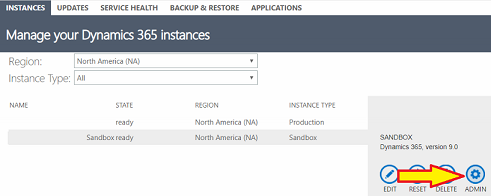
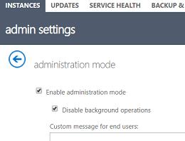
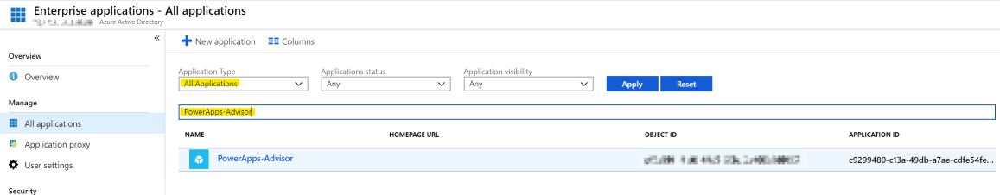

# Common issues and resolutions for Solution Checker

This article lists some common issues that you might encounter while using Solution Checker. Where applicable, workarounds are provided.

## You're unable to use Solution Checker to run analysis or download results

Shortly after submitting a Solution Checker request to run an analysis or download results the operation doesn't complete and an error message is displayed, such as:

> *"We weren't able to run the check on **[Solution Name]** solution. Try running it again."*

Whenever possible, Solution Checker attempts to return a specific error message with a link to details about the potential cause and resolution steps. Select **'Learn more'** for details.

Failures that occur during background processing of the analysis will fail with **'Couldn't be completed'** status and return an error message in the PowerApps portal as well as send email notification to the requestor. 

Selecting the portal notification will link to this page of common issues for further troubleshooting. If one of the provided common issues does not resolve the problem, a reference number is also returned. Provide this reference number to Microsoft Support for further investigation.

## Solution Checker fails due to unsupported version of PowerApps Checker

Solution Checker is a feature enabled by the PowerApps Checker app.  If you have installed a PowerApps Checker app version earlier than version **1.0.0.47**, Solution Checker runs may fail to complete successfully. You should upgrade your PowerApps Checker version from the [!INCLUDE [pn-dyn-365-admin-center](../../includes/pn-dyn-365-admin-center.md)]. 

However, if you have a PowerApps Checker version earlier than version **1.0.0.45** installed, we recommend that you delete the solution and install it again. Due to recent schema changes, upgrade of PowerApps Checker from versions earlier than version **1.0.0.45** may fail.

If you want to keep the past results from Solution Checker, export the results from a previous run or export all Solution Checker data using [Export data to Excel](../../user/export-data-excel.md) to export the data from the following entities:

- Analysis Component
- Analysis Job
- Analysis Result
- Analysis Result Detail

### How to uninstall PowerApps Checker

To uninstall the PowerApps Checker solution:

1. As a System Administrator or as a System Customizer, open the PowerApps portal by going to https://web.powerapps.com/environments.
2. Select **Solutions**.
3. Select **PowerApps Checker**, and then on the solutions toolbar select **Delete**.

### How to install PowerApps Checker

To install PowerApps Checker back into your Common Data Service environment:

1. As a System Administrator or as a System Customizer, open up your PowerApps portal by going to https://web.powerapps.com/environments.
2. Select **Solutions**.
3. On the solution toolbar select **Solution Checker**, and then select **Install**.

## Solution Checker can't access organizations in Administration Mode

Organizations that have been placed into [Administration Mode](https://docs.microsoft.com/en-us/dynamics365/customer-engagement/admin/manage-sandbox-instances#administration-mode) purposely restrict access to only users with System Administrator and System Customizer roles. Because the PowerApps Checker application identity has neither of these roles assigned by default, it can't access organizations operating in this mode.

In order to use Solution Checker in this organization, Adminstration Mode must be disabled.

### How to disable administration mode

To disable administration mode for an organization instance:

1. Open the Dynamics 365 instance picker: https://port.crm.dynamics.com/G/Instances/InstancePicker.aspx.
2. Select the organization instance that has issues running Solution Checker.
3. Select **ADMIN**. 

4. Clear **Enable administration mode**, and then select **Save**. 

5. Run Solution Checker again.

## Solution Checker fails due to missing security roles

The application user for Solution Checker requires two security roles assigned in order to provide the necessary privileges to communicate with the Common Data Service organization. If either of these roles are not assigned to the user **'PowerApps Checker'**,  attempts to run analysis, download results, and run cancelation will fail. This occurs most often when customers have automation in place that removes security roles from unexpected users. The following security roles contain minimum required permissions:

- Export Customizations
- Solution Checker

### How to assign missing security roles

To assign missing security roles to the PowerApps Checker user:

1. Open your Common Data Service organization and navigate to **Settings** > **Security** > **Users**.
2. Select the **'PowerApps Checker'** user from the list of users.
3. Select **MANAGE ROLES** on the command bar.
4. Select **'Export Customizations'** and **'Solution Checker'** role checkboxes, and then select **OK**. 

5. Run Solution Checker again.

## Solution Checker fails due to restricted access mode

The application user for Solution Checker requires an access mode of **'Non-Interactive'** or **'Read-Write'** in order to communicate with the Common Data Service organization. If the access mode has been changed to another value such as **'Administrative'**, then attempts to run analysis, download results, and run cancelation will fail.

To resolve this issue, you must update the **'PowerApps Checker'** application user with 'Non-interactive' access mode.

### How to update user access mode

To update the access mode for the PowerApps Checker user:

1. Open your Common Data Service organization and navigate to **Settings** > **Security** > **Users**.
2. Select the **'PowerApps Checker'** user from the list of users and double-click to open the user form.
3. Scroll to the **'Administration'** > **'Client Access License (CAL) Information'** section of the form.
4. Select **'Non-interactive'** in the **Access Mode** drop-down control. 

5. Save and close the user form.
6. Run Solution Checker again.

## Solution Checker fails due to disabled first-party application in AAD

The first-party enterprise application identity used by Solution Checker (PowerApps-Advisor) should not be disabled in Azure Active Directory (AAD). If disabled, the identity cannot authenticate when requesting bearer tokens for Common Data Service and other required resource providers on-behalf of the requesting user. 

Follow the below steps to verify that the application identity hasn't been disabled in AAD and if necessary enable the application.

### How to verify and/or modify application enabled status

To verify and/or modify the enabled status of the PowerApps-Advisor enterprise application identity

1. Access your tenant in the [Azure Active Directory (AAD) Portal](https://aad.portal.azure.com/).
2. Navigate to **Enterprise Applications**.
3. Select **All Application** and search for **'PowerApps-Advisor'**. 

4. Select **'PowerApps-Advisor'** to view the app details.
5. Select **Properties**.
6. Check the state of **Enabled for users to sign-in**. If **'No'**, then the application has been disabled. 

7. Select the radio control to switch the value to **'Yes'**. This enables the application. 

8. Select **Save**. The application is now enabled. You may need to wait a few minutes for change to propagate.
9. Run Solution Checker again.

> [!IMPORTANT]
> You must have administrator privileges in Azure Active Directory (AAD) in order to edit enterprise applications.

## Solution Checker fails to export solutions with draft Business Process Flow components

If a solution contains a business process flow component in draft state that has never been previously activated, then Solution Checker will fail to export the solution for analysis. This error is not unique to Solution Checker and is caused by the business process flow having a dependency on a backing (custom) entity component that doesn't get created until the business process flow is activated for the first time. This issue can also occur if a business process flow is activated from within Solution Explorer.

Reference [KB Article #4337537: Invalid Export - Business Process Entity Missing](https://support.microsoft.com/en-hk/help/4337537/invalid-export-business-process-entity-missing) for details about the issue and steps to resolve.

## Solution Checker fails to export patched solutions

If a solution has had a [patch](https://docs.microsoft.com/powerapps/developer/common-data-service/create-patches-simplify-solution-updates) applied, Solution Checker will fail to export the solution for analysis. When a solution has had a patch applied, the original solution becomes locked and it can’t be changed or exported as long as there are dependent patches that exist in the organization that identify the solution as the parent solution.

To resolve this issue, clone the solution so that all patches related to the solution are rolled into the newly-created solution. This unlocks the solution and allows the solution to be exported from the system.  For more information, see [Clone a Solution](use-segmented-solutions-patches-simplify-updates.md#clone-a-solution).

## Solution Checker will not analyze empty solutions

If Solution Checker exports a solution that contains no components to analyze, it will terminate further processing and consider the run a failure. Ensure that the selected solution submitted for a Solution Checker analysis contains at least one component.

## Solution Checker fails to export large solutions

The primary scenario for failure to export a large solution from the Common Data Service environment involves a timeout exception on the export request. This will occur if the request exceeds 20 minutes. Large solutions, such as the Default Solution, may fail to get exported within this timeframe, and the check will not complete successfully. If Solution Checker encounters a timeout during export, it will retry three times before it fails to process the job, so it may take over an hour before you receive a failure notification.

The workaround is to create smaller solutions with fewer components to be analyzed. If the large file size of the solution is due to many plug-in assembly components, please see guidance to [Optimize custom assembly development](../../developer/common-data-service/best-practices/business-logic/optimize-assembly-development.md). 

> [!IMPORTANT]
> To minimize false positives, ensure you add dependent customizations. When you create a solution and add these components, include the following:
> - When you add plug-ins, include the SDK Message Processing Steps for the plug-in.
> - When you add entity forms, include the JavaScript web resources attached to the form events.  
> - When you add JavaScript web resources, include any dependent JavaScript web resources.
> - When you add HTML web resources, include any dependent scripts that are defined within the HTML web resource.
> - When you add custom workflows, include the assembly used within the workflow.

## Line number references for issues in HTML resources with embedded JavaScript are not correct 

When HTML web resources are processed within Solution Checker, the HTML web resource is processed separately than the JavaScript within the HTML web resource. Due to this, the line number of the violation found within `<script>` of the HTML web resource will not be correct.

## Web-unsupported-syntax issue for web resources

ECMAScript 6 (2015) or later versions are not currently supported for Solution Checker. When Solution Checker analyzes JavaScript using ECMAScript 6 or later, a web-supported-syntax issue for the web resource is reported.  

## Multiple violations reported for plug-ins and workflow activities based on call scope

For plug-in and workflow activity rules where the issue is only relevant in the calling context, the Solution Checker tool starts its analysis at the IPlugin interface implementation and traverses a call graph to detect issues within the scope of that implementation.  In some cases, many call paths may arrive at the same location where the issue is detected.  Since the issue is relevant to the call scope, the tool may report based on that scope to provide a better picture of impact rather than on distinct locations. As a result, multiple issues may reference a single location that should be fixed.

## See also
[Best practices and guidance for the Common Data Service](../../developer/common-data-service/best-practices/index.md) 
[Best practices and guidance for model-driven apps](../../developer/model-driven-apps/best-practices/index.md) 
