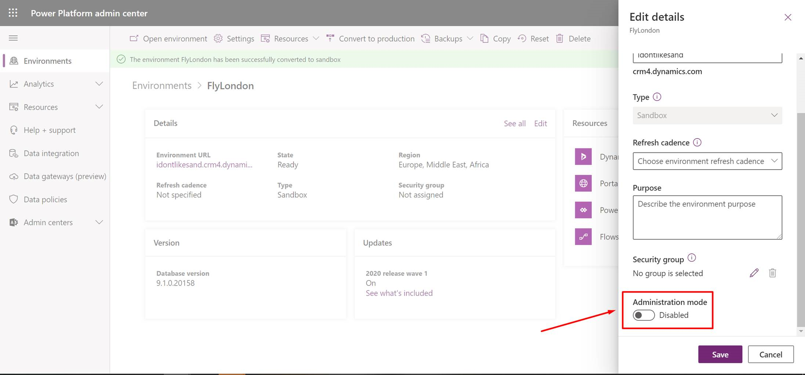

# Common issues and resolutions for Solution Checker

This article lists some common issues that you might encounter while using Solution Checker. Where applicable, workarounds are provided.

## Solution Checker runs fail due to PowerApps Checker version installed
Solution Checker is a feature included with the PowerApps Checker solution.  If you have a PowerApps Checker version earlier than 1.0.0.47, Solution Checker runs will fail to complete successfully. You should upgrade your PowerApps Checker version from the [!INCLUDE [pn-dyn-365-admin-center](../../includes/pn-dyn-365-admin-center.md)]. 

However, if you have a PowerApps Checker version earlier than 1.0.0.45 installed, we recommend that you delete the solution and install it again. Due to recent schema changes, upgrade of PowerApps Checker from versions earlier than 1.0.0.45 may fail.

If you want to keep the past results from Solution Checker, export the results from a previous run or export all Solution Checker data using [Export data to Excel](../../user/export-data-excel.md) to export the data from the following entities:

- Analysis Component
- Analysis Job
- Analysis Result
- Analysis Result Detail

### Delete PowerApps Checker

To delete the PowerApps Checker solution:

1. As a System Administrator or as a System Customizer, open the PowerApps portal by going to https://web.powerapps.com/environments.
2. Select **Solutions**.
3. Select **PowerApps Checker**, and then on the solutions toolbar select **Delete**.

### Add PowerApps Checker

To add PowerApps Checker back to your CDS for Apps environment:

1. As a System Administrator or as a System Customizer, open up your PowerApps portal by going to https://web.powerapps.com/environments.
2. Select **Solutions**.
3. On the solution toolbar select **Solution Checker**, and then select **Install**.

## Runs on large solutions fail

Solution Checker has a 10-minute timeout for exporting a solution from the Common Data Service (CDS) for Apps environment. Large solutions, like the Default Solution, may fail to get exported within this time, and the check will not complete successfully. Solution Checker will retry three times before it fails to process the job, so it may take over 30-minutes before you receive a failure notification.

To address this issue, check or create smaller solutions to be analyzed. To minimize false positives, ensure you add dependent customizations. When you create a solution and add these components, include the following:

- When you add plug-ins, include the SDK Message Processing Steps for the plug-in.
- When you add entity forms, include the JavaScript web resources attached to the form events.  
- When you add JavaScript web resources, include any dependent JavaScript web resources.
- When you add HTML web resources, include any dependent scripts that are defined within the HTML web resource.
- When you add custom workflows, include the assembly used within the workflow.

## Solution Checker Run or Download Results fail due to instance in Administration mode
Shortly after running Solution Checker, it fails shortly after with the following message bar: 
"We weren't able to run the check on SOLUTIONNAME Solution. Try running it again."

The issue is that the organization is in Administration state and Solution Checker is unable to validate the user's permissions executing the request.

1. Access the Dynamics 365 Instance Picker: https://port.crm.dynamics.com/G/Instances/InstancePicker.aspx
2. Click on the instance having issues
3. Click on ADMIN 

4. Uncheck "Enable administration mode"  

## Solution Checker will not process patched solutions

If a solution has had a [patch](https://docs.microsoft.com/powerapps/developer/common-data-service/create-patches-simplify-solution-updates) applied, Solution Checker will fail to export the solution for analysis. When a solution has had a patch applied, the original solution becomes locked and it can’t be changed or exported as long as there are dependent patches that exist in the organization that identify the solution as the parent solution.

To address this issue, clone the solution so that all patches related to the solution are rolled into the newly-created solution. This unlocks the solution and allows the solution to be exported from the system. More information: [Clone a solution](use-segmented-solutions-patches-simplify-updates.md#clone-a-solution)

## Line number references for issues in HTML resources with embedded JavaScript are not correct 

When HTML web resources are processed within Solution Checker, the HTML web resource is processed separately than the JavaScript within the HTML web resource. Due to this, the line number of the violation found within `<script>` of the HTML web resource will not be correct.

## Web-unsupported-syntax issue for web resources

ECMAScript 6 (2015) or later versions are not currently supported for Solution Checker. When Solution Checker analyzes JavaScript using ECMAScript 6 or later, a web-supported-syntax issue for the web resource is reported.  

## See also
[Best practices and guidance for the Common Data Service for Apps](../../developer/common-data-service/best-practices/index.md) 
[Best practices and guidance for model-driven apps](../../developer/model-driven-apps/best-practices/index.md) 
