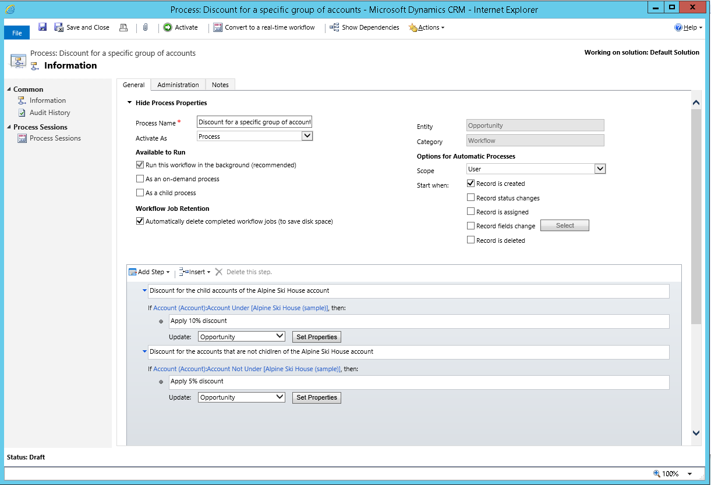

# Configure workflow steps

In this tutorial, you learn how to design a workflow. 

When configuring workflows you have four major areas to consider:  
  
-   When to start them?  
  
-   Should they run as a real-time workflow or a background workflow?  
  
-   What actions should they perform?  
  
-   Under what conditions actions should be performed?  
  
 The [Workflows processes overview](../common-data-service/workflow-processes.md) topic shows how to find workflow processes, when to start them, and if they should run as real time or background. This topic shows which actions workflows can perform and conditions to perform those actions.  
  
   

## Workflow stages and steps  

 When you design workflows you have the option to contain the logic you want to perform in stages and steps.  
  
 **Stages**  
 Stages make the workflow logic easier to read, and explain the workflow logic. However, stages do not affect the logic or behavior of workflows. If a process has stages, all the steps within the process must be contained with a stage.  
  
 **Steps**  
 Steps are a unit of business logic within a workflow. Steps can include conditions, actions, other steps, or a combination of these elements.  
  
  
 
## Actions that workflow processes can perform  

 Workflow processes can perform the actions listed in the following table.  
  
|Action|Description|  
|------------|-----------------|  
|**Create Record**|Creates a new record for an entity and assigns values you choose to attributes.|  
|**Update Record**|You can update the record that the workflow is running on, any of the records linked to that record in an N:1 relationships, or any records created by earlier steps.|  
|**Assign Record**|You can assign the record that the workflow is running on, any of the records linked to that record with an N:1 relationship, or any records created by earlier steps.|  
|**Send Email**|Sends an email. You can choose to create a new email message or use an email template configured for the entity of the record that the workflow is running on or any entities that have an N:1 relationship with the entity, or the entity for any records created by earlier steps.|  
|**Start Child Workflow**|Starts a workflow process that has been configured as a child workflow.|  
|**Change Status**|Changes the status of the record that the process is running on, any of the records linked to that record with an N:1 relationship, or any records created by earlier steps.|  
|**Stop Workflow**|Stops the current workflow. You can set a status of either **Succeeded** or **Cancelled** and specify a status message.   When real-time workflows are configured for an event, stopping a workflow with a status of cancelled will prevent the event action from completing. See [Using real-time workflows](configure-workflow-steps.md#BKMK_SynchronousWorkflows) for more information.|  
|**Custom Step**|Developers can create custom workflow steps that define actions. There are no custom steps available by default.|  
  
### Setting record values  

 When you create a record you can set values for the record. When you update a record you can set, append, increment, decrement, multiply, or clear values.  
  
 When you select **Set Properties**, a dialog opens showing you the default form for the entity.  
  
 At the bottom of the dialog you can see a list of additional fields not present in the form.  
  
 For any field, you can set a static value and that will be set by the workflow.  
  
 On the right side of the dialog the **Form Assistant** gives you the ability to set or append dynamic values from the context of the current record. This includes values from related records that can be accessed from the N:1 (many-to-one) relationships for the entity.  
  
 The options available in the **Form Assistant** depend on the field you have selected in the form. When you set a dynamic value, you will see a yellow placeholder known as a ‘slug’ that shows where the dynamic data will be included. If you want to remove the value, just select the slug and delete it. For text fields, you can use a combination of static and dynamic data.  
  
 With dynamic values you don’t know for certain that a field or related entity has the value you want to set. You can actually set a number of fields to try and set the value and sort them in order using the green arrows. If the first field doesn’t have data, the second field will be tried and so on. If none of the fields have data, you can specify a default value to be used.  
  
   

## Setting conditions for workflow actions  

 The actions that you will apply often depend on conditions. Workflow processes provide several ways to set conditions and create branching logic to get the results you want. You can check values of the record that the workflow process is running against, any of the records linked to that record with an N:1 relationship, or values within the process itself  
  
|Condition Type|Description|  
|--------------------|-----------------|  
|**Check Condition**|A logical "if-\<condition> then" statement.   You can check the current values for the record that the workflow is running on, any of the records linked to that record in an N:1 relationships, or any records created by earlier steps. Based on these values you can define additional steps when the condition is true.   In the "if-\<condition> then" statement, you can use the following operators: **Equals**, **Does Not Equal**, **Contains Data**, **Does Not Contain Data**, **Under** and **Not Under**. **Note:**  The **Under** and **Not Under** are hierarchical operators. They can only be used on the entities that have a hierarchical relationship defined. If you’re trying to use these operators on the entities that don’t have the hierarchical relationship defined, you’ll see the error message: “You’re using a hierarchical operator on an entity that doesn’t have a hierarchical relationship defined. Either make the entity hierarchical (by marking a relationship as hierarchical) or use a different operator.”For more information about hierarchical relationships, see [Define and query hierarchically related data](../common-data-service/define-query-hierarchical-data.md). A screenshot that follows the table is an example of the definition of the workflow process that uses the **Under** and **Not Under** hierarchical operators.|  
|**Conditional Branch**|A logical "else-if-then" statement, the editor uses the text “Otherwise, if \<condition> then:”   Select a check condition you have previously defined and you can add a conditional branch to define additional steps when the check condition returns false.|  
|**Default Action**|A logical "else" statement. the editor uses the text “Otherwise:”   Select a check condition, conditional branch, wait condition, or parallel wait branch that you have previously defined and you can use a default action to define steps for all cases that do not match the criteria defined in condition or branch elements.|  
|**Wait Condition**|Enables a background workflow to pause itself until the criteria defined by the condition have been met. The workflow starts again automatically when the criteria in the wait condition have been met.   Real-time workflows cannot use wait conditions.|  
|**Parallel Wait Branch**|Defines an alternative wait condition for a background workflow with a corresponding set of additional steps that are performed only when the initial criterion is met. You can use parallel wait branches to create time limits in your workflow logic. They help prevent the workflow from waiting indefinitely until the criteria defined in a wait condition have been met.|  
|**Custom Step**|Developers can create custom workflow steps that define conditions. There are no custom steps available by default.|  
  
 The following screenshot contains an example of the workflow process definition with the **Under** and **Not Under** hierarchical operators. In our example, we apply two different discounts to two groups of accounts. In **Add Step**, we selected the **Check Condition** to specify the **if-then** condition containing the **Under** or **Not Under** operators. The first **if-then** condition applies to all accounts that are **Under** the Alpine Ski House account. These accounts receive a 10% discount on purchased good and services. The second **if-then** condition applies to all accounts that are **Not Under** the Alpine Ski House account and they receive a 5% discount. Then, we selected **Update Record** to define the action to be performed based on the condition.  
  
   
  
   

## Using real-time workflows  

 You can configure real-time workflows but you should use them with care. Background workflows are generally recommended because they allow the system to apply them as resources on the server are available. This helps smooth out the work the server has to do and help maintain the best performance for everyone using the system. The drawback is that actions defined by background workflows are not immediate. You can’t predict when they will be applied, but generally it will take a few minutes. For most automation of business processes this is fine because people using the system don’t need to be consciously aware that the process is running.  
  
 Use real-time workflows when a business process requires someone to immediately see the results of the process or if you want the ability to cancel an operation. For example, you may want to set certain default values for a record the first time it’s saved, or you want to make sure that some records are not deleted.  
  
### Converting between real-time and background workflows  

 You can change a real-time workflow into a background workflow by choosing **Convert to a background workflow** on the toolbar.  
  
 You can change a background workflow into a real-time workflow by choosing **Convert to a real-time workflow** on the toolbar. If the background workflow uses a wait conditions it will become invalid and you won’t be able to activate it until you remove the wait condition.  
  
### Initiating real-time workflows before or after status changes  

 When you configure **Options for Automatic Processes** for real-time workflows, the **Start When** options for the status changes event let you select **After** or **Before** for when status changes. The default option is **After**.  
  
 When you select **Before** you are saying that you want the logic in the workflow to be applied before data changing the status is saved. This provides you with the ability to check the values before other logic has been applied after the operation and prevent further logic from being performed. For example, you may have additional logic in a plug-in or custom workflow action which could initiate actions on another system. By stopping further processing you can avoid cases where external systems are affected. Applying real-time workflows before this event also means that other workflow or plug-in actions that may have saved data don’t need to be “rolled back” when the operation is canceled.  
  
### Using the Stop Workflow action with real-time workflows  

 When you apply a **Stop Workflow** action in a workflow you have the option to specify a status condition that can be either **Succeeded** or **Canceled**. When you set the status to canceled, you prevent the operation. An error message containing the text from the stop action status message will be displayed to the user with the heading **Business Process Error**.  
  
### Next steps  
 [Create custom business logic with processes](../model-driven-apps/guide-staff-through-common-tasks-processes.md)   
 [Workflow processes overview](../common-data-service/workflow-processes.md)   
 [Monitor and manage workflow processes](monitor-manage-processes.md)   
 [Best practices for workflow processes](best-practices-workflow-processes.md)
