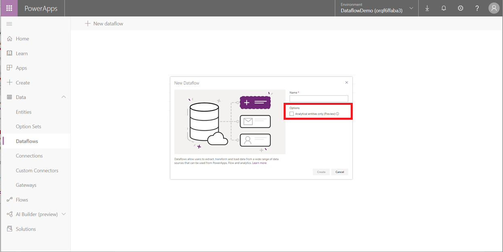

# Connect Azure Data Lake Storage Gen2 for dataflow storage

[!INCLUDE [cc-beta-prerelease-disclaimer](../../includes/cc-beta-prerelease-disclaimer.md)]

You can configure dataflows to store their data in your organization’s Azure Data Lake Storage Gen2 account. This article describes the general steps necessary to do so, and provides guidance and best practices along the way. 

There are some advantages to configuring dataflows to store their definitions and datafiles in your data lake, including the following:
- Azure Data Lake Storage Gen2 provides an enormously scalable storage facility for data.
- Dataflow data and definition files can be leveraged by your IT department's developers to leverage Azure data and artificial intelligence (AI) services as demonstrated in the GitHub samples from Azure data services.
- It enables developers in your organization to integrate dataflow data into internal applications and line-of-business solutions, using developer resources for dataflows and Azure.

## Requirements
To use Azure Data Lake Storage Gen2 for dataflows, you need the following:
- A PowerApps environment. Any PowerApps plan will allow you to create dataflows with Azure Data Lake Storage Gen2 as a destination. You will need to be authorized in the environment as a maker. 
- An Azure subscription. You need an Azure subscription to use Azure Data Lake Storage Gen2.
- A resource group. Use a resource group you already have, or create a new one.
- An Azure storage account. The storage account must have the Data Lake Storage Gen2 feature enabled.

> [!TIP]
> If you don't have an Azure subscription, [create a free trial account](https://azure.microsoft.com/free/) before you begin.

## Prepare your Azure Data Lake Storage Gen2 for Power Platform Dataflows
Before you configure your environment with an Azure Data Lake Storage Gen2 account, you must create and configure a storage account. Here are the requirements for Power Platform Dataflows:
1.	The storage account must be created in the same Azure Active Directory tenant as your PowerApps tenant.
2.	We recommend that the storage account is created in the same region as the PowerApps environment you plan to use it in. To determine where your PowerApps environment is, contact your environment admin.
3.	The storage account must have the Hierarchical Name Space feature enabled.
4.	You must be granted an Owner role on the storage account.

The following sections walk through the steps necessary to configure your Azure Data Lake Storage Gen2 account.

## Create the storage account
Follow the steps in [Create an Azure Data Lake Storage Gen2 storage account](https://docs.microsoft.com/azure/storage/blobs/data-lake-storage-quickstart-create-account).
1.	Make sure you select the same region as your environment and set your storage as StorageV2 (general purpose v2).
2.	Make sure you enable the hierarchical namespace feature. 
3.	We recommend that you set the replication setting to Read-access geo-redundant storage (RA-GRS).

## Create a Cross-Origin Resource Sharing (CORS) rule for the Export to data lake (preview) service

> [!NOTE]
> Power Platform Dataflows leverage the Export to data lake (preview) feature to connect a Data Lake to a PowerApps environment. In this section, you are required to grant the Export to data lake (preview) service a role to the storage account, so it can be configured for Dataflow use.

Next, you need to enable the Export to data lake (preview) service access the storage account via web browser and the PowerApps portal. Web browsers implement a security restriction known as [same-origin policy](http://www.w3.org/Security/wiki/Same_Origin_Policy) that prevents a web page from calling APIs in a different domain; CORS provides a secure way to allow one domain (the origin domain) to call APIs in another domain. For more information about CORS, see the [CORS specification](http://www.w3.org/TR/cors/).

Follow the steps in the storage account you just created on the settings page in the Azure portal. In the CORS menu item, select the Blob service section and enter these details. 

|Setting  |Value  |
|---------|---------|
|Allowed origins   | https://athena-ui-prod.trafficmanager.net     |
|Allowed methods   |  DELETE, GET, HEAD, MERGE, POST, OPTIONS, PUT, PATCH   |
|Allowed headers   | *    |
|Exposed headers   | *    |
|Max age |   *  |

The following image shows the CORS rule configured for the Export to data lake (preview) Service.

## Connect your Azure Data Lake Storage Gen2 to PowerApps
Once you've set up your Azure Data Lake Storage Gen2 account in the Azure portal, you are ready to connect it to a specific dataflow or a PowerApps environment. Connecting the lake to an environment allows other makers and admins in the environment to create dataflows that store their data in your organization's lake as well. 

To connect your Azure Data Lake Storage Gen2 account with the dataflow, follow these steps:
1.	Sign in to [PowerApps](https://web.powerapps.com/?utm_source=padocs&utm_medium=linkinadoc&utm_campaign=referralsfromdoc), and verify which environment you're in. The environment switcher is located on the right side of the header. 
2. On the left navigation pane, select the down arrow next to **Data**.

   

3. In the list that appears, select **Dataflows** and then on the command bar select **New dataflow**.

    

4. Select the analytical entities you want. These entities indicate what data you want to store in your organization's Azure Data Lake Store Gen2 account. 

   

## Select the storage account to use for dataflow storage
If a storage account has not yet been associated with the environment, a **Link to data lake** dialog box appears. You will need to sign in and find the data lake you created in the previous steps. In this example, no data lake is associated with the environment and so a prompt occurs to add one. 

<!--from editor: Should "storage account" be in bold because it's something the user has to select? --"

1. Select storage account.

    The **Select Storage Account** screen appears.
    
    
    
2. Select the **Subscription ID** of the storage account.
3. Select the **Resource group name** in which the storage account was created.
4. Enter the **Storage account name**.
5. Select **Save**.

Once these steps are successfully completed, your Azure Data Lake Storage Gen2 account is connected to Power Platform Dataflows and you can continue to create a dataflow.

## Considerations and limitations
There are a few considerations and limitations to keep in mind when working with your dataflow storage:
- Linking an Azure Data Lake Store Gen2 account for dataflow storage is not supported in the default environment.
- Once a dataflow storage location is configured for a dataflow, it can't be changed.
- By default, any member of the environment can access dataflow data using the Power Platform Dataflows Connector. However, only the owners of a dataflow can access its files directly in Azure Data Lake Storage Gen2. To authorize additional people to access the dataflows data directly in the lake, you must authorize them to the dataflow’s CDM folder in the data lake or the data lake itself.
- When a dataflow is deleted, its CDM folder in the lake will also be deleted. 

> [!IMPORTANT]
> You shouldn't change files created by dataflows in your organization’s lake or add files to a dataflow’s CDM folder. Changing files might damage dataflows or alter their behavior and is not supported. Power Platform Dataflows only grants read access to files it creates in the lake. If you authorize other people or services to the filesystem used by Power Platform Dataflows, only grant them read access to files or folders in that filesystem.

## Frequently asked questions
*What if I had previously created dataflows in my organization’s Azure Data Lake Storage Gen2 and would like to change their storage location?*

   You can't change the storage location of a dataflow after it was created.

*When can I change the dataflow storage location of an environment?*

   Changing the environment's dataflow storage location is not currently supported. 

## Next steps
This article provided guidance about how to connect an Azure Data Lake Storage Gen2 account for dataflow storage. 

For more information about dataflows, the Common Data Model, and Azure Data Lake Storage Gen2, see these articles:
- [Self-service data prep with dataflows](https://go.microsoft.com/fwlink/?linkid=2099972)
- [Creating and using dataflows in PowerApps](https://go.microsoft.com/fwlink/?linkid=2100076)
- [Connect Azure Data Lake Storage Gen2 for dataflow storage](https://go.microsoft.com/fwlink/?linkid=2099973)
- [Add data to an entity in Common Data Service](https://go.microsoft.com/fwlink/?linkid=2100075)

For more information about Azure storage, see this article:
- [Azure Storage security guide](https://docs.microsoft.com/azure/storage/common/storage-security-guide)

For more information about the Common Data Model, see these articles:
- [Common Data Model - overview](https://docs.microsoft.com/powerapps/common-data-model/overview) 
- [Common Data Model folders](https://go.microsoft.com/fwlink/?linkid=2045304)
- [CDM model file definition](https://go.microsoft.com/fwlink/?linkid=2045521)

You can ask questions in the [PowerApps Community](https://go.microsoft.com/fwlink/?linkid=2099971).
