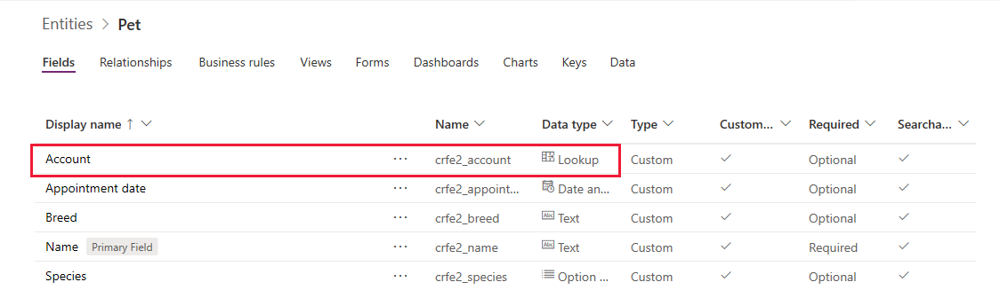

# Create a custom entity that has components in Power Apps

With Power Apps you tailor your app to closely fit your organization’s industry, nomenclature, and unique business processes. Power Apps app development includes adding standard "out-of-box" entities or creating custom entities. An entity defines the information you want to track in the form of records, which typically include properties such as company name, location, products, email, and phone. 

In this topic you create an entity and then add or customize key components such as fields, relationships, views, and forms. You learn how to:

- Create a custom entity
- Add custom fields to your entity
- Add an entity relationship
- Customize a view 
- Customize a form

The topic will follow the company, Contoso, which is a pet grooming business that grooms dogs and cats. Contoso needs an app for client and pet tracking that can be used by employees across a variety of devices.

## Prerequisites

Sign in to [Power Apps](https://make.powerapps.com/?utm_source=padocs&utm_medium=linkinadoc&utm_campaign=referralsfromdoc). If you don’t already have a Power Apps account, select the **Get started free** link from [powerapps.com](https://make.powerapps.com/?utm_source=padocs&utm_medium=linkinadoc&utm_campaign=referralsfromdoc).

## Create a custom entity

1. On the left navigation pane expand **Data**, select **Entities**, and then select **New entity**.

    > [!div class="mx-imgBorder"] 
    > 

2. In the right pane, enter the following values, and then select **Create**.

    - **Display name**: *Pet* 
    - **Description**: *Custom entity to track pet services*

## Add and customize fields
 
1. In the list of entities, select the **Pet** entity that was created in the previous section.

2. On the **Fields** tab, select the **Pet** field.

3. In the right pane make the following changes to the **Display name** field: 

    - Change the **Display name** from **Pet** to *Pet Name*
    -	Select **Searchable**  
  
      > [!div class="mx-imgBorder"] 
      > 

4. Select **Done**.

5. On the **Fields** tab on the entity designer toolbar select **Add field**. On the **Field properties** pane, enter or select the following values and options.
    - **Display name**. *Species*
    - **Data type**. *Option Set*
    - **Option set**. *New option set*
  
6. Select **View more**, and then select **Local option set**.

7. Create the option set

      a. Replace **New option** with *Dog*. 
      
      b. Select **Add new item**. 
        
      c.  Replace **New option** with *Cat*. 
        
      d. Select **Save**. 

    > [!div class="mx-imgBorder"] 
    > 

6. Select **Searchable**, and then select **Done**.

7. On the entity designer toolbar select **Add field**. On the **Field properties** pane, enter or select the following values, and then select **Done**.
    - **Display name**. *Breed*
    - **Data type**. *Text*

8. Select **Searchable**, and then select **Done**.

8. On the entity designer toolbar select **Add field**. 

9. On the **Field properties** pane, enter or select the following values, and then select **Done**. 
    -	**Display name**. *Appointment date*
    - **Data type**. *Date and time*

10. Select **Done**.

## Add a relationship

1. Select the **Relationships** tab, on the entity designer toolbar select **Add relationship**, and then select **Many-to-one**.

2. On the right pane, in the **Related** list select **Account**.

3. Select **Done**.

4. Select **Save Entity**.

  Notice that when you add a many-to-one relationship, an **Account** field with the data type **Lookup** is automatically added to your list of fields on the **Fields** tab.
  > [!div class="mx-imgBorder"]
  > 

## Customize a view

1. Select the **Views** tab, and then select the **Active Pets** view. If you don't see the **Active Pets** view, change the filter on the command bar from **Default** to **All**.

2. On the view designer select **Add Columns**, select the following columns, and then select **OK**.

    - Account
    - Appointment date 
    - Breed 
    - Species

3. Select the **Created On** column, and then select **Remove**.

4. To arrange the columns, select the column you want to move and then use **Move Left** and **Move Left** until your view looks like this.
    > [!div class="mx-imgBorder"] 
    > 

5. On the view designer toolbar, select **Save**.  

## Model-driven apps only: Customize the main form

Skip this step if you only want to use the Pet entity in a canvas app. 

1. On the left navigation pane, expand **Data**, select **Entities**, and then select **Pet**.

2. Select the **Forms** tab, and then select **Information** next to the **Main** form type to open the form designer.

    > [!div class="mx-imgBorder"] 
    > 

3. On the form editor, drag and drop the **Species**, **Breed**, **Appointment date**, and **Account** fields located on the Field Explorer pane on to the General section of the form canvas until the form looks like this.

    > [!div class="mx-imgBorder"] 
    >  

4. Select **Save**.

5. Select **Publish**.

6. Return to the Power Apps home page.

## Add the custom entity to an app

Now your entity is ready to be used to build either a canvas or model-driven app. 

## Next steps

In this topic, you learned how to create an entity that can be used to create a useful app. 
- To learn how to create a model-driven app, see [Build your first model-driven app](../model-driven-apps/build-first-model-driven-app.md).
- To learn how to create a canvas app, see [Create an app from scratch](../canvas-apps/get-started-create-from-blank.md).
