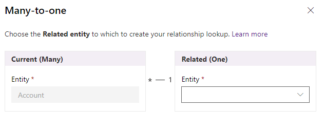
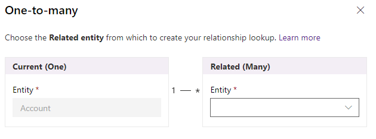
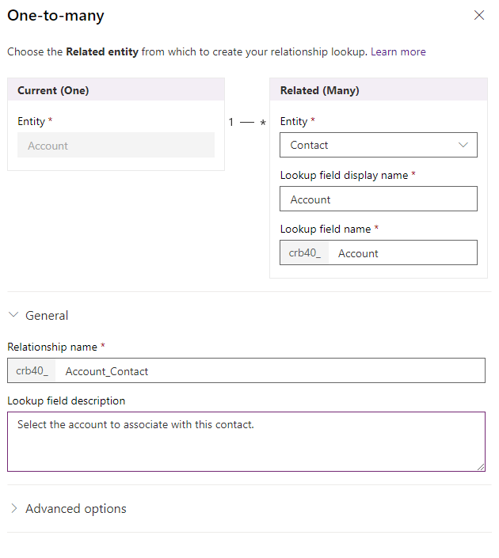

# Create and edit One-to-many or Many-to-one entity relationships using PowerApps portal

The [PowerApps portal](https://web.powerapps.com) provides an easy way to create and edit 1:N (one-to-many) or N:1 (many-to-one) relationships for  Common Data Service for Apps.

The portal enables configuring the most common options, but certain options can only be set using solution explorer. More information: 
- [Create and edit 1:N (one-to-many) or N:1 (many-to-one) relationships](create-edit-1n-relationships.md)
- [Create and edit 1:N (one-to-many) or N:1 (many-to-one) entity relationships using solution explorer](create-edit-1n-relationships-solution-explorer.md).

## View entity relationships

1. From the [PowerApps portal](https://web.powerapps.com), select either **Model-driven** or **Canvas** design mode.
2. Select **Data** > **Entities** and select the entity that has the relationships you want to view.
3. With the **Relationships** tab selected, you can select the following views: 

 |View|Description|
 |--|--|
 |**All**| Shows all the relationships for the entity|
 |**Custom**|Shows only custom relationships for the entity|
 |**Default**|Shows only the standard relationships for the entity|
<!-- TODO: What is the actual difference between All and Default? -->

## Create relationships

While [viewing entity relationships](#view-entity-relationships), in the command bar, select **Add relationship** and choose either **Many-to-one** or **One-to-many**.

> [!NOTE]
> For information about **Many-to-many** relationships see [Create N:N (many-to-many) relationships](create-edit-nn-relationships.md)

<!-- This may change going forward, but this is the way it is now. #2534972 -->
> [!Important]
> The portal uses different terminology than solution explorer. The terms are reversed. The solution explorer **Related entity** is the **Primary entity** in the portal. Likewise, the **Primary entity** in solution explorer is the **Related entity** in the portal.

Depending on your choice you will see either:

<!-- These are the correct screenshots from the UI as of 6/11/18 -->
|Type|Panel|
|--|--|
|**Many-to-one**||
|**One-to-many**||

Choose either the **Related entity** or the **Primary entity** for the relationship you want to create between the two entities. 

> [!NOTE]
> With either choice, a lookup field will be created on the *primary* entity.

Once you select the entity you can edit the details of the relationship. In this example, multiple contact entity records can be associated with a single account.

<!-- These are the correct screenshots from the UI as of 6/11/18 -->

You can edit the default values provided before you save. Select **More options** to view the **Relationship name** and **Lookup field description** values

|Field|Description|
|--|--|
|**Lookup field display name**|The localizable text for the lookup field that will be created on the related entity. This can be edited later.|
|**Lookup field name**|The name for the Lookup field that will be created on the related entity.|
|**Relationship name**|The name for the relationship that will be created.|
|**Lookup field description**|The description for the lookup field. In model-driven apps this will appear as a tooltip when people hover their mouse over the field.  This can be edited later.|

You can continue editing the entity. Select **Save Entity** to create the relationship you have configured.

## Edit relationships

While [viewing entity relationships](#view-entity-relationships), select the relationship you want to edit.

> [!NOTE]
> Each relationship can be found within the primary entity or the related entity as a **Many-to-one** or **One-to-many** relationship. Although it can be edited in either place, it is the same relationship.
>
> The publisher of a managed solution can prevent some customizations of relationships that are part of their solution.

The only fields you can edit are **Lookup field display name** and **Lookup field description**. These can also be edited in the properties of the lookup field in the related entity. More information: [Edit a field](create-edit-field-portal.md#edit-a-field)

## Delete relationships

While [viewing entity relationships](#view-entity-relationships), select the relationship you want to delete.

You can use the **Delete relationship** command from the command bar or from the row context menu when you click the elipses (**...**).

Deleteing the relationship will delete the lookup field on the related entity.

> [!NOTE]
> You will not be able to delete a relationship that has dependencies. For example, if you have added the lookup field to a form for the related entity, you must remove the field from the form before you delete the relationship.

### See also

[Create and edit relationships between entities](create-edit-entity-relationships.md) 
[Create and edit 1:N (one-to-many) or N:1 (many-to-one) relationships](create-edit-1n-relationships.md) 
[Create and edit 1:N (one-to-many) or N:1 (many-to-one) entity relationships using solution explorer](create-edit-1n-relationships-solution-explorer.md) 
[Edit a field](create-edit-field-portal.md#edit-a-field)